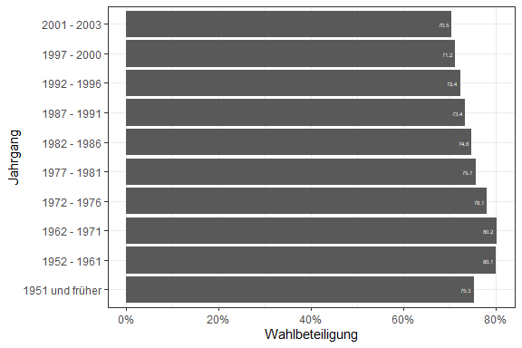

Repraesentative Wahlstatistik - BTW, 2021
================
Jacob Edenhofer
09 Jan 2023

``` r
# packages 
library(tidyverse)
library(readr)
library(janitor)
library(Hmisc)
library(scales)
# data
## turnout data, 2021
bwl <- read_delim("https://www.bundeswahlleiter.de/dam/jcr/2aaec1fb-745a-422d-9ef0-0be7c9ca0ac9/btw21_rws_bw2.csv", skip = 11, col_names = T, delim = ";") %>%
  clean_names()
save(bwl, file = "Data/bwl.RData")
## votes data, 2021
btw <- read_delim("https://www.bundeswahlleiter.de/dam/jcr/a565eeb3-d324-4c0a-b921-fbfea16f8817/btw21_rws_bst2.csv",
                  skip = 12, col_names = T) %>% clean_names()
save(btw, file = "Data/btw.RData")
## time series, turnout 
zte <- read_delim("https://www.bundeswahlleiter.de/dam/jcr/f920aa03-a0b1-45a5-8e65-7902a67259d7/btw_rws_wb-1953.csv",
                  skip = 14, col_names = T, locale = locale(decimal_mark = ",")) %>% clean_names()
save(zte, file = "Data/zte.RData")
## time series, votes 
time <- read_delim("https://www.bundeswahlleiter.de/dam/jcr/0c8deca8-4030-419c-9fa8-5ab770cfa123/btw_rws_zwst-1953.csv",
                   skip = 11, col_names = T, locale = locale(decimal_mark = ",")) %>% clean_names()
save(time, file = "Data/time.RData")
```

# Plots

## Turnout by Age in 2021

``` r
# turnout variable
bwl_bund <- bwl %>%
  filter(grepl("Bund", land), !grepl("Summe", geburtsjahresgruppe)) %>%
  mutate(turnout = (wahler_innen/wahlberechtigte)*100)
# plot 
bwl_bund %>%
  filter(grepl("Summe", geschlecht)) %>%
  ggplot(aes(x = as.factor(geburtsjahresgruppe), y = turnout)) +
  geom_col() +
  geom_text(aes(label = round(turnout, 1)), hjust = 1.3, colour = "white", size = 1.5) +
  scale_y_continuous(labels = label_percent(scale = 1)) +
  labs(x = "Jahrgang", y = "Wahlbeteiligung") +
  coord_flip() +
  theme_bw()
```



## Turnout by Age and Gender in 2021

``` r
bwl_bund %>%
  filter(!grepl("Summe", geschlecht)) %>%
  ggplot(aes(x = as.factor(geburtsjahresgruppe), y = turnout)) +
  geom_col() +
  geom_text(aes(label = round(turnout, 1)), hjust = 1.3, colour = "white", size = 1.5) +
  scale_y_continuous(labels = label_percent(scale = 1)) +
  labs(x = "Jahrgang", y = "Wahlbeteiligung") +
  coord_flip() +
  facet_wrap(~geschlecht, labeller = labeller(geschlecht = c(m = "Maenner", w = "Frauen"))) +
  theme_bw()
```


## Turnout by Age over Time

``` r
# variables
zte$age_coarse <- fct_collapse(zte$altersgruppe_etwa_von_bis_jahren, 
                               "18_24" = c("18 - 20", "21 - 24"),
                               "30_39" = c("30 - 34", "35 - 39", "30 - 39"),
                               "40_49" = c("40 - 44", "45 - 49", "40 - 49"),
                               "+60" = c("60 - 69", "70 und mehr"))
# plot 
zte %>%
  filter(grepl("Summe", geschlecht), !grepl("Summe", altersgruppe_etwa_von_bis_jahren)) %>%
  group_by(bundestagswahl) %>%
  mutate(mean_turnout = mean(wahlbeteiligung)) %>%
  ungroup() %>%
  group_by(bundestagswahl, age_coarse) %>%
  mutate(turnout = mean(wahlbeteiligung)) %>%
  ungroup() %>%
  ggplot(aes(x = bundestagswahl, y = turnout, colour = age_coarse)) +
  geom_point() +
  geom_point(aes(y= mean_turnout), colour = "magenta") +
  geom_line(size = 1) +
  geom_line(aes(y = mean_turnout), colour = "magenta", size = 1) +
  scale_color_grey("Altersgruppe", 
                   labels = c("18_24" = "18 - 24", 
                              "25_29" = "25 - 29",
                              "30_39" = "30 - 39",
                              "40_49" = "40 - 49",
                              "50_59" = "50 - 59",
                              "+60" = ">=60")) +
  scale_y_continuous("Wahlbeteiligung", labels = label_percent(scale = 1), 
                     breaks = seq(50, 100, 10)) +
  scale_x_continuous("Jahr", breaks = seq(1950, 2020, 10)) +
  labs(caption = "Die violette Linie visualisiert die durchschnittliche Wahlbeteiligung ueber alle Altersgruppen.") +
  theme_bw() +
  theme(legend.position = "bottom")
```


## Turnout by Bundesland 2021

``` r
bwl %>%
  filter(!grepl("Bund", land), grepl("Summe", geschlecht), grepl("Summe", geburtsjahresgruppe), !grepl("^BE-", land)) %>%
  mutate(turnout = (wahler_innen/wahlberechtigte)*100) %>%
  ggplot(aes(x = reorder(factor(land), turnout), y = turnout)) +
  geom_col() +
  geom_hline(aes(yintercept = mean(turnout)), colour = "magenta", 
             linetype = "dashed", size = 1) +
  scale_y_continuous("Wahlbeteiligung", labels = label_percent(scale = 1)) +
  labs(x = "Bundesland", caption = "Die violette Linie visualisiert die durchschnittliche Wahlbeteiligung.") +
  coord_flip() +
  theme_bw()
```


## Veraenderung der Wahlbeteiligung

``` r
zte %>%
  filter(!grepl("Summe", altersgruppe_etwa_von_bis_jahren),
          grepl("Summe", geschlecht), bundestagswahl %in% c(2017, 2021)) %>%
  mutate(btw_date = as.Date(as.character(bundestagswahl), format = "%Y")) %>%
  group_by(altersgruppe_etwa_von_bis_jahren) %>%
  arrange(btw_date) %>%
  mutate(lag_turnout = lag(wahlbeteiligung, 1)) %>%
  ungroup() %>%
  mutate(change_turnout = wahlbeteiligung - lag_turnout) %>%
  filter(bundestagswahl == 2021) %>%
  ggplot(aes(factor(altersgruppe_etwa_von_bis_jahren), y = change_turnout)) +
  geom_col() +
  labs(x = "Altersgruppe", y = "Veraenderung d. Wahlbeteiligung in Prozentpunkten",
       caption = "Die Veraenderung ergibt sich aus der Differenz zwischen der Wahlbeteiligung bei der BTW 2021 und der BTW 2017.") +
  theme_bw() 
```


## Plots - Parties

``` r
btw2 <- btw %>% filter(grepl("Bund", land), grepl("Summe", geschlecht), 
                       !grepl("Summe", geburtsjahresgruppe), erst_zweitstimme == 2) %>%
  mutate(union = cdu + csu)
# create variables 
for(k in names(btw2)){
  if(grepl("af_d|fdp|grune|spd|union|die_linke", k)){
    btw2[[paste(k, "share", sep = "_")]] <- (btw2[[k]] / (btw2["summe"] - btw2[["ungultig"]]))*100 
  } else {
    next
  }
}
```

## Parties by Age

``` r
btw2 %>% 
  select(geburtsjahresgruppe, ends_with("share")) %>%
  pivot_longer(cols = !c(geburtsjahresgruppe), 
               names_to = "party", 
               values_to = "share") %>%
  ggplot(aes(x = factor(geburtsjahresgruppe), y = share$summe)) +
  geom_col() +
  geom_text(aes(label = round(share$summe, 1)), vjust = 1.3, 
            colour = "white", size = 1.5) +
  facet_wrap(~party, labeller = labeller(party = c(af_d_share = "AfD", 
                                                   die_linke_share = "LINKE",
                                                   fdp_share = "FDP",
                                                   grune_share = "GRUNE/B90",
                                                   spd_share = "SPD",
                                                   union_share = "CDU/CSU"))) +
  scale_y_continuous("Zweitstimmenanteil", labels = label_percent(scale = 1)) +
  labs(x = "Altersgruppe") +
  theme_bw() +
  theme(axis.text.x = element_text(angle = 25, vjust = 0.5))
```


## Parties by Age (alternative)

``` r
# data wrangling
btw_bund_age <- btw %>%
  filter(grepl("Bund", land), grepl("Summe", geschlecht), 
         erst_zweitstimme == 2, !grepl("Summe", geburtsjahresgruppe)) %>%
  mutate(union = cdu + csu)
## variables 
for(h in names(btw_bund_age)){
  if(grepl("af_d|union|spd|die_linke|grune|fdp", h)){
    btw_bund_age[[paste(h, "share", sep = "_")]] <- (btw_bund_age[[h]] / (btw_bund_age[["summe"]] - btw_bund_age[["ungultig"]]))*100
  } else {
    next
  }
}
# plot 
btw_bund_age %>%
  select(geburtsjahresgruppe, ends_with("share")) %>%
  pivot_longer(cols = !geburtsjahresgruppe, names_to = "party", values_to = "share") %>%
  ggplot(aes(x = factor(party), y = share, fill = factor(geburtsjahresgruppe))) +
  geom_col(position = "dodge") +
  scale_fill_viridis_d() +
  scale_x_discrete(labels = c("af_d_share" = "AfD", 
                              "union_share" = "CDU/CSU",
                              "die_linke_share" = "LINKE",
                              "fdp_share" = "FDP",
                              "grune_share" = "GRUNE/B90",
                              "spd_share" = "SPD")) +
  scale_y_continuous(labels = label_percent(scale = 1)) +
  labs(x = "Parteien", y = "Zweitstimmenanteil", fill = "Altersgruppe") +
  theme_bw() +
  theme(legend.position = "bottom") 
```


## Parties: Change in Support

``` r
# data 
time1 <- read_delim("https://www.bundeswahlleiter.de/dam/jcr/0c8deca8-4030-419c-9fa8-5ab770cfa123/btw_rws_zwst-1953.csv",
                   skip = 12, col_names = T, locale = locale(decimal_mark = ",")) %>% 
  clean_names()
## variables 
time1$age_coarse <- fct_collapse(factor(time1$altersgruppe_etwa_von_bis_jahren),
                                "60+" = c("60 - 69", "60 und mehr", "70 und mehr"))
# plot 
time1 %>% 
  filter(bundestagswahl %in% c(2017, 2021), grepl("Summe", geschlecht), 
         !grepl("Summe", age_coarse)) %>%
  mutate(union = cdu + csu) %>%
  select(bundestagswahl, age_coarse, spd, union, fdp, grune, af_d, pds_die_linke, sonstige) %>%
  group_by(bundestagswahl, age_coarse) %>%
  summarise(across(.cols = c(spd, union, fdp, grune, af_d, pds_die_linke, sonstige),
                   .fns = ~mean(.x, na.rm = T))) %>%
  ungroup() %>%
  pivot_wider(id_cols = c(age_coarse),
              names_from = bundestagswahl, values_from = c(spd, union, 
                                                           af_d, fdp, pds_die_linke, 
                                                           grune, sonstige)) %>%
  mutate(spd_delta = spd_2021 - spd_2017, 
         union_delta = union_2021 - union_2017, 
         grune_delta = grune_2021 - grune_2017, 
         afd_delta = af_d_2021 - af_d_2017, 
         fdp_delta = fdp_2021 - fdp_2017, 
         linke_delta = pds_die_linke_2021 - pds_die_linke_2017) %>%
  select(age_coarse, ends_with("delta")) %>%
  pivot_longer(cols = !age_coarse, names_to = "party", values_to = "delta") %>%
  ggplot(aes(x = age_coarse, y = delta, fill = party)) +
  geom_col(position = "dodge") +
  scale_fill_viridis_d(labels = c("afd_delta" = "AfD",
                              "union_delta" = "CDU/CSU",
                              "grune_delta" = "GRUNE/B90",
                              "spd_delta" = "SPD",
                              "fdp_delta" = "FDP",
                              "linke_delta" = "LINKE")) +
  ylim(c(-15, 15)) +
  labs(x = "Altersgruppe", y = "Veraenderung d. Zweitstimmenanteils", fill = "Partei",
       caption = "Die Veraenderung ist in Prozentpunkten angegeben.") +
  theme_bw() +
  theme(legend.position = "bottom")
```


## Parties: Differences in Support

``` r
time1 %>% 
  filter(bundestagswahl %in% c(2017, 2021), grepl("Summe", geschlecht), 
         !grepl("Summe", age_coarse)) %>%
  select(bundestagswahl, age_coarse, spd, cdu, csu, fdp, grune, af_d, pds_die_linke, sonstige) %>%
  group_by(bundestagswahl, age_coarse) %>%
  summarise(across(.cols = c(spd, cdu, csu, fdp, grune, af_d, pds_die_linke, sonstige),
                   .fns = ~mean(.x, na.rm = T))) %>%
  ungroup() %>%
  mutate(union = cdu + csu) %>%
  select(bundestagswahl, age_coarse, spd, fdp, grune, af_d, union, pds_die_linke) %>%
  pivot_longer(cols = !c(bundestagswahl, age_coarse), names_to = "party", values_to = "share") %>%
  mutate(party = as.factor(party)) %>%
  ggplot(aes(x = factor(age_coarse), y = share, fill = factor(bundestagswahl))) +
  geom_col(position = "dodge") +
  geom_text(aes(label = round(share, 1)), position = position_dodge(width = 1), 
            colour = "white", vjust = 1.3, size = 1.5) +
  scale_y_continuous("Zweitstimmenanteil", labels = label_percent(scale = 1)) +
  scale_fill_brewer(palette = "Set1") +
  labs(x = "Altersgruppen", fill = "Bundestagswahl") +
  facet_wrap(~party, labeller = labeller(party = c(af_d = "AfD", fdp = "FDP", 
                                                   grune = "GRUNE", pds_die_linke = "LINKE",
                                                   spd = "SPD", union = "CDU/CSU"))) +
  theme_bw() +
  theme(legend.position = "bottom")
```


## Parties by Coarse Age Group

``` r
time1 %>%
  filter(bundestagswahl == 2021, grepl("Summe", geschlecht), 
         !grepl("Summe", altersgruppe_etwa_von_bis_jahren)) %>%
  mutate(age_coarse = fct_collapse(altersgruppe_etwa_von_bis_jahren, 
                                   "+60" = c("60 und mehr", "60 - 69", "70 und mehr")),
         above_45 = ifelse(grepl("45 - 59|+60", age_coarse), "above_45", "below_45"),
         union = cdu + csu) %>%
  group_by(age_coarse, above_45) %>%
  summarise(across(.cols = c(union, spd, af_d, fdp, pds_die_linke, grune),
                   .fns = ~mean(.x))) %>%
  ungroup() %>%
  group_by(above_45) %>%
  summarise(across(.cols = c(union, spd, af_d, fdp, pds_die_linke, grune),
                   .fns = ~mean(.x))) %>%
  pivot_longer(cols = !above_45, names_to = "party", values_to = "share") %>%
  ggplot(aes(x = party, y = share)) +
  geom_col() +
  geom_text(aes(label = round(share, 1)), hjust = 1.3, colour = "white", size = 1.5) +
  scale_y_continuous("Zweitstimmenanteil", labels = label_percent(scale = 1)) +
  scale_x_discrete("Parteien", labels = c("af_d" = "AfD", "union" = "CDU/CSU", "fdp" = "FDP", 
                                          "grune" = "GRUNE", "pds_die_linke" = "LINKE",
                                          "spd" = "SPD")) +
  facet_wrap(~above_45, labeller = labeller(above_45 = c(above_45 = "ueber 45",
                                                         below_45 = "unter 45"))) +
  coord_flip() +
  theme_bw()
```


## Parties by Gender

``` r
btw_gender <- btw %>% 
  filter(grepl("Bund", land), 
         !grepl("Summe", geschlecht),
         grepl("Summe", geburtsjahresgruppe),
         erst_zweitstimme == 2) %>%
  mutate(union = cdu + csu)
# variables 
for(u in names(btw_gender)){
  if(grepl("union|spd|af_d|fdp|die_linke|grune", u)){
     btw_gender[[paste(u, "share", sep = "_")]] <- (btw_gender[[u]] / (btw_gender[["summe"]] - btw_gender[["ungultig"]]))*100  
  } else {
    next
  }
}
# plot 
btw_gender %>%
  select(geschlecht, ends_with("share")) %>%
  pivot_longer(cols = !geschlecht, 
               names_to = "party", values_to = "share") %>%
  ggplot(aes(x = party, y = share, fill = geschlecht)) +
  geom_col(position = "dodge") +
  geom_text(aes(label = round(share, 1)), colour = "white", vjust = 1.3, position = position_dodge(width = 1), size = 1.5) +
  scale_fill_brewer("Geschlecht", 
                    labels = c("m" = "Maenner",
                               "w" = "Frauen"),
                    palette = "Set1") +
  scale_y_continuous(breaks = seq(0, 30, 5), labels = label_percent(scale = 1)) +
  scale_x_discrete(labels = c("af_d_share" = "AfD", 
                              "union_share" = "CDU/CSU", "die_linke_share" = "LINKE", 
                              "spd_share" = "SPD", 
                              "grune_share" = "GRUNE", 
                              "fdp_share" = "FDP")) +
  labs(x = "Parteien", y = "Zweitstimmenanteil") +
  theme_bw() +
  theme(legend.position = "bottom")
```


## Parties by Gender and Age

``` r
# data 
btw_young <- btw %>% filter(grepl("Bund", land), !grepl("Summe", geschlecht), erst_zweitstimme == 2,
                            !grepl("Summe", geburtsjahresgruppe)) %>%
  mutate(union = cdu + csu)
## variables 
for(q in names(btw_young)){
  if(grepl("union|af_d|fdp|spd|die_linke|grune", q)){
    btw_young[[paste(q, "share", sep = "_")]] <- (btw_young[[q]] / (btw_young[["summe"]] - btw_young[["ungultig"]]))*100
  } else {
    next
  }
}
# plot 
btw_young %>%
  select(geschlecht, geburtsjahresgruppe, ends_with("share")) %>%
  pivot_longer(cols = !c(geschlecht, geburtsjahresgruppe), 
               names_to = "party", values_to = "share") %>%
  ggplot(aes(x = factor(party), y = share, fill = geburtsjahresgruppe)) +
  geom_col(position = "dodge") +
  scale_fill_viridis_d() +
  scale_y_continuous(labels = label_percent(scale = 1)) +
  scale_x_discrete(labels = c("af_d_share" = "AfD",
                              "union_share" = "CDU/CSU",
                              "die_linke_share" = "LINKE",
                              "fdp_share" = "FDP",
                              "grune_share" = "GRUNE",
                              "spd_share" = "SPD")) +
  facet_wrap(~geschlecht, labeller = labeller(geschlecht = c(m = "Maenner",
                                                  w = "Frauen"))) +
  labs(x = "Parteien", y = "Zweitstimmenanteil", fill = "Altersgruppe") +
  theme_bw() +
  theme(legend.position = "bottom")
```


``` r
time1 %>%
  dplyr::filter(!grepl("Summe", geschlecht), !grepl("Summe", altersgruppe_etwa_von_bis_jahren),
         bundestagswahl == 2021) %>%
  mutate(age_coarse = fct_collapse(altersgruppe_etwa_von_bis_jahren, 
                                   "60+" = c("60 und mehr", "60 - 69", "70 und mehr")),
         union = cdu + csu,
         geschlecht = as.factor(geschlecht)) %>%
  group_by(age_coarse, geschlecht) %>%
  summarise(across(.cols = c(union, spd, af_d, fdp, pds_die_linke, grune),
                   .fns = ~mean(.x))) %>%
  ungroup() %>%
  pivot_longer(cols = !c(age_coarse, geschlecht), names_to = "party", 
               values_to = "share") %>%
  ggplot(aes(x = party, y = share, fill = age_coarse)) +
  geom_col(position = "dodge") +
  scale_fill_viridis_d() +
  scale_y_continuous("Zweitstimmenanteil", labels = label_percent(scale = 1)) +
  scale_x_discrete("Parteien", labels = c("af_d" = "AfD", "fdp" = "FDP",
                                          "grune" = "GRUNE", "pds_die_linke" = "LINKE",
                                          "union" = "CDU/CSU", "spd" = "SPD")) +
  facet_wrap(~geschlecht, labeller = labeller(geschlecht = c(w = "Frauen", 
                                                             m = "Maenner"))) +
  labs(fill = "Altersgruppe") +
  theme_bw() +
  theme(legend.position = "bottom")
```


