Bundestagswahl-Kandidaten
================
13 February 2023

# Preliminaries

``` r
# packages
library(tidyverse)
library(readr)
library(janitor)
library(scales)
library(modelsummary)
library(sf)
library(ggridges)
library(kableExtra)
library(knitr)
library(DiagrammeR)
library(skimr)
library(stringr)
# data
btw <- load("Data/btwkandidierende2021.rda")
wahlkreisnamen <- read_csv2("https://www.bundeswahlleiter.de/dam/jcr/b46e4c9d-290c-4b96-a64b-0edee1c780a5/btw21_wahlkreisnamen_utf8.csv", skip = 7)
btw_shapefile <- st_read("Data/btw21_geometrie_wahlkreise_geo_shp/Geometrie_Wahlkreise_20DBT_geo.shp")
```

    ## Reading layer `Geometrie_Wahlkreise_20DBT_geo' from data source 
    ##   `C:\Users\jacob\Documents\R_documents\Data\Bundestagswahl2021_anaylsis\bundestagswahl2021\Data\btw21_geometrie_wahlkreise_geo_shp\Geometrie_Wahlkreise_20DBT_geo.shp' 
    ##   using driver `ESRI Shapefile'
    ## Simple feature collection with 299 features and 4 fields
    ## Geometry type: MULTIPOLYGON
    ## Dimension:     XY
    ## Bounding box:  xmin: 5.86625 ymin: 47.27012 xmax: 15.03962 ymax: 55.05838
    ## Geodetic CRS:  WGS 84

``` r
strukturdaten21 <- read_csv2("Data/btw21_strukturdaten_wahlkreise.csv", skip = 8) %>%
  clean_names() %>%
  filter(!(grepl("Land insgesamt", wahlkreis_name) == TRUE)) %>%
  filter(!(grepl("Insgesamt", wahlkreis_name) == TRUE)) 
```

# Tentative Data Exploration

Importantly, there are 299 constituencies (Wahlkreise). The missing
values for the `Wahlkreis` variable indicate that some candidates are
only on the list.

We can conclude that there are:

- 2851 candidates who are only on the list without contesting any
  constituency

- 1284 candidates contesting a constituency without being on the list

- 2076 candidates contesting a constituency whilst simultaneously being
  on the list

  - Hence, the 3360 direct candidates, candidates contesting a
    constituency, can be divided into those who are simultaneously on
    the list and those who are not.

- All candidates are the sum of all direct candidates and those who are
  only on the list.

# Data Wrangling

Let us mutate the `Wahlkreis` variable and create some useful
identifiers:

``` r
btwkandidierende2021 <- btwkandidierende2021 %>%
  mutate(WKR_NR = as.numeric(str_replace_all(wahlkreis, "^0+(?!$)", " ")),
         direct = ifelse(!is.na(WKR_NR), 1, 0),
         direct_plus_list = ifelse(!is.na(WKR_NR) & !is.na(listenplatz), 1, 0),
         direct_no_list = ifelse(!is.na(WKR_NR) & is.na(listenplatz), 1, 0),
         list_only = ifelse(is.na(WKR_NR) & !is.na(listenplatz), 1, 0))
```

Now, I will use this data set to create my final data set, which
ultimately consists of:

- `btwkandidierende2021`
- `wahlkreisnamen` to associate candidates’ constituency identifiers
  with the names of the locations
- `btw_shapefile` to associate the constituencies with their borders
- `strukturdaten21` to associate constituencies with their
  socio-economic characteristics

I use the `left_join()` function because the latter returns all rows
from `btwkandidierende2021`, and all columns from `btwkandidierende2021`
and the other three data sets (except for the column we merge on).
Additionally, rows in `btwkandidierende2021` with no match in the other
data sets will have NA values in the new columns.”

``` r
# merging data 
btw21 <- btwkandidierende2021 %>%
  left_join(wahlkreisnamen, by = "WKR_NR") %>%
  left_join(btw_shapefile, by = "WKR_NR", suffix = c("_kreis", "_shape")) %>%
  left_join(strukturdaten21, by = c("WKR_NR" = "wahlkreis_nr"))
# creating east-dummy
btw21 <- btw21 %>%
  mutate(east_dummy = ifelse(LAND_NR_shape %in% c(12, 13, 14, 15, 16), "East Germany", "West Germany"))
```

The final data set, `btw21`, is a 6211-by-75 matrix. The number of rows
is identical to `btwkandidierende2021`, which follows from the
definition of `left_join()`. The number of columns is the sum of the
columns of the four data sets minus three (15 + 5 + 5 + 52 - 3 = 74). We
have to subtract three since we match on `WKR_NR` three times to merge
the four data sets.

Finally, here are some useful summary statistics:

``` r
datasummary_skim(btwkandidierende2021, 
                 output = "Figures/Candidates/sum.png")
```

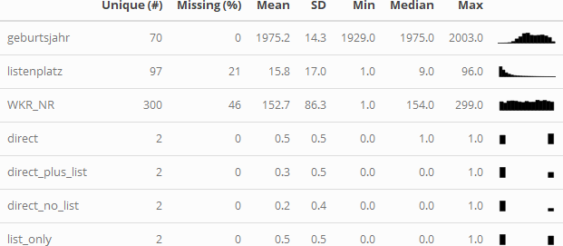

# Data Sets

Here, I look at all Direktkandidaten:

``` r
direkt <- btw21 %>%
  filter(direct == 1)
```

Then, I look at all the Direktkandidaten who are not on the list:

``` r
direkt_risk <- btw21 %>%
  filter(direct_no_list == 1)
```

Let us examine those direct candidates that are also on the
Landeslisten:

``` r
direkt_little_risk <- btw21 %>%
  filter(direct_plus_list == 1)
```

Finally, those who are only on the list:

``` r
list <- btw21 %>%
  filter(list_only == 1)
```

# Tentative Analysis

Now, we can use the dataset of *direct candidates* to visualise where,
for a given party, those candidates compete:

## CDU/CSU Direct Candidates

``` r
direkt %>%
  filter(partei %in% c("CDU", "CSU")) %>%
  ggplot(aes(geometry = geometry)) +
  geom_sf(aes(fill = direct_no_list == 1)) +
  scale_fill_viridis_d("Type of Direct Candidate",
                       labels = c("Listenplatz", "No Listenplatz")) +
  labs(title = "Direct CDU/CSU Candidates by Listenplatz Status") +
  theme_void()
```

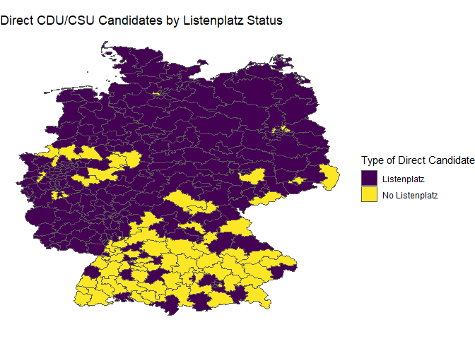<!-- -->

``` r
ggsave("Figures/Candidates/btw_21_direct_candidates_cdu_csu.png")
```

Lessons:

- The CDU’s direct candidates without Listenplätze are heavily
  concentrated in Baden-Württemberg (e.g. Thomas Bareiß in
  Zollernalb-Sigmaringen) and Bavaria. Hans-Georg Maaßen, who is
  contesting Suhl in Thuringa, Friedrich Merz, who is standing in the
  Hochsauerlandkreis in North-Rhine Westphalia, are two prominent
  examples. There are also some no-list direct candidates in Saxony,
  North-Rhine Westphalia and Berlin.

- In Baden-Württemberg, many of the direct candidates with Listenplätze
  are standing in urban constituencies, such as Wolfgang Schäuble in
  Offenburg, Steffen Bilger in Ludwigsburg, Andreas Jung in Konstanz,
  Stefan Kaufmann in Stuttgart I (whose opponent is Cem Özdemir),
  Annette Widmann-Mauz in Tübingen (heavy competition from the Greens),
  Alexander Föhr in Heidelberg (no incumbent, Listenplatz 6 and facing
  fierce competition from the Greens) and Ingo Wellenreuther in
  Karlsruhe-Stadt.

- We can divide the no-list candidates in Baden-Württemberg into those
  contesting safe CDU seats and those contesting seats which are
  unlikely to return a CDU MP.

  - Safe no-listers:

    - Böblingen: A CDU candidate failed to win the direct mandate only
      once, namely in 1972 when the SPD’s Hans Geiger represented the
      constituency. This constituency is often referred to as the
      German-car constituency since a substantial share of constituents
      are employed by Mercedes-Benz, Porsche or their suppliers.
    - Emmendingen-Lahr: This constituency has, since 1949, always
      returned a CDU MP. The current MP, Peter Weiß, has decided to step
      down, meaning that no incumbent is contesting this seat. The CDU’s
      candidate, Yannick Bury, enjoys little name-recognition, whilst
      facing strong competition - the SPD MP, Johannes Fechner.
    - Reutlingen: This constituency has unfailingly given its support to
      CDU candidates since 1953. The current CDU candidate, Michael
      Donth, has been an MP since 2013. Interestingly, Donth failed to
      gain a Listenplatz earlier this year. So, for him this is a
      make-or-break election. The SPD candidate is Donth’s strongest
      opponent.
    - Göppingen: The CDU has always won this constituency since 1949.
      Yet, the 2021 election might spell the end of CDU dominance, with
      the race forecast to be extremely tight. The future of Germany’s
      car industry is of central importance in this constituency.
    - Neckar-Zaber: Since 1980 the CDU has only once failed to win this
      constituency. Indeed, this constituency is currently represented
      by its directly elected CDU MP as well as an AfD MP, who entered
      the Bundestag via the AfD’s Landesliste in 2017. The future of the
      German car industry, soaring house prices and the expansion of
      public transport have proved the most virulent issues during the
      2021 election. Importantly, no incumbent is standing.
    - Esslingen: This constituency is currently held by a CDU MP, who is
      seeking re-election. Yet, the uncertain prospects of German car
      industry worry many constituents - as do the ever rising house
      prices. Whilst the CDU is likely to prevail, the SPD’s candidate
      is a strong challenger.
    - Bruchsal-Schwetzingen: Whilst the CDU managed to win this seat in
      the past five elections, the Azerbaijan scandal might prove the
      incumbent’s undoing. The strongest challenger to the CDU’s Gutting
      is the Green’s Nicole Heger.
    - Nürtingen: This constituency has consistently returned a CDU MP
      since 1965 and is one of the country’s most prosperous seats. The
      CDU incumbent faces strong competition from SPD and Green
      candidates, who are also MPs.
    - Pforzheim: The CDU has dominated this constituency since 1949.
      Yet, in recent elections the AfD has established a stronghold
      here. Overall, the CDU is expected to win this seat, though.
    - Rhein-Neckar: Whilst no incumbent is standing, the CDU is expected
      to retain this seat.
    - Rottweil-Tuttlingen: The incumbent, Volker Kauder, has stepped
      down. Nevertheless, the constituency seems staunchly conservative.

  - Weak no-listers:

    - Zollernalb-Sigmaringen: This constituency has always entrusted a
      CDU candidate with its direct mandate since 1949. In this election
      cycle, however, the current MP, parliamentary under-secretary in
      the Ministry of Business, faces fierce competition from the son of
      the *Landesvater* of Baden-Württemberg, Johannes Kretschmann.
    - Freiburg: This is known as the country’s “greenest” constituency.
    - Bodensee: The incumbent, a CDU MP, has decided to step down, and
      the AfD’s co-leader, Alice Weidel, is also contesting this
      constituency. The CDU might win. This is far from certain, though.
    - Stuttgart I: This promises to be a fierce battle between the
      Green’s Cem Özdemir and the CDU’s Stefan Kaufmann, the incumbent.
    - Ravensburg: This seat is known as a CDU stronghold. In recent
      state elections, however, the Greens did surprisingly well. A
      similarly strong performance in this election would mean that the
      Greens are likely to unseat the CDU incumbent.
    - Waldshut: Like many seats in the region, this used to be CDU
      stronghold. In recent state elections, the Greens overtook the CDU
      for the first time. If this is any indication for voting patterns
      in federal elections the CDU incumbent might be unseated. The
      CDU’s worries have been compounded by the AfD’s decision to field
      a fairly prominent candidate, Andrea Zürcher.
    - Schwäbisch-Hall: The CDU incumbent, who took over from his father,
      seeks to defend this conservative stronghold. His fiercest
      opponent is a Green MP. Indeed, in the state elections this
      constituency returned a Green MP.
    - Waiblingen: The incumbent stepped down owing to a corruption
      scandal. The SPD hopes to wins this seat.

- The CDU is keen to “insure” internally powerful candidates who are
  contesting urban constituencies by offering them prominent positions
  on its Landesliste. Here are a few examples:

  - Ludwigsburg (Listenplatz: 4)
  - Heidelberg (Listenplatz: 6)
  - Backnang (Listenplatz: 5)
  - Mannheim (Listenplatz: 40)
  - Konstanz (Listenplatz: 3)
  - Stuttgart I (Listenplatz: 7)
  - Ulm (Listenplatz: 15)
  - Offenburg (Listenplatz: 1)
  - Heilbronn (Listenplatz: 13)
  - Tübingen (Listenplatz: 2)
  - Karslruhe Stadt (Listenplatz: 8)

- We can divide the North-Rhine Westphalian CDU no-list candidates into
  safe and weak no-listers:

  - Safe no-listers:
    - Hochsauerlandkreis: Friedrich Merz is almost certain to win this
      seat.
    - Olpe: In 2017 the CDU won nearly 50% of the *Erststimmen*, with
      the SPD coming second on 26.3%.
    - Paderborn: The CDU won over 50% of the *Erststimmen* in 2017,
      whereas the SPD came second with 19.9%.
    - Cosefeld: Similar story as in Paderborn.
    - Krefeld: The CDU’s share of first votes was 20 percentage points
      higher than that of the SPD, which came second.
    - Borken II: CDU stronghold.
    - Höxter: Same as above.
    - Rhein-Sieg Kreis I: 15 percentage point advantage over SPD
    - RheinS-Sief Kreis II: 15 percentage point advantage (Röttgen)
  - Weak no-lister:
    - Bottrop-Recklingshausen III: This is an SPD seat, which the CDU
      narrowly lost in 2017.

- The CDU can expect a tight race in Leipzig-Land, with the AfD being
  its most viable competitor, at least if the 2017 result is any
  indication. The same holds for the Erzgebirgekreis I. In Görlitz and
  Dresden II, both currently held by the AfD, the CDU might be able to
  gain new seats, though this is highly unlikely. In Berlin they are
  unlikely to win seats, which is why offering Listenplätze to those
  candidates would be wasteful.

- In Bavaria, almost all no-list candidates are contesting supremely
  safe constituencies, which follows from Bavaria historically being a
  single-party state. There are only a few urban seats, which the CSU
  might lose. Candidates in these constituencies are, however, backed up
  by the Landesliste.

- The CDU is fielding 47 no-list direct candidates, with the CSU
  accounting for another 23, implying a total of 70 conservative no-list
  direct candidates.

## SPD Direct Candidates

``` r
direkt %>%
  filter(partei == "SPD") %>%
  ggplot(aes(geometry = geometry)) +
  geom_sf(aes(fill = direct_no_list == 1)) +
  scale_fill_viridis_d("Type of Direct Candidate",
                       labels = c("Listenplatz", "No Listenplatz")) +
  labs(title = "Direct SPD Candidates by Listenplatz Status") +
  theme_void()
```

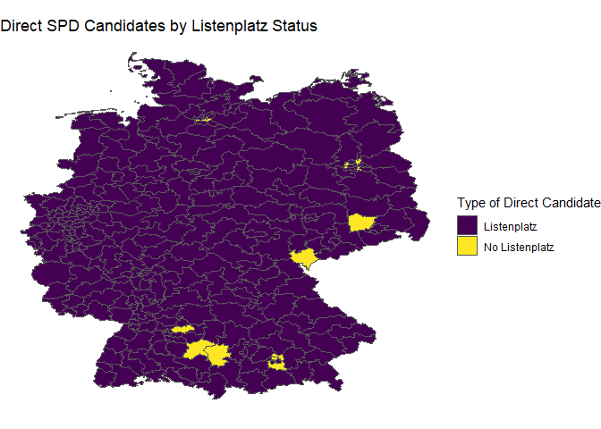<!-- -->

``` r
ggsave("Figures/Candidates/btw_21_direct_candidates_spd.png")
```

Lessons:

- There are only 11 SPD candidates without a Listenplatz. Some of them
  are found in Berlin and Bremen as well as in Baden-Württemberg and
  Saxony.

- The SPD did not insure their candidate in Waiblingen, perhaps because
  the CDU incumbent, Joachim Pfeiffer, stepped down after his
  involvement in a corruption scandal was revealed. Is the SPD confident
  of victory or is their candidate internally unpopular?

  - Similarly, the SPD has not insured its candidate in Neu-Ulm -
    another constituency whose incumbent, Georg Nüßlein, retired due to
    a corruption scandal.

- They have probably given up on München-Nord and München-Land, as well
  as Ulm. The same goes for Meißen and the Vogtlandkreis. In Berlin, the
  SPD tends to be strong.

- The SPD knows full well that it will win few direct mandates. Hence,
  the state lists are of much greater importance. That is, whoever the
  party grandees want to become an MP has to be assigned a prominent
  position on the list.

## FDP Direct Candidates

``` r
direkt %>%
  filter(partei == "FDP") %>%
  ggplot(aes(geometry = geometry)) +
  geom_sf(aes(fill = direct_no_list == 1)) +
  scale_fill_viridis_d("Type of Direct Candidate",
                       labels = c("Listenplatz", "No Listenplatz")) +
  labs(title = "Direct FDP Candidates by Listenplatz Status") +
  theme_void()
```

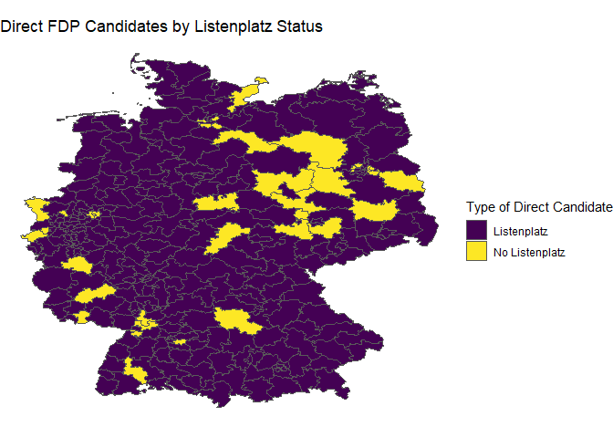<!-- -->

``` r
ggsave("Figures/Candidates/btw_21_direct_candidates_fdp.png")
```

Lessons:

- The FDP is fielding 35 no-list direct candidates.

- There are less no-list direct candidates than for the CDU. Yet, there
  are more than for the SPD. Why? They seem to be mostly concentrated in
  Brandenburg, Saxony-Anhalt and Saxony.

- I confess, I fail to understand the logic behind the spatial
  distribution of no-list direct candidates.

## Green Direct Candidates

``` r
direkt %>%
  filter(partei == "GRÜNE") %>%
  ggplot(aes(geometry = geometry)) +
  geom_sf(aes(fill = direct_no_list == 1)) +
  scale_fill_viridis_d("Type of Direct Candidate",
                       labels = c("Listenplatz", "No Listenplatz")) +
  labs(title = "Direct GRüNE Candidates by Listenplatz Status") +
  theme_void()
```

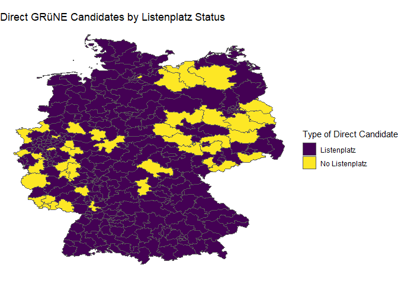<!-- -->

``` r
ggsave("Figures/Candidates/btw_21_direct_candidates_green.png")
```

Lessons:

- The Eastern Green direct candidates, i.e. in Brandenburg, Saxony,
  Thuringa and Saxony-Anhalt, tend not be back up by lists, particularly
  in rural areas. In urban areas, however, they are backed by
  Listenplätze, such as in Potsdam (Wahlkreis 61). Indeed, there are
  also quite a few no-list Greeens in North-Rhein Westphalia and
  Rhineland-Palatinate.

- Overall, the Greens are fielding 45 no-list direct candidates.

## AfD Direct Candidates

``` r
direkt %>%
  filter(partei == "AfD") %>%
  ggplot(aes(geometry = geometry)) +
  geom_sf(aes(fill = direct_no_list == 1)) +
  scale_fill_viridis_d("Type of Direct Candidate",
                       labels = c("Listenplatz", "No Listenplatz")) +
  labs(title = "Direct AfD Candidates by Listenplatz Status") +
  theme_void()
```

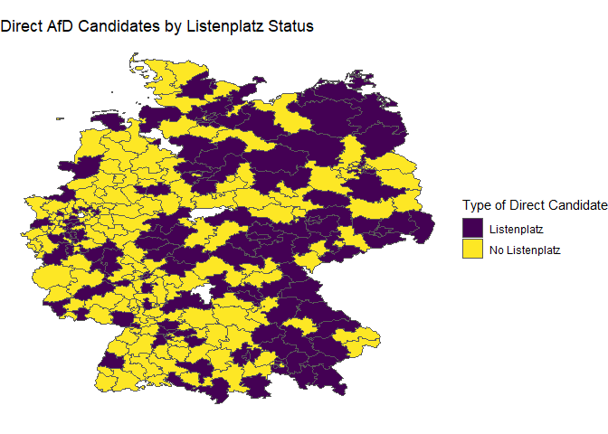<!-- -->

``` r
ggsave("Figures/Candidates/btw_21_direct_candidates_afd.png")
```

Lessons:

- There are 161 no-list direct candidates - more than half of all AfD
  candidates will only enter the Bundestag if they win their
  constituency directly. Given that the AfD is forecast to win merely
  some direct seats in Saxony, roughly 54% of all direct AfD candidates
  are doomed. This reflects the AfD’s internal divisions.

- There also appear to be three constituencies where the AfD has fieled
  no direct candidate.

## Linke Direct Candidates

``` r
direkt %>%
  filter(partei == "DIE LINKE") %>%
  ggplot(aes(geometry = geometry)) +
  geom_sf(aes(fill = direct_no_list == 1)) +
  scale_fill_viridis_d("Type of Direct Candidate",
                       labels = c("Listenplatz", "No Listenplatz")) +
  labs(title = "Direct DIE LINKE Candidates by Listenplatz Status") +
  theme_void()
```

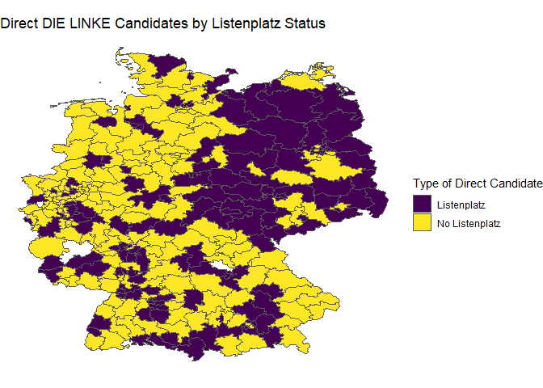<!-- -->

``` r
ggsave("Figures/Candidates/btw_21_direct_candidates_linke.png")
```

Lessons:

- The Linke nominated 162 no-list direct candidates. They are
  particularly concentrated in the former West, with some exceptions.

- What explains this logic?

# Wahlkreise and Socio-Economic Characteristics

Let us start by creating an appropriate data set:

``` r
# data set
constituencies21 <- wahlkreisnamen %>%
  left_join(btw_shapefile, by = "WKR_NR") %>%
  left_join(strukturdaten21, by = c("WKR_NR" = "wahlkreis_nr"))
## mutate()
constituencies21 <- constituencies21 %>%
  mutate(east_dummy = ifelse(LAND_NR.x %in% c(12, 13, 14, 15, 16), "East Germany", "West Germany"))
```

Now, I create a table for these variables, comparing Eastern and Western
constituencies.

``` r
# table 
table_east_west <- constituencies21 %>%
  dplyr::select("Population per 1000 Inhabitants" = bevolkerung_am_31_12_2019_deutsche_in_1000,
         "Ausländeranteil in Prozent" = bevolkerung_am_31_12_2019_auslander_innen_percent,
         "Bevölkerungsdichte (Einwohner je km2)" = bevolkerungsdichte_am_31_12_2019_ew_je_km2,
         "Zu-/Abnahme d. Bevölkerung (Wanderungssaldo)" = zu_bzw_abnahme_der_bevolkerung_2019_wanderungssaldo_je_1000_ew,
         "Anteil, 18-24 Jahre in Prozent" = alter_von_bis_jahren_am_31_12_2019_18_24_percent,
         "Anteil, 60-74 Jahre in Prozent" = alter_von_bis_jahren_am_31_12_2019_60_74_percent, 
         "Anteil, +75 Jahre in Prozent" = alter_von_bis_jahren_am_31_12_2019_75_und_mehr_percent,
         "Unternehmen je 1000 Einwohner" = unternehmensregister_2018_unternehmen_insgesamt_je_1000_ew,
         "Schulabgänger ohne Hauptschulabschluss in Prozent" = schulabganger_innen_allgemeinbildender_schulen_2019_ohne_hauptschulabschluss_percent,
         "Verfügbares Einkommen, Euro je Einwohner" = verfugbares_einkommen_der_privaten_haushalte_2018_eur_je_ew,
        "Arbeitslosenquote, insgesamt" = arbeitslosenquote_februar_2021_insgesamt,
        "Arbeitslosenquote, Frauen" = arbeitslosenquote_februar_2021_frauen,
        "Arbeitslosenquote, Männer" = arbeitslosenquote_februar_2021_manner,
        "Arbeitslosenquote, 55-64 Jahre" = arbeitslosenquote_februar_2021_55_bis_64_jahre,
         east_dummy)
# summary stats
datasummary_skim(table_east_west,
                 fmt = 2, 
                 title = "Summary Statistics",
                 output = "Figures/Candidates/sum_eastwest.png") 
```

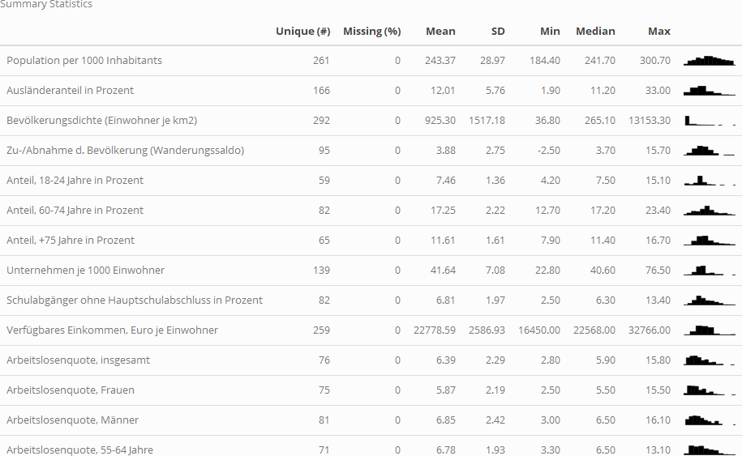

Now, we are in a position to create a table comparing Eastern and
Western German constituencies.

``` r
datasummary_balance(~east_dummy, 
                    fmt = 2,
                    dinm_statistic = "p.value",
                    data = table_east_west,
                    title = "Comparing Eastern and Western Constituencies",
                    output = "Figures/Candidates/balance.png")
```

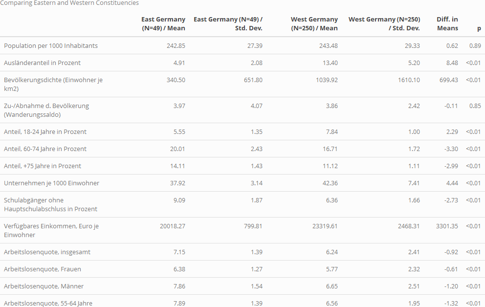

## Population Density

``` r
constituencies21 %>%
  ggplot(aes(geometry = geometry)) +
  geom_sf(aes(fill = bevolkerung_am_31_12_2019_insgesamt_in_1000)) +
  scale_fill_viridis_b("Bevölkerung", 
                       labels = label_number(scale = 1000, 
                                             accuracy = 1),
                       direction = -1) +
  theme_void()
```

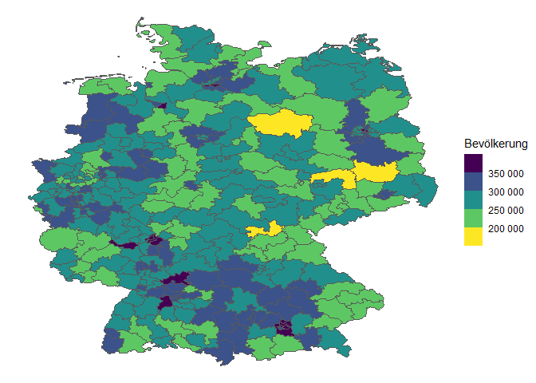<!-- -->

``` r
ggsave("Figures/Candidates/btw_21_wahlkreise_population_density.png")
```

## Density of Non-Germans

``` r
constituencies21 %>%
  ggplot(aes(geometry = geometry)) +
  geom_sf(aes(fill = bevolkerung_am_31_12_2019_auslander_innen_percent)) +
  scale_fill_viridis_b("Bevölkerungsanteil\nder Ausländer", 
                       labels = label_percent(scale = 1),
                       direction = -1) +
  theme_void()
```

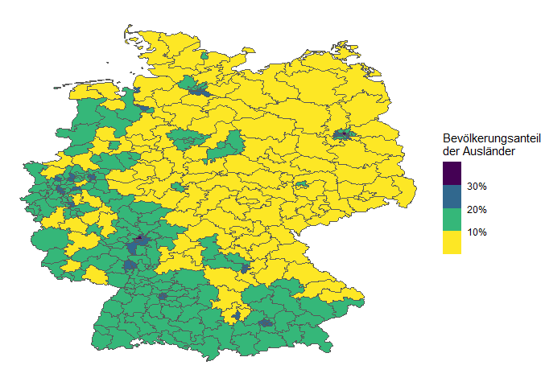<!-- -->

``` r
ggsave("Figures/Candidates/btw_21_wahlkreise_share_foreigners.png")
```

## Change in Population per 1000 Inhabitants

``` r
constituencies21 %>%
  ggplot(aes(geometry = geometry)) +
  geom_sf(aes(fill = zu_bzw_abnahme_der_bevolkerung_2019_wanderungssaldo_je_1000_ew)) +
  scale_fill_viridis_b("Bevölkerungsveränderung\nje 1000 Einwohner\n(Wanderungssaldo)",
                       direction = -1) +
  theme_void()
```

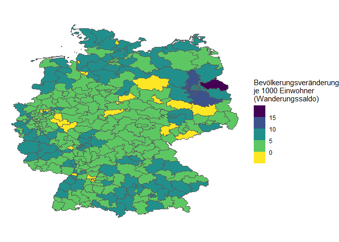<!-- -->

``` r
ggsave("Figures/Candidates/btw_21_wahlkreise_wanderungssaldo.png")
```

## Share of 18-24 Year Olds

``` r
constituencies21 %>%
  ggplot(aes(geometry = geometry)) +
  geom_sf(aes(fill = alter_von_bis_jahren_am_31_12_2019_18_24_percent)) +
  scale_fill_viridis_b("Bevölkerungsanteil 18-24\nJahre",
                       labels = label_percent(scale = 1, accuracy = 1),
                       direction = -1) +
  theme_void()
```

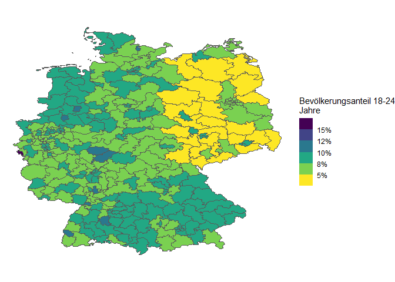<!-- -->

``` r
ggsave("Figures/Candidates/btw_21_wahlkreise_share_18_24.png")
```

## Share of 25-34 Year Olds

``` r
constituencies21 %>%
  ggplot(aes(geometry = geometry)) +
  geom_sf(aes(fill = alter_von_bis_jahren_am_31_12_2019_25_34_percent)) +
  scale_fill_viridis_b("Bevölkerungsanteil 25-34\nJahre",
                       labels = label_percent(scale = 1, accuracy = 1),
                       direction = -1) +
  theme_void()
```

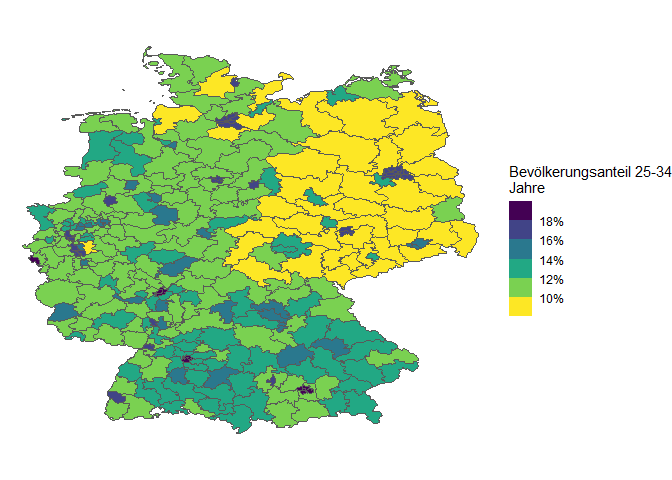<!-- -->

``` r
ggsave("Figures/Candidates/btw_21_wahlkreise_share_25_34.png")
```

## Share of 35-59 Year Olds

``` r
constituencies21 %>%
  ggplot(aes(geometry = geometry)) +
  geom_sf(aes(fill = alter_von_bis_jahren_am_31_12_2019_35_59_percent)) +
  scale_fill_viridis_b("Bevölkerungsanteil 35-59\nJahre",
                       labels = label_percent(scale = 1, accuracy = 1),
                       direction = -1) +
  theme_void()
```

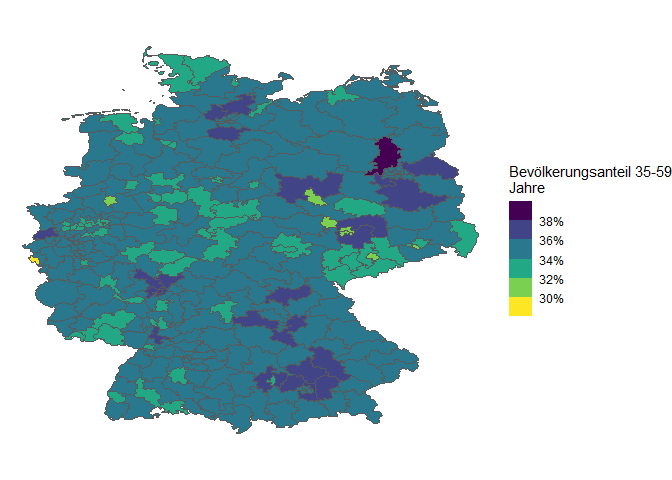<!-- -->

``` r
ggsave("Figures/Candidates/btw_21_wahlkreise_share_35_59.png")
```

## Share of 60-74 Year Olds

``` r
constituencies21 %>%
  ggplot(aes(geometry = geometry)) +
  geom_sf(aes(fill = alter_von_bis_jahren_am_31_12_2019_60_74_percent)) +
  scale_fill_viridis_b("Bevölkerungsanteil 60-74\nJahre",
                       labels = label_percent(scale = 1, accuracy = 1),
                       direction = -1) +
  theme_void()
```

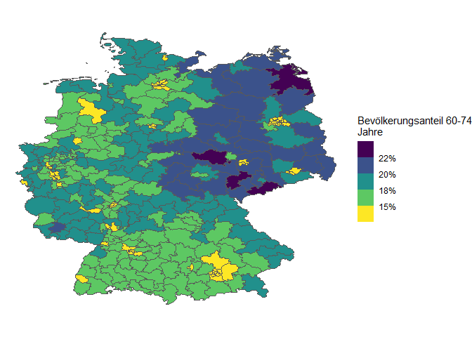<!-- -->

``` r
ggsave("Figures/Candidates/btw_21_wahlkreise_share_60_74.png")
```

## Share of +75 Year Olds

``` r
constituencies21 %>%
  ggplot(aes(geometry = geometry)) +
  geom_sf(aes(fill = alter_von_bis_jahren_am_31_12_2019_75_und_mehr_percent)) +
  scale_fill_viridis_b("Bevölkerungsanteil 75+\nJahre",
                       labels = label_percent(scale = 1, accuracy = 1),
                       direction = -1) +
  theme_void()
```

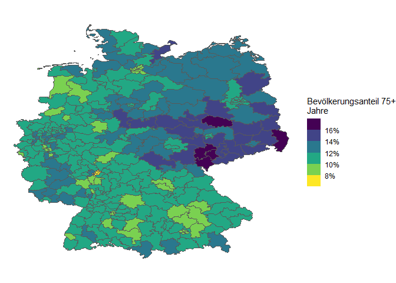<!-- -->

``` r
ggsave("Figures/Candidates/btw_21_wahlkreise_share_75_over.png")
```

## Density of Companies

``` r
constituencies21 %>%
  ggplot(aes(geometry = geometry)) +
  geom_sf(aes(fill = unternehmensregister_2018_unternehmen_insgesamt_je_1000_ew)) +
  scale_fill_viridis_b("Unternehmen je\n1000 Einwohner",
                       direction = -1) +
  theme_void()
```

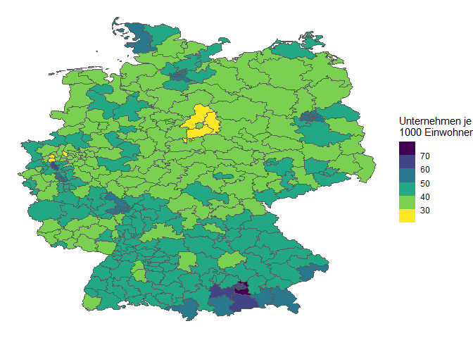<!-- -->

``` r
ggsave("Figures/Candidates/btw_21_wahlkreise_density_companies.png")
```

## Density of Handwerksunternehmen

``` r
constituencies21 %>%
  ggplot(aes(geometry = geometry)) +
  geom_sf(aes(fill = unternehmensregister_2018_handwerksunternehmen_je_1000_ew)) +
  scale_fill_viridis_b("Handwerksunternehmen\nje 1000 Einwohner",
                       direction = -1) +
  theme_void()
```

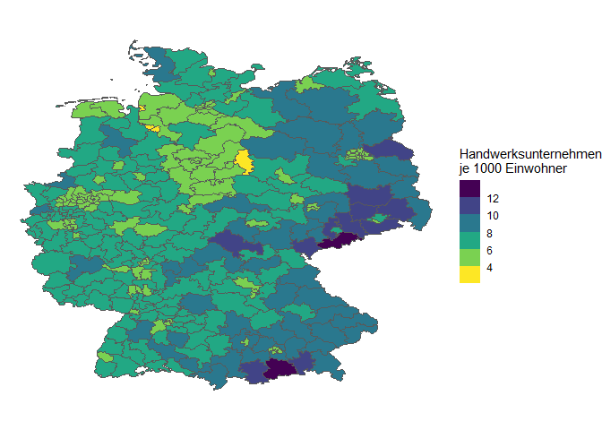<!-- -->

``` r
ggsave("Figures/Candidates/btw_21_wahlkreise_density_handwerk.png")
```

## Schulabgänger ohne Hauptschulabschluss

``` r
constituencies21 %>%
  ggplot(aes(geometry = geometry)) +
  geom_sf(aes(fill = schulabganger_innen_allgemeinbildender_schulen_2019_ohne_hauptschulabschluss_percent)) +
  scale_fill_viridis_b("Anteil der Schulabgänger\nohne Hauptschulabschluss",
                       labels = label_percent(scale = 1, accuracy = 2),
                       direction = -1) +
  theme_void()
```

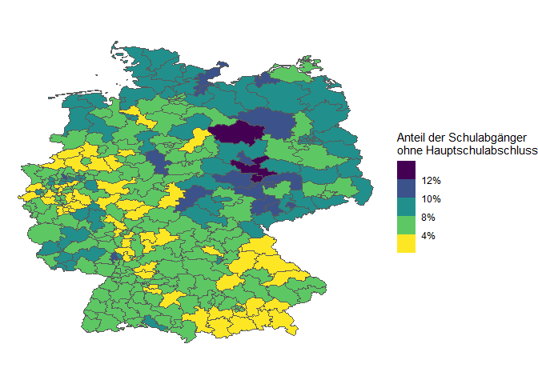<!-- -->

``` r
ggsave("Figures/Candidates/btw_21_wahlkreise_ohne_hauptschulabschluss.png")
```

## Schulabgänger mit allgemeiner Reifer (Abitur)

``` r
constituencies21 %>%
  ggplot(aes(geometry = geometry)) +
  geom_sf(aes(fill = schulabganger_innen_allgemeinblldender_schulen_2019_mit_allgemeiner_und_fachhochschulreife_percent)) +
  scale_fill_viridis_b("Anteil der Schulabgänger\nmit Abitur",
                       labels = label_percent(scale = 1, accuracy = 2),
                       direction = -1) +
  theme_void()
```

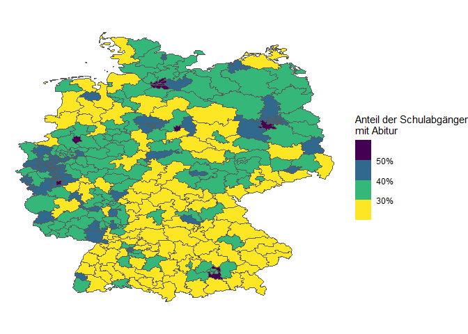<!-- -->

``` r
ggsave("Figures/Candidates/btw_21_wahlkreise_abitur.png")
```

## Disposable Income

``` r
constituencies21 %>%
  ggplot(aes(geometry = geometry)) +
  geom_sf(aes(fill = verfugbares_einkommen_der_privaten_haushalte_2018_eur_je_ew)) +
  scale_fill_viridis_b("Verfügbares Einkommen\nprivater Haushalte je Einwohner", 
                       labels = label_number(scale = 1),
                       direction = -1) +
  theme_void()
```

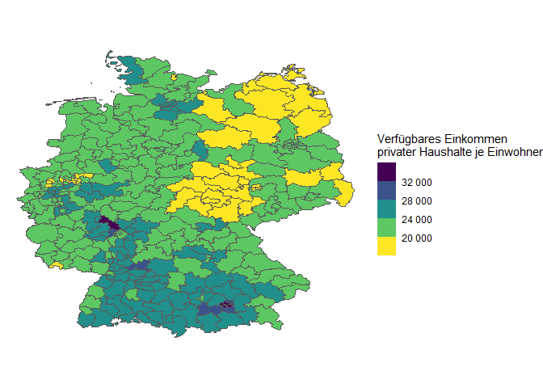<!-- -->

``` r
ggsave("Figures/Candidates/btw_21_wahlkreise_disposable_income.png")
```

## Regional BIP

``` r
constituencies21 %>%
  ggplot(aes(geometry = geometry)) +
  geom_sf(aes(fill = bruttoinlandsprodukt_2018_eur_je_ew)) +
  scale_fill_viridis_b("Pro-Kopf BIP (2018)", 
                       labels = label_number(scale = 1),
                       direction = -1) +
  theme_void()
```

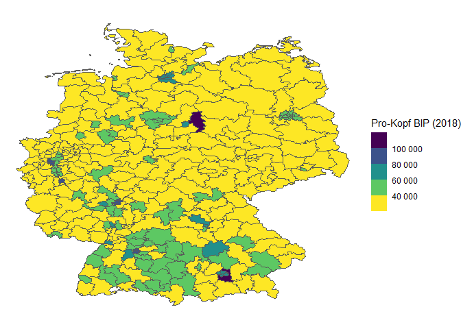<!-- -->

## Unemployment Rate

``` r
constituencies21 %>%
  ggplot(aes(geometry = geometry)) +
  geom_sf(aes(fill = arbeitslosenquote_februar_2021_insgesamt)) +
  scale_fill_viridis_b("Arbeitslosenquote", 
                       labels = label_percent(scale = 1, 
                                              accuracy = 1),
                       direction = -1) +
  theme_void()
```

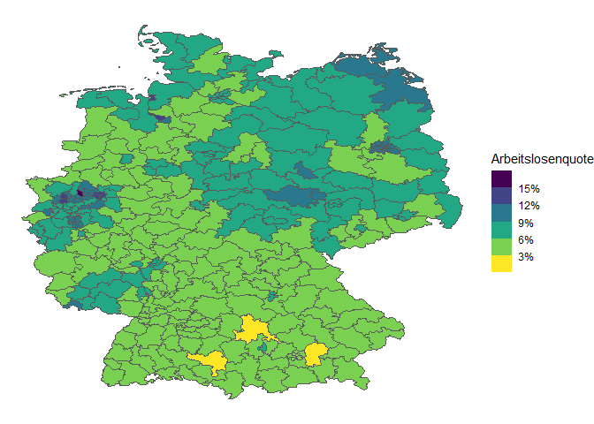<!-- -->

``` r
ggsave("Figures/Candidates/btw_21_wahlkreise_arbeitslosenquote.png")
```

## Unemployment Rate Among 55-64 Year Olds

``` r
constituencies21 %>%
  ggplot(aes(geometry = geometry)) +
  geom_sf(aes(fill = arbeitslosenquote_februar_2021_55_bis_64_jahre)) +
  scale_fill_viridis_b("Arbeitslosenquote unter\n55-64 Jährigen", 
                       labels = label_percent(scale = 1, 
                                              accuracy = 1),
                       direction = -1) +
  theme_void()
```

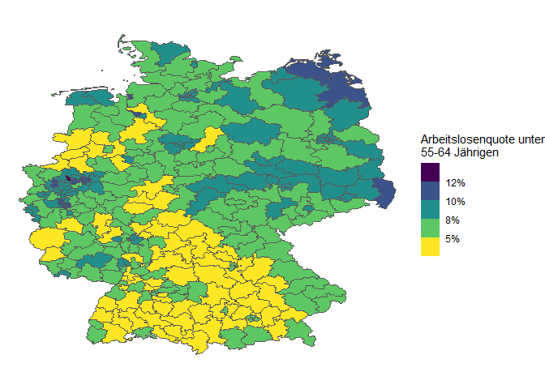<!-- -->

``` r
ggsave("Figures/Candidates/btw_21_wahlkreise_arbeitslosenquote_55_64.png")
```

## Arbeitslosengeld-II-Empfänger

``` r
constituencies21 %>%
  ggplot(aes(geometry = geometry)) +
  geom_sf(aes(fill = empfanger_innen_von_leistungen_nach_sgb_ii_oktober_2020_insgesamt_je_1000_ew)) +
  scale_fill_viridis_b("Arbeitslosengeld-II-\nEmpfänger je 1000 Einwohner\n(Oktober 2020)", 
                       labels = label_number(scale = 1, 
                                              accuracy = 1),
                       direction = -1) +
  theme_void()
```

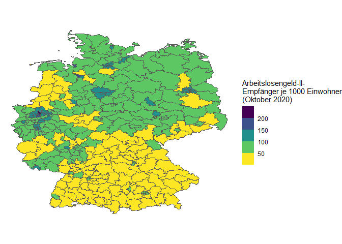<!-- -->

``` r
ggsave("Figures/Candidates/btw_21_wahlkreise_arbeitslosengeld_ii_empfaenger.png")
```

## Ausländische Arbeitslosengeld-II-Empfänger

``` r
constituencies21 %>%
  ggplot(aes(geometry = geometry)) +
  geom_sf(aes(fill = empfanger_innen_von_leistungen_nach_sgb_ii_oktober_2020_auslander_innen_percent)) +
  scale_fill_viridis_b("Anteil der Ausländer unter\nArbeitslosengeld-II-\nEmpfängern", 
                       labels = label_percent(scale = 1, 
                                              accuracy = 1),
                       direction = -1) +
  theme_void()
```

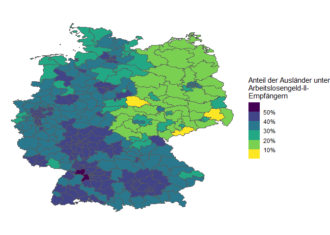<!-- -->

``` r
ggsave("Figures/Candidates/btw_21_wahlkreise_foreign_arbeitslosengeld_ii_empfaenger.png")
```

## From Candidates to Representatives

Let us import the data set of all 736 elected representatives:

``` r
# import 
mps21 <- read_delim("Data/btw21_gewaehlte-fortschreibung_utf8.csv", 
                               skip = 8, delim = ";") %>%
  clean_names() %>%
  filter(is.na(verlust_mitgliedschaft_grund)) # 736 MPs in total 
## let us create a variable that contains their full name 
mps21 <- mps21 %>%
  mutate(full_name = paste(nachname, vornamen, sep = ", "))
```

### Gender Balance

``` r
# plot 1, absolute 
mps21 %>%
  group_by(geschlecht) %>%
  count() %>%
  ggplot(aes(factor(geschlecht), n)) +
  geom_col(width = 0.6) +
  geom_text(aes(label = n), vjust = -0.5) +
  expand_limits(y = 520) +
  scale_x_discrete(labels = c("m" = "Mann",
                              "w" = "Frau")) +
  labs(x = "Geschlecht", y = "Anzahl", 
       title = "Abgeordnete nach Geschlecht") +
  theme_bw() 
```

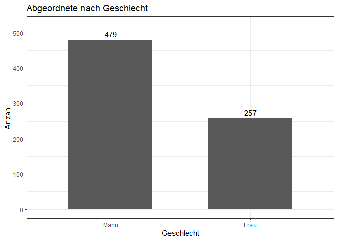<!-- -->

``` r
ggsave("Figures/Candidates/btw_21_candidates_gender_balance_absolute.png")
# plot 2, relative  
mps21 %>%
  group_by(geschlecht) %>%
  summarise(freq = round((n()/736)*100, digits = 2)) %>%
  ggplot(aes(factor(geschlecht), freq)) +
  geom_col(width = 0.6) +
  geom_text(aes(label = freq), vjust = -0.5) +
  scale_x_discrete(labels = c("m" = "Mann",
                              "w" = "Frau")) +
  scale_y_continuous("Geschlechteranteil",
                     labels = label_percent(scale = 1, accuracy = 1)) +
  expand_limits(y = 75) +
  labs(x = "Geschlecht",
       title = "Abgeordnete nach Geschlecht") +
  theme_bw()
```

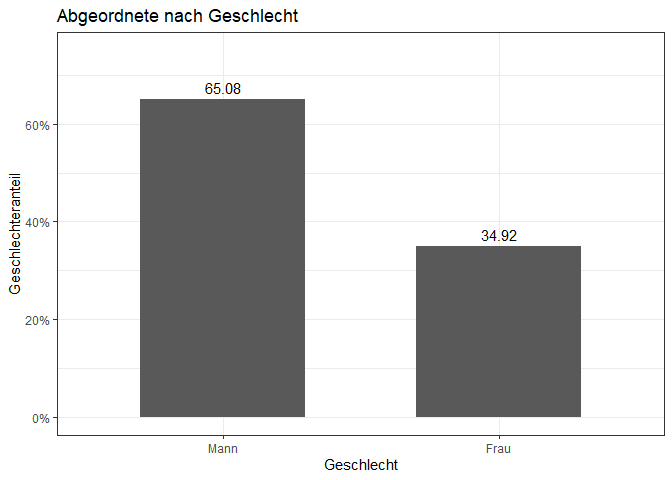<!-- -->

``` r
ggsave("Figures/Candidates/btw_21_candidates_gender_balance_relative.png")
```

### Gender Balance by Status

``` r
# variable
mps21 <- mps21 %>%
  mutate(type_mp = ifelse(is.na(listenplatz), "direct", "list"))
## same plot as before 
mps21 %>%
  group_by(geschlecht, type_mp) %>%
  count() %>%
  ggplot(aes(factor(geschlecht), n, fill = type_mp)) +
  geom_col(position = "dodge") +
  geom_text(aes(label = n), vjust = -0.5, position = position_dodge(width = 1)) +
  expand_limits(y = 350) +
  scale_fill_manual(" ", 
                    labels = c("direct" = "Wahlkreis",
                               "list" = "Listenplatz"),
                    values = c("darkgreen", "deepskyblue4")) +
  scale_x_discrete(labels = c("m" = "Mann",
                              "w" = "Frau")) +
  labs(x = "Geschlecht", y = "Anzahl", 
       title = "Abgeordnete nach Geschlecht und Einzugstyp") +
  theme_bw() 
```

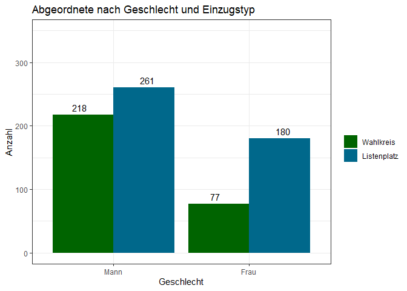<!-- -->

``` r
ggsave("Figures/Candidates/btw_21_candidates_by_gender_candidate_type.png")
```

We can see that, among those who entered the Bundestag by winning their
constituencies directly, roughly 75% are men. Those who entered via the
list, approximately 60% are men. Thus, the overall share of men (roughly
two thirds) is given by the following weighted average:

$$
\underbrace{\frac{299}{736}}_{share direct MPs}*(0.75) + \underbrace{\frac{436}{736}}_{share list MPs}*(0.6) \approx 0.66
$$

Let me just reverse this plot:

``` r
mps21 %>%
  group_by(type_mp, geschlecht) %>%
  count() %>%
  ggplot(aes(factor(type_mp), n, fill = geschlecht)) +
  geom_col(position = "dodge") +
  geom_text(aes(label = n), vjust = -0.5, position = position_dodge(width = 1)) +
  expand_limits(y = 350) +
  scale_fill_manual(" ", 
                    labels = c("m" = "Mann",
                               "w" = "Frau"),
                    values = c("darkgreen", "deepskyblue4")) +
  scale_x_discrete(labels = c("direct" = "Wahlkreis",
                               "list" = "Listenplatz")) +
  labs(x = "Type of Candidate", y = "Anzahl", 
       title = "Abgeordnete nach Einzugstyp und Geschlecht") +
  theme_bw() 
```

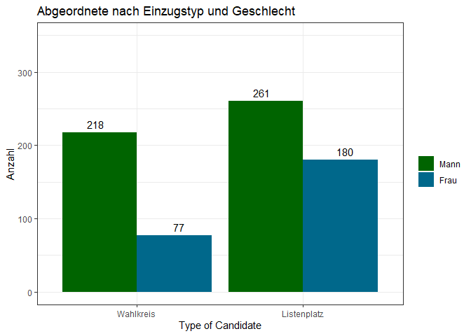<!-- -->

``` r
ggsave("Figures/Candidates/btw_21_candidates_by_candidate_type_and_gender.png")
```

### Gender Balance by Party

``` r
# absolute
mps21 %>%
  filter(!gruppenname == "SSW") %>%
  mutate(gruppenname1 = ifelse(gruppenname %in% c("CDU", "CSU"), "CDU/CSU", gruppenname)) %>%
  group_by(geschlecht, gruppenname1) %>%
  count() %>%
  ggplot(aes(factor(geschlecht), n)) +
  geom_col(width = 0.6) +
  geom_text(aes(label = n), vjust = -0.5) +
  scale_x_discrete(labels = c("m" = "Mann",
                              "w" = "Frau")) +
  scale_y_continuous("Geschlechteranteil") +
  expand_limits(y = 180) +
  labs(x = "Geschlecht",
       title = "Abgeordnete nach Geschlecht und Partei") +
  theme_bw() +
  facet_wrap(~gruppenname1)
```

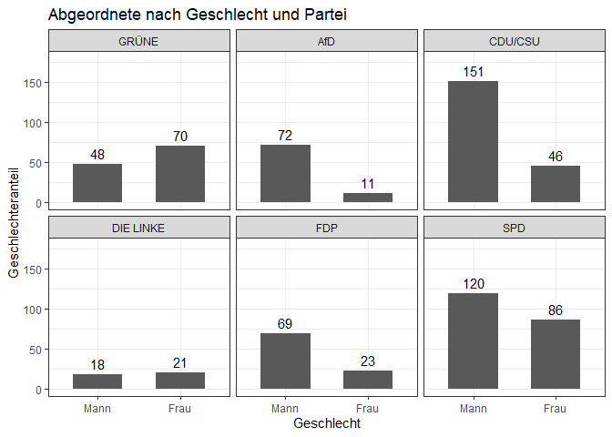<!-- -->

``` r
ggsave("Figures/Candidates/btw_21_candidates_by_gender_and_party_absolute.png")
# relative 
mps21 %>%
  filter(!gruppenname == "SSW") %>%
  mutate(gruppenname1 = ifelse(gruppenname %in% c("CDU", "CSU"), "CDU/CSU", gruppenname)) %>%
  ggplot(aes(factor(geschlecht), group = 1)) +
  geom_bar(aes(y = stat(prop)), width = 0.6) +
  scale_x_discrete(labels = c("m" = "Mann",
                              "w" = "Frau")) +
  scale_y_continuous("Geschlechteranteil",
                     labels = label_percent(scale = 100, accuracy = 1)) +
  labs(x = "Geschlecht",
       title = "Abgeordnete nach Geschlecht und Partei") +
  expand_limits(y = 0.90) +
  theme_bw() +
  facet_wrap(~gruppenname1)
```

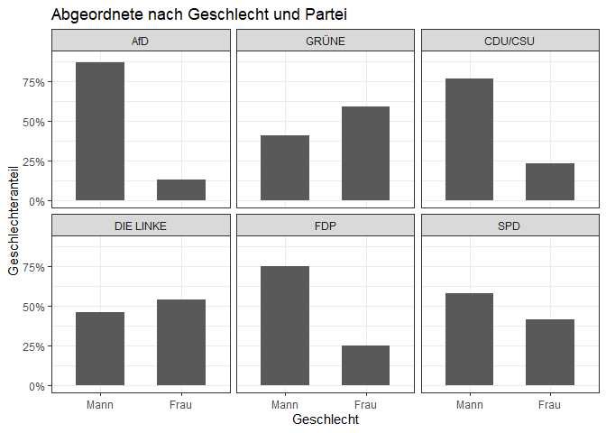<!-- -->

``` r
ggsave("Figures/Candidates/btw_21_candidates_by_gender_and_party_relative.png")
```

### Gender Balance by Party and Type of Candidate

``` r
mps21 %>%
  filter(!gruppenname == "SSW") %>%
  mutate(gruppenname1 = ifelse(gruppenname %in% c("CDU", "CSU"), "CDU/CSU", gruppenname)) %>%
  group_by(geschlecht, type_mp, gruppenname1) %>%
  count() %>%
  ggplot(aes(factor(geschlecht), n, fill = type_mp)) +
  geom_col(position = "dodge") +
  geom_text(aes(label = n), vjust = -0.5, position = position_dodge(width = 1)) +
  scale_fill_manual(" ", 
                    labels = c("direct" = "Wahlkreis",
                               "list" = "Listenplatz"),
                    values = c("darkgreen", "deepskyblue4")) +
  scale_x_discrete(labels = c("m" = "Mann",
                              "w" = "Frau")) +
  expand_limits(y = 150) +
  labs(x = "Geschlecht", y = "Anzahl", 
       title = "Abgeordnete nach Geschlecht, Einzugstyp und Partei") +
  theme_bw() +
  facet_wrap(~gruppenname1)
```

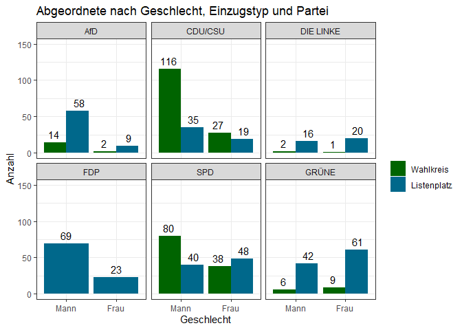<!-- -->

``` r
ggsave("Figures/Candidates/btw_21_candidates_by_gender_candidate_type_and_party.png")
```

### Geburtjahr

``` r
mps21 %>%
  ggplot(aes(x = geburtsjahr)) +
  geom_histogram(aes(y = stat(density)), bins = 20, 
                 colour = "white") +
  geom_density(size = 1) +
  geom_vline(aes(xintercept = mean(geburtsjahr)),
             colour = "red", size = 1) +
  geom_vline(aes(xintercept = mean(geburtsjahr) + sd(geburtsjahr)),
             colour = "red", linetype = "dashed", size = 1) +
  geom_vline(aes(xintercept = mean(geburtsjahr) - sd(geburtsjahr)),
             colour = "red", linetype = "dashed", size = 1) +
  stat_function(fun = dnorm,
                args = list(mean(mps21$geburtsjahr), sd(mps21$geburtsjahr)),
                size = 1, linetype = "dashed") +
  scale_x_continuous(breaks = seq(from = 1940, to = 2000, by = 10)) +
  labs(x = "Geburtjahr", y = "Density", 
       title = "Abgeordnete nach Geburtjahr",
       caption = "The dashed line indicates the shape of the theoretical normal distribution.") +
  theme_bw()
```

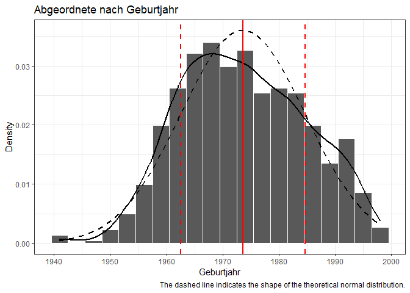<!-- -->

``` r
ggsave("Figures/Candidates/btw_21_candidates_age_distribution.png")
```

Let us try to create separate histograms for each party:

``` r
mps21 %>%
  filter(!gruppenname == "SSW") %>%
  mutate(gruppenname1 = ifelse(gruppenname %in% c("CDU", "CSU"), "CDU/CSU", gruppenname)) %>%
  ggplot(aes(x = geburtsjahr)) +
  geom_histogram(aes(y = stat(density)), bins = 20, 
                 colour = "white") +
  geom_density(size = 1) +
  scale_x_continuous(breaks = seq(from = 1940, to = 2000, by = 10)) +
  labs(x = "Geburtjahr", y = "Density", 
       title = "Altersverteilung der Abgeordneten nach Partei") +
  theme_bw() +
  theme(axis.text.x = element_text(angle = 25)) +
  facet_wrap(~gruppenname1)
```

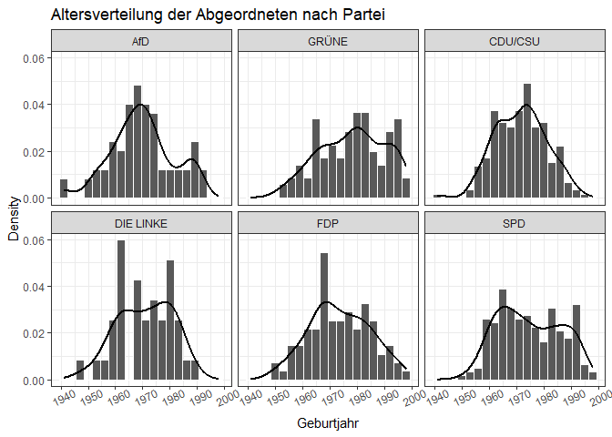<!-- -->

``` r
ggsave("Figures/Candidates/btw_21_candidates_age_distribution_by_party.png")
```

The information in this graph can be expressed in a table:

``` r
mps21 %>%
  filter(!gruppenname == "SSW") %>%
  mutate(gruppenname1 = ifelse(gruppenname %in% c("CDU", "CSU"), "CDU/CSU", gruppenname)) %>%
  group_by(gruppenname1) %>%
  summarise(m1 = round(mean(geburtsjahr), digits = 2),
            m2 = round(median(geburtsjahr), digits = 2)) %>%
  arrange(m1) %>%
  kable(col.names = c("Partei", "durchschnittliches Geburtjahr", "medianes Geburtjahr"),
        booktabs = T) %>%
  kable_styling(full_width = T)
```

<table class="table" style="margin-left: auto; margin-right: auto;">
<thead>
<tr>
<th style="text-align:left;">
Partei
</th>
<th style="text-align:right;">
durchschnittliches Geburtjahr
</th>
<th style="text-align:right;">
medianes Geburtjahr
</th>
</tr>
</thead>
<tbody>
<tr>
<td style="text-align:left;">
AfD
</td>
<td style="text-align:right;">
1969.78
</td>
<td style="text-align:right;">
1969.0
</td>
</tr>
<tr>
<td style="text-align:left;">
DIE LINKE
</td>
<td style="text-align:right;">
1970.77
</td>
<td style="text-align:right;">
1971.0
</td>
</tr>
<tr>
<td style="text-align:left;">
CDU/CSU
</td>
<td style="text-align:right;">
1971.68
</td>
<td style="text-align:right;">
1972.0
</td>
</tr>
<tr>
<td style="text-align:left;">
FDP
</td>
<td style="text-align:right;">
1973.66
</td>
<td style="text-align:right;">
1973.0
</td>
</tr>
<tr>
<td style="text-align:left;">
SPD
</td>
<td style="text-align:right;">
1974.70
</td>
<td style="text-align:right;">
1973.5
</td>
</tr>
<tr>
<td style="text-align:left;">
GRÜNE
</td>
<td style="text-align:right;">
1978.31
</td>
<td style="text-align:right;">
1979.0
</td>
</tr>
</tbody>
</table>

Let us define a three-valued age variable:

``` r
mps21 <- mps21 %>%
  mutate(age_category = case_when(geburtsjahr < 1962 ~ "old",
                   geburtsjahr > 1985 ~ "young",
                   TRUE ~ "middle"))
```

Let us make use of that variable.

``` r
# count
mps21 %>%
  group_by(age_category) %>%
  count() %>%
  ggplot(aes(x = factor(age_category), y = n)) +
  geom_col() +
  scale_x_discrete("Altersgruppe nach Jahrgängen",
                   labels = c("middle" = "1963-1985",
                              "young" = "1986-1998",
                              "old" = "1941-1962")) +
  labs(y = "Anzahl") +
  theme_bw()
```

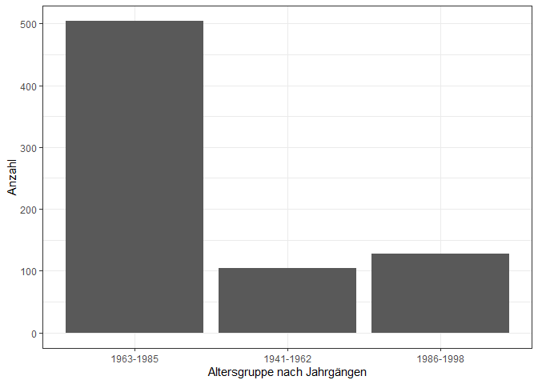<!-- -->

``` r
ggsave("Figures/Candidates/btw_21_candidates_age_groups_absolute.png")
# proportions
mps21 %>%
  ggplot(aes(x = factor(age_category), group = 1)) +
  geom_bar(aes(y = stat(prop))) +
  scale_x_discrete("Altersgruppe nach Jahrgängen",
                   labels = c("middle" = "1963-1985",
                              "young" = "1986-1998",
                              "old" = "1941-1962")) +
  scale_y_continuous("Anteil", 
                     labels = label_percent(scale = 100, accuracy = 1)) +
  theme_bw()
```

<!-- -->

``` r
ggsave("Figures/Candidates/btw_21_candidates_age_groups_relative.png")
```

Next, let us look at Altersgruppe by type of candidacy:

``` r
mps21 %>%
  group_by(age_category, type_mp) %>%
  count() %>%
  ggplot(aes(factor(age_category), n, fill = type_mp)) +
  geom_col(position = "dodge") +
  geom_text(aes(label = n), vjust = -0.5, position = position_dodge(width = 1)) +
  scale_x_discrete("Altersgruppe nach Jahrgängen",
                   labels = c("middle" = "1963-1985",
                              "young" = "1986-1998",
                              "old" = "1941-1962")) +
  scale_fill_manual("", 
                    labels = c("direct" = "Wahlkreis",
                               "list" = "Listenplatz"),
                    values = c("darkgreen", "deepskyblue4")) +
  expand_limits(y = 310) +
  labs(y = "Anzahl") +
  theme_bw()
```

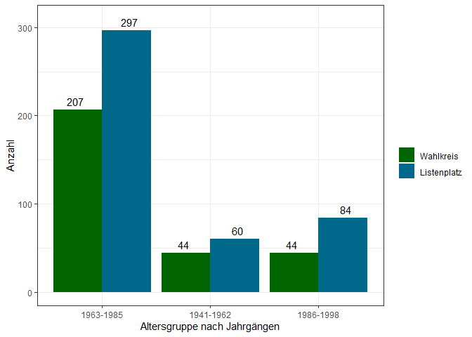<!-- -->

``` r
ggsave("Figures/Candidates/btw_21_candidates_age_groups_candidate_type.png")
```

Do this plot by party:

``` r
mps21 %>%
  filter(!gruppenname == "SSW") %>%
  mutate(gruppenname1 = ifelse(gruppenname %in% c("CDU", "CSU"), "CDU/CSU", gruppenname)) %>%
  group_by(age_category, type_mp, gruppenname1) %>%
  count() %>%
  ggplot(aes(factor(age_category), n, fill = type_mp)) +
  geom_col(position = "dodge") +
  geom_text(aes(label = n), vjust = -0.5, position = position_dodge(width = 1)) +
  scale_x_discrete("Altersgruppe nach Jahrgängen",
                   labels = c("middle" = "1963-1985",
                              "young" = "1986-1998",
                              "old" = "1941-1962")) +
  scale_fill_manual("", 
                    labels = c("direct" = "Wahlkreis",
                               "list" = "Listenplatz"),
                    values = c("darkgreen", "deepskyblue4")) +
  expand_limits(y = 150) +
  labs(y = "Anzahl") +
  theme_bw() +
  theme(axis.text.x = element_text(angle = 30, vjust = 0.5)) +
  facet_wrap(~gruppenname1)
```

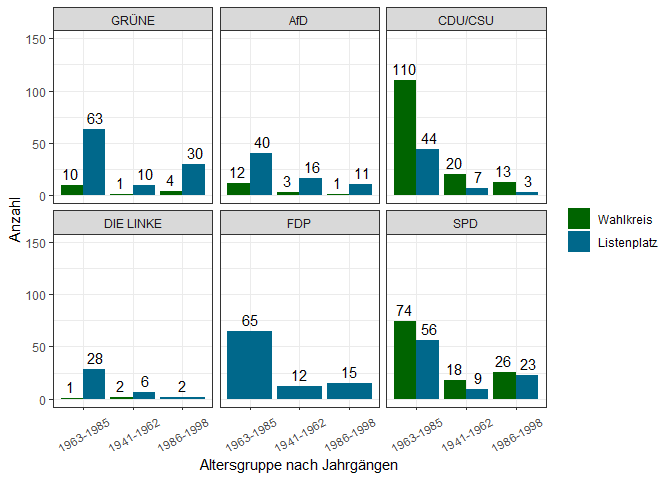<!-- -->

``` r
ggsave("Figures/Candidates/btw_21_candidates_age_groups_candidate_type_and_party.png")
```

## Academic MPs

``` r
mps21 <- mps21 %>%
  mutate(high_academic = ifelse(is.na(titel), "no", "yes"))
mps21 %>%
  ggplot(aes(x = high_academic, group = 1)) +
  geom_bar(aes(y = stat(prop)), width = 0.6) +
  scale_y_continuous("Anteil der Abgeordneten",
                     labels = label_percent(scale = 100, accuracy = 1)) + 
  scale_x_discrete("Sind die Abgeordneten mindestens promoviert?", 
                   labels = c("no" = "Nein",
                              "yes" = "Ja")) +
  theme_bw()
```

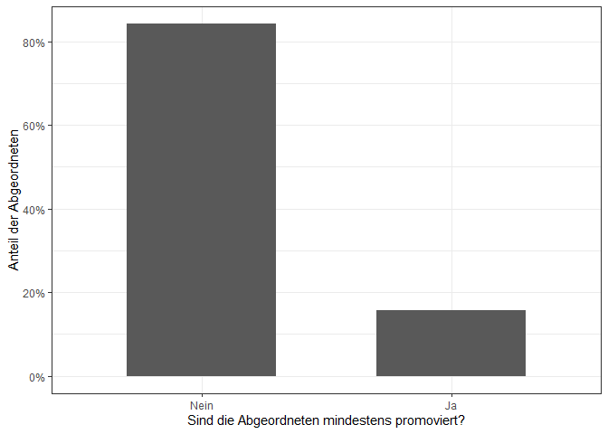<!-- -->

## Academic MPs by Party

``` r
mps21 %>%
  filter(!gruppenname == "SSW") %>%
  mutate(gruppenname1 = ifelse(gruppenname %in% c("CDU", "CSU"), "CDU/CSU", gruppenname)) %>%
  ggplot(aes(x = high_academic, group = 1)) +
  geom_bar(aes(y = stat(prop)), width = 0.6) +
  scale_y_continuous("Anteil der Abgeordneten",
                     labels = label_percent(scale = 100, accuracy = 1),
                     breaks = seq(0, 0.8, by = 0.2)) + 
  scale_x_discrete("Sind die Abgeordneten mindestens promoviert?", 
                   labels = c("no" = "Nein",
                              "yes" = "Ja")) +
  facet_wrap(~gruppenname1) +
  theme_bw()
```

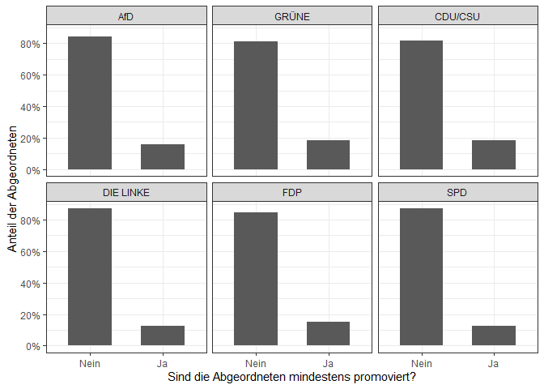<!-- -->
