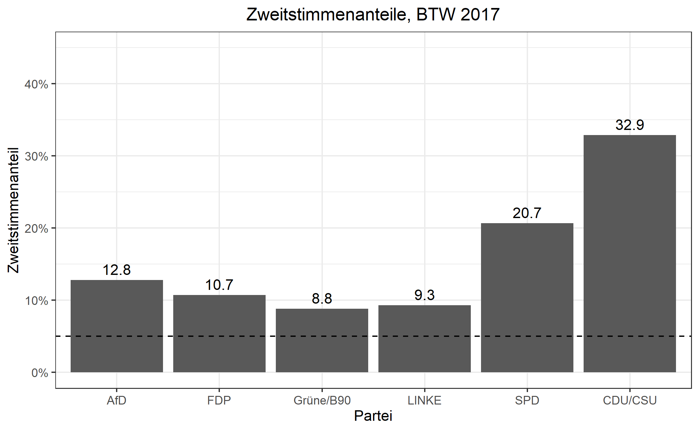
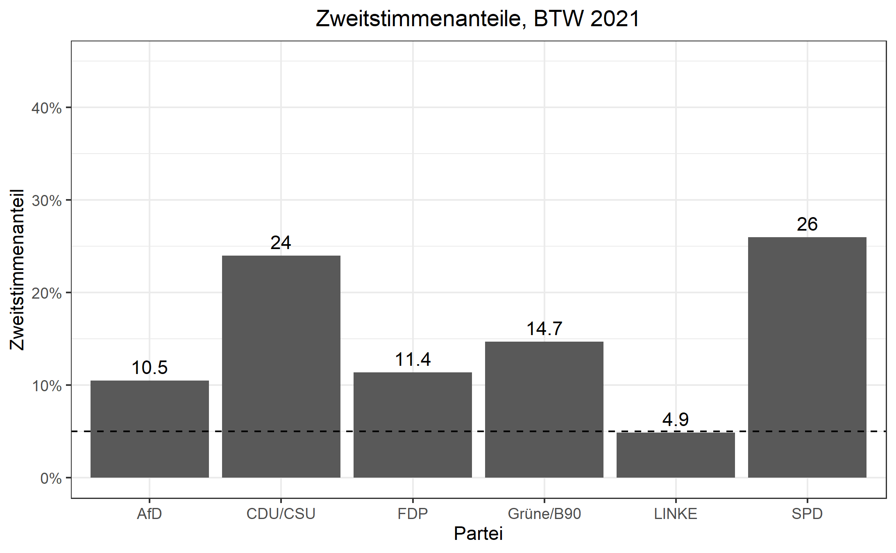

```{r setup, include=FALSE}
Sys.setlocale("LC_ALL", "german")
knitr::opts_chunk$set(fig.align = "center", 
                      message = F, warning = F)
```


# Preliminaries 

## Packages 

```{r packages}
library(readr)
library(readxl)
library(tidyverse)
library(stringr)
library(janitor)
library(tidyr)
library(modelsummary)
library(scales)
library(sf)
library(knitr)
library(kableExtra)
```


## Data 

### Election Results 

```{r importing-results-data}
# election results 
## header
btw21_header <- read_delim("https://www.bundeswahlleiter.de/bundestagswahlen/2021/ergebnisse/opendata/csv/kerg.csv",
                           col_names = F, skip = 2, n_max = 3, delim = ";") 
# re-shaping header
btw21_header_proper <- btw21_header %>%
  rownames_to_column(var = "rowname") %>% # assign rownames to be used as identifiers
  pivot_longer(cols = !rowname, names_to = "super", values_to = "sub") %>% 
  fill(sub, .direction = "down") %>% # turn data into long format to re-shape multi-line headers into single line headers by assigning super-categories to all columns
  pivot_wider(id_cols = rowname, names_from = super, values_from = sub) %>% # turn data back into wide format tom match headers in results data frame
  sapply(., paste, collapse = "_") # combine column values from three rows into a single one, resulting in single-line header 
## import actual results 
btw21 <- read_delim("https://www.bundeswahlleiter.de/bundestagswahlen/2021/ergebnisse/opendata/csv/kerg.csv",
                  col_names = F,  skip = 5, delim = ";") %>% # do not use column names and skip first five rows, delimiter is semicolon 
  remove_empty(which = "rows") %>% # remove completely empty rows 
  clean_names() # use convenience function 
## assign header names 
names(btw21) <- btw21_header_proper[2:213] # I omit the first name since this is used the row identifier column.
## eliminate some final inconsistencies 
btw21 <- btw21 %>%
  clean_names() %>%
  rename("WKR_NR" = nr_ubrige_zweitstimmen,
         "Wahlkreis" = gebiet_ubrige_zweitstimmen,
         "Bundesland_Nr" = gehort_zu_ubrige_zweitstimmen) %>%
  mutate(WKR_NR = as.numeric(as.character(WKR_NR)))
# finally, get rid of Bundesland and overall summaries 
btw21 <- btw21 %>%
  filter(!(grepl("99", Bundesland_Nr) | grepl("Bundesgebiet", Wahlkreis)))
```


### Strukturdaten, Shapefile and Merging 

```{r data-structural-data-shapefile-merging}
# shapefile
btw_shapefile <- st_read("Data/btw21_geometrie_wahlkreise_geo_shp/Geometrie_Wahlkreise_20DBT_geo.shp")
# socio-economic characteristics of consttuencies 
strukturdaten21 <- read_csv2("Data/btw21_strukturdaten_wahlkreise.csv", skip = 8) %>%
  clean_names() %>%
  filter(!(grepl("Land insgesamt", wahlkreis_name) == TRUE)) %>%
  filter(!(grepl("Insgesamt", wahlkreis_name) == TRUE))
## merge data 
btw21 <- btw21 %>%
  left_join(btw_shapefile, by = "WKR_NR") %>%
  left_join(strukturdaten21, by = c("WKR_NR" = "wahlkreis_nr"))
## final data frame: 299-by-267 matrix, 267 = 5 (shapefile) - 1 (merging column) + 212 (btw21_results) + 52 (strukturdaten) - 1(merging column)
```


## Analysis 

Let us start by creating some useful variables: 

```{r variables-plus-final-data}
# variables 
btw21 <- btw21 %>%
  mutate(union_zweitstimmen_endgultig = ifelse(is.na(christlich_demokratische_union_deutschlands_zweitstimmen_endgultig), christlich_soziale_union_in_bayern_e_v_zweitstimmen_endgultig, christlich_demokratische_union_deutschlands_zweitstimmen_endgultig),
         CDU_CSU_Zweitstimmen_Share = union_zweitstimmen_endgultig/gultige_stimmen_zweitstimmen_endgultig,
         SPD_Zweitstimmen_Share = sozialdemokratische_partei_deutschlands_zweitstimmen_endgultig/gultige_stimmen_zweitstimmen_endgultig,
         FDP_Zweitstimmen_Share = freie_demokratische_partei_zweitstimmen_endgultig/gultige_stimmen_zweitstimmen_endgultig,
         AfD_Zweitstimmen_Share = alternative_fur_deutschland_zweitstimmen_endgultig/gultige_stimmen_zweitstimmen_endgultig,
         LINKE_Zweitstimmen_Share = die_linke_zweitstimmen_endgultig/gultige_stimmen_zweitstimmen_endgultig,
         Gruene_B90_Zweitstimmen_Share = bundnis_90_die_grunen_zweitstimmen_endgultig/gultige_stimmen_zweitstimmen_endgultig)
# final data set
## load 2017 election results 
load("Data/bundestagswahl2017_election_results.RData")
## create second data set consisting of merged results files 
btws17_21_merged <- btw21 %>%
  left_join(btw17_merged, by = "WKR_NR", 
            suffix = c("_btw21", "_btw21"))
```


Let us create an appropriate data set for plotting: 


```{r data-for-plots}
# general data set 
btws17_21_merged <- btws17_21_merged %>%
  mutate(CDU_CSU_delta_21_17 = CDU_CSU_Zweitstimmen_Share - union_zweitstimmen_share,
         SPD_delta_21_17 = SPD_Zweitstimmen_Share - spd_zweitstimmen_share,
         AfD_delta_21_17 = AfD_Zweitstimmen_Share - afd_zweitstimmen_share,
         Gruene_B90_delta_21_17 = Gruene_B90_Zweitstimmen_Share - green_zweitstimmen_share,
         FDP_delta_21_17 = FDP_Zweitstimmen_Share - fdp_zweitstimmen_share,
         LINKE_delta_21_17 = LINKE_Zweitstimmen_Share - linke_zweitstimmen_share)
# selection 
btws17_21_merged_plot <- btws17_21_merged %>%
  select(WKR_NR, WKR_Name, geometry_btw21, LAND_NAME_btw21,
         union_zweitstimmen_share, spd_zweitstimmen_share, 
         afd_zweitstimmen_share, fdp_zweitstimmen_share,
         green_zweitstimmen_share, linke_zweitstimmen_share, CDU_CSU_Zweitstimmen_Share, FDP_Zweitstimmen_Share,
         SPD_Zweitstimmen_Share, AfD_Zweitstimmen_Share, 
         Gruene_B90_Zweitstimmen_Share, LINKE_Zweitstimmen_Share, CDU_CSU_delta_21_17, SPD_delta_21_17, AfD_delta_21_17, Gruene_B90_delta_21_17, FDP_delta_21_17, LINKE_delta_21_17) 
save(btws17_21_merged_plot, file = "Data/bundestagswahlen_17_21_merged_plot_data.RData")
```


### Summary Statistics

```{r summary-stats-skimr}
btws17_21_merged_plot %>%
  select(-c(WKR_Name, WKR_NR, geometry_btw21, LAND_NAME_btw21), 
         "CDU/CSU Zweitstimmenanteil 2017" = union_zweitstimmen_share, 
         "SPD Zweitstimmenanteil 2017" = spd_zweitstimmen_share,
         "AfD Zweitstimmenanteil 2017" = afd_zweitstimmen_share,
         "FDP Zweitstimmenanteil 2017" = fdp_zweitstimmen_share,
         "Grüne B90 Zweitstimmenanteil 2017" = green_zweitstimmen_share, 
         "LINKE Zweitstimmenanteil 2017" = linke_zweitstimmen_share, 
         "CDU/CSU Zweitstimmenanteil 2021" = CDU_CSU_Zweitstimmen_Share, 
         "SPD Zweitstimmenanteil 2021" = SPD_Zweitstimmen_Share,
         "FDP Zweitstimmenanteil 2021" = FDP_Zweitstimmen_Share,
         "AfD Zweitstimmenanteil 2021" = AfD_Zweitstimmen_Share,
         "Grüne B90 Zweitstimmenanteil 2021" = Gruene_B90_Zweitstimmen_Share,
         "LINKE Zweitstimmenanteil 2021" = LINKE_Zweitstimmen_Share,
         "Veränderung des CDU/CSU Zweitstimmenanteils" = CDU_CSU_delta_21_17,
         "Veränderung des SPD Zweitstimmenanteils" = SPD_delta_21_17,
         "Veränderung des AfD Zweitstimmenanteils" = AfD_delta_21_17,
         "Veränderung des Grüne Zweitstimmenanteils" = Gruene_B90_delta_21_17,
         "Veränderung des FDP Zweitstimmenanteils" = FDP_delta_21_17,
         "Veränderung des LINKE Zweitstimmenanteils" = LINKE_delta_21_17) %>%
  mutate(across(.cols = everything(),
                .fns = ~ . * 100)) %>%
  datasummary_skim(fmt = "%.1f", 
                   output = "kableExtra", 
                   histogram = F) %>%
  landscape() %>%
  add_footnote(c("Die Veränderung der Zweitstimmenanteile beschreibt die Differenz der Zweitstimmenanteile der Bundestagswahl 2021 im Vergleich zu 2017."), 
               notation = "number")
```


Let us produce some plots of the *Zweitstimmenanteile* in 2017: 


```{r loop-plots-zweitstimmen-17, message=FALSE}
# loop
btw17_zweitstimmen_plot <- function(x){
  nm <- names(x)[5:10] 
  for(i in seq_along(nm)){
    plots <- ggplot(x, aes(geometry = geometry_btw21)) +
    geom_sf(aes_string(fill = nm[i])) +
    scale_fill_viridis_b(name = " ", 
                       labels = label_percent(scale = 100, accuracy = 1),
                       direction = -1,
                       option = "mako") +
    labs(title = paste(str_to_upper(str_replace_all(str_remove(nm[i], "_zweitstimmen_share"), "_", "/")), "Zweitstimmenanteil, BTW 2017")) + 
    theme_void() +
    theme(plot.title = element_text(hjust = 0.5))
    print(plots)
  }
}
# applying loop
btw17_zweitstimmen_plot(btws17_21_merged_plot)
```

Here is an overview of the results in 2017: 




Then, we examine the *Zweitstimmenanteil* in 2021: 

```{r loop-plots-zweitstimmen-21, message=FALSE}
# loop
btw21_zweitstimmen_plot <- function(x){
  nm <- names(x)[11:16] # use columns with zweitstimmen_share
  for(i in seq_along(nm)){
    plots <- ggplot(x, aes(geometry = geometry_btw21)) +
    geom_sf(aes_string(fill = nm[i])) +
    scale_fill_viridis_b(name = " ", 
                       labels = label_percent(scale = 100, accuracy = 1),
                       direction = -1,
                       option = "mako") +
    labs(title = paste(str_replace_all(str_remove(nm[i], "_Zweitstimmen_Share"), "_", "/"), "Zweitstimmenanteil, BTW 2021")) + 
    theme_void() +
    theme(plot.title = element_text(hjust = 0.5))
    print(plots)
  }
}
# applying loop
btw21_zweitstimmen_plot(btws17_21_merged_plot)
```


Before digging deeper into the results at the constituency-level, here is a plot of the overall results in 2021: 



Let us create a table containing all Wahlkreise: 

```{r table-all-wahlkreise-btw2021}
btws17_21_merged %>%
  select(Wahlkreis, CDU_CSU_Zweitstimmen_Share, 
         SPD_Zweitstimmen_Share, Gruene_B90_Zweitstimmen_Share,
         FDP_Zweitstimmen_Share, AfD_Zweitstimmen_Share, LINKE_Zweitstimmen_Share) %>%
  mutate(across(.cols = grep("Share", names(.)),
                .fns = ~ . * 100)) %>%
  kable(col.names = c("Wahlkreis", "CDU/CSU", "SPD",
                      "Grüne/B90", "FDP", "AfD", "LINKE"),
    booktabs = T, digits = 1) %>%
  add_header_above(c(" " = 1, "Zweitstimmenanteile" = 6)) %>%
  kable_styling(full_width = F) %>%
  landscape() 
```


Next, I am interested in the change of the party's *Zweitstimmenanteile* between the 2017 and 2021 elections. 


```{r loop-for-delta-plots}
# loop
delta_loop <- function(x){
  lw <- names(x)[17:22]
  for(i in seq_along(lw)){
  plots <- ggplot(x, aes(geometry = geometry_btw21)) +
  geom_sf(aes_string(fill = lw[i])) +
  scale_fill_viridis_b(name = " ", 
                       labels = label_number(scale = 100, accuracy = 1),
                       option = "mako",
                       direction = -1) +
  labs(title = paste("Veränderung (2021-2017) des Zweitstimmenanteils für die", str_replace_all(str_remove(lw[i], "_delta_21_17"), "_", "/")), caption = "Verluste und Gewinne sind hier in Prozentpunkten angegeben.") +
  theme_void() +
  theme(plot.title = element_text(hjust = 0.5),
        plot.caption = element_text(hjust = 0.5))
    print(plots)
  }
}
# apply loop
delta_loop(btws17_21_merged_plot)
```

Let us also examine the change in the *Zweitstimmenanteile* from the 2013 to the 2021 election.

```{r roop-for-delta-plots-21-13}
# import data 
load("Data/btws_13_21.RData")

# write loop 
delta_21_13_loop <- function(x){
  lw <- names(x)[4:8]
  for(i in seq_along(lw)){
  plots <- ggplot(x, aes(geometry = geometry)) +
  geom_sf(aes_string(fill = lw[i])) +
  scale_fill_viridis_b(name = " ", 
                       labels = label_number(scale = 100, accuracy = 1),
                       option = "mako",
                       direction = -1) +
  labs(title = paste("Veränderung (2021-2013) des Zweitstimmenanteils für die", str_replace_all(str_remove(lw[i], "_delta_21_13"), "_", "/")), caption = "Verluste und Gewinne sind hier in Prozentpunkten angegeben.") +
  theme_void() +
  theme(plot.title = element_text(hjust = 0.5),
        plot.caption = element_text(hjust = 0.5))
    print(plots)
  }
}

# apply loop 
delta_21_13_loop(btws_13_21)
```


### Population Density and Vote Shares 


```{r correlation-log-pop-vote-shares}
# data 
some_correlations <- btws17_21_merged %>%
  select(Wahlkreis, east_dummy, alter_von_bis_jahren_am_31_12_2019_60_74_percent,
        alter_von_bis_jahren_am_31_12_2019_25_34_percent,
         verfugbares_einkommen_der_privaten_haushalte_2018_eur_je_ew, arbeitslosenquote_februar_2021_insgesamt, bev_lkerungsdichte_am_31_12_2015_einwohner_je_km, pkw_bestand_am_01_01_2020_pkw_mit_elektro_oder_hybrid_antrieb_percent,
schulabganger_innen_allgemeinblldender_schulen_2019_mit_allgemeiner_und_fachhochschulreife_percent,
unternehmensregister_2018_unternehmen_insgesamt_je_1000_ew,
schulabganger_innen_allgemeinbildender_schulen_2019_ohne_hauptschulabschluss_percent,
empfanger_innen_von_leistungen_nach_sgb_ii_oktober_2020_insgesamt_je_1000_ew,
empfanger_innen_von_leistungen_nach_sgb_ii_oktober_2020_auslander_innen_percent,
         CDU_CSU_Zweitstimmen_Share, SPD_Zweitstimmen_Share, 
         AfD_Zweitstimmen_Share, Gruene_B90_Zweitstimmen_Share, FDP_Zweitstimmen_Share, LINKE_Zweitstimmen_Share)
# loops 
population_loop21 <- function(x){
  db <- names(x)[14:ncol(x)]
  for(i in seq_along(db)){
  plots <- ggplot(x, aes(x = log(bev_lkerungsdichte_am_31_12_2015_einwohner_je_km))) +
  geom_point(aes_string(y = db[i])) +
  geom_smooth(aes_string(y = db[i]), method = "lm") +
  scale_y_continuous(name = paste(str_replace_all(str_remove_all(db[i], "_Zweitstimmen_Share"), "_", "/"), "Zweitstimmenanteil"),
                     labels = label_percent(scale = 100, accuracy = 1)) +
  labs(x = "Log Bevölkerungsdichte (Einwohner je km2)", 
       title = paste(str_replace_all(str_remove_all(db[i], "_Zweitstimmen_Share"), "_", "/"), "Zweitstimmenanteil, BTW 2021")) +
  theme_bw() +
  theme(plot.title = element_text(hjust = 0.5))
  print(plots)
  }
}
# loops
population_loop21_east_west <- function(x){
  db <- names(x)[14:ncol(x)]
  for(i in seq_along(db)){
  plots <- ggplot(x, aes(x = log(bev_lkerungsdichte_am_31_12_2015_einwohner_je_km), colour = factor(east_dummy))) +
  geom_point(aes_string(y = db[i])) +
  geom_smooth(aes_string(y = db[i]), method = "lm") +
  scale_colour_manual(" ", values = c("0" = "magenta",
                                      "1" = "skyblue"),
                           labels = c("0" = "West",
                                      "1" = "Ost")) +
  scale_y_continuous(name = paste(str_replace_all(str_remove_all(db[i], "_Zweitstimmen_Share"), "_", "/"), "Zweitstimmenanteil"),
                     labels = label_percent(scale = 100, accuracy = 1)) +
  labs(x = "Log Bevölkerungsdichte (Einwohner je km2)", 
       title = paste(str_replace_all(str_remove_all(db[i], "_Zweitstimmen_Share"), "_", "/"), "Zweitstimmenanteil nach Ost-West, BTW 2021")) +
  theme_bw() +
  theme(plot.title = element_text(hjust = 0.5))
  print(plots)
  }
}
# apply loops
population_loop21(some_correlations)
population_loop21_east_west(some_correlations)
```

### Share of Young and Voters

```{r correlation-young-voters-vote-shares}
# loop
young_loop <- function(x){
  db <- names(x)[14:ncol(x)]
  for(i in seq_along(db)){
    plots <- ggplot(x, aes(x = alter_von_bis_jahren_am_31_12_2019_25_34_percent)) +
  geom_point(aes_string(y = db[i])) +
  geom_smooth(aes_string(y = db[i]), method = "lm") +
  scale_y_continuous(name = paste(str_replace_all(str_remove_all(db[i], "_Zweitstimmen_Share"), "_", "/"), "Zweitstimmenanteil"),
                     labels = label_percent(scale = 100, accuracy = 1)) +
      scale_x_continuous(name = "Anteil der 25-34 Jährigen (2019)",
                         labels = label_percent(scale = 1, accuracy = 1)) +
  labs(title = paste(str_replace_all(str_remove_all(db[i], "_Zweitstimmen_Share"), "_", "/"), "Zweitstimmenanteil, BTW 2021")) +
  theme_bw() +
  theme(plot.title = element_text(hjust = 0.5))
  print(plots)
  }
}
## east-west
young_loop_east_west <- function(x){
  db <- names(x)[14:ncol(x)]
  for(i in seq_along(db)){
    plots <- ggplot(x, aes(x = alter_von_bis_jahren_am_31_12_2019_25_34_percent, colour = factor(east_dummy))) +
  geom_point(aes_string(y = db[i])) +
  geom_smooth(aes_string(y = db[i]), method = "lm") +
  scale_colour_manual(" ", values = c("0" = "magenta",
                                      "1" = "skyblue"),
                           labels = c("0" = "West",
                                      "1" = "Ost")) +
  scale_y_continuous(name = paste(str_replace_all(str_remove_all(db[i], "_Zweitstimmen_Share"), "_", "/"), "Zweitstimmenanteil"),
                     labels = label_percent(scale = 100, accuracy = 1)) +
  scale_x_continuous(name = "Anteil der 25-34 Jährigen (2019)",
                         labels = label_percent(scale = 1, accuracy = 1)) +
  labs(title = paste(str_replace_all(str_remove_all(db[i], "_Zweitstimmen_Share"), "_", "/"), "Zweitstimmenanteil, BTW 2021")) +
  theme_bw() +
  theme(plot.title = element_text(hjust = 0.5))
  print(plots)
  }
}
# applying loops
young_loop(some_correlations)
young_loop_east_west(some_correlations)
```


### Share of Oldies and Vote shares


```{r correlation-old-voters-vote-shares}
# loop
oldies_loop <- function(x){
  db <- names(x)[14:ncol(x)]
  for(i in seq_along(db)){
    plots <- ggplot(x, aes(x = alter_von_bis_jahren_am_31_12_2019_60_74_percent)) +
  geom_point(aes_string(y = db[i])) +
  geom_smooth(aes_string(y = db[i]), method = "lm") +
  scale_y_continuous(name = paste(str_replace_all(str_remove_all(db[i], "_Zweitstimmen_Share"), "_", "/"), "Zweitstimmenanteil"),
                     labels = label_percent(scale = 100, accuracy = 1)) +
      scale_x_continuous(name = "Anteil der 60-74 Jährigen (2019)",
                         labels = label_percent(scale = 1, accuracy = 1)) +
  labs(title = paste(str_replace_all(str_remove_all(db[i], "_Zweitstimmen_Share"), "_", "/"), "Zweitstimmenanteil, BTW 2021")) +
  theme_bw() +
  theme(plot.title = element_text(hjust = 0.5))
  print(plots)
  }
}
## east-west
oldies_loop_east_west <- function(x){
  db <- names(x)[14:ncol(x)]
  for(i in seq_along(db)){
    plots <- ggplot(x, aes(x = alter_von_bis_jahren_am_31_12_2019_60_74_percent, colour = factor(east_dummy))) +
  geom_point(aes_string(y = db[i])) +
  geom_smooth(aes_string(y = db[i]), method = "lm") +
  scale_colour_manual(" ", values = c("0" = "magenta",
                                      "1" = "skyblue"),
                           labels = c("0" = "West",
                                      "1" = "Ost")) +
  scale_y_continuous(name = paste(str_replace_all(str_remove_all(db[i], "_Zweitstimmen_Share"), "_", "/"), "Zweitstimmenanteil"),
                     labels = label_percent(scale = 100, accuracy = 1)) +
  scale_x_continuous(name = "Anteil der 60-74 Jährigen (2019)",
                         labels = label_percent(scale = 1, accuracy = 1)) +
  labs(title = paste(str_replace_all(str_remove_all(db[i], "_Zweitstimmen_Share"), "_", "/"), "Zweitstimmenanteil, BTW 2021")) +
  theme_bw() +
  theme(plot.title = element_text(hjust = 0.5))
  print(plots)
  }
}
# applying loops
oldies_loop(some_correlations)
oldies_loop_east_west(some_correlations)
```


### Disposable Income and Vote Shares 

```{r disposable-income-vote-shares-loops}
# loop
income_loop <- function(x){
  db <- names(x)[14:ncol(x)]
  for(i in seq_along(db)){
    plots <- ggplot(x, aes(x = log(verfugbares_einkommen_der_privaten_haushalte_2018_eur_je_ew))) +
  geom_point(aes_string(y = db[i])) +
  geom_smooth(aes_string(y = db[i]), method = "lm") +
  scale_y_continuous(name = paste(str_replace_all(str_remove_all(db[i], "_Zweitstimmen_Share"), "_", "/"), "Zweitstimmenanteil"),
                     labels = label_percent(scale = 100, accuracy = 1)) +
  labs(x = "Log Verfügbares Einkommen je Einwohner", title = paste(str_replace_all(str_remove_all(db[i], "_Zweitstimmen_Share"), "_", "/"), "Zweitstimmenanteil, BTW 2021")) +
  theme_bw() +
  theme(plot.title = element_text(hjust = 0.5))
  print(plots)
  }
}
## east-west loop
income_loop_east_west <- function(x){
  db <- names(x)[14:ncol(x)]
  for(i in seq_along(db)){
    plots <- ggplot(x, aes(x = log(verfugbares_einkommen_der_privaten_haushalte_2018_eur_je_ew), colour = factor(east_dummy))) +
  geom_point(aes_string(y = db[i])) +
  geom_smooth(aes_string(y = db[i]), method = "lm") +
  scale_colour_manual(" ", values = c("0" = "magenta",
                                      "1" = "skyblue"),
                           labels = c("0" = "West",
                                      "1" = "Ost")) +
  scale_y_continuous(name = paste(str_replace_all(str_remove_all(db[i], "_Zweitstimmen_Share"), "_", "/"), "Zweitstimmenanteil"),
                     labels = label_percent(scale = 100, accuracy = 1)) +
  labs(x = "Log Verfügbares Einkommen je Einwohner", title = paste(str_replace_all(str_remove_all(db[i], "_Zweitstimmen_Share"), "_", "/"), "Zweitstimmenanteil, BTW 2021")) +
  theme_bw() +
  theme(plot.title = element_text(hjust = 0.5))
  print(plots)
  }
}
## applying loops 
income_loop(some_correlations)
income_loop_east_west(some_correlations)
```


### Unemployment Rate and Vote Shares 


```{r unemployment-rate-vote-shares-loops}
# loop
unemployment_loop <- function(x){
  db <- names(x)[14:ncol(x)]
  for(i in seq_along(db)){
    plots <- ggplot(x, aes(x = arbeitslosenquote_februar_2021_insgesamt)) +
  geom_point(aes_string(y = db[i])) +
  geom_smooth(aes_string(y = db[i]), method = "lm") +
  scale_y_continuous(name = paste(str_replace_all(str_remove_all(db[i], "_Zweitstimmen_Share"), "_", "/"), "Zweitstimmenanteil"),
                     labels = label_percent(scale = 100, accuracy = 1)) +
  scale_x_continuous(name = "Arbeitslosenquote (Februar 2021)",
                         labels = label_percent(scale = 1, accuracy = 1)) +
  labs(title = paste(str_replace_all(str_remove_all(db[i], "_Zweitstimmen_Share"), "_", "/"), "Zweitstimmenanteil, BTW 2021")) +
  theme_bw() +
  theme(plot.title = element_text(hjust = 0.5))
  print(plots)
  }
}
## east-west loop
unemployment_loop_east_west <- function(x){
  db <- names(x)[14:ncol(x)]
  for(i in seq_along(db)){
    plots <- ggplot(x, aes(x = arbeitslosenquote_februar_2021_insgesamt, 
                           colour = factor(east_dummy))) +
  geom_point(aes_string(y = db[i])) +
  geom_smooth(aes_string(y = db[i]), method = "lm") +
  scale_colour_manual(" ", values = c("0" = "magenta",
                                      "1" = "skyblue"),
                           labels = c("0" = "West",
                                      "1" = "Ost")) +
  scale_y_continuous(name = paste(str_replace_all(str_remove_all(db[i], "_Zweitstimmen_Share"), "_", "/"), "Zweitstimmenanteil"),
                     labels = label_percent(scale = 100, accuracy = 1)) +
  scale_x_continuous(name = "Arbeitslosenquote (Februar 2021)",
                         labels = label_percent(scale = 1, accuracy = 1)) +
  labs(title = paste(str_replace_all(str_remove_all(db[i], "_Zweitstimmen_Share"), "_", "/"), "Zweitstimmenanteil, BTW 2021")) +
  theme_bw() +
  theme(plot.title = element_text(hjust = 0.5))
  print(plots)
  }
}
## applying loops 
unemployment_loop(some_correlations)
unemployment_loop_east_west(some_correlations)
```

### Recipients of Arbeitslosengeld II 

```{r arbeitslosengeld-ii-loop}
# loop
unemployment_benefit_loop <- function(x){
  db <- names(x)[14:ncol(x)]
  for(i in seq_along(db)){
    plots <- ggplot(x, aes(x = empfanger_innen_von_leistungen_nach_sgb_ii_oktober_2020_insgesamt_je_1000_ew)) +
  geom_point(aes_string(y = db[i])) +
  geom_smooth(aes_string(y = db[i]), method = "lm") +
  scale_y_continuous(name = paste(str_replace_all(str_remove_all(db[i], "_Zweitstimmen_Share"), "_", "/"), "Zweitstimmenanteil"),
                     labels = label_percent(scale = 100, accuracy = 1)) +
  labs(x = "Arbeitslosengled-II-Empfänger je 1000 Einwohner", title = paste(str_replace_all(str_remove_all(db[i], "_Zweitstimmen_Share"), "_", "/"), "Zweitstimmenanteil, BTW 2021")) +
  theme_bw() +
  theme(plot.title = element_text(hjust = 0.5))
  print(plots)
  }
}
## east-west loop
unemployment_benefit_east_west <- function(x){
  db <- names(x)[14:ncol(x)]
  for(i in seq_along(db)){
    plots <- ggplot(x, aes(x = empfanger_innen_von_leistungen_nach_sgb_ii_oktober_2020_insgesamt_je_1000_ew, 
                           colour = factor(east_dummy))) +
  geom_point(aes_string(y = db[i])) +
  geom_smooth(aes_string(y = db[i]), method = "lm") +
  scale_colour_manual(" ", values = c("0" = "magenta",
                                      "1" = "skyblue"),
                           labels = c("0" = "West",
                                      "1" = "Ost")) +
  scale_y_continuous(name = paste(str_replace_all(str_remove_all(db[i], "_Zweitstimmen_Share"), "_", "/"), "Zweitstimmenanteil"),
                     labels = label_percent(scale = 100, accuracy = 1)) +
  labs(x = "Arbeitslosengled-II-Empfänger je 1000 Einwohner", title = paste(str_replace_all(str_remove_all(db[i], "_Zweitstimmen_Share"), "_", "/"), "Zweitstimmenanteil, BTW 2021")) +
  theme_bw() +
  theme(plot.title = element_text(hjust = 0.5))
  print(plots)
  }
}
## applying loops 
unemployment_benefit_loop(some_correlations)
unemployment_benefit_east_west(some_correlations)
```

### Share of Foreign Arbeitslosengeld-II-Recipients 

```{r arbeitslosengeld-ii-loop-foreign}
# loop
unemployment_benefit_foreign_loop <- function(x){
  db <- names(x)[14:ncol(x)]
  for(i in seq_along(db)){
    plots <- ggplot(x, aes(x = empfanger_innen_von_leistungen_nach_sgb_ii_oktober_2020_auslander_innen_percent)) +
  geom_point(aes_string(y = db[i])) +
  geom_smooth(aes_string(y = db[i]), method = "lm") +
  scale_y_continuous(name = paste(str_replace_all(str_remove_all(db[i], "_Zweitstimmen_Share"), "_", "/"), "Zweitstimmenanteil"),
                     labels = label_percent(scale = 100, accuracy = 1)) +
  scale_x_continuous(name = "Anteil ausländischer Arbeitslosengeld-II-Empfänger",
                         labels = label_percent(scale = 1, accuracy = 1)) +
  labs(title = paste(str_replace_all(str_remove_all(db[i], "_Zweitstimmen_Share"), "_", "/"), "Zweitstimmenanteil, BTW 2021")) +
  theme_bw() +
  theme(plot.title = element_text(hjust = 0.5))
  print(plots)
  }
}
## east-west loop
unemployment_benefit_foreign_loop_east_west <- function(x){
  db <- names(x)[14:ncol(x)]
  for(i in seq_along(db)){
    plots <- ggplot(x, aes(x = empfanger_innen_von_leistungen_nach_sgb_ii_oktober_2020_auslander_innen_percent, 
                           colour = factor(east_dummy))) +
  geom_point(aes_string(y = db[i])) +
  geom_smooth(aes_string(y = db[i]), method = "lm") +
  scale_colour_manual(" ", values = c("0" = "magenta",
                                      "1" = "skyblue"),
                           labels = c("0" = "West",
                                      "1" = "Ost")) +
  scale_y_continuous(name = paste(str_replace_all(str_remove_all(db[i], "_Zweitstimmen_Share"), "_", "/"), "Zweitstimmenanteil"),
                     labels = label_percent(scale = 100, accuracy = 1)) +
  scale_x_continuous(name = "Anteil ausländischer Arbeitslosengeld-II-Empfänger",
                         labels = label_percent(scale = 1, accuracy = 1)) +
  labs(title = paste(str_replace_all(str_remove_all(db[i], "_Zweitstimmen_Share"), "_", "/"), "Zweitstimmenanteil, BTW 2021")) +
  theme_bw() +
  theme(plot.title = element_text(hjust = 0.5))
  print(plots)
  }
}
## apply loops 
unemployment_benefit_foreign_loop(some_correlations)
unemployment_benefit_foreign_loop_east_west(some_correlations)
```


### Elektroautos and Vote Shares 


```{r electro-loop}
# loop
electro_loop <- function(x){
  db <- names(x)[14:ncol(x)]
  for(i in seq_along(db)){
    plots <- ggplot(x, aes(x = pkw_bestand_am_01_01_2020_pkw_mit_elektro_oder_hybrid_antrieb_percent)) +
  geom_point(aes_string(y = db[i])) +
  geom_smooth(aes_string(y = db[i]), method = "lm") +
  scale_y_continuous(name = paste(str_replace_all(str_remove_all(db[i], "_Zweitstimmen_Share"), "_", "/"), "Zweitstimmenanteil"),
                     labels = label_percent(scale = 100, accuracy = 1)) +
  scale_x_continuous(name = "Anteil an PKWs mit Elektro- oder Hybridantrieb",
                         labels = label_percent(scale = 1, accuracy = 1)) +
  labs(title = paste(str_replace_all(str_remove_all(db[i], "_Zweitstimmen_Share"), "_", "/"), "Zweitstimmenanteil, BTW 2021")) +
  theme_bw() +
  theme(plot.title = element_text(hjust = 0.5))
  print(plots)
  }
}
## east-west loop
electro_loop_east_west <- function(x){
  db <- names(x)[14:ncol(x)]
  for(i in seq_along(db)){
    plots <- ggplot(x, aes(x = pkw_bestand_am_01_01_2020_pkw_mit_elektro_oder_hybrid_antrieb_percent, 
                           colour = factor(east_dummy))) +
  geom_point(aes_string(y = db[i])) +
  geom_smooth(aes_string(y = db[i]), method = "lm") +
  scale_colour_manual(" ", values = c("0" = "magenta",
                                      "1" = "skyblue"),
                           labels = c("0" = "West",
                                      "1" = "Ost")) +
  scale_y_continuous(name = paste(str_replace_all(str_remove_all(db[i], "_Zweitstimmen_Share"), "_", "/"), "Zweitstimmenanteil"),
                     labels = label_percent(scale = 100, accuracy = 1)) +
  scale_x_continuous(name = "Anteil an PKWs mit Elektro- oder Hybridantrieb",
                         labels = label_percent(scale = 1, accuracy = 1)) +
  labs(title = paste(str_replace_all(str_remove_all(db[i], "_Zweitstimmen_Share"), "_", "/"), "Zweitstimmenanteil, BTW 2021")) +
  theme_bw() +
  theme(plot.title = element_text(hjust = 0.5))
  print(plots)
  }
}
## applying loops 
electro_loop(some_correlations)
electro_loop_east_west(some_correlations)
```


### Unternehmensregister and Vote Shares 


```{r companies-vote-share-loop}
# loop
company_loop <- function(x){
  db <- names(x)[14:ncol(x)]
  for(i in seq_along(db)){
    plots <- ggplot(x, aes(x = unternehmensregister_2018_unternehmen_insgesamt_je_1000_ew)) +
  geom_point(aes_string(y = db[i])) +
  geom_smooth(aes_string(y = db[i]), method = "lm") +
  scale_y_continuous(name = paste(str_replace_all(str_remove_all(db[i], "_Zweitstimmen_Share"), "_", "/"), "Zweitstimmenanteil"),
                     labels = label_percent(scale = 100, accuracy = 1)) +
  labs(x = "Anzahl der Unternehmen je 1000 Einwohner", title = paste(str_replace_all(str_remove_all(db[i], "_Zweitstimmen_Share"), "_", "/"), "Zweitstimmenanteil, BTW 2021")) +
  theme_bw() +
  theme(plot.title = element_text(hjust = 0.5))
  print(plots)
  }
}
## east-west loop
company_loop_east_west <- function(x){
  db <- names(x)[14:ncol(x)]
  for(i in seq_along(db)){
    plots <- ggplot(x, aes(x = unternehmensregister_2018_unternehmen_insgesamt_je_1000_ew, 
                           colour = factor(east_dummy))) +
  geom_point(aes_string(y = db[i])) +
  geom_smooth(aes_string(y = db[i]), method = "lm") +
  scale_colour_manual(" ", values = c("0" = "magenta",
                                      "1" = "skyblue"),
                           labels = c("0" = "West",
                                      "1" = "Ost")) +
  scale_y_continuous(name = paste(str_replace_all(str_remove_all(db[i], "_Zweitstimmen_Share"), "_", "/"), "Zweitstimmenanteil"),
                     labels = label_percent(scale = 100, accuracy = 1)) +
  labs(x = "Anzahl der Unternehmen je 1000 Einwohner", title = paste(str_replace_all(str_remove_all(db[i], "_Zweitstimmen_Share"), "_", "/"), "Zweitstimmenanteil, BTW 2021")) +
  theme_bw() +
  theme(plot.title = element_text(hjust = 0.5))
  print(plots)
  }
}
## applying loops 
company_loop(some_correlations)
company_loop_east_west(some_correlations)
```


### Schulabgänger ohne Hauptschulabschluss


```{r loops-no-hauptschulabschluss}
# loop
hauptschul_loop <- function(x){
  db <- names(x)[14:ncol(x)]
  for(i in seq_along(db)){
    plots <- ggplot(x, aes(x = schulabganger_innen_allgemeinbildender_schulen_2019_ohne_hauptschulabschluss_percent)) +
  geom_point(aes_string(y = db[i])) +
  geom_smooth(aes_string(y = db[i]), method = "lm") +
  scale_y_continuous(name = paste(str_replace_all(str_remove_all(db[i], "_Zweitstimmen_Share"), "_", "/"), "Zweitstimmenanteil"),
                     labels = label_percent(scale = 100, accuracy = 1)) +
  scale_x_continuous(name = "Anteil der Schulabgänger ohne Hauptschulabschluss",
                         labels = label_percent(scale = 1, accuracy = 1)) +
  labs(title = paste(str_replace_all(str_remove_all(db[i], "_Zweitstimmen_Share"), "_", "/"), "Zweitstimmenanteil, BTW 2021")) +
  theme_bw() +
  theme(plot.title = element_text(hjust = 0.5))
  print(plots)
  }
}
## east-west loop
hauptschul_loop_east_west <- function(x){
  db <- names(x)[14:ncol(x)]
  for(i in seq_along(db)){
    plots <- ggplot(x, aes(x = schulabganger_innen_allgemeinbildender_schulen_2019_ohne_hauptschulabschluss_percent, 
                           colour = factor(east_dummy))) +
  geom_point(aes_string(y = db[i])) +
  geom_smooth(aes_string(y = db[i]), method = "lm") +
  scale_colour_manual(" ", values = c("0" = "magenta",
                                      "1" = "skyblue"),
                           labels = c("0" = "West",
                                      "1" = "Ost")) +
  scale_y_continuous(name = paste(str_replace_all(str_remove_all(db[i], "_Zweitstimmen_Share"), "_", "/"), "Zweitstimmenanteil"),
                     labels = label_percent(scale = 100, accuracy = 1)) +
  scale_x_continuous(name = "Anteil der Schulabgänger ohne Hauptschulabschluss",
                         labels = label_percent(scale = 1, accuracy = 1)) +
  labs(title = paste(str_replace_all(str_remove_all(db[i], "_Zweitstimmen_Share"), "_", "/"), "Zweitstimmenanteil, BTW 2021")) +
  theme_bw() +
  theme(plot.title = element_text(hjust = 0.5))
  print(plots)
  }
}
## apply loops
hauptschul_loop(some_correlations)
hauptschul_loop_east_west(some_correlations)
```


### Schulabgänger mit Abitur


```{r abitur-loop}
# loop
abitur_loop <- function(x){
  db <- names(x)[14:ncol(x)]
  for(i in seq_along(db)){
    plots <- ggplot(x, aes(x = schulabganger_innen_allgemeinblldender_schulen_2019_mit_allgemeiner_und_fachhochschulreife_percent)) +
  geom_point(aes_string(y = db[i])) +
  geom_smooth(aes_string(y = db[i]), method = "lm") +
  scale_y_continuous(name = paste(str_replace_all(str_remove_all(db[i], "_Zweitstimmen_Share"), "_", "/"), "Zweitstimmenanteil"),
                     labels = label_percent(scale = 100, accuracy = 1)) +
  scale_x_continuous(name = "Anteil der Schulabgänger mit allgemeiner Reife",
                         labels = label_percent(scale = 1, accuracy = 1)) +
  labs(title = paste(str_replace_all(str_remove_all(db[i], "_Zweitstimmen_Share"), "_", "/"), "Zweitstimmenanteil, BTW 2021")) +
  theme_bw() +
  theme(plot.title = element_text(hjust = 0.5))
  print(plots)
  }
}
## east-west loop
abitur_loop_east_west <- function(x){
  db <- names(x)[14:ncol(x)]
  for(i in seq_along(db)){
    plots <- ggplot(x, aes(x = schulabganger_innen_allgemeinblldender_schulen_2019_mit_allgemeiner_und_fachhochschulreife_percent, 
                           colour = factor(east_dummy))) +
  geom_point(aes_string(y = db[i])) +
  geom_smooth(aes_string(y = db[i]), method = "lm") +
  scale_colour_manual(" ", values = c("0" = "magenta",
                                      "1" = "skyblue"),
                           labels = c("0" = "West",
                                      "1" = "Ost")) +
  scale_y_continuous(name = paste(str_replace_all(str_remove_all(db[i], "_Zweitstimmen_Share"), "_", "/"), "Zweitstimmenanteil"),
                     labels = label_percent(scale = 100, accuracy = 1)) +
  scale_x_continuous(name = "Anteil der Schulabgänger mit allgemeiner Reife",
                         labels = label_percent(scale = 1, accuracy = 1)) +
  labs(title = paste(str_replace_all(str_remove_all(db[i], "_Zweitstimmen_Share"), "_", "/"), "Zweitstimmenanteil, BTW 2021")) +
  theme_bw() +
  theme(plot.title = element_text(hjust = 0.5))
  print(plots)
  }
}
# apply loops
abitur_loop(some_correlations)
abitur_loop_east_west(some_correlations)
```


