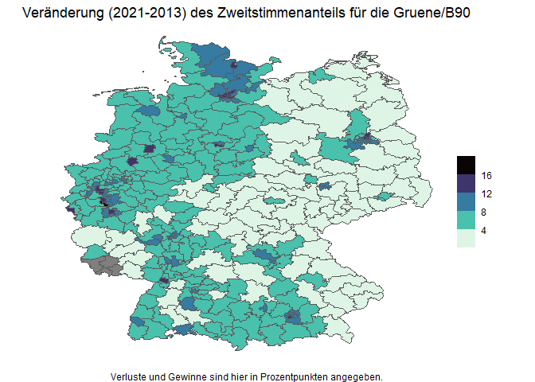
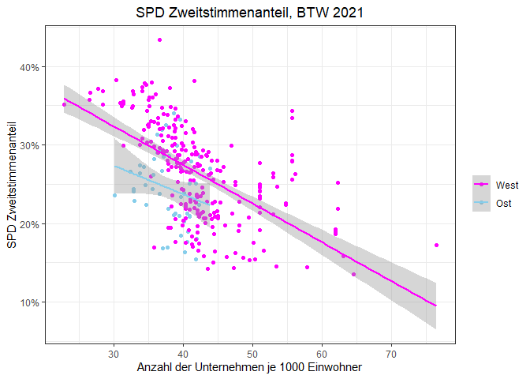
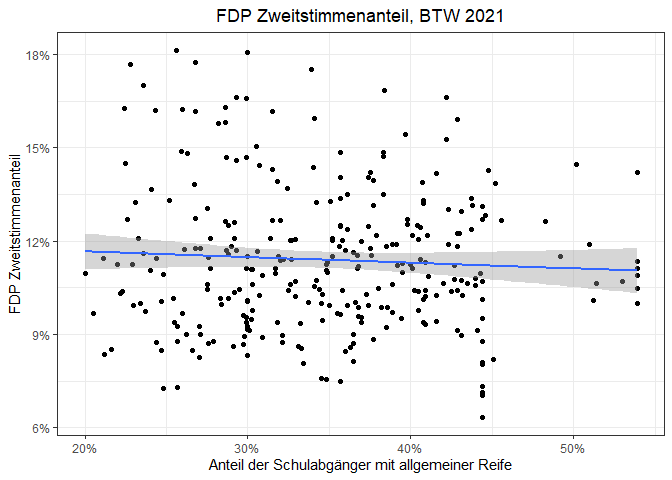

Bundestagswahl - 2021
================
13 February 2023

# Preliminaries

## Packages

``` r
library(readr)
library(readxl)
library(tidyverse)
library(stringr)
library(janitor)
library(tidyr)
library(modelsummary)
library(scales)
library(sf)
library(knitr)
library(kableExtra)
```

## Data

### Election Results

``` r
# election results 
## header
btw21_header <- read_delim("https://www.bundeswahlleiter.de/bundestagswahlen/2021/ergebnisse/opendata/csv/kerg.csv",
                           col_names = F, skip = 2, n_max = 3, delim = ";") 
# re-shaping header
btw21_header_proper <- btw21_header %>%
  rownames_to_column(var = "rowname") %>% # assign rownames to be used as identifiers
  pivot_longer(cols = !rowname, names_to = "super", values_to = "sub") %>% 
  fill(sub, .direction = "down") %>% # turn data into long format to re-shape multi-line headers into single line headers by assigning super-categories to all columns
  pivot_wider(id_cols = rowname, names_from = super, values_from = sub) %>% # turn data back into wide format tom match headers in results data frame
  sapply(., paste, collapse = "_") # combine column values from three rows into a single one, resulting in single-line header 
## import actual results 
btw21 <- read_delim("https://www.bundeswahlleiter.de/bundestagswahlen/2021/ergebnisse/opendata/csv/kerg.csv",
                  col_names = F,  skip = 5, delim = ";") %>% # do not use column names and skip first five rows, delimiter is semicolon 
  remove_empty(which = "rows") %>% # remove completely empty rows 
  clean_names() # use convenience function 
## assign header names 
names(btw21) <- btw21_header_proper[2:213] # I omit the first name since this is used the row identifier column.
## eliminate some final inconsistencies 
btw21 <- btw21 %>%
  clean_names() %>%
  rename("WKR_NR" = nr_ubrige_zweitstimmen,
         "Wahlkreis" = gebiet_ubrige_zweitstimmen,
         "Bundesland_Nr" = gehort_zu_ubrige_zweitstimmen) %>%
  mutate(WKR_NR = as.numeric(as.character(WKR_NR)))
# finally, get rid of Bundesland and overall summaries 
btw21 <- btw21 %>%
  filter(!(grepl("99", Bundesland_Nr) | grepl("Bundesgebiet", Wahlkreis)))
```

### Strukturdaten, Shapefile and Merging

``` r
# shapefile
btw_shapefile <- st_read("Data/btw21_geometrie_wahlkreise_geo_shp/Geometrie_Wahlkreise_20DBT_geo.shp")
```

    ## Reading layer `Geometrie_Wahlkreise_20DBT_geo' from data source 
    ##   `C:\Users\jacob\Documents\R_documents\Data\Bundestagswahl2021_anaylsis\bundestagswahl2021\Data\btw21_geometrie_wahlkreise_geo_shp\Geometrie_Wahlkreise_20DBT_geo.shp' 
    ##   using driver `ESRI Shapefile'
    ## Simple feature collection with 299 features and 4 fields
    ## Geometry type: MULTIPOLYGON
    ## Dimension:     XY
    ## Bounding box:  xmin: 5.86625 ymin: 47.27012 xmax: 15.03962 ymax: 55.05838
    ## Geodetic CRS:  WGS 84

``` r
# socio-economic characteristics of consttuencies 
strukturdaten21 <- read_csv2("Data/btw21_strukturdaten_wahlkreise.csv", skip = 8) %>%
  clean_names() %>%
  filter(!(grepl("Land insgesamt", wahlkreis_name) == TRUE)) %>%
  filter(!(grepl("Insgesamt", wahlkreis_name) == TRUE))
## merge data 
btw21 <- btw21 %>%
  left_join(btw_shapefile, by = "WKR_NR") %>%
  left_join(strukturdaten21, by = c("WKR_NR" = "wahlkreis_nr"))
## final data frame: 299-by-267 matrix, 267 = 5 (shapefile) - 1 (merging column) + 212 (btw21_results) + 52 (strukturdaten) - 1(merging column)
```

## Analysis

Let us start by creating some useful variables:

``` r
# variables 
btw21 <- btw21 %>%
  mutate(union_zweitstimmen_endgultig = ifelse(is.na(christlich_demokratische_union_deutschlands_zweitstimmen_endgultig), christlich_soziale_union_in_bayern_e_v_zweitstimmen_endgultig, christlich_demokratische_union_deutschlands_zweitstimmen_endgultig),
         CDU_CSU_Zweitstimmen_Share = union_zweitstimmen_endgultig/gultige_stimmen_zweitstimmen_endgultig,
         SPD_Zweitstimmen_Share = sozialdemokratische_partei_deutschlands_zweitstimmen_endgultig/gultige_stimmen_zweitstimmen_endgultig,
         FDP_Zweitstimmen_Share = freie_demokratische_partei_zweitstimmen_endgultig/gultige_stimmen_zweitstimmen_endgultig,
         AfD_Zweitstimmen_Share = alternative_fur_deutschland_zweitstimmen_endgultig/gultige_stimmen_zweitstimmen_endgultig,
         LINKE_Zweitstimmen_Share = die_linke_zweitstimmen_endgultig/gultige_stimmen_zweitstimmen_endgultig,
         Gruene_B90_Zweitstimmen_Share = bundnis_90_die_grunen_zweitstimmen_endgultig/gultige_stimmen_zweitstimmen_endgultig)
# final data set
## load 2017 election results 
load("Data/bundestagswahl2017_election_results.RData")
## create second data set consisting of merged results files 
btws17_21_merged <- btw21 %>%
  left_join(btw17_merged, by = "WKR_NR", 
            suffix = c("_btw21", "_btw21"))
```

Let us create an appropriate data set for plotting:

``` r
# general data set 
btws17_21_merged <- btws17_21_merged %>%
  mutate(CDU_CSU_delta_21_17 = CDU_CSU_Zweitstimmen_Share - union_zweitstimmen_share,
         SPD_delta_21_17 = SPD_Zweitstimmen_Share - spd_zweitstimmen_share,
         AfD_delta_21_17 = AfD_Zweitstimmen_Share - afd_zweitstimmen_share,
         Gruene_B90_delta_21_17 = Gruene_B90_Zweitstimmen_Share - green_zweitstimmen_share,
         FDP_delta_21_17 = FDP_Zweitstimmen_Share - fdp_zweitstimmen_share,
         LINKE_delta_21_17 = LINKE_Zweitstimmen_Share - linke_zweitstimmen_share)
# selection 
btws17_21_merged_plot <- btws17_21_merged %>%
  select(WKR_NR, WKR_Name, geometry_btw21, LAND_NAME_btw21,
         union_zweitstimmen_share, spd_zweitstimmen_share, 
         afd_zweitstimmen_share, fdp_zweitstimmen_share,
         green_zweitstimmen_share, linke_zweitstimmen_share, CDU_CSU_Zweitstimmen_Share, FDP_Zweitstimmen_Share,
         SPD_Zweitstimmen_Share, AfD_Zweitstimmen_Share, 
         Gruene_B90_Zweitstimmen_Share, LINKE_Zweitstimmen_Share, CDU_CSU_delta_21_17, SPD_delta_21_17, AfD_delta_21_17, Gruene_B90_delta_21_17, FDP_delta_21_17, LINKE_delta_21_17) 
save(btws17_21_merged_plot, file = "Data/bundestagswahlen_17_21_merged_plot_data.RData")
```

### Summary Statistics

``` r
btws17_21_merged_plot %>%
  select(-c(WKR_Name, WKR_NR), "CDU/CSU Zweitstimmenanteil 2017" = union_zweitstimmen_share, "SPD Zweitstimmenanteil 2017" = spd_zweitstimmen_share, "AfD Zweitstimmenanteil 2017" = afd_zweitstimmen_share, "FDP Zweitstimmenanteil 2017" = fdp_zweitstimmen_share, "Grüne B90 Zweitstimmenanteil 2017" = green_zweitstimmen_share, "LINKE Zweitstimmenanteil 2017" = linke_zweitstimmen_share, "CDU/CSU Zweitstimmenanteil 2021" = CDU_CSU_Zweitstimmen_Share, "SPD Zweitstimmenanteil 2021" = SPD_Zweitstimmen_Share, "FDP Zweitstimmenanteil 2021" = FDP_Zweitstimmen_Share, "AfD Zweitstimmenanteil 2021" = AfD_Zweitstimmen_Share, "Grüne B90 Zweitstimmenanteil 2021" = Gruene_B90_Zweitstimmen_Share, "LINKE Zweitstimmenanteil 2021" = LINKE_Zweitstimmen_Share, "Veränderung des CDU/CSU Zweitstimmenanteils" = CDU_CSU_delta_21_17, "Veränderung des SPD Zweitstimmenanteils" = SPD_delta_21_17, "Veränderung des AfD Zweitstimmenanteils" = AfD_delta_21_17, "Veränderung des Grüne Zweitstimmenanteils" = Gruene_B90_delta_21_17, "Veränderung des FDP Zweitstimmenanteils" = FDP_delta_21_17, "Veränderung des LINKE Zweitstimmenanteils" = LINKE_delta_21_17) %>%
  datasummary_skim(fmt = "%.3f", output = "kableExtra") %>%
  landscape() %>%
  add_footnote(c("Die Veränderung der Zweitstimmenanteile beschreibt die Differenz der Zweitstimmenanteile der Bundestagswahl 2021 im Vergleich zu 2017."), notation = "number")
```

<table class="table" style="width: auto !important; margin-left: auto; margin-right: auto;">
<thead>
<tr>
<th style="text-align:left;">
</th>
<th style="text-align:right;">
Unique (#)
</th>
<th style="text-align:right;">
Missing (%)
</th>
<th style="text-align:right;">
Mean
</th>
<th style="text-align:right;">
SD
</th>
<th style="text-align:right;">
Min
</th>
<th style="text-align:right;">
Median
</th>
<th style="text-align:right;">
Max
</th>
<th style="text-align:right;">
</th>
</tr>
</thead>
<tbody>
<tr>
<td style="text-align:left;">
CDU/CSU Zweitstimmenanteil 2017
</td>
<td style="text-align:right;">
299
</td>
<td style="text-align:right;">
0
</td>
<td style="text-align:right;">
0.329
</td>
<td style="text-align:right;">
0.060
</td>
<td style="text-align:right;">
0.139
</td>
<td style="text-align:right;">
0.328
</td>
<td style="text-align:right;">
0.531
</td>
<td style="text-align:right;">
<svg xmlns="http://www.w3.org/2000/svg" xmlns:xlink="http://www.w3.org/1999/xlink" class="svglite" width="48.00pt" height="12.00pt" viewBox="0 0 48.00 12.00">
<defs>
<style type="text/css">
    .svglite line, .svglite polyline, .svglite polygon, .svglite path, .svglite rect, .svglite circle {
      fill: none;
      stroke: #000000;
      stroke-linecap: round;
      stroke-linejoin: round;
      stroke-miterlimit: 10.00;
    }
    .svglite text {
      white-space: pre;
    }
  </style>
</defs><rect width="100%" height="100%" style="stroke: none; fill: none;"></rect><defs><clipPath id="cpMC4wMHw0OC4wMHwwLjAwfDEyLjAw"><rect x="0.00" y="0.00" width="48.00" height="12.00"></rect></clipPath></defs><g clip-path="url(#cpMC4wMHw0OC4wMHwwLjAwfDEyLjAw)">
</g><defs><clipPath id="cpMC4wMHw0OC4wMHwyLjg4fDEyLjAw"><rect x="0.00" y="2.88" width="48.00" height="9.12"></rect></clipPath></defs><g clip-path="url(#cpMC4wMHw0OC4wMHwyLjg4fDEyLjAw)"><rect x="-2.65" y="11.57" width="5.67" height="0.089" style="stroke-width: 0.38; fill: #000000;"></rect><rect x="3.02" y="11.40" width="5.67" height="0.27" style="stroke-width: 0.38; fill: #000000;"></rect><rect x="8.69" y="9.62" width="5.67" height="2.04" style="stroke-width: 0.38; fill: #000000;"></rect><rect x="14.35" y="5.17" width="5.67" height="6.49" style="stroke-width: 0.38; fill: #000000;"></rect><rect x="20.02" y="3.22" width="5.67" height="8.44" style="stroke-width: 0.38; fill: #000000;"></rect><rect x="25.69" y="5.88" width="5.67" height="5.78" style="stroke-width: 0.38; fill: #000000;"></rect><rect x="31.36" y="8.46" width="5.67" height="3.20" style="stroke-width: 0.38; fill: #000000;"></rect><rect x="37.03" y="11.48" width="5.67" height="0.18" style="stroke-width: 0.38; fill: #000000;"></rect><rect x="42.70" y="11.57" width="5.67" height="0.089" style="stroke-width: 0.38; fill: #000000;"></rect></g>
</svg>
</td>
</tr>
<tr>
<td style="text-align:left;">
SPD Zweitstimmenanteil 2017
</td>
<td style="text-align:right;">
299
</td>
<td style="text-align:right;">
0
</td>
<td style="text-align:right;">
0.207
</td>
<td style="text-align:right;">
0.062
</td>
<td style="text-align:right;">
0.078
</td>
<td style="text-align:right;">
0.207
</td>
<td style="text-align:right;">
0.378
</td>
<td style="text-align:right;">
<svg xmlns="http://www.w3.org/2000/svg" xmlns:xlink="http://www.w3.org/1999/xlink" class="svglite" width="48.00pt" height="12.00pt" viewBox="0 0 48.00 12.00">
<defs>
<style type="text/css">
    .svglite line, .svglite polyline, .svglite polygon, .svglite path, .svglite rect, .svglite circle {
      fill: none;
      stroke: #000000;
      stroke-linecap: round;
      stroke-linejoin: round;
      stroke-miterlimit: 10.00;
    }
    .svglite text {
      white-space: pre;
    }
  </style>
</defs><rect width="100%" height="100%" style="stroke: none; fill: none;"></rect><defs><clipPath id="cpMC4wMHw0OC4wMHwwLjAwfDEyLjAw"><rect x="0.00" y="0.00" width="48.00" height="12.00"></rect></clipPath></defs><g clip-path="url(#cpMC4wMHw0OC4wMHwwLjAwfDEyLjAw)">
</g><defs><clipPath id="cpMC4wMHw0OC4wMHwyLjg4fDEyLjAw"><rect x="0.00" y="2.88" width="48.00" height="9.12"></rect></clipPath></defs><g clip-path="url(#cpMC4wMHw0OC4wMHwyLjg4fDEyLjAw)"><rect x="-2.37" y="10.93" width="7.40" height="0.73" style="stroke-width: 0.38; fill: #000000;"></rect><rect x="5.04" y="5.82" width="7.40" height="5.84" style="stroke-width: 0.38; fill: #000000;"></rect><rect x="12.44" y="3.22" width="7.40" height="8.44" style="stroke-width: 0.38; fill: #000000;"></rect><rect x="19.84" y="3.32" width="7.40" height="8.34" style="stroke-width: 0.38; fill: #000000;"></rect><rect x="27.24" y="6.24" width="7.40" height="5.42" style="stroke-width: 0.38; fill: #000000;"></rect><rect x="34.65" y="9.47" width="7.40" height="2.19" style="stroke-width: 0.38; fill: #000000;"></rect><rect x="42.05" y="11.45" width="7.40" height="0.21" style="stroke-width: 0.38; fill: #000000;"></rect></g>
</svg>
</td>
</tr>
<tr>
<td style="text-align:left;">
AfD Zweitstimmenanteil 2017
</td>
<td style="text-align:right;">
299
</td>
<td style="text-align:right;">
0
</td>
<td style="text-align:right;">
0.128
</td>
<td style="text-align:right;">
0.055
</td>
<td style="text-align:right;">
0.049
</td>
<td style="text-align:right;">
0.115
</td>
<td style="text-align:right;">
0.355
</td>
<td style="text-align:right;">
<svg xmlns="http://www.w3.org/2000/svg" xmlns:xlink="http://www.w3.org/1999/xlink" class="svglite" width="48.00pt" height="12.00pt" viewBox="0 0 48.00 12.00">
<defs>
<style type="text/css">
    .svglite line, .svglite polyline, .svglite polygon, .svglite path, .svglite rect, .svglite circle {
      fill: none;
      stroke: #000000;
      stroke-linecap: round;
      stroke-linejoin: round;
      stroke-miterlimit: 10.00;
    }
    .svglite text {
      white-space: pre;
    }
  </style>
</defs><rect width="100%" height="100%" style="stroke: none; fill: none;"></rect><defs><clipPath id="cpMC4wMHw0OC4wMHwwLjAwfDEyLjAw"><rect x="0.00" y="0.00" width="48.00" height="12.00"></rect></clipPath></defs><g clip-path="url(#cpMC4wMHw0OC4wMHwwLjAwfDEyLjAw)">
</g><defs><clipPath id="cpMC4wMHw0OC4wMHwyLjg4fDEyLjAw"><rect x="0.00" y="2.88" width="48.00" height="9.12"></rect></clipPath></defs><g clip-path="url(#cpMC4wMHw0OC4wMHwyLjg4fDEyLjAw)"><rect x="-5.42" y="11.59" width="7.28" height="0.069" style="stroke-width: 0.38; fill: #000000;"></rect><rect x="1.86" y="3.98" width="7.28" height="7.68" style="stroke-width: 0.38; fill: #000000;"></rect><rect x="9.14" y="3.22" width="7.28" height="8.44" style="stroke-width: 0.38; fill: #000000;"></rect><rect x="16.42" y="9.38" width="7.28" height="2.28" style="stroke-width: 0.38; fill: #000000;"></rect><rect x="23.70" y="10.49" width="7.28" height="1.18" style="stroke-width: 0.38; fill: #000000;"></rect><rect x="30.99" y="10.97" width="7.28" height="0.69" style="stroke-width: 0.38; fill: #000000;"></rect><rect x="38.27" y="11.39" width="7.28" height="0.28" style="stroke-width: 0.38; fill: #000000;"></rect><rect x="45.55" y="11.59" width="7.28" height="0.069" style="stroke-width: 0.38; fill: #000000;"></rect></g>
</svg>
</td>
</tr>
<tr>
<td style="text-align:left;">
FDP Zweitstimmenanteil 2017
</td>
<td style="text-align:right;">
299
</td>
<td style="text-align:right;">
0
</td>
<td style="text-align:right;">
0.107
</td>
<td style="text-align:right;">
0.027
</td>
<td style="text-align:right;">
0.053
</td>
<td style="text-align:right;">
0.104
</td>
<td style="text-align:right;">
0.197
</td>
<td style="text-align:right;">
<svg xmlns="http://www.w3.org/2000/svg" xmlns:xlink="http://www.w3.org/1999/xlink" class="svglite" width="48.00pt" height="12.00pt" viewBox="0 0 48.00 12.00">
<defs>
<style type="text/css">
    .svglite line, .svglite polyline, .svglite polygon, .svglite path, .svglite rect, .svglite circle {
      fill: none;
      stroke: #000000;
      stroke-linecap: round;
      stroke-linejoin: round;
      stroke-miterlimit: 10.00;
    }
    .svglite text {
      white-space: pre;
    }
  </style>
</defs><rect width="100%" height="100%" style="stroke: none; fill: none;"></rect><defs><clipPath id="cpMC4wMHw0OC4wMHwwLjAwfDEyLjAw"><rect x="0.00" y="0.00" width="48.00" height="12.00"></rect></clipPath></defs><g clip-path="url(#cpMC4wMHw0OC4wMHwwLjAwfDEyLjAw)">
</g><defs><clipPath id="cpMC4wMHw0OC4wMHwyLjg4fDEyLjAw"><rect x="0.00" y="2.88" width="48.00" height="9.12"></rect></clipPath></defs><g clip-path="url(#cpMC4wMHw0OC4wMHwyLjg4fDEyLjAw)"><rect x="-2.10" y="10.95" width="6.14" height="0.71" style="stroke-width: 0.38; fill: #000000;"></rect><rect x="4.04" y="6.88" width="6.14" height="4.78" style="stroke-width: 0.38; fill: #000000;"></rect><rect x="10.18" y="4.34" width="6.14" height="7.33" style="stroke-width: 0.38; fill: #000000;"></rect><rect x="16.32" y="3.22" width="6.14" height="8.44" style="stroke-width: 0.38; fill: #000000;"></rect><rect x="22.45" y="5.96" width="6.14" height="5.70" style="stroke-width: 0.38; fill: #000000;"></rect><rect x="28.59" y="9.22" width="6.14" height="2.44" style="stroke-width: 0.38; fill: #000000;"></rect><rect x="34.73" y="10.75" width="6.14" height="0.92" style="stroke-width: 0.38; fill: #000000;"></rect><rect x="40.87" y="11.56" width="6.14" height="0.10" style="stroke-width: 0.38; fill: #000000;"></rect></g>
</svg>
</td>
</tr>
<tr>
<td style="text-align:left;">
Grüne B90 Zweitstimmenanteil 2017
</td>
<td style="text-align:right;">
299
</td>
<td style="text-align:right;">
0
</td>
<td style="text-align:right;">
0.088
</td>
<td style="text-align:right;">
0.039
</td>
<td style="text-align:right;">
0.022
</td>
<td style="text-align:right;">
0.081
</td>
<td style="text-align:right;">
0.212
</td>
<td style="text-align:right;">
<svg xmlns="http://www.w3.org/2000/svg" xmlns:xlink="http://www.w3.org/1999/xlink" class="svglite" width="48.00pt" height="12.00pt" viewBox="0 0 48.00 12.00">
<defs>
<style type="text/css">
    .svglite line, .svglite polyline, .svglite polygon, .svglite path, .svglite rect, .svglite circle {
      fill: none;
      stroke: #000000;
      stroke-linecap: round;
      stroke-linejoin: round;
      stroke-miterlimit: 10.00;
    }
    .svglite text {
      white-space: pre;
    }
  </style>
</defs><rect width="100%" height="100%" style="stroke: none; fill: none;"></rect><defs><clipPath id="cpMC4wMHw0OC4wMHwwLjAwfDEyLjAw"><rect x="0.00" y="0.00" width="48.00" height="12.00"></rect></clipPath></defs><g clip-path="url(#cpMC4wMHw0OC4wMHwwLjAwfDEyLjAw)">
</g><defs><clipPath id="cpMC4wMHw0OC4wMHwyLjg4fDEyLjAw"><rect x="0.00" y="2.88" width="48.00" height="9.12"></rect></clipPath></defs><g clip-path="url(#cpMC4wMHw0OC4wMHwyLjg4fDEyLjAw)"><rect x="1.23" y="8.14" width="4.69" height="3.52" style="stroke-width: 0.38; fill: #000000;"></rect><rect x="5.93" y="6.38" width="4.69" height="5.28" style="stroke-width: 0.38; fill: #000000;"></rect><rect x="10.62" y="3.22" width="4.69" height="8.44" style="stroke-width: 0.38; fill: #000000;"></rect><rect x="15.32" y="5.68" width="4.69" height="5.98" style="stroke-width: 0.38; fill: #000000;"></rect><rect x="20.01" y="7.67" width="4.69" height="3.99" style="stroke-width: 0.38; fill: #000000;"></rect><rect x="24.70" y="7.91" width="4.69" height="3.75" style="stroke-width: 0.38; fill: #000000;"></rect><rect x="29.40" y="9.32" width="4.69" height="2.35" style="stroke-width: 0.38; fill: #000000;"></rect><rect x="34.09" y="10.61" width="4.69" height="1.06" style="stroke-width: 0.38; fill: #000000;"></rect><rect x="38.79" y="11.19" width="4.69" height="0.47" style="stroke-width: 0.38; fill: #000000;"></rect><rect x="43.48" y="11.43" width="4.69" height="0.23" style="stroke-width: 0.38; fill: #000000;"></rect></g>
</svg>
</td>
</tr>
<tr>
<td style="text-align:left;">
LINKE Zweitstimmenanteil 2017
</td>
<td style="text-align:right;">
299
</td>
<td style="text-align:right;">
0
</td>
<td style="text-align:right;">
0.093
</td>
<td style="text-align:right;">
0.048
</td>
<td style="text-align:right;">
0.042
</td>
<td style="text-align:right;">
0.071
</td>
<td style="text-align:right;">
0.293
</td>
<td style="text-align:right;">
<svg xmlns="http://www.w3.org/2000/svg" xmlns:xlink="http://www.w3.org/1999/xlink" class="svglite" width="48.00pt" height="12.00pt" viewBox="0 0 48.00 12.00">
<defs>
<style type="text/css">
    .svglite line, .svglite polyline, .svglite polygon, .svglite path, .svglite rect, .svglite circle {
      fill: none;
      stroke: #000000;
      stroke-linecap: round;
      stroke-linejoin: round;
      stroke-miterlimit: 10.00;
    }
    .svglite text {
      white-space: pre;
    }
  </style>
</defs><rect width="100%" height="100%" style="stroke: none; fill: none;"></rect><defs><clipPath id="cpMC4wMHw0OC4wMHwwLjAwfDEyLjAw"><rect x="0.00" y="0.00" width="48.00" height="12.00"></rect></clipPath></defs><g clip-path="url(#cpMC4wMHw0OC4wMHwwLjAwfDEyLjAw)">
</g><defs><clipPath id="cpMC4wMHw0OC4wMHwyLjg4fDEyLjAw"><rect x="0.00" y="2.88" width="48.00" height="9.12"></rect></clipPath></defs><g clip-path="url(#cpMC4wMHw0OC4wMHwyLjg4fDEyLjAw)"><rect x="1.49" y="5.07" width="3.53" height="6.60" style="stroke-width: 0.38; fill: #000000;"></rect><rect x="5.02" y="3.22" width="3.53" height="8.44" style="stroke-width: 0.38; fill: #000000;"></rect><rect x="8.55" y="7.97" width="3.53" height="3.69" style="stroke-width: 0.38; fill: #000000;"></rect><rect x="12.08" y="9.99" width="3.53" height="1.67" style="stroke-width: 0.38; fill: #000000;"></rect><rect x="15.61" y="10.87" width="3.53" height="0.79" style="stroke-width: 0.38; fill: #000000;"></rect><rect x="19.14" y="10.17" width="3.53" height="1.50" style="stroke-width: 0.38; fill: #000000;"></rect><rect x="22.67" y="9.82" width="3.53" height="1.85" style="stroke-width: 0.38; fill: #000000;"></rect><rect x="26.20" y="10.69" width="3.53" height="0.97" style="stroke-width: 0.38; fill: #000000;"></rect><rect x="29.73" y="11.40" width="3.53" height="0.26" style="stroke-width: 0.38; fill: #000000;"></rect><rect x="33.26" y="11.49" width="3.53" height="0.18" style="stroke-width: 0.38; fill: #000000;"></rect><rect x="36.79" y="11.57" width="3.53" height="0.088" style="stroke-width: 0.38; fill: #000000;"></rect><rect x="40.32" y="11.57" width="3.53" height="0.088" style="stroke-width: 0.38; fill: #000000;"></rect><rect x="43.85" y="11.49" width="3.53" height="0.18" style="stroke-width: 0.38; fill: #000000;"></rect></g>
</svg>
</td>
</tr>
<tr>
<td style="text-align:left;">
CDU/CSU Zweitstimmenanteil 2021
</td>
<td style="text-align:right;">
299
</td>
<td style="text-align:right;">
0
</td>
<td style="text-align:right;">
0.240
</td>
<td style="text-align:right;">
0.060
</td>
<td style="text-align:right;">
0.070
</td>
<td style="text-align:right;">
0.236
</td>
<td style="text-align:right;">
0.385
</td>
<td style="text-align:right;">
<svg xmlns="http://www.w3.org/2000/svg" xmlns:xlink="http://www.w3.org/1999/xlink" class="svglite" width="48.00pt" height="12.00pt" viewBox="0 0 48.00 12.00">
<defs>
<style type="text/css">
    .svglite line, .svglite polyline, .svglite polygon, .svglite path, .svglite rect, .svglite circle {
      fill: none;
      stroke: #000000;
      stroke-linecap: round;
      stroke-linejoin: round;
      stroke-miterlimit: 10.00;
    }
    .svglite text {
      white-space: pre;
    }
  </style>
</defs><rect width="100%" height="100%" style="stroke: none; fill: none;"></rect><defs><clipPath id="cpMC4wMHw0OC4wMHwwLjAwfDEyLjAw"><rect x="0.00" y="0.00" width="48.00" height="12.00"></rect></clipPath></defs><g clip-path="url(#cpMC4wMHw0OC4wMHwwLjAwfDEyLjAw)">
</g><defs><clipPath id="cpMC4wMHw0OC4wMHwyLjg4fDEyLjAw"><rect x="0.00" y="2.88" width="48.00" height="9.12"></rect></clipPath></defs><g clip-path="url(#cpMC4wMHw0OC4wMHwyLjg4fDEyLjAw)"><rect x="-1.02" y="11.58" width="7.06" height="0.085" style="stroke-width: 0.38; fill: #000000;"></rect><rect x="6.04" y="10.30" width="7.06" height="1.36" style="stroke-width: 0.38; fill: #000000;"></rect><rect x="13.10" y="6.20" width="7.06" height="5.46" style="stroke-width: 0.38; fill: #000000;"></rect><rect x="20.16" y="3.22" width="7.06" height="8.44" style="stroke-width: 0.38; fill: #000000;"></rect><rect x="27.21" y="6.37" width="7.06" height="5.29" style="stroke-width: 0.38; fill: #000000;"></rect><rect x="34.27" y="7.57" width="7.06" height="4.09" style="stroke-width: 0.38; fill: #000000;"></rect><rect x="41.33" y="10.89" width="7.06" height="0.77" style="stroke-width: 0.38; fill: #000000;"></rect></g>
</svg>
</td>
</tr>
<tr>
<td style="text-align:left;">
FDP Zweitstimmenanteil 2021
</td>
<td style="text-align:right;">
299
</td>
<td style="text-align:right;">
0
</td>
<td style="text-align:right;">
0.114
</td>
<td style="text-align:right;">
0.023
</td>
<td style="text-align:right;">
0.063
</td>
<td style="text-align:right;">
0.111
</td>
<td style="text-align:right;">
0.181
</td>
<td style="text-align:right;">
<svg xmlns="http://www.w3.org/2000/svg" xmlns:xlink="http://www.w3.org/1999/xlink" class="svglite" width="48.00pt" height="12.00pt" viewBox="0 0 48.00 12.00">
<defs>
<style type="text/css">
    .svglite line, .svglite polyline, .svglite polygon, .svglite path, .svglite rect, .svglite circle {
      fill: none;
      stroke: #000000;
      stroke-linecap: round;
      stroke-linejoin: round;
      stroke-miterlimit: 10.00;
    }
    .svglite text {
      white-space: pre;
    }
  </style>
</defs><rect width="100%" height="100%" style="stroke: none; fill: none;"></rect><defs><clipPath id="cpMC4wMHw0OC4wMHwwLjAwfDEyLjAw"><rect x="0.00" y="0.00" width="48.00" height="12.00"></rect></clipPath></defs><g clip-path="url(#cpMC4wMHw0OC4wMHwwLjAwfDEyLjAw)">
</g><defs><clipPath id="cpMC4wMHw0OC4wMHwyLjg4fDEyLjAw"><rect x="0.00" y="2.88" width="48.00" height="9.12"></rect></clipPath></defs><g clip-path="url(#cpMC4wMHw0OC4wMHwyLjg4fDEyLjAw)"><rect x="0.49" y="11.52" width="3.78" height="0.14" style="stroke-width: 0.38; fill: #000000;"></rect><rect x="4.27" y="10.52" width="3.78" height="1.15" style="stroke-width: 0.38; fill: #000000;"></rect><rect x="8.05" y="7.23" width="3.78" height="4.44" style="stroke-width: 0.38; fill: #000000;"></rect><rect x="11.82" y="5.22" width="3.78" height="6.44" style="stroke-width: 0.38; fill: #000000;"></rect><rect x="15.60" y="3.22" width="3.78" height="8.44" style="stroke-width: 0.38; fill: #000000;"></rect><rect x="19.37" y="3.93" width="3.78" height="7.73" style="stroke-width: 0.38; fill: #000000;"></rect><rect x="23.15" y="6.37" width="3.78" height="5.30" style="stroke-width: 0.38; fill: #000000;"></rect><rect x="26.93" y="8.51" width="3.78" height="3.15" style="stroke-width: 0.38; fill: #000000;"></rect><rect x="30.70" y="8.94" width="3.78" height="2.72" style="stroke-width: 0.38; fill: #000000;"></rect><rect x="34.48" y="10.66" width="3.78" height="1.00" style="stroke-width: 0.38; fill: #000000;"></rect><rect x="38.26" y="10.09" width="3.78" height="1.57" style="stroke-width: 0.38; fill: #000000;"></rect><rect x="42.03" y="11.23" width="3.78" height="0.43" style="stroke-width: 0.38; fill: #000000;"></rect><rect x="45.81" y="11.38" width="3.78" height="0.29" style="stroke-width: 0.38; fill: #000000;"></rect></g>
</svg>
</td>
</tr>
<tr>
<td style="text-align:left;">
SPD Zweitstimmenanteil 2021
</td>
<td style="text-align:right;">
299
</td>
<td style="text-align:right;">
0
</td>
<td style="text-align:right;">
0.260
</td>
<td style="text-align:right;">
0.060
</td>
<td style="text-align:right;">
0.135
</td>
<td style="text-align:right;">
0.262
</td>
<td style="text-align:right;">
0.433
</td>
<td style="text-align:right;">
<svg xmlns="http://www.w3.org/2000/svg" xmlns:xlink="http://www.w3.org/1999/xlink" class="svglite" width="48.00pt" height="12.00pt" viewBox="0 0 48.00 12.00">
<defs>
<style type="text/css">
    .svglite line, .svglite polyline, .svglite polygon, .svglite path, .svglite rect, .svglite circle {
      fill: none;
      stroke: #000000;
      stroke-linecap: round;
      stroke-linejoin: round;
      stroke-miterlimit: 10.00;
    }
    .svglite text {
      white-space: pre;
    }
  </style>
</defs><rect width="100%" height="100%" style="stroke: none; fill: none;"></rect><defs><clipPath id="cpMC4wMHw0OC4wMHwwLjAwfDEyLjAw"><rect x="0.00" y="0.00" width="48.00" height="12.00"></rect></clipPath></defs><g clip-path="url(#cpMC4wMHw0OC4wMHwwLjAwfDEyLjAw)">
</g><defs><clipPath id="cpMC4wMHw0OC4wMHwyLjg4fDEyLjAw"><rect x="0.00" y="2.88" width="48.00" height="9.12"></rect></clipPath></defs><g clip-path="url(#cpMC4wMHw0OC4wMHwyLjg4fDEyLjAw)"><rect x="-3.44" y="11.19" width="7.45" height="0.47" style="stroke-width: 0.38; fill: #000000;"></rect><rect x="4.01" y="7.35" width="7.45" height="4.32" style="stroke-width: 0.38; fill: #000000;"></rect><rect x="11.45" y="3.78" width="7.45" height="7.88" style="stroke-width: 0.38; fill: #000000;"></rect><rect x="18.90" y="3.22" width="7.45" height="8.44" style="stroke-width: 0.38; fill: #000000;"></rect><rect x="26.34" y="6.97" width="7.45" height="4.69" style="stroke-width: 0.38; fill: #000000;"></rect><rect x="33.79" y="9.50" width="7.45" height="2.16" style="stroke-width: 0.38; fill: #000000;"></rect><rect x="41.24" y="11.57" width="7.45" height="0.094" style="stroke-width: 0.38; fill: #000000;"></rect></g>
</svg>
</td>
</tr>
<tr>
<td style="text-align:left;">
AfD Zweitstimmenanteil 2021
</td>
<td style="text-align:right;">
299
</td>
<td style="text-align:right;">
0
</td>
<td style="text-align:right;">
0.105
</td>
<td style="text-align:right;">
0.059
</td>
<td style="text-align:right;">
0.029
</td>
<td style="text-align:right;">
0.089
</td>
<td style="text-align:right;">
0.325
</td>
<td style="text-align:right;">
<svg xmlns="http://www.w3.org/2000/svg" xmlns:xlink="http://www.w3.org/1999/xlink" class="svglite" width="48.00pt" height="12.00pt" viewBox="0 0 48.00 12.00">
<defs>
<style type="text/css">
    .svglite line, .svglite polyline, .svglite polygon, .svglite path, .svglite rect, .svglite circle {
      fill: none;
      stroke: #000000;
      stroke-linecap: round;
      stroke-linejoin: round;
      stroke-miterlimit: 10.00;
    }
    .svglite text {
      white-space: pre;
    }
  </style>
</defs><rect width="100%" height="100%" style="stroke: none; fill: none;"></rect><defs><clipPath id="cpMC4wMHw0OC4wMHwwLjAwfDEyLjAw"><rect x="0.00" y="0.00" width="48.00" height="12.00"></rect></clipPath></defs><g clip-path="url(#cpMC4wMHw0OC4wMHwwLjAwfDEyLjAw)">
</g><defs><clipPath id="cpMC4wMHw0OC4wMHwyLjg4fDEyLjAw"><rect x="0.00" y="2.88" width="48.00" height="9.12"></rect></clipPath></defs><g clip-path="url(#cpMC4wMHw0OC4wMHwyLjg4fDEyLjAw)"><rect x="-2.52" y="10.58" width="7.49" height="1.08" style="stroke-width: 0.38; fill: #000000;"></rect><rect x="4.97" y="3.22" width="7.49" height="8.44" style="stroke-width: 0.38; fill: #000000;"></rect><rect x="12.46" y="8.77" width="7.49" height="2.90" style="stroke-width: 0.38; fill: #000000;"></rect><rect x="19.96" y="10.73" width="7.49" height="0.93" style="stroke-width: 0.38; fill: #000000;"></rect><rect x="27.45" y="11.07" width="7.49" height="0.59" style="stroke-width: 0.38; fill: #000000;"></rect><rect x="34.94" y="11.17" width="7.49" height="0.49" style="stroke-width: 0.38; fill: #000000;"></rect><rect x="42.43" y="11.42" width="7.49" height="0.25" style="stroke-width: 0.38; fill: #000000;"></rect></g>
</svg>
</td>
</tr>
<tr>
<td style="text-align:left;">
Grüne B90 Zweitstimmenanteil 2021
</td>
<td style="text-align:right;">
296
</td>
<td style="text-align:right;">
1
</td>
<td style="text-align:right;">
0.147
</td>
<td style="text-align:right;">
0.063
</td>
<td style="text-align:right;">
0.033
</td>
<td style="text-align:right;">
0.139
</td>
<td style="text-align:right;">
0.367
</td>
<td style="text-align:right;">
<svg xmlns="http://www.w3.org/2000/svg" xmlns:xlink="http://www.w3.org/1999/xlink" class="svglite" width="48.00pt" height="12.00pt" viewBox="0 0 48.00 12.00">
<defs>
<style type="text/css">
    .svglite line, .svglite polyline, .svglite polygon, .svglite path, .svglite rect, .svglite circle {
      fill: none;
      stroke: #000000;
      stroke-linecap: round;
      stroke-linejoin: round;
      stroke-miterlimit: 10.00;
    }
    .svglite text {
      white-space: pre;
    }
  </style>
</defs><rect width="100%" height="100%" style="stroke: none; fill: none;"></rect><defs><clipPath id="cpMC4wMHw0OC4wMHwwLjAwfDEyLjAw"><rect x="0.00" y="0.00" width="48.00" height="12.00"></rect></clipPath></defs><g clip-path="url(#cpMC4wMHw0OC4wMHwwLjAwfDEyLjAw)">
</g><defs><clipPath id="cpMC4wMHw0OC4wMHwyLjg4fDEyLjAw"><rect x="0.00" y="2.88" width="48.00" height="9.12"></rect></clipPath></defs><g clip-path="url(#cpMC4wMHw0OC4wMHwyLjg4fDEyLjAw)"><rect x="-2.54" y="10.27" width="6.63" height="1.40" style="stroke-width: 0.38; fill: #000000;"></rect><rect x="4.09" y="8.73" width="6.63" height="2.94" style="stroke-width: 0.38; fill: #000000;"></rect><rect x="10.73" y="3.22" width="6.63" height="8.44" style="stroke-width: 0.38; fill: #000000;"></rect><rect x="17.36" y="6.60" width="6.63" height="5.07" style="stroke-width: 0.38; fill: #000000;"></rect><rect x="24.00" y="9.61" width="6.63" height="2.06" style="stroke-width: 0.38; fill: #000000;"></rect><rect x="30.63" y="10.34" width="6.63" height="1.32" style="stroke-width: 0.38; fill: #000000;"></rect><rect x="37.27" y="11.30" width="6.63" height="0.37" style="stroke-width: 0.38; fill: #000000;"></rect><rect x="43.90" y="11.59" width="6.63" height="0.073" style="stroke-width: 0.38; fill: #000000;"></rect></g>
</svg>
</td>
</tr>
<tr>
<td style="text-align:left;">
LINKE Zweitstimmenanteil 2021
</td>
<td style="text-align:right;">
299
</td>
<td style="text-align:right;">
0
</td>
<td style="text-align:right;">
0.049
</td>
<td style="text-align:right;">
0.031
</td>
<td style="text-align:right;">
0.018
</td>
<td style="text-align:right;">
0.034
</td>
<td style="text-align:right;">
0.182
</td>
<td style="text-align:right;">
<svg xmlns="http://www.w3.org/2000/svg" xmlns:xlink="http://www.w3.org/1999/xlink" class="svglite" width="48.00pt" height="12.00pt" viewBox="0 0 48.00 12.00">
<defs>
<style type="text/css">
    .svglite line, .svglite polyline, .svglite polygon, .svglite path, .svglite rect, .svglite circle {
      fill: none;
      stroke: #000000;
      stroke-linecap: round;
      stroke-linejoin: round;
      stroke-miterlimit: 10.00;
    }
    .svglite text {
      white-space: pre;
    }
  </style>
</defs><rect width="100%" height="100%" style="stroke: none; fill: none;"></rect><defs><clipPath id="cpMC4wMHw0OC4wMHwwLjAwfDEyLjAw"><rect x="0.00" y="0.00" width="48.00" height="12.00"></rect></clipPath></defs><g clip-path="url(#cpMC4wMHw0OC4wMHwwLjAwfDEyLjAw)">
</g><defs><clipPath id="cpMC4wMHw0OC4wMHwyLjg4fDEyLjAw"><rect x="0.00" y="2.88" width="48.00" height="9.12"></rect></clipPath></defs><g clip-path="url(#cpMC4wMHw0OC4wMHwyLjg4fDEyLjAw)"><rect x="-3.14" y="11.42" width="5.41" height="0.25" style="stroke-width: 0.38; fill: #000000;"></rect><rect x="2.27" y="3.22" width="5.41" height="8.44" style="stroke-width: 0.38; fill: #000000;"></rect><rect x="7.68" y="9.29" width="5.41" height="2.37" style="stroke-width: 0.38; fill: #000000;"></rect><rect x="13.10" y="10.38" width="5.41" height="1.28" style="stroke-width: 0.38; fill: #000000;"></rect><rect x="18.51" y="10.72" width="5.41" height="0.94" style="stroke-width: 0.38; fill: #000000;"></rect><rect x="23.92" y="10.72" width="5.41" height="0.94" style="stroke-width: 0.38; fill: #000000;"></rect><rect x="29.33" y="11.37" width="5.41" height="0.30" style="stroke-width: 0.38; fill: #000000;"></rect><rect x="34.74" y="11.51" width="5.41" height="0.15" style="stroke-width: 0.38; fill: #000000;"></rect><rect x="40.15" y="11.66" width="5.41" height="0.00" style="stroke-width: 0.38; fill: #000000;"></rect><rect x="45.56" y="11.56" width="5.41" height="0.099" style="stroke-width: 0.38; fill: #000000;"></rect></g>
</svg>
</td>
</tr>
<tr>
<td style="text-align:left;">
Veränderung des CDU/CSU Zweitstimmenanteils
</td>
<td style="text-align:right;">
299
</td>
<td style="text-align:right;">
0
</td>
<td style="text-align:right;">
-0.089
</td>
<td style="text-align:right;">
0.026
</td>
<td style="text-align:right;">
-0.171
</td>
<td style="text-align:right;">
-0.086
</td>
<td style="text-align:right;">
-0.012
</td>
<td style="text-align:right;">
<svg xmlns="http://www.w3.org/2000/svg" xmlns:xlink="http://www.w3.org/1999/xlink" class="svglite" width="48.00pt" height="12.00pt" viewBox="0 0 48.00 12.00">
<defs>
<style type="text/css">
    .svglite line, .svglite polyline, .svglite polygon, .svglite path, .svglite rect, .svglite circle {
      fill: none;
      stroke: #000000;
      stroke-linecap: round;
      stroke-linejoin: round;
      stroke-miterlimit: 10.00;
    }
    .svglite text {
      white-space: pre;
    }
  </style>
</defs><rect width="100%" height="100%" style="stroke: none; fill: none;"></rect><defs><clipPath id="cpMC4wMHw0OC4wMHwwLjAwfDEyLjAw"><rect x="0.00" y="0.00" width="48.00" height="12.00"></rect></clipPath></defs><g clip-path="url(#cpMC4wMHw0OC4wMHwwLjAwfDEyLjAw)">
</g><defs><clipPath id="cpMC4wMHw0OC4wMHwyLjg4fDEyLjAw"><rect x="0.00" y="2.88" width="48.00" height="9.12"></rect></clipPath></defs><g clip-path="url(#cpMC4wMHw0OC4wMHwyLjg4fDEyLjAw)"><rect x="-0.86" y="11.36" width="5.60" height="0.31" style="stroke-width: 0.38; fill: #000000;"></rect><rect x="4.74" y="11.05" width="5.60" height="0.61" style="stroke-width: 0.38; fill: #000000;"></rect><rect x="10.33" y="8.61" width="5.60" height="3.05" style="stroke-width: 0.38; fill: #000000;"></rect><rect x="15.93" y="5.15" width="5.60" height="6.51" style="stroke-width: 0.38; fill: #000000;"></rect><rect x="21.53" y="3.93" width="5.60" height="7.73" style="stroke-width: 0.38; fill: #000000;"></rect><rect x="27.12" y="3.22" width="5.60" height="8.44" style="stroke-width: 0.38; fill: #000000;"></rect><rect x="32.72" y="8.51" width="5.60" height="3.15" style="stroke-width: 0.38; fill: #000000;"></rect><rect x="38.32" y="11.26" width="5.60" height="0.41" style="stroke-width: 0.38; fill: #000000;"></rect><rect x="43.91" y="11.46" width="5.60" height="0.20" style="stroke-width: 0.38; fill: #000000;"></rect></g>
</svg>
</td>
</tr>
<tr>
<td style="text-align:left;">
Veränderung des SPD Zweitstimmenanteils
</td>
<td style="text-align:right;">
299
</td>
<td style="text-align:right;">
0
</td>
<td style="text-align:right;">
0.053
</td>
<td style="text-align:right;">
0.030
</td>
<td style="text-align:right;">
-0.037
</td>
<td style="text-align:right;">
0.048
</td>
<td style="text-align:right;">
0.154
</td>
<td style="text-align:right;">
<svg xmlns="http://www.w3.org/2000/svg" xmlns:xlink="http://www.w3.org/1999/xlink" class="svglite" width="48.00pt" height="12.00pt" viewBox="0 0 48.00 12.00">
<defs>
<style type="text/css">
    .svglite line, .svglite polyline, .svglite polygon, .svglite path, .svglite rect, .svglite circle {
      fill: none;
      stroke: #000000;
      stroke-linecap: round;
      stroke-linejoin: round;
      stroke-miterlimit: 10.00;
    }
    .svglite text {
      white-space: pre;
    }
  </style>
</defs><rect width="100%" height="100%" style="stroke: none; fill: none;"></rect><defs><clipPath id="cpMC4wMHw0OC4wMHwwLjAwfDEyLjAw"><rect x="0.00" y="0.00" width="48.00" height="12.00"></rect></clipPath></defs><g clip-path="url(#cpMC4wMHw0OC4wMHwwLjAwfDEyLjAw)">
</g><defs><clipPath id="cpMC4wMHw0OC4wMHwyLjg4fDEyLjAw"><rect x="0.00" y="2.88" width="48.00" height="9.12"></rect></clipPath></defs><g clip-path="url(#cpMC4wMHw0OC4wMHwyLjg4fDEyLjAw)"><rect x="1.06" y="11.50" width="4.65" height="0.16" style="stroke-width: 0.38; fill: #000000;"></rect><rect x="5.71" y="11.58" width="4.65" height="0.082" style="stroke-width: 0.38; fill: #000000;"></rect><rect x="10.37" y="10.35" width="4.65" height="1.31" style="stroke-width: 0.38; fill: #000000;"></rect><rect x="15.02" y="3.79" width="4.65" height="7.87" style="stroke-width: 0.38; fill: #000000;"></rect><rect x="19.68" y="3.22" width="4.65" height="8.44" style="stroke-width: 0.38; fill: #000000;"></rect><rect x="24.33" y="9.04" width="4.65" height="2.62" style="stroke-width: 0.38; fill: #000000;"></rect><rect x="28.99" y="10.02" width="4.65" height="1.64" style="stroke-width: 0.38; fill: #000000;"></rect><rect x="33.64" y="10.35" width="4.65" height="1.31" style="stroke-width: 0.38; fill: #000000;"></rect><rect x="38.29" y="10.92" width="4.65" height="0.74" style="stroke-width: 0.38; fill: #000000;"></rect><rect x="42.95" y="11.33" width="4.65" height="0.33" style="stroke-width: 0.38; fill: #000000;"></rect></g>
</svg>
</td>
</tr>
<tr>
<td style="text-align:left;">
Veränderung des AfD Zweitstimmenanteils
</td>
<td style="text-align:right;">
299
</td>
<td style="text-align:right;">
0
</td>
<td style="text-align:right;">
-0.022
</td>
<td style="text-align:right;">
0.015
</td>
<td style="text-align:right;">
-0.053
</td>
<td style="text-align:right;">
-0.023
</td>
<td style="text-align:right;">
0.033
</td>
<td style="text-align:right;">
<svg xmlns="http://www.w3.org/2000/svg" xmlns:xlink="http://www.w3.org/1999/xlink" class="svglite" width="48.00pt" height="12.00pt" viewBox="0 0 48.00 12.00">
<defs>
<style type="text/css">
    .svglite line, .svglite polyline, .svglite polygon, .svglite path, .svglite rect, .svglite circle {
      fill: none;
      stroke: #000000;
      stroke-linecap: round;
      stroke-linejoin: round;
      stroke-miterlimit: 10.00;
    }
    .svglite text {
      white-space: pre;
    }
  </style>
</defs><rect width="100%" height="100%" style="stroke: none; fill: none;"></rect><defs><clipPath id="cpMC4wMHw0OC4wMHwwLjAwfDEyLjAw"><rect x="0.00" y="0.00" width="48.00" height="12.00"></rect></clipPath></defs><g clip-path="url(#cpMC4wMHw0OC4wMHwwLjAwfDEyLjAw)">
</g><defs><clipPath id="cpMC4wMHw0OC4wMHwyLjg4fDEyLjAw"><rect x="0.00" y="2.88" width="48.00" height="9.12"></rect></clipPath></defs><g clip-path="url(#cpMC4wMHw0OC4wMHwyLjg4fDEyLjAw)"><rect x="-2.06" y="11.07" width="5.17" height="0.60" style="stroke-width: 0.38; fill: #000000;"></rect><rect x="3.11" y="9.58" width="5.17" height="2.09" style="stroke-width: 0.38; fill: #000000;"></rect><rect x="8.28" y="4.91" width="5.17" height="6.76" style="stroke-width: 0.38; fill: #000000;"></rect><rect x="13.46" y="3.22" width="5.17" height="8.44" style="stroke-width: 0.38; fill: #000000;"></rect><rect x="18.63" y="4.91" width="5.17" height="6.76" style="stroke-width: 0.38; fill: #000000;"></rect><rect x="23.80" y="8.58" width="5.17" height="3.08" style="stroke-width: 0.38; fill: #000000;"></rect><rect x="28.97" y="10.67" width="5.17" height="0.99" style="stroke-width: 0.38; fill: #000000;"></rect><rect x="34.14" y="11.07" width="5.17" height="0.60" style="stroke-width: 0.38; fill: #000000;"></rect><rect x="39.31" y="11.36" width="5.17" height="0.30" style="stroke-width: 0.38; fill: #000000;"></rect><rect x="44.48" y="11.56" width="5.17" height="0.099" style="stroke-width: 0.38; fill: #000000;"></rect></g>
</svg>
</td>
</tr>
<tr>
<td style="text-align:left;">
Veränderung des Grüne Zweitstimmenanteils
</td>
<td style="text-align:right;">
296
</td>
<td style="text-align:right;">
1
</td>
<td style="text-align:right;">
0.058
</td>
<td style="text-align:right;">
0.032
</td>
<td style="text-align:right;">
-0.001
</td>
<td style="text-align:right;">
0.056
</td>
<td style="text-align:right;">
0.164
</td>
<td style="text-align:right;">
<svg xmlns="http://www.w3.org/2000/svg" xmlns:xlink="http://www.w3.org/1999/xlink" class="svglite" width="48.00pt" height="12.00pt" viewBox="0 0 48.00 12.00">
<defs>
<style type="text/css">
    .svglite line, .svglite polyline, .svglite polygon, .svglite path, .svglite rect, .svglite circle {
      fill: none;
      stroke: #000000;
      stroke-linecap: round;
      stroke-linejoin: round;
      stroke-miterlimit: 10.00;
    }
    .svglite text {
      white-space: pre;
    }
  </style>
</defs><rect width="100%" height="100%" style="stroke: none; fill: none;"></rect><defs><clipPath id="cpMC4wMHw0OC4wMHwwLjAwfDEyLjAw"><rect x="0.00" y="0.00" width="48.00" height="12.00"></rect></clipPath></defs><g clip-path="url(#cpMC4wMHw0OC4wMHwwLjAwfDEyLjAw)">
</g><defs><clipPath id="cpMC4wMHw0OC4wMHwyLjg4fDEyLjAw"><rect x="0.00" y="2.88" width="48.00" height="9.12"></rect></clipPath></defs><g clip-path="url(#cpMC4wMHw0OC4wMHwyLjg4fDEyLjAw)"><rect x="-3.30" y="11.54" width="5.39" height="0.12" style="stroke-width: 0.38; fill: #000000;"></rect><rect x="2.09" y="8.11" width="5.39" height="3.55" style="stroke-width: 0.38; fill: #000000;"></rect><rect x="7.48" y="3.22" width="5.39" height="8.44" style="stroke-width: 0.38; fill: #000000;"></rect><rect x="12.86" y="4.20" width="5.39" height="7.47" style="stroke-width: 0.38; fill: #000000;"></rect><rect x="18.25" y="3.22" width="5.39" height="8.44" style="stroke-width: 0.38; fill: #000000;"></rect><rect x="23.64" y="7.38" width="5.39" height="4.28" style="stroke-width: 0.38; fill: #000000;"></rect><rect x="29.02" y="9.83" width="5.39" height="1.84" style="stroke-width: 0.38; fill: #000000;"></rect><rect x="34.41" y="10.44" width="5.39" height="1.22" style="stroke-width: 0.38; fill: #000000;"></rect><rect x="39.80" y="11.42" width="5.39" height="0.24" style="stroke-width: 0.38; fill: #000000;"></rect><rect x="45.18" y="11.17" width="5.39" height="0.49" style="stroke-width: 0.38; fill: #000000;"></rect></g>
</svg>
</td>
</tr>
<tr>
<td style="text-align:left;">
Veränderung des FDP Zweitstimmenanteils
</td>
<td style="text-align:right;">
299
</td>
<td style="text-align:right;">
0
</td>
<td style="text-align:right;">
0.007
</td>
<td style="text-align:right;">
0.017
</td>
<td style="text-align:right;">
-0.042
</td>
<td style="text-align:right;">
0.008
</td>
<td style="text-align:right;">
0.046
</td>
<td style="text-align:right;">
<svg xmlns="http://www.w3.org/2000/svg" xmlns:xlink="http://www.w3.org/1999/xlink" class="svglite" width="48.00pt" height="12.00pt" viewBox="0 0 48.00 12.00">
<defs>
<style type="text/css">
    .svglite line, .svglite polyline, .svglite polygon, .svglite path, .svglite rect, .svglite circle {
      fill: none;
      stroke: #000000;
      stroke-linecap: round;
      stroke-linejoin: round;
      stroke-miterlimit: 10.00;
    }
    .svglite text {
      white-space: pre;
    }
  </style>
</defs><rect width="100%" height="100%" style="stroke: none; fill: none;"></rect><defs><clipPath id="cpMC4wMHw0OC4wMHwwLjAwfDEyLjAw"><rect x="0.00" y="0.00" width="48.00" height="12.00"></rect></clipPath></defs><g clip-path="url(#cpMC4wMHw0OC4wMHwwLjAwfDEyLjAw)">
</g><defs><clipPath id="cpMC4wMHw0OC4wMHwyLjg4fDEyLjAw"><rect x="0.00" y="2.88" width="48.00" height="9.12"></rect></clipPath></defs><g clip-path="url(#cpMC4wMHw0OC4wMHwyLjg4fDEyLjAw)"><rect x="-2.41" y="11.45" width="5.09" height="0.22" style="stroke-width: 0.38; fill: #000000;"></rect><rect x="2.67" y="11.01" width="5.09" height="0.65" style="stroke-width: 0.38; fill: #000000;"></rect><rect x="7.76" y="9.93" width="5.09" height="1.73" style="stroke-width: 0.38; fill: #000000;"></rect><rect x="12.85" y="9.06" width="5.09" height="2.60" style="stroke-width: 0.38; fill: #000000;"></rect><rect x="17.93" y="7.55" width="5.09" height="4.11" style="stroke-width: 0.38; fill: #000000;"></rect><rect x="23.02" y="3.87" width="5.09" height="7.79" style="stroke-width: 0.38; fill: #000000;"></rect><rect x="28.10" y="3.22" width="5.09" height="8.44" style="stroke-width: 0.38; fill: #000000;"></rect><rect x="33.19" y="7.44" width="5.09" height="4.22" style="stroke-width: 0.38; fill: #000000;"></rect><rect x="38.28" y="9.39" width="5.09" height="2.27" style="stroke-width: 0.38; fill: #000000;"></rect><rect x="43.36" y="11.34" width="5.09" height="0.32" style="stroke-width: 0.38; fill: #000000;"></rect></g>
</svg>
</td>
</tr>
<tr>
<td style="text-align:left;">
Veränderung des LINKE Zweitstimmenanteils
</td>
<td style="text-align:right;">
299
</td>
<td style="text-align:right;">
0
</td>
<td style="text-align:right;">
-0.044
</td>
<td style="text-align:right;">
0.018
</td>
<td style="text-align:right;">
-0.111
</td>
<td style="text-align:right;">
-0.037
</td>
<td style="text-align:right;">
-0.017
</td>
<td style="text-align:right;">
<svg xmlns="http://www.w3.org/2000/svg" xmlns:xlink="http://www.w3.org/1999/xlink" class="svglite" width="48.00pt" height="12.00pt" viewBox="0 0 48.00 12.00">
<defs>
<style type="text/css">
    .svglite line, .svglite polyline, .svglite polygon, .svglite path, .svglite rect, .svglite circle {
      fill: none;
      stroke: #000000;
      stroke-linecap: round;
      stroke-linejoin: round;
      stroke-miterlimit: 10.00;
    }
    .svglite text {
      white-space: pre;
    }
  </style>
</defs><rect width="100%" height="100%" style="stroke: none; fill: none;"></rect><defs><clipPath id="cpMC4wMHw0OC4wMHwwLjAwfDEyLjAw"><rect x="0.00" y="0.00" width="48.00" height="12.00"></rect></clipPath></defs><g clip-path="url(#cpMC4wMHw0OC4wMHwwLjAwfDEyLjAw)">
</g><defs><clipPath id="cpMC4wMHw0OC4wMHwyLjg4fDEyLjAw"><rect x="0.00" y="2.88" width="48.00" height="9.12"></rect></clipPath></defs><g clip-path="url(#cpMC4wMHw0OC4wMHwyLjg4fDEyLjAw)"><rect x="-2.49" y="11.58" width="4.75" height="0.078" style="stroke-width: 0.38; fill: #000000;"></rect><rect x="2.25" y="11.43" width="4.75" height="0.23" style="stroke-width: 0.38; fill: #000000;"></rect><rect x="7.00" y="11.35" width="4.75" height="0.31" style="stroke-width: 0.38; fill: #000000;"></rect><rect x="11.75" y="10.72" width="4.75" height="0.94" style="stroke-width: 0.38; fill: #000000;"></rect><rect x="16.49" y="10.65" width="4.75" height="1.02" style="stroke-width: 0.38; fill: #000000;"></rect><rect x="21.24" y="10.18" width="4.75" height="1.49" style="stroke-width: 0.38; fill: #000000;"></rect><rect x="25.99" y="9.94" width="4.75" height="1.72" style="stroke-width: 0.38; fill: #000000;"></rect><rect x="30.73" y="7.60" width="4.75" height="4.07" style="stroke-width: 0.38; fill: #000000;"></rect><rect x="35.48" y="3.22" width="4.75" height="8.44" style="stroke-width: 0.38; fill: #000000;"></rect><rect x="40.23" y="6.66" width="4.75" height="5.00" style="stroke-width: 0.38; fill: #000000;"></rect><rect x="44.97" y="11.58" width="4.75" height="0.078" style="stroke-width: 0.38; fill: #000000;"></rect></g>
</svg>
</td>
</tr>
</tbody>
<tfoot>
<tr>
<td style="padding: 0; border:0;" colspan="100%">
<sup>1</sup> Die Veränderung der Zweitstimmenanteile beschreibt die
Differenz der Zweitstimmenanteile der Bundestagswahl 2021 im Vergleich
zu 2017.
</td>
</tr>
</tfoot>
</table>

Let us produce some plots of the *Zweitstimmenanteile* in 2017:

``` r
# loop
btw17_zweitstimmen_plot <- function(x){
  nm <- names(x)[5:10] 
  for(i in seq_along(nm)){
    plots <- ggplot(x, aes(geometry = geometry_btw21)) +
    geom_sf(aes_string(fill = nm[i])) +
    scale_fill_viridis_b(name = " ", 
                       labels = label_percent(scale = 100, accuracy = 1),
                       direction = -1,
                       option = "mako") +
    labs(title = paste(str_to_upper(str_replace_all(str_remove(nm[i], "_zweitstimmen_share"), "_", "/")), "Zweitstimmenanteil, BTW 2017")) + 
    theme_void() +
    theme(plot.title = element_text(hjust = 0.5))
    print(plots)
    ggsave(filename = paste("Figures/btw_17", nm[i], "plots.png", sep = "_"))
  }
}
# applying loop
btw17_zweitstimmen_plot(btws17_21_merged_plot)
```


Here is an overview of the results in 2017:


Then, we examine the *Zweitstimmenanteil* in 2021:

``` r
# loop
btw21_zweitstimmen_plot <- function(x){
  nm <- names(x)[11:16] # use columns with zweitstimmen_share
  for(i in seq_along(nm)){
    plots <- ggplot(x, aes(geometry = geometry_btw21)) +
    geom_sf(aes_string(fill = nm[i])) +
    scale_fill_viridis_b(name = " ", 
                       labels = label_percent(scale = 100, accuracy = 1),
                       direction = -1,
                       option = "mako") +
    labs(title = paste(str_replace_all(str_remove(nm[i], "_Zweitstimmen_Share"), "_", "/"), "Zweitstimmenanteil, BTW 2021")) + 
    theme_void() +
    theme(plot.title = element_text(hjust = 0.5))
    print(plots)
    ggsave(filename = paste("Figures/btw_21", nm[i], "plots.png", sep = "_"))
  }
}
# applying loop
btw21_zweitstimmen_plot(btws17_21_merged_plot)
```


Before digging deeper into the results at the constituency-level, here
is a plot of the overall results in 2021:


Let us create a table containing all Wahlkreise:

``` r
btws17_21_merged %>%
  select(Wahlkreis, CDU_CSU_Zweitstimmen_Share, 
         SPD_Zweitstimmen_Share, Gruene_B90_Zweitstimmen_Share,
         FDP_Zweitstimmen_Share, AfD_Zweitstimmen_Share, LINKE_Zweitstimmen_Share) %>%
  kable(col.names = c("Wahlkreis", "CDU/CSU", "SPD",
                      "Grüne/B90", "FDP", "AfD", "LINKE"),
    booktabs = T, digits = 3, longtable = TRUE) %>%
  add_header_above(c(" " = 1, "Zweitstimmenanteile" = 6)) %>%
  kable_styling(full_width = F) %>%
  landscape() %>%
  save_kable("Figures/all_constituencies.png")
```

Next, I am interested in the change of the party’s *Zweitstimmenanteile*
between the 2017 and 2021 elections.

``` r
# loop
delta_loop <- function(x){
  lw <- names(x)[17:22]
  for(i in seq_along(lw)){
  plots <- ggplot(x, aes(geometry = geometry_btw21)) +
  geom_sf(aes_string(fill = lw[i])) +
  scale_fill_viridis_b(name = " ", 
                       labels = label_number(scale = 100, accuracy = 1),
                       option = "mako",
                       direction = -1) +
  labs(title = paste("Veränderung (2021-2017) des Zweitstimmenanteils für die", str_replace_all(str_remove(lw[i], "_delta_21_17"), "_", "/")), caption = "Verluste und Gewinne sind hier in Prozentpunkten angegeben.") +
  theme_void() +
  theme(plot.title = element_text(hjust = 0.5),
        plot.caption = element_text(hjust = 0.5))
    print(plots)
    ggsave(filename = paste("Figures/btw_21", lw[i], "delta_plots.png", sep = "_"))
  }
}
# apply loop
delta_loop(btws17_21_merged_plot)
```


Let us also examine the change in the *Zweitstimmenanteile* from the
2013 to the 2021 election.

``` r
# import data 
load("Data/btws_13_21.RData")

# write loop 
delta_21_13_loop <- function(x){
  lw <- names(x)[4:8]
  for(i in seq_along(lw)){
  plots <- ggplot(x, aes(geometry = geometry)) +
  geom_sf(aes_string(fill = lw[i])) +
  scale_fill_viridis_b(name = " ", 
                       labels = label_number(scale = 100, accuracy = 1),
                       option = "mako",
                       direction = -1) +
  labs(title = paste("Veränderung (2021-2013) des Zweitstimmenanteils für die", str_replace_all(str_remove(lw[i], "_delta_21_13"), "_", "/")), caption = "Verluste und Gewinne sind hier in Prozentpunkten angegeben.") +
  theme_void() +
  theme(plot.title = element_text(hjust = 0.5),
        plot.caption = element_text(hjust = 0.5))
    print(plots)
    ggsave(filename = paste("Figures/btw_21", lw[i], "delta_plots21_13.png", sep = "_"))
  }
}

# apply loop 
delta_21_13_loop(btws_13_21)
```



### Population Density and Vote Shares

``` r
# data 
some_correlations <- btws17_21_merged %>%
  select(Wahlkreis, east_dummy, alter_von_bis_jahren_am_31_12_2019_60_74_percent,
        alter_von_bis_jahren_am_31_12_2019_25_34_percent,
         verfugbares_einkommen_der_privaten_haushalte_2018_eur_je_ew, arbeitslosenquote_februar_2021_insgesamt, bev_lkerungsdichte_am_31_12_2015_einwohner_je_km, pkw_bestand_am_01_01_2020_pkw_mit_elektro_oder_hybrid_antrieb_percent,
schulabganger_innen_allgemeinblldender_schulen_2019_mit_allgemeiner_und_fachhochschulreife_percent,
unternehmensregister_2018_unternehmen_insgesamt_je_1000_ew,
schulabganger_innen_allgemeinbildender_schulen_2019_ohne_hauptschulabschluss_percent,
empfanger_innen_von_leistungen_nach_sgb_ii_oktober_2020_insgesamt_je_1000_ew,
empfanger_innen_von_leistungen_nach_sgb_ii_oktober_2020_auslander_innen_percent,
         CDU_CSU_Zweitstimmen_Share, SPD_Zweitstimmen_Share, 
         AfD_Zweitstimmen_Share, Gruene_B90_Zweitstimmen_Share, FDP_Zweitstimmen_Share, LINKE_Zweitstimmen_Share)
# loops 
population_loop21 <- function(x){
  db <- names(x)[14:ncol(x)]
  for(i in seq_along(db)){
  plots <- ggplot(x, aes(x = log(bev_lkerungsdichte_am_31_12_2015_einwohner_je_km))) +
  geom_point(aes_string(y = db[i])) +
  geom_smooth(aes_string(y = db[i]), method = "lm") +
  scale_y_continuous(name = paste(str_replace_all(str_remove_all(db[i], "_Zweitstimmen_Share"), "_", "/"), "Zweitstimmenanteil"),
                     labels = label_percent(scale = 100, accuracy = 1)) +
  labs(x = "Log Bevölkerungsdichte (Einwohner je km2)", 
       title = paste(str_replace_all(str_remove_all(db[i], "_Zweitstimmen_Share"), "_", "/"), "Zweitstimmenanteil, BTW 2021")) +
  theme_bw() +
  theme(plot.title = element_text(hjust = 0.5))
  print(plots)
  ggsave(filename = paste("Figures/btw_21_log_pop_density", db[i], "zweitstimmenanteil.png", sep = "_"))
  }
}
# loops
population_loop21_east_west <- function(x){
  db <- names(x)[14:ncol(x)]
  for(i in seq_along(db)){
  plots <- ggplot(x, aes(x = log(bev_lkerungsdichte_am_31_12_2015_einwohner_je_km), colour = factor(east_dummy))) +
  geom_point(aes_string(y = db[i])) +
  geom_smooth(aes_string(y = db[i]), method = "lm") +
  scale_colour_manual(" ", values = c("0" = "magenta",
                                      "1" = "skyblue"),
                           labels = c("0" = "West",
                                      "1" = "Ost")) +
  scale_y_continuous(name = paste(str_replace_all(str_remove_all(db[i], "_Zweitstimmen_Share"), "_", "/"), "Zweitstimmenanteil"),
                     labels = label_percent(scale = 100, accuracy = 1)) +
  labs(x = "Log Bevölkerungsdichte (Einwohner je km2)", 
       title = paste(str_replace_all(str_remove_all(db[i], "_Zweitstimmen_Share"), "_", "/"), "Zweitstimmenanteil nach Ost-West, BTW 2021")) +
  theme_bw() +
  theme(plot.title = element_text(hjust = 0.5))
  print(plots)
  ggsave(filename = paste("Figures/btw_21_log_pop_density_ost_west", db[i], "zweitstimmenanteil.png", sep = "_"))
  }
}
# apply loops
population_loop21(some_correlations)
```


``` r
population_loop21_east_west(some_correlations)
```


### Share of Young and Voters

``` r
# loop
young_loop <- function(x){
  db <- names(x)[14:ncol(x)]
  for(i in seq_along(db)){
    plots <- ggplot(x, aes(x = alter_von_bis_jahren_am_31_12_2019_25_34_percent)) +
  geom_point(aes_string(y = db[i])) +
  geom_smooth(aes_string(y = db[i]), method = "lm") +
  scale_y_continuous(name = paste(str_replace_all(str_remove_all(db[i], "_Zweitstimmen_Share"), "_", "/"), "Zweitstimmenanteil"),
                     labels = label_percent(scale = 100, accuracy = 1)) +
      scale_x_continuous(name = "Anteil der 25-34 Jährigen (2019)",
                         labels = label_percent(scale = 1, accuracy = 1)) +
  labs(title = paste(str_replace_all(str_remove_all(db[i], "_Zweitstimmen_Share"), "_", "/"), "Zweitstimmenanteil, BTW 2021")) +
  theme_bw() +
  theme(plot.title = element_text(hjust = 0.5))
  print(plots)
  ggsave(filename = paste("Figures/btw_21_age_25_34", db[i], "zweitstimmenanteil.png", sep = "_"))
  }
}
## east-west
young_loop_east_west <- function(x){
  db <- names(x)[14:ncol(x)]
  for(i in seq_along(db)){
    plots <- ggplot(x, aes(x = alter_von_bis_jahren_am_31_12_2019_25_34_percent, colour = factor(east_dummy))) +
  geom_point(aes_string(y = db[i])) +
  geom_smooth(aes_string(y = db[i]), method = "lm") +
  scale_colour_manual(" ", values = c("0" = "magenta",
                                      "1" = "skyblue"),
                           labels = c("0" = "West",
                                      "1" = "Ost")) +
  scale_y_continuous(name = paste(str_replace_all(str_remove_all(db[i], "_Zweitstimmen_Share"), "_", "/"), "Zweitstimmenanteil"),
                     labels = label_percent(scale = 100, accuracy = 1)) +
  scale_x_continuous(name = "Anteil der 25-34 Jährigen (2019)",
                         labels = label_percent(scale = 1, accuracy = 1)) +
  labs(title = paste(str_replace_all(str_remove_all(db[i], "_Zweitstimmen_Share"), "_", "/"), "Zweitstimmenanteil, BTW 2021")) +
  theme_bw() +
  theme(plot.title = element_text(hjust = 0.5))
  print(plots)
  ggsave(filename = paste("Figures/btw_21_age_25_34", db[i], "east_west.png", sep = "_"))
  }
}
# applying loops
young_loop(some_correlations)
```


``` r
young_loop_east_west(some_correlations)
```


### Share of Oldies and Vote shares

``` r
# loop
oldies_loop <- function(x){
  db <- names(x)[14:ncol(x)]
  for(i in seq_along(db)){
    plots <- ggplot(x, aes(x = alter_von_bis_jahren_am_31_12_2019_60_74_percent)) +
  geom_point(aes_string(y = db[i])) +
  geom_smooth(aes_string(y = db[i]), method = "lm") +
  scale_y_continuous(name = paste(str_replace_all(str_remove_all(db[i], "_Zweitstimmen_Share"), "_", "/"), "Zweitstimmenanteil"),
                     labels = label_percent(scale = 100, accuracy = 1)) +
      scale_x_continuous(name = "Anteil der 60-74 Jährigen (2019)",
                         labels = label_percent(scale = 1, accuracy = 1)) +
  labs(title = paste(str_replace_all(str_remove_all(db[i], "_Zweitstimmen_Share"), "_", "/"), "Zweitstimmenanteil, BTW 2021")) +
  theme_bw() +
  theme(plot.title = element_text(hjust = 0.5))
  print(plots)
  ggsave(filename = paste("Figures/btw_21_age_60_74", db[i], "zweitstimmenanteil.png", sep = "_"))
  }
}
## east-west
oldies_loop_east_west <- function(x){
  db <- names(x)[14:ncol(x)]
  for(i in seq_along(db)){
    plots <- ggplot(x, aes(x = alter_von_bis_jahren_am_31_12_2019_60_74_percent, colour = factor(east_dummy))) +
  geom_point(aes_string(y = db[i])) +
  geom_smooth(aes_string(y = db[i]), method = "lm") +
  scale_colour_manual(" ", values = c("0" = "magenta",
                                      "1" = "skyblue"),
                           labels = c("0" = "West",
                                      "1" = "Ost")) +
  scale_y_continuous(name = paste(str_replace_all(str_remove_all(db[i], "_Zweitstimmen_Share"), "_", "/"), "Zweitstimmenanteil"),
                     labels = label_percent(scale = 100, accuracy = 1)) +
  scale_x_continuous(name = "Anteil der 60-74 Jährigen (2019)",
                         labels = label_percent(scale = 1, accuracy = 1)) +
  labs(title = paste(str_replace_all(str_remove_all(db[i], "_Zweitstimmen_Share"), "_", "/"), "Zweitstimmenanteil, BTW 2021")) +
  theme_bw() +
  theme(plot.title = element_text(hjust = 0.5))
  print(plots)
  ggsave(filename = paste("Figures/btw_21_age_60_74", db[i], "east_west.png", sep = "_"))
  }
}
# applying loops
oldies_loop(some_correlations)
```


``` r
oldies_loop_east_west(some_correlations)
```


### Disposable Income and Vote Shares

``` r
# loop
income_loop <- function(x){
  db <- names(x)[14:ncol(x)]
  for(i in seq_along(db)){
    plots <- ggplot(x, aes(x = log(verfugbares_einkommen_der_privaten_haushalte_2018_eur_je_ew))) +
  geom_point(aes_string(y = db[i])) +
  geom_smooth(aes_string(y = db[i]), method = "lm") +
  scale_y_continuous(name = paste(str_replace_all(str_remove_all(db[i], "_Zweitstimmen_Share"), "_", "/"), "Zweitstimmenanteil"),
                     labels = label_percent(scale = 100, accuracy = 1)) +
  labs(x = "Log Verfügbares Einkommen je Einwohner", title = paste(str_replace_all(str_remove_all(db[i], "_Zweitstimmen_Share"), "_", "/"), "Zweitstimmenanteil, BTW 2021")) +
  theme_bw() +
  theme(plot.title = element_text(hjust = 0.5))
  print(plots)
  ggsave(filename = paste("Figures/btw_21_disposable_income", db[i], "zweitstimmenanteil.png", sep = "_"))
  }
}
## east-west loop
income_loop_east_west <- function(x){
  db <- names(x)[14:ncol(x)]
  for(i in seq_along(db)){
    plots <- ggplot(x, aes(x = log(verfugbares_einkommen_der_privaten_haushalte_2018_eur_je_ew), colour = factor(east_dummy))) +
  geom_point(aes_string(y = db[i])) +
  geom_smooth(aes_string(y = db[i]), method = "lm") +
  scale_colour_manual(" ", values = c("0" = "magenta",
                                      "1" = "skyblue"),
                           labels = c("0" = "West",
                                      "1" = "Ost")) +
  scale_y_continuous(name = paste(str_replace_all(str_remove_all(db[i], "_Zweitstimmen_Share"), "_", "/"), "Zweitstimmenanteil"),
                     labels = label_percent(scale = 100, accuracy = 1)) +
  labs(x = "Log Verfügbares Einkommen je Einwohner", title = paste(str_replace_all(str_remove_all(db[i], "_Zweitstimmen_Share"), "_", "/"), "Zweitstimmenanteil, BTW 2021")) +
  theme_bw() +
  theme(plot.title = element_text(hjust = 0.5))
  print(plots)
  ggsave(filename = paste("Figures/btw_21_disposable_income", db[i], "east_west.png", sep = "_"))
  }
}
## applying loops 
income_loop(some_correlations)
```


``` r
income_loop_east_west(some_correlations)
```


### Unemployment Rate and Vote Shares

``` r
# loop
unemployment_loop <- function(x){
  db <- names(x)[14:ncol(x)]
  for(i in seq_along(db)){
    plots <- ggplot(x, aes(x = arbeitslosenquote_februar_2021_insgesamt)) +
  geom_point(aes_string(y = db[i])) +
  geom_smooth(aes_string(y = db[i]), method = "lm") +
  scale_y_continuous(name = paste(str_replace_all(str_remove_all(db[i], "_Zweitstimmen_Share"), "_", "/"), "Zweitstimmenanteil"),
                     labels = label_percent(scale = 100, accuracy = 1)) +
  scale_x_continuous(name = "Arbeitslosenquote (Februar 2021)",
                         labels = label_percent(scale = 1, accuracy = 1)) +
  labs(title = paste(str_replace_all(str_remove_all(db[i], "_Zweitstimmen_Share"), "_", "/"), "Zweitstimmenanteil, BTW 2021")) +
  theme_bw() +
  theme(plot.title = element_text(hjust = 0.5))
  print(plots)
  ggsave(filename = paste("Figures/btw_21_unemployment", db[i], "zweitstimmenanteil.png", sep = "_"))
  }
}
## east-west loop
unemployment_loop_east_west <- function(x){
  db <- names(x)[14:ncol(x)]
  for(i in seq_along(db)){
    plots <- ggplot(x, aes(x = arbeitslosenquote_februar_2021_insgesamt, 
                           colour = factor(east_dummy))) +
  geom_point(aes_string(y = db[i])) +
  geom_smooth(aes_string(y = db[i]), method = "lm") +
  scale_colour_manual(" ", values = c("0" = "magenta",
                                      "1" = "skyblue"),
                           labels = c("0" = "West",
                                      "1" = "Ost")) +
  scale_y_continuous(name = paste(str_replace_all(str_remove_all(db[i], "_Zweitstimmen_Share"), "_", "/"), "Zweitstimmenanteil"),
                     labels = label_percent(scale = 100, accuracy = 1)) +
  scale_x_continuous(name = "Arbeitslosenquote (Februar 2021)",
                         labels = label_percent(scale = 1, accuracy = 1)) +
  labs(title = paste(str_replace_all(str_remove_all(db[i], "_Zweitstimmen_Share"), "_", "/"), "Zweitstimmenanteil, BTW 2021")) +
  theme_bw() +
  theme(plot.title = element_text(hjust = 0.5))
  print(plots)
  ggsave(filename = paste("Figures/btw_21_unemployment", db[i], "east_west.png", sep = "_"))
  }
}
## applying loops 
unemployment_loop(some_correlations)
```


``` r
unemployment_loop_east_west(some_correlations)
```


### Recipients of Arbeitslosengeld II

``` r
# loop
unemployment_benefit_loop <- function(x){
  db <- names(x)[14:ncol(x)]
  for(i in seq_along(db)){
    plots <- ggplot(x, aes(x = empfanger_innen_von_leistungen_nach_sgb_ii_oktober_2020_insgesamt_je_1000_ew)) +
  geom_point(aes_string(y = db[i])) +
  geom_smooth(aes_string(y = db[i]), method = "lm") +
  scale_y_continuous(name = paste(str_replace_all(str_remove_all(db[i], "_Zweitstimmen_Share"), "_", "/"), "Zweitstimmenanteil"),
                     labels = label_percent(scale = 100, accuracy = 1)) +
  labs(x = "Arbeitslosengled-II-Empfänger je 1000 Einwohner", title = paste(str_replace_all(str_remove_all(db[i], "_Zweitstimmen_Share"), "_", "/"), "Zweitstimmenanteil, BTW 2021")) +
  theme_bw() +
  theme(plot.title = element_text(hjust = 0.5))
  print(plots)
  ggsave(filename = paste("Figures/btw_21_unemployment_benefit", db[i], "zweitstimmenanteil.png", sep = "_"))
  }
}
## east-west loop
unemployment_benefit_east_west <- function(x){
  db <- names(x)[14:ncol(x)]
  for(i in seq_along(db)){
    plots <- ggplot(x, aes(x = empfanger_innen_von_leistungen_nach_sgb_ii_oktober_2020_insgesamt_je_1000_ew, 
                           colour = factor(east_dummy))) +
  geom_point(aes_string(y = db[i])) +
  geom_smooth(aes_string(y = db[i]), method = "lm") +
  scale_colour_manual(" ", values = c("0" = "magenta",
                                      "1" = "skyblue"),
                           labels = c("0" = "West",
                                      "1" = "Ost")) +
  scale_y_continuous(name = paste(str_replace_all(str_remove_all(db[i], "_Zweitstimmen_Share"), "_", "/"), "Zweitstimmenanteil"),
                     labels = label_percent(scale = 100, accuracy = 1)) +
  labs(x = "Arbeitslosengled-II-Empfänger je 1000 Einwohner", title = paste(str_replace_all(str_remove_all(db[i], "_Zweitstimmen_Share"), "_", "/"), "Zweitstimmenanteil, BTW 2021")) +
  theme_bw() +
  theme(plot.title = element_text(hjust = 0.5))
  print(plots)
  ggsave(filename = paste("Figures/btw_21_unemployment_benefit", db[i], "east_west.png", sep = "_"))
  }
}
## applying loops 
unemployment_benefit_loop(some_correlations)
```


``` r
unemployment_benefit_east_west(some_correlations)
```


### Share of Foreign Arbeitslosengeld-II-Recipients

``` r
# loop
unemployment_benefit_foreign_loop <- function(x){
  db <- names(x)[14:ncol(x)]
  for(i in seq_along(db)){
    plots <- ggplot(x, aes(x = empfanger_innen_von_leistungen_nach_sgb_ii_oktober_2020_auslander_innen_percent)) +
  geom_point(aes_string(y = db[i])) +
  geom_smooth(aes_string(y = db[i]), method = "lm") +
  scale_y_continuous(name = paste(str_replace_all(str_remove_all(db[i], "_Zweitstimmen_Share"), "_", "/"), "Zweitstimmenanteil"),
                     labels = label_percent(scale = 100, accuracy = 1)) +
  scale_x_continuous(name = "Anteil ausländischer Arbeitslosengeld-II-Empfänger",
                         labels = label_percent(scale = 1, accuracy = 1)) +
  labs(title = paste(str_replace_all(str_remove_all(db[i], "_Zweitstimmen_Share"), "_", "/"), "Zweitstimmenanteil, BTW 2021")) +
  theme_bw() +
  theme(plot.title = element_text(hjust = 0.5))
  print(plots)
  ggsave(filename = paste("Figures/btw_21_unemployment_benefit_foreign", db[i], "zweitstimmenanteil.png", sep = "_"))
  }
}
## east-west loop
unemployment_benefit_foreign_loop_east_west <- function(x){
  db <- names(x)[14:ncol(x)]
  for(i in seq_along(db)){
    plots <- ggplot(x, aes(x = empfanger_innen_von_leistungen_nach_sgb_ii_oktober_2020_auslander_innen_percent, 
                           colour = factor(east_dummy))) +
  geom_point(aes_string(y = db[i])) +
  geom_smooth(aes_string(y = db[i]), method = "lm") +
  scale_colour_manual(" ", values = c("0" = "magenta",
                                      "1" = "skyblue"),
                           labels = c("0" = "West",
                                      "1" = "Ost")) +
  scale_y_continuous(name = paste(str_replace_all(str_remove_all(db[i], "_Zweitstimmen_Share"), "_", "/"), "Zweitstimmenanteil"),
                     labels = label_percent(scale = 100, accuracy = 1)) +
  scale_x_continuous(name = "Anteil ausländischer Arbeitslosengeld-II-Empfänger",
                         labels = label_percent(scale = 1, accuracy = 1)) +
  labs(title = paste(str_replace_all(str_remove_all(db[i], "_Zweitstimmen_Share"), "_", "/"), "Zweitstimmenanteil, BTW 2021")) +
  theme_bw() +
  theme(plot.title = element_text(hjust = 0.5))
  print(plots)
  ggsave(filename = paste("Figures/btw_21_unemployment_benefit_foreign", db[i], "east_west.png", sep = "_"))
  }
}
## apply loops 
unemployment_benefit_foreign_loop(some_correlations)
```


``` r
unemployment_benefit_foreign_loop_east_west(some_correlations)
```


### Elektroautos and Vote Shares

``` r
# loop
electro_loop <- function(x){
  db <- names(x)[14:ncol(x)]
  for(i in seq_along(db)){
    plots <- ggplot(x, aes(x = pkw_bestand_am_01_01_2020_pkw_mit_elektro_oder_hybrid_antrieb_percent)) +
  geom_point(aes_string(y = db[i])) +
  geom_smooth(aes_string(y = db[i]), method = "lm") +
  scale_y_continuous(name = paste(str_replace_all(str_remove_all(db[i], "_Zweitstimmen_Share"), "_", "/"), "Zweitstimmenanteil"),
                     labels = label_percent(scale = 100, accuracy = 1)) +
  scale_x_continuous(name = "Anteil an PKWs mit Elektro- oder Hybridantrieb",
                         labels = label_percent(scale = 1, accuracy = 1)) +
  labs(title = paste(str_replace_all(str_remove_all(db[i], "_Zweitstimmen_Share"), "_", "/"), "Zweitstimmenanteil, BTW 2021")) +
  theme_bw() +
  theme(plot.title = element_text(hjust = 0.5))
  print(plots)
  ggsave(filename = paste("Figures/btw_21_electro", db[i], "zweitstimmenanteil.png", sep = "_"))
  }
}
## east-west loop
electro_loop_east_west <- function(x){
  db <- names(x)[14:ncol(x)]
  for(i in seq_along(db)){
    plots <- ggplot(x, aes(x = pkw_bestand_am_01_01_2020_pkw_mit_elektro_oder_hybrid_antrieb_percent, 
                           colour = factor(east_dummy))) +
  geom_point(aes_string(y = db[i])) +
  geom_smooth(aes_string(y = db[i]), method = "lm") +
  scale_colour_manual(" ", values = c("0" = "magenta",
                                      "1" = "skyblue"),
                           labels = c("0" = "West",
                                      "1" = "Ost")) +
  scale_y_continuous(name = paste(str_replace_all(str_remove_all(db[i], "_Zweitstimmen_Share"), "_", "/"), "Zweitstimmenanteil"),
                     labels = label_percent(scale = 100, accuracy = 1)) +
  scale_x_continuous(name = "Anteil an PKWs mit Elektro- oder Hybridantrieb",
                         labels = label_percent(scale = 1, accuracy = 1)) +
  labs(title = paste(str_replace_all(str_remove_all(db[i], "_Zweitstimmen_Share"), "_", "/"), "Zweitstimmenanteil, BTW 2021")) +
  theme_bw() +
  theme(plot.title = element_text(hjust = 0.5))
  print(plots)
  ggsave(filename = paste("Figures/btw_21_electro", db[i], "east_west.png", sep = "_"))
  }
}
## applying loops 
electro_loop(some_correlations)
```


``` r
electro_loop_east_west(some_correlations)
```


### Unternehmensregister and Vote Shares

``` r
# loop
company_loop <- function(x){
  db <- names(x)[14:ncol(x)]
  for(i in seq_along(db)){
    plots <- ggplot(x, aes(x = unternehmensregister_2018_unternehmen_insgesamt_je_1000_ew)) +
  geom_point(aes_string(y = db[i])) +
  geom_smooth(aes_string(y = db[i]), method = "lm") +
  scale_y_continuous(name = paste(str_replace_all(str_remove_all(db[i], "_Zweitstimmen_Share"), "_", "/"), "Zweitstimmenanteil"),
                     labels = label_percent(scale = 100, accuracy = 1)) +
  labs(x = "Anzahl der Unternehmen je 1000 Einwohner", title = paste(str_replace_all(str_remove_all(db[i], "_Zweitstimmen_Share"), "_", "/"), "Zweitstimmenanteil, BTW 2021")) +
  theme_bw() +
  theme(plot.title = element_text(hjust = 0.5))
  print(plots)
  ggsave(filename = paste("Figures/btw_21_companies", db[i], "zweitstimmenanteil.png", sep = "_"))
  }
}
## east-west loop
company_loop_east_west <- function(x){
  db <- names(x)[14:ncol(x)]
  for(i in seq_along(db)){
    plots <- ggplot(x, aes(x = unternehmensregister_2018_unternehmen_insgesamt_je_1000_ew, 
                           colour = factor(east_dummy))) +
  geom_point(aes_string(y = db[i])) +
  geom_smooth(aes_string(y = db[i]), method = "lm") +
  scale_colour_manual(" ", values = c("0" = "magenta",
                                      "1" = "skyblue"),
                           labels = c("0" = "West",
                                      "1" = "Ost")) +
  scale_y_continuous(name = paste(str_replace_all(str_remove_all(db[i], "_Zweitstimmen_Share"), "_", "/"), "Zweitstimmenanteil"),
                     labels = label_percent(scale = 100, accuracy = 1)) +
  labs(x = "Anzahl der Unternehmen je 1000 Einwohner", title = paste(str_replace_all(str_remove_all(db[i], "_Zweitstimmen_Share"), "_", "/"), "Zweitstimmenanteil, BTW 2021")) +
  theme_bw() +
  theme(plot.title = element_text(hjust = 0.5))
  print(plots)
  ggsave(filename = paste("Figures/btw_21_companies", db[i], "east_west.png", sep = "_"))
  }
}
## applying loops 
company_loop(some_correlations)
```


``` r
company_loop_east_west(some_correlations)
```



### Schulabgänger ohne Hauptschulabschluss

``` r
# loop
hauptschul_loop <- function(x){
  db <- names(x)[14:ncol(x)]
  for(i in seq_along(db)){
    plots <- ggplot(x, aes(x = schulabganger_innen_allgemeinbildender_schulen_2019_ohne_hauptschulabschluss_percent)) +
  geom_point(aes_string(y = db[i])) +
  geom_smooth(aes_string(y = db[i]), method = "lm") +
  scale_y_continuous(name = paste(str_replace_all(str_remove_all(db[i], "_Zweitstimmen_Share"), "_", "/"), "Zweitstimmenanteil"),
                     labels = label_percent(scale = 100, accuracy = 1)) +
  scale_x_continuous(name = "Anteil der Schulabgänger ohne Hauptschulabschluss",
                         labels = label_percent(scale = 1, accuracy = 1)) +
  labs(title = paste(str_replace_all(str_remove_all(db[i], "_Zweitstimmen_Share"), "_", "/"), "Zweitstimmenanteil, BTW 2021")) +
  theme_bw() +
  theme(plot.title = element_text(hjust = 0.5))
  print(plots)
  ggsave(filename = paste("Figures/btw_21_ohne_hauptschulabschluss", db[i], "zweitstimmenanteil.png", sep = "_"))
  }
}
## east-west loop
hauptschul_loop_east_west <- function(x){
  db <- names(x)[14:ncol(x)]
  for(i in seq_along(db)){
    plots <- ggplot(x, aes(x = schulabganger_innen_allgemeinbildender_schulen_2019_ohne_hauptschulabschluss_percent, 
                           colour = factor(east_dummy))) +
  geom_point(aes_string(y = db[i])) +
  geom_smooth(aes_string(y = db[i]), method = "lm") +
  scale_colour_manual(" ", values = c("0" = "magenta",
                                      "1" = "skyblue"),
                           labels = c("0" = "West",
                                      "1" = "Ost")) +
  scale_y_continuous(name = paste(str_replace_all(str_remove_all(db[i], "_Zweitstimmen_Share"), "_", "/"), "Zweitstimmenanteil"),
                     labels = label_percent(scale = 100, accuracy = 1)) +
  scale_x_continuous(name = "Anteil der Schulabgänger ohne Hauptschulabschluss",
                         labels = label_percent(scale = 1, accuracy = 1)) +
  labs(title = paste(str_replace_all(str_remove_all(db[i], "_Zweitstimmen_Share"), "_", "/"), "Zweitstimmenanteil, BTW 2021")) +
  theme_bw() +
  theme(plot.title = element_text(hjust = 0.5))
  print(plots)
  ggsave(filename = paste("Figures/btw_21_ohne_hauptschulabschluss", db[i], "east_west.png", sep = "_"))
  }
}
## apply loops
hauptschul_loop(some_correlations)
```


``` r
hauptschul_loop_east_west(some_correlations)
```


### Schulabgänger mit Abitur

``` r
# loop
abitur_loop <- function(x){
  db <- names(x)[14:ncol(x)]
  for(i in seq_along(db)){
    plots <- ggplot(x, aes(x = schulabganger_innen_allgemeinblldender_schulen_2019_mit_allgemeiner_und_fachhochschulreife_percent)) +
  geom_point(aes_string(y = db[i])) +
  geom_smooth(aes_string(y = db[i]), method = "lm") +
  scale_y_continuous(name = paste(str_replace_all(str_remove_all(db[i], "_Zweitstimmen_Share"), "_", "/"), "Zweitstimmenanteil"),
                     labels = label_percent(scale = 100, accuracy = 1)) +
  scale_x_continuous(name = "Anteil der Schulabgänger mit allgemeiner Reife",
                         labels = label_percent(scale = 1, accuracy = 1)) +
  labs(title = paste(str_replace_all(str_remove_all(db[i], "_Zweitstimmen_Share"), "_", "/"), "Zweitstimmenanteil, BTW 2021")) +
  theme_bw() +
  theme(plot.title = element_text(hjust = 0.5))
  print(plots)
  ggsave(filename = paste("Figures/btw_21_abitur", db[i], "zweitstimmenanteil.png", sep = "_"))
  }
}
## east-west loop
abitur_loop_east_west <- function(x){
  db <- names(x)[14:ncol(x)]
  for(i in seq_along(db)){
    plots <- ggplot(x, aes(x = schulabganger_innen_allgemeinblldender_schulen_2019_mit_allgemeiner_und_fachhochschulreife_percent, 
                           colour = factor(east_dummy))) +
  geom_point(aes_string(y = db[i])) +
  geom_smooth(aes_string(y = db[i]), method = "lm") +
  scale_colour_manual(" ", values = c("0" = "magenta",
                                      "1" = "skyblue"),
                           labels = c("0" = "West",
                                      "1" = "Ost")) +
  scale_y_continuous(name = paste(str_replace_all(str_remove_all(db[i], "_Zweitstimmen_Share"), "_", "/"), "Zweitstimmenanteil"),
                     labels = label_percent(scale = 100, accuracy = 1)) +
  scale_x_continuous(name = "Anteil der Schulabgänger mit allgemeiner Reife",
                         labels = label_percent(scale = 1, accuracy = 1)) +
  labs(title = paste(str_replace_all(str_remove_all(db[i], "_Zweitstimmen_Share"), "_", "/"), "Zweitstimmenanteil, BTW 2021")) +
  theme_bw() +
  theme(plot.title = element_text(hjust = 0.5))
  print(plots)
  ggsave(filename = paste("Figures/btw_21_abitur", db[i], "east_west.png", sep = "_"))
  }
}
# apply loops
abitur_loop(some_correlations)
```



``` r
abitur_loop_east_west(some_correlations)
```


