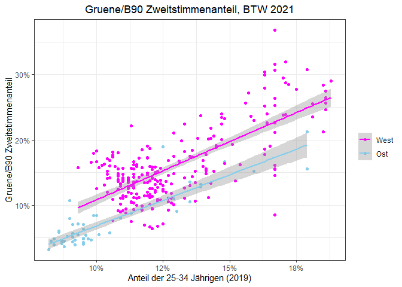
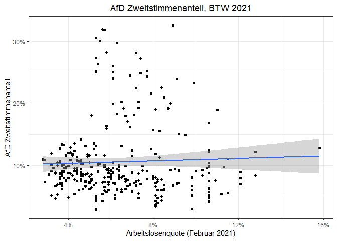
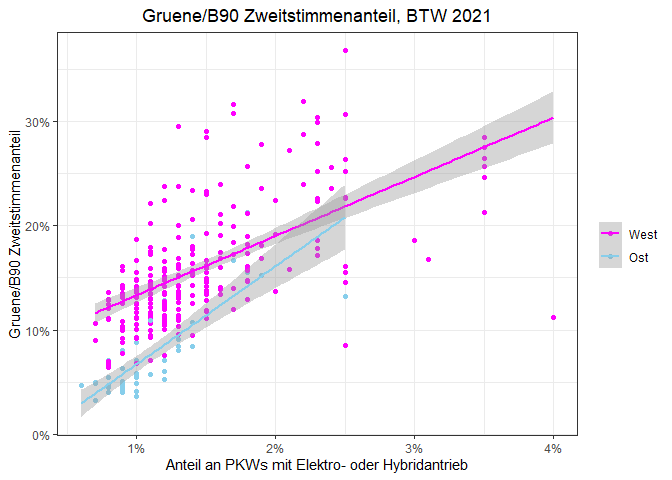
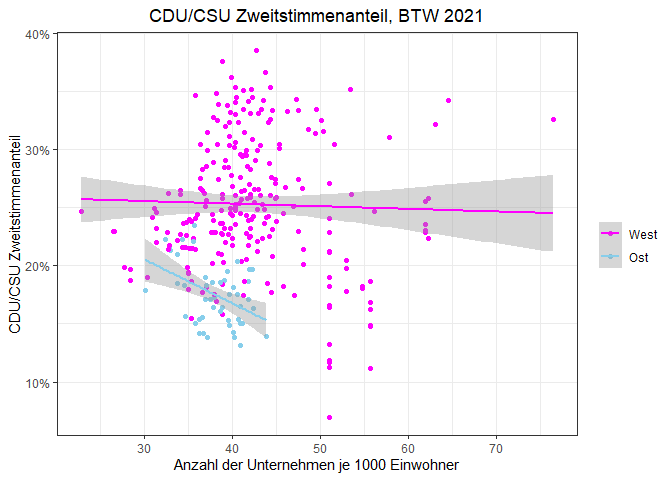

Bundestagswahl - 2021
================
21 February 2023

# Preliminaries

## Packages

``` r
library(readr)
library(readxl)
library(tidyverse)
library(stringr)
library(janitor)
library(tidyr)
library(modelsummary)
library(scales)
library(sf)
library(knitr)
library(kableExtra)
```

## Data

### Election Results

``` r
# election results 
## header
btw21_header <- read_delim("https://www.bundeswahlleiter.de/bundestagswahlen/2021/ergebnisse/opendata/csv/kerg.csv",
                           col_names = F, skip = 2, n_max = 3, delim = ";") 
# re-shaping header
btw21_header_proper <- btw21_header %>%
  rownames_to_column(var = "rowname") %>% # assign rownames to be used as identifiers
  pivot_longer(cols = !rowname, names_to = "super", values_to = "sub") %>% 
  fill(sub, .direction = "down") %>% # turn data into long format to re-shape multi-line headers into single line headers by assigning super-categories to all columns
  pivot_wider(id_cols = rowname, names_from = super, values_from = sub) %>% # turn data back into wide format tom match headers in results data frame
  sapply(., paste, collapse = "_") # combine column values from three rows into a single one, resulting in single-line header 
## import actual results 
btw21 <- read_delim("https://www.bundeswahlleiter.de/bundestagswahlen/2021/ergebnisse/opendata/csv/kerg.csv",
                  col_names = F,  skip = 5, delim = ";") %>% # do not use column names and skip first five rows, delimiter is semicolon 
  remove_empty(which = "rows") %>% # remove completely empty rows 
  clean_names() # use convenience function 
## assign header names 
names(btw21) <- btw21_header_proper[2:213] # I omit the first name since this is used the row identifier column.
## eliminate some final inconsistencies 
btw21 <- btw21 %>%
  clean_names() %>%
  rename("WKR_NR" = nr_ubrige_zweitstimmen,
         "Wahlkreis" = gebiet_ubrige_zweitstimmen,
         "Bundesland_Nr" = gehort_zu_ubrige_zweitstimmen) %>%
  mutate(WKR_NR = as.numeric(as.character(WKR_NR)))
# finally, get rid of Bundesland and overall summaries 
btw21 <- btw21 %>%
  filter(!(grepl("99", Bundesland_Nr) | grepl("Bundesgebiet", Wahlkreis)))
```

### Strukturdaten, Shapefile and Merging

``` r
# shapefile
btw_shapefile <- st_read("Data/btw21_geometrie_wahlkreise_geo_shp/Geometrie_Wahlkreise_20DBT_geo.shp")
```

    ## Reading layer `Geometrie_Wahlkreise_20DBT_geo' from data source 
    ##   `C:\Users\jacob\Documents\R_documents\Data\Bundestagswahl2021_anaylsis\bundestagswahl2021\Data\btw21_geometrie_wahlkreise_geo_shp\Geometrie_Wahlkreise_20DBT_geo.shp' 
    ##   using driver `ESRI Shapefile'
    ## Simple feature collection with 299 features and 4 fields
    ## Geometry type: MULTIPOLYGON
    ## Dimension:     XY
    ## Bounding box:  xmin: 5.86625 ymin: 47.27012 xmax: 15.03962 ymax: 55.05838
    ## Geodetic CRS:  WGS 84

``` r
# socio-economic characteristics of consttuencies 
strukturdaten21 <- read_csv2("Data/btw21_strukturdaten_wahlkreise.csv", skip = 8) %>%
  clean_names() %>%
  filter(!(grepl("Land insgesamt", wahlkreis_name) == TRUE)) %>%
  filter(!(grepl("Insgesamt", wahlkreis_name) == TRUE))
## merge data 
btw21 <- btw21 %>%
  left_join(btw_shapefile, by = "WKR_NR") %>%
  left_join(strukturdaten21, by = c("WKR_NR" = "wahlkreis_nr"))
## final data frame: 299-by-267 matrix, 267 = 5 (shapefile) - 1 (merging column) + 212 (btw21_results) + 52 (strukturdaten) - 1(merging column)
```

## Analysis

Let us start by creating some useful variables:

``` r
# variables 
btw21 <- btw21 %>%
  mutate(union_zweitstimmen_endgultig = ifelse(is.na(christlich_demokratische_union_deutschlands_zweitstimmen_endgultig), christlich_soziale_union_in_bayern_e_v_zweitstimmen_endgultig, christlich_demokratische_union_deutschlands_zweitstimmen_endgultig),
         CDU_CSU_Zweitstimmen_Share = union_zweitstimmen_endgultig/gultige_stimmen_zweitstimmen_endgultig,
         SPD_Zweitstimmen_Share = sozialdemokratische_partei_deutschlands_zweitstimmen_endgultig/gultige_stimmen_zweitstimmen_endgultig,
         FDP_Zweitstimmen_Share = freie_demokratische_partei_zweitstimmen_endgultig/gultige_stimmen_zweitstimmen_endgultig,
         AfD_Zweitstimmen_Share = alternative_fur_deutschland_zweitstimmen_endgultig/gultige_stimmen_zweitstimmen_endgultig,
         LINKE_Zweitstimmen_Share = die_linke_zweitstimmen_endgultig/gultige_stimmen_zweitstimmen_endgultig,
         Gruene_B90_Zweitstimmen_Share = bundnis_90_die_grunen_zweitstimmen_endgultig/gultige_stimmen_zweitstimmen_endgultig)
# final data set
## load 2017 election results 
load("Data/bundestagswahl2017_election_results.RData")
## create second data set consisting of merged results files 
btws17_21_merged <- btw21 %>%
  left_join(btw17_merged, by = "WKR_NR", 
            suffix = c("_btw21", "_btw21"))
```

Let us create an appropriate data set for plotting:

``` r
# general data set 
btws17_21_merged <- btws17_21_merged %>%
  mutate(CDU_CSU_delta_21_17 = CDU_CSU_Zweitstimmen_Share - union_zweitstimmen_share,
         SPD_delta_21_17 = SPD_Zweitstimmen_Share - spd_zweitstimmen_share,
         AfD_delta_21_17 = AfD_Zweitstimmen_Share - afd_zweitstimmen_share,
         Gruene_B90_delta_21_17 = Gruene_B90_Zweitstimmen_Share - green_zweitstimmen_share,
         FDP_delta_21_17 = FDP_Zweitstimmen_Share - fdp_zweitstimmen_share,
         LINKE_delta_21_17 = LINKE_Zweitstimmen_Share - linke_zweitstimmen_share)
# selection 
btws17_21_merged_plot <- btws17_21_merged %>%
  select(WKR_NR, WKR_Name, geometry_btw21, LAND_NAME_btw21,
         union_zweitstimmen_share, spd_zweitstimmen_share, 
         afd_zweitstimmen_share, fdp_zweitstimmen_share,
         green_zweitstimmen_share, linke_zweitstimmen_share, CDU_CSU_Zweitstimmen_Share, FDP_Zweitstimmen_Share,
         SPD_Zweitstimmen_Share, AfD_Zweitstimmen_Share, 
         Gruene_B90_Zweitstimmen_Share, LINKE_Zweitstimmen_Share, CDU_CSU_delta_21_17, SPD_delta_21_17, AfD_delta_21_17, Gruene_B90_delta_21_17, FDP_delta_21_17, LINKE_delta_21_17) 
save(btws17_21_merged_plot, file = "Data/bundestagswahlen_17_21_merged_plot_data.RData")
```

### Summary Statistics

``` r
btws17_21_merged_plot %>%
  select(-c(WKR_Name, WKR_NR, geometry_btw21, LAND_NAME_btw21), 
         "CDU/CSU Zweitstimmenanteil 2017" = union_zweitstimmen_share, 
         "SPD Zweitstimmenanteil 2017" = spd_zweitstimmen_share,
         "AfD Zweitstimmenanteil 2017" = afd_zweitstimmen_share,
         "FDP Zweitstimmenanteil 2017" = fdp_zweitstimmen_share,
         "Grüne B90 Zweitstimmenanteil 2017" = green_zweitstimmen_share, 
         "LINKE Zweitstimmenanteil 2017" = linke_zweitstimmen_share, 
         "CDU/CSU Zweitstimmenanteil 2021" = CDU_CSU_Zweitstimmen_Share, 
         "SPD Zweitstimmenanteil 2021" = SPD_Zweitstimmen_Share,
         "FDP Zweitstimmenanteil 2021" = FDP_Zweitstimmen_Share,
         "AfD Zweitstimmenanteil 2021" = AfD_Zweitstimmen_Share,
         "Grüne B90 Zweitstimmenanteil 2021" = Gruene_B90_Zweitstimmen_Share,
         "LINKE Zweitstimmenanteil 2021" = LINKE_Zweitstimmen_Share,
         "Veränderung des CDU/CSU Zweitstimmenanteils" = CDU_CSU_delta_21_17,
         "Veränderung des SPD Zweitstimmenanteils" = SPD_delta_21_17,
         "Veränderung des AfD Zweitstimmenanteils" = AfD_delta_21_17,
         "Veränderung des Grüne Zweitstimmenanteils" = Gruene_B90_delta_21_17,
         "Veränderung des FDP Zweitstimmenanteils" = FDP_delta_21_17,
         "Veränderung des LINKE Zweitstimmenanteils" = LINKE_delta_21_17) %>%
  mutate(across(.cols = everything(),
                .fns = ~ . * 100)) %>%
  datasummary_skim(fmt = "%.1f", 
                   output = "kableExtra", 
                   histogram = F) %>%
  landscape() %>%
  add_footnote(c("Die Veränderung der Zweitstimmenanteile beschreibt die Differenz der Zweitstimmenanteile der Bundestagswahl 2021 im Vergleich zu 2017."), 
               notation = "number")
```

<table class="table" style="width: auto !important; margin-left: auto; margin-right: auto;">
<thead>
<tr>
<th style="text-align:left;">
</th>
<th style="text-align:right;">
Unique (#)
</th>
<th style="text-align:right;">
Missing (%)
</th>
<th style="text-align:right;">
Mean
</th>
<th style="text-align:right;">
SD
</th>
<th style="text-align:right;">
Min
</th>
<th style="text-align:right;">
Median
</th>
<th style="text-align:right;">
Max
</th>
</tr>
</thead>
<tbody>
<tr>
<td style="text-align:left;">
CDU/CSU Zweitstimmenanteil 2017
</td>
<td style="text-align:right;">
299
</td>
<td style="text-align:right;">
0
</td>
<td style="text-align:right;">
32.9
</td>
<td style="text-align:right;">
6.0
</td>
<td style="text-align:right;">
13.9
</td>
<td style="text-align:right;">
32.8
</td>
<td style="text-align:right;">
53.1
</td>
</tr>
<tr>
<td style="text-align:left;">
SPD Zweitstimmenanteil 2017
</td>
<td style="text-align:right;">
299
</td>
<td style="text-align:right;">
0
</td>
<td style="text-align:right;">
20.7
</td>
<td style="text-align:right;">
6.2
</td>
<td style="text-align:right;">
7.8
</td>
<td style="text-align:right;">
20.7
</td>
<td style="text-align:right;">
37.8
</td>
</tr>
<tr>
<td style="text-align:left;">
AfD Zweitstimmenanteil 2017
</td>
<td style="text-align:right;">
299
</td>
<td style="text-align:right;">
0
</td>
<td style="text-align:right;">
12.8
</td>
<td style="text-align:right;">
5.5
</td>
<td style="text-align:right;">
4.9
</td>
<td style="text-align:right;">
11.5
</td>
<td style="text-align:right;">
35.5
</td>
</tr>
<tr>
<td style="text-align:left;">
FDP Zweitstimmenanteil 2017
</td>
<td style="text-align:right;">
299
</td>
<td style="text-align:right;">
0
</td>
<td style="text-align:right;">
10.7
</td>
<td style="text-align:right;">
2.7
</td>
<td style="text-align:right;">
5.3
</td>
<td style="text-align:right;">
10.4
</td>
<td style="text-align:right;">
19.7
</td>
</tr>
<tr>
<td style="text-align:left;">
Grüne B90 Zweitstimmenanteil 2017
</td>
<td style="text-align:right;">
299
</td>
<td style="text-align:right;">
0
</td>
<td style="text-align:right;">
8.8
</td>
<td style="text-align:right;">
3.9
</td>
<td style="text-align:right;">
2.2
</td>
<td style="text-align:right;">
8.1
</td>
<td style="text-align:right;">
21.2
</td>
</tr>
<tr>
<td style="text-align:left;">
LINKE Zweitstimmenanteil 2017
</td>
<td style="text-align:right;">
299
</td>
<td style="text-align:right;">
0
</td>
<td style="text-align:right;">
9.3
</td>
<td style="text-align:right;">
4.8
</td>
<td style="text-align:right;">
4.2
</td>
<td style="text-align:right;">
7.1
</td>
<td style="text-align:right;">
29.3
</td>
</tr>
<tr>
<td style="text-align:left;">
CDU/CSU Zweitstimmenanteil 2021
</td>
<td style="text-align:right;">
299
</td>
<td style="text-align:right;">
0
</td>
<td style="text-align:right;">
24.0
</td>
<td style="text-align:right;">
6.0
</td>
<td style="text-align:right;">
7.0
</td>
<td style="text-align:right;">
23.6
</td>
<td style="text-align:right;">
38.5
</td>
</tr>
<tr>
<td style="text-align:left;">
FDP Zweitstimmenanteil 2021
</td>
<td style="text-align:right;">
299
</td>
<td style="text-align:right;">
0
</td>
<td style="text-align:right;">
11.4
</td>
<td style="text-align:right;">
2.3
</td>
<td style="text-align:right;">
6.3
</td>
<td style="text-align:right;">
11.1
</td>
<td style="text-align:right;">
18.1
</td>
</tr>
<tr>
<td style="text-align:left;">
SPD Zweitstimmenanteil 2021
</td>
<td style="text-align:right;">
299
</td>
<td style="text-align:right;">
0
</td>
<td style="text-align:right;">
26.0
</td>
<td style="text-align:right;">
6.0
</td>
<td style="text-align:right;">
13.5
</td>
<td style="text-align:right;">
26.2
</td>
<td style="text-align:right;">
43.3
</td>
</tr>
<tr>
<td style="text-align:left;">
AfD Zweitstimmenanteil 2021
</td>
<td style="text-align:right;">
299
</td>
<td style="text-align:right;">
0
</td>
<td style="text-align:right;">
10.5
</td>
<td style="text-align:right;">
5.9
</td>
<td style="text-align:right;">
2.9
</td>
<td style="text-align:right;">
8.9
</td>
<td style="text-align:right;">
32.5
</td>
</tr>
<tr>
<td style="text-align:left;">
Grüne B90 Zweitstimmenanteil 2021
</td>
<td style="text-align:right;">
296
</td>
<td style="text-align:right;">
1
</td>
<td style="text-align:right;">
14.7
</td>
<td style="text-align:right;">
6.3
</td>
<td style="text-align:right;">
3.3
</td>
<td style="text-align:right;">
13.9
</td>
<td style="text-align:right;">
36.7
</td>
</tr>
<tr>
<td style="text-align:left;">
LINKE Zweitstimmenanteil 2021
</td>
<td style="text-align:right;">
299
</td>
<td style="text-align:right;">
0
</td>
<td style="text-align:right;">
4.9
</td>
<td style="text-align:right;">
3.1
</td>
<td style="text-align:right;">
1.8
</td>
<td style="text-align:right;">
3.4
</td>
<td style="text-align:right;">
18.2
</td>
</tr>
<tr>
<td style="text-align:left;">
Veränderung des CDU/CSU Zweitstimmenanteils
</td>
<td style="text-align:right;">
299
</td>
<td style="text-align:right;">
0
</td>
<td style="text-align:right;">
-8.9
</td>
<td style="text-align:right;">
2.6
</td>
<td style="text-align:right;">
-17.1
</td>
<td style="text-align:right;">
-8.6
</td>
<td style="text-align:right;">
-1.2
</td>
</tr>
<tr>
<td style="text-align:left;">
Veränderung des SPD Zweitstimmenanteils
</td>
<td style="text-align:right;">
299
</td>
<td style="text-align:right;">
0
</td>
<td style="text-align:right;">
5.3
</td>
<td style="text-align:right;">
3.0
</td>
<td style="text-align:right;">
-3.7
</td>
<td style="text-align:right;">
4.8
</td>
<td style="text-align:right;">
15.4
</td>
</tr>
<tr>
<td style="text-align:left;">
Veränderung des AfD Zweitstimmenanteils
</td>
<td style="text-align:right;">
299
</td>
<td style="text-align:right;">
0
</td>
<td style="text-align:right;">
-2.2
</td>
<td style="text-align:right;">
1.5
</td>
<td style="text-align:right;">
-5.3
</td>
<td style="text-align:right;">
-2.3
</td>
<td style="text-align:right;">
3.3
</td>
</tr>
<tr>
<td style="text-align:left;">
Veränderung des Grüne Zweitstimmenanteils
</td>
<td style="text-align:right;">
296
</td>
<td style="text-align:right;">
1
</td>
<td style="text-align:right;">
5.8
</td>
<td style="text-align:right;">
3.2
</td>
<td style="text-align:right;">
-0.1
</td>
<td style="text-align:right;">
5.6
</td>
<td style="text-align:right;">
16.4
</td>
</tr>
<tr>
<td style="text-align:left;">
Veränderung des FDP Zweitstimmenanteils
</td>
<td style="text-align:right;">
299
</td>
<td style="text-align:right;">
0
</td>
<td style="text-align:right;">
0.7
</td>
<td style="text-align:right;">
1.7
</td>
<td style="text-align:right;">
-4.2
</td>
<td style="text-align:right;">
0.8
</td>
<td style="text-align:right;">
4.6
</td>
</tr>
<tr>
<td style="text-align:left;">
Veränderung des LINKE Zweitstimmenanteils
</td>
<td style="text-align:right;">
299
</td>
<td style="text-align:right;">
0
</td>
<td style="text-align:right;">
-4.4
</td>
<td style="text-align:right;">
1.8
</td>
<td style="text-align:right;">
-11.1
</td>
<td style="text-align:right;">
-3.7
</td>
<td style="text-align:right;">
-1.7
</td>
</tr>
</tbody>
<tfoot>
<tr>
<td style="padding: 0; border:0;" colspan="100%">
<sup>1</sup> Die Veränderung der Zweitstimmenanteile beschreibt die
Differenz der Zweitstimmenanteile der Bundestagswahl 2021 im Vergleich
zu 2017.
</td>
</tr>
</tfoot>
</table>

Let us produce some plots of the *Zweitstimmenanteile* in 2017:

``` r
# loop
btw17_zweitstimmen_plot <- function(x){
  nm <- names(x)[5:10] 
  for(i in seq_along(nm)){
    plots <- ggplot(x, aes(geometry = geometry_btw21)) +
    geom_sf(aes_string(fill = nm[i])) +
    scale_fill_viridis_b(name = " ", 
                       labels = label_percent(scale = 100, accuracy = 1),
                       direction = -1,
                       option = "mako") +
    labs(title = paste(str_to_upper(str_replace_all(str_remove(nm[i], "_zweitstimmen_share"), "_", "/")), "Zweitstimmenanteil, BTW 2017")) + 
    theme_void() +
    theme(plot.title = element_text(hjust = 0.5))
    print(plots)
    ggsave(filename = paste("Figures/btw_17", nm[i], "plots.png", sep = "_"))
  }
}
# applying loop
btw17_zweitstimmen_plot(btws17_21_merged_plot)
```


Here is an overview of the results in 2017:


Then, we examine the *Zweitstimmenanteil* in 2021:

``` r
# loop
btw21_zweitstimmen_plot <- function(x){
  nm <- names(x)[11:16] # use columns with zweitstimmen_share
  for(i in seq_along(nm)){
    plots <- ggplot(x, aes(geometry = geometry_btw21)) +
    geom_sf(aes_string(fill = nm[i])) +
    scale_fill_viridis_b(name = " ", 
                       labels = label_percent(scale = 100, accuracy = 1),
                       direction = -1,
                       option = "mako") +
    labs(title = paste(str_replace_all(str_remove(nm[i], "_Zweitstimmen_Share"), "_", "/"), "Zweitstimmenanteil, BTW 2021")) + 
    theme_void() +
    theme(plot.title = element_text(hjust = 0.5))
    print(plots)
    ggsave(filename = paste("Figures/btw_21", nm[i], "plots.png", sep = "_"))
  }
}
# applying loop
btw21_zweitstimmen_plot(btws17_21_merged_plot)
```


Before digging deeper into the results at the constituency-level, here
is a plot of the overall results in 2021:


Let us create a table containing all Wahlkreise:

``` r
btws17_21_merged %>%
  select(Wahlkreis, CDU_CSU_Zweitstimmen_Share, 
         SPD_Zweitstimmen_Share, Gruene_B90_Zweitstimmen_Share,
         FDP_Zweitstimmen_Share, AfD_Zweitstimmen_Share, LINKE_Zweitstimmen_Share) %>%
  mutate(across(.cols = grep("Share", names(.)),
                .fns = ~ . * 100)) %>%
  kable(col.names = c("Wahlkreis", "CDU/CSU", "SPD",
                      "Grüne/B90", "FDP", "AfD", "LINKE"),
    booktabs = T, digits = 1) %>%
  add_header_above(c(" " = 1, "Zweitstimmenanteile" = 6)) %>%
  kable_styling(full_width = F) %>%
  landscape() 
```

<table class="table" style="width: auto !important; margin-left: auto; margin-right: auto;">
<thead>
<tr>
<th style="empty-cells: hide;border-bottom:hidden;" colspan="1">
</th>
<th style="border-bottom:hidden;padding-bottom:0; padding-left:3px;padding-right:3px;text-align: center; " colspan="6">

<div style="border-bottom: 1px solid #ddd; padding-bottom: 5px; ">

Zweitstimmenanteile

</div>

</th>
</tr>
<tr>
<th style="text-align:left;">
Wahlkreis
</th>
<th style="text-align:right;">
CDU/CSU
</th>
<th style="text-align:right;">
SPD
</th>
<th style="text-align:right;">
Grüne/B90
</th>
<th style="text-align:right;">
FDP
</th>
<th style="text-align:right;">
AfD
</th>
<th style="text-align:right;">
LINKE
</th>
</tr>
</thead>
<tbody>
<tr>
<td style="text-align:left;">
Flensburg – Schleswig
</td>
<td style="text-align:right;">
20.4
</td>
<td style="text-align:right;">
25.5
</td>
<td style="text-align:right;">
18.6
</td>
<td style="text-align:right;">
10.7
</td>
<td style="text-align:right;">
5.8
</td>
<td style="text-align:right;">
4.2
</td>
</tr>
<tr>
<td style="text-align:left;">
Nordfriesland – Dithmarschen Nord
</td>
<td style="text-align:right;">
24.6
</td>
<td style="text-align:right;">
26.3
</td>
<td style="text-align:right;">
15.7
</td>
<td style="text-align:right;">
12.7
</td>
<td style="text-align:right;">
6.1
</td>
<td style="text-align:right;">
3.1
</td>
</tr>
<tr>
<td style="text-align:left;">
Steinburg – Dithmarschen Süd
</td>
<td style="text-align:right;">
24.3
</td>
<td style="text-align:right;">
27.7
</td>
<td style="text-align:right;">
14.2
</td>
<td style="text-align:right;">
13.7
</td>
<td style="text-align:right;">
8.4
</td>
<td style="text-align:right;">
3.3
</td>
</tr>
<tr>
<td style="text-align:left;">
Rendsburg-Eckernförde
</td>
<td style="text-align:right;">
23.9
</td>
<td style="text-align:right;">
26.8
</td>
<td style="text-align:right;">
17.9
</td>
<td style="text-align:right;">
12.0
</td>
<td style="text-align:right;">
6.6
</td>
<td style="text-align:right;">
3.2
</td>
</tr>
<tr>
<td style="text-align:left;">
Kiel
</td>
<td style="text-align:right;">
15.4
</td>
<td style="text-align:right;">
26.0
</td>
<td style="text-align:right;">
28.4
</td>
<td style="text-align:right;">
10.4
</td>
<td style="text-align:right;">
4.9
</td>
<td style="text-align:right;">
6.1
</td>
</tr>
<tr>
<td style="text-align:left;">
Plön – Neumünster
</td>
<td style="text-align:right;">
22.9
</td>
<td style="text-align:right;">
29.2
</td>
<td style="text-align:right;">
17.4
</td>
<td style="text-align:right;">
12.0
</td>
<td style="text-align:right;">
7.4
</td>
<td style="text-align:right;">
3.2
</td>
</tr>
<tr>
<td style="text-align:left;">
Pinneberg
</td>
<td style="text-align:right;">
22.1
</td>
<td style="text-align:right;">
29.3
</td>
<td style="text-align:right;">
18.0
</td>
<td style="text-align:right;">
13.5
</td>
<td style="text-align:right;">
6.9
</td>
<td style="text-align:right;">
3.3
</td>
</tr>
<tr>
<td style="text-align:left;">
Segeberg – Stormarn-Mitte
</td>
<td style="text-align:right;">
22.3
</td>
<td style="text-align:right;">
28.6
</td>
<td style="text-align:right;">
16.8
</td>
<td style="text-align:right;">
14.0
</td>
<td style="text-align:right;">
7.3
</td>
<td style="text-align:right;">
3.3
</td>
</tr>
<tr>
<td style="text-align:left;">
Ostholstein – Stormarn-Nord
</td>
<td style="text-align:right;">
25.1
</td>
<td style="text-align:right;">
30.0
</td>
<td style="text-align:right;">
15.7
</td>
<td style="text-align:right;">
12.7
</td>
<td style="text-align:right;">
7.1
</td>
<td style="text-align:right;">
2.8
</td>
</tr>
<tr>
<td style="text-align:left;">
Herzogtum Lauenburg – Stormarn-Süd
</td>
<td style="text-align:right;">
23.2
</td>
<td style="text-align:right;">
28.8
</td>
<td style="text-align:right;">
16.6
</td>
<td style="text-align:right;">
14.2
</td>
<td style="text-align:right;">
7.5
</td>
<td style="text-align:right;">
3.2
</td>
</tr>
<tr>
<td style="text-align:left;">
Lübeck
</td>
<td style="text-align:right;">
18.1
</td>
<td style="text-align:right;">
30.5
</td>
<td style="text-align:right;">
22.4
</td>
<td style="text-align:right;">
10.5
</td>
<td style="text-align:right;">
6.8
</td>
<td style="text-align:right;">
4.4
</td>
</tr>
<tr>
<td style="text-align:left;">
Schwerin – Ludwigslust-Parchim I – Nordwestmecklenburg I
</td>
<td style="text-align:right;">
17.1
</td>
<td style="text-align:right;">
32.0
</td>
<td style="text-align:right;">
8.1
</td>
<td style="text-align:right;">
8.6
</td>
<td style="text-align:right;">
15.7
</td>
<td style="text-align:right;">
10.8
</td>
</tr>
<tr>
<td style="text-align:left;">
Ludwigslust-Parchim II – Nordwestmecklenburg II – Landkreis Rostock I
</td>
<td style="text-align:right;">
17.1
</td>
<td style="text-align:right;">
32.5
</td>
<td style="text-align:right;">
7.0
</td>
<td style="text-align:right;">
8.1
</td>
<td style="text-align:right;">
17.1
</td>
<td style="text-align:right;">
10.4
</td>
</tr>
<tr>
<td style="text-align:left;">
Rostock – Landkreis Rostock II
</td>
<td style="text-align:right;">
14.2
</td>
<td style="text-align:right;">
29.0
</td>
<td style="text-align:right;">
12.8
</td>
<td style="text-align:right;">
9.1
</td>
<td style="text-align:right;">
12.7
</td>
<td style="text-align:right;">
13.2
</td>
</tr>
<tr>
<td style="text-align:left;">
Vorpommern-Rügen – Vorpommern-Greifswald I
</td>
<td style="text-align:right;">
18.6
</td>
<td style="text-align:right;">
25.1
</td>
<td style="text-align:right;">
8.8
</td>
<td style="text-align:right;">
8.3
</td>
<td style="text-align:right;">
18.9
</td>
<td style="text-align:right;">
11.4
</td>
</tr>
<tr>
<td style="text-align:left;">
Mecklenburgische Seenplatte I – Vorpommern-Greifswald II
</td>
<td style="text-align:right;">
19.0
</td>
<td style="text-align:right;">
26.7
</td>
<td style="text-align:right;">
4.4
</td>
<td style="text-align:right;">
7.6
</td>
<td style="text-align:right;">
23.2
</td>
<td style="text-align:right;">
10.2
</td>
</tr>
<tr>
<td style="text-align:left;">
Mecklenburgische Seenplatte II – Landkreis Rostock III
</td>
<td style="text-align:right;">
18.8
</td>
<td style="text-align:right;">
29.9
</td>
<td style="text-align:right;">
5.1
</td>
<td style="text-align:right;">
7.5
</td>
<td style="text-align:right;">
20.9
</td>
<td style="text-align:right;">
10.3
</td>
</tr>
<tr>
<td style="text-align:left;">
Hamburg-Mitte
</td>
<td style="text-align:right;">
11.2
</td>
<td style="text-align:right;">
28.7
</td>
<td style="text-align:right;">
27.9
</td>
<td style="text-align:right;">
10.5
</td>
<td style="text-align:right;">
5.1
</td>
<td style="text-align:right;">
8.7
</td>
</tr>
<tr>
<td style="text-align:left;">
Hamburg-Altona
</td>
<td style="text-align:right;">
14.8
</td>
<td style="text-align:right;">
25.6
</td>
<td style="text-align:right;">
30.4
</td>
<td style="text-align:right;">
10.9
</td>
<td style="text-align:right;">
3.3
</td>
<td style="text-align:right;">
9.0
</td>
</tr>
<tr>
<td style="text-align:left;">
Hamburg-Eimsbüttel
</td>
<td style="text-align:right;">
14.9
</td>
<td style="text-align:right;">
28.0
</td>
<td style="text-align:right;">
29.9
</td>
<td style="text-align:right;">
11.3
</td>
<td style="text-align:right;">
3.5
</td>
<td style="text-align:right;">
6.8
</td>
</tr>
<tr>
<td style="text-align:left;">
Hamburg-Nord
</td>
<td style="text-align:right;">
18.6
</td>
<td style="text-align:right;">
27.9
</td>
<td style="text-align:right;">
25.2
</td>
<td style="text-align:right;">
14.2
</td>
<td style="text-align:right;">
3.7
</td>
<td style="text-align:right;">
4.7
</td>
</tr>
<tr>
<td style="text-align:left;">
Hamburg-Wandsbek
</td>
<td style="text-align:right;">
16.8
</td>
<td style="text-align:right;">
34.3
</td>
<td style="text-align:right;">
18.6
</td>
<td style="text-align:right;">
11.1
</td>
<td style="text-align:right;">
6.5
</td>
<td style="text-align:right;">
5.1
</td>
</tr>
<tr>
<td style="text-align:left;">
Hamburg-Bergedorf – Harburg
</td>
<td style="text-align:right;">
16.2
</td>
<td style="text-align:right;">
33.5
</td>
<td style="text-align:right;">
17.8
</td>
<td style="text-align:right;">
10.0
</td>
<td style="text-align:right;">
8.0
</td>
<td style="text-align:right;">
6.3
</td>
</tr>
<tr>
<td style="text-align:left;">
Aurich – Emden
</td>
<td style="text-align:right;">
17.7
</td>
<td style="text-align:right;">
43.3
</td>
<td style="text-align:right;">
13.0
</td>
<td style="text-align:right;">
8.9
</td>
<td style="text-align:right;">
8.2
</td>
<td style="text-align:right;">
3.4
</td>
</tr>
<tr>
<td style="text-align:left;">
Unterems
</td>
<td style="text-align:right;">
29.9
</td>
<td style="text-align:right;">
34.0
</td>
<td style="text-align:right;">
10.7
</td>
<td style="text-align:right;">
10.1
</td>
<td style="text-align:right;">
8.2
</td>
<td style="text-align:right;">
2.7
</td>
</tr>
<tr>
<td style="text-align:left;">
Friesland – Wilhelmshaven – Wittmund
</td>
<td style="text-align:right;">
21.5
</td>
<td style="text-align:right;">
38.0
</td>
<td style="text-align:right;">
12.8
</td>
<td style="text-align:right;">
10.4
</td>
<td style="text-align:right;">
8.2
</td>
<td style="text-align:right;">
3.1
</td>
</tr>
<tr>
<td style="text-align:left;">
Oldenburg – Ammerland
</td>
<td style="text-align:right;">
18.6
</td>
<td style="text-align:right;">
32.0
</td>
<td style="text-align:right;">
23.7
</td>
<td style="text-align:right;">
10.2
</td>
<td style="text-align:right;">
5.2
</td>
<td style="text-align:right;">
4.8
</td>
</tr>
<tr>
<td style="text-align:left;">
Delmenhorst – Wesermarsch – Oldenburg-Land
</td>
<td style="text-align:right;">
22.6
</td>
<td style="text-align:right;">
34.3
</td>
<td style="text-align:right;">
14.8
</td>
<td style="text-align:right;">
11.5
</td>
<td style="text-align:right;">
8.0
</td>
<td style="text-align:right;">
3.1
</td>
</tr>
<tr>
<td style="text-align:left;">
Cuxhaven – Stade II
</td>
<td style="text-align:right;">
26.2
</td>
<td style="text-align:right;">
35.0
</td>
<td style="text-align:right;">
12.6
</td>
<td style="text-align:right;">
10.1
</td>
<td style="text-align:right;">
7.9
</td>
<td style="text-align:right;">
2.6
</td>
</tr>
<tr>
<td style="text-align:left;">
Stade I – Rotenburg II
</td>
<td style="text-align:right;">
26.5
</td>
<td style="text-align:right;">
32.0
</td>
<td style="text-align:right;">
14.6
</td>
<td style="text-align:right;">
11.1
</td>
<td style="text-align:right;">
7.3
</td>
<td style="text-align:right;">
2.9
</td>
</tr>
<tr>
<td style="text-align:left;">
Mittelems
</td>
<td style="text-align:right;">
33.8
</td>
<td style="text-align:right;">
30.9
</td>
<td style="text-align:right;">
12.5
</td>
<td style="text-align:right;">
11.8
</td>
<td style="text-align:right;">
5.1
</td>
<td style="text-align:right;">
2.2
</td>
</tr>
<tr>
<td style="text-align:left;">
Cloppenburg – Vechta
</td>
<td style="text-align:right;">
38.5
</td>
<td style="text-align:right;">
24.6
</td>
<td style="text-align:right;">
11.1
</td>
<td style="text-align:right;">
12.1
</td>
<td style="text-align:right;">
7.8
</td>
<td style="text-align:right;">
2.2
</td>
</tr>
<tr>
<td style="text-align:left;">
Diepholz – Nienburg I
</td>
<td style="text-align:right;">
25.3
</td>
<td style="text-align:right;">
33.0
</td>
<td style="text-align:right;">
14.5
</td>
<td style="text-align:right;">
12.1
</td>
<td style="text-align:right;">
7.1
</td>
<td style="text-align:right;">
2.7
</td>
</tr>
<tr>
<td style="text-align:left;">
Osterholz – Verden
</td>
<td style="text-align:right;">
24.1
</td>
<td style="text-align:right;">
32.9
</td>
<td style="text-align:right;">
16.1
</td>
<td style="text-align:right;">
10.4
</td>
<td style="text-align:right;">
7.5
</td>
<td style="text-align:right;">
3.5
</td>
</tr>
<tr>
<td style="text-align:left;">
Rotenburg I – Heidekreis
</td>
<td style="text-align:right;">
25.1
</td>
<td style="text-align:right;">
34.8
</td>
<td style="text-align:right;">
13.6
</td>
<td style="text-align:right;">
10.1
</td>
<td style="text-align:right;">
8.0
</td>
<td style="text-align:right;">
2.8
</td>
</tr>
<tr>
<td style="text-align:left;">
Harburg
</td>
<td style="text-align:right;">
24.8
</td>
<td style="text-align:right;">
29.1
</td>
<td style="text-align:right;">
16.7
</td>
<td style="text-align:right;">
12.7
</td>
<td style="text-align:right;">
7.3
</td>
<td style="text-align:right;">
2.9
</td>
</tr>
<tr>
<td style="text-align:left;">
Lüchow-Dannenberg – Lüneburg
</td>
<td style="text-align:right;">
21.0
</td>
<td style="text-align:right;">
29.9
</td>
<td style="text-align:right;">
22.1
</td>
<td style="text-align:right;">
9.6
</td>
<td style="text-align:right;">
6.6
</td>
<td style="text-align:right;">
4.6
</td>
</tr>
<tr>
<td style="text-align:left;">
Osnabrück-Land
</td>
<td style="text-align:right;">
28.5
</td>
<td style="text-align:right;">
32.1
</td>
<td style="text-align:right;">
14.7
</td>
<td style="text-align:right;">
11.1
</td>
<td style="text-align:right;">
6.7
</td>
<td style="text-align:right;">
2.6
</td>
</tr>
<tr>
<td style="text-align:left;">
Stadt Osnabrück
</td>
<td style="text-align:right;">
23.2
</td>
<td style="text-align:right;">
30.2
</td>
<td style="text-align:right;">
23.3
</td>
<td style="text-align:right;">
9.8
</td>
<td style="text-align:right;">
4.6
</td>
<td style="text-align:right;">
4.2
</td>
</tr>
<tr>
<td style="text-align:left;">
Nienburg II – Schaumburg
</td>
<td style="text-align:right;">
24.0
</td>
<td style="text-align:right;">
34.9
</td>
<td style="text-align:right;">
14.1
</td>
<td style="text-align:right;">
10.0
</td>
<td style="text-align:right;">
8.8
</td>
<td style="text-align:right;">
2.7
</td>
</tr>
<tr>
<td style="text-align:left;">
Stadt Hannover I
</td>
<td style="text-align:right;">
18.3
</td>
<td style="text-align:right;">
31.0
</td>
<td style="text-align:right;">
23.8
</td>
<td style="text-align:right;">
10.4
</td>
<td style="text-align:right;">
6.0
</td>
<td style="text-align:right;">
4.5
</td>
</tr>
<tr>
<td style="text-align:left;">
Stadt Hannover II
</td>
<td style="text-align:right;">
15.8
</td>
<td style="text-align:right;">
28.2
</td>
<td style="text-align:right;">
29.5
</td>
<td style="text-align:right;">
9.3
</td>
<td style="text-align:right;">
4.7
</td>
<td style="text-align:right;">
6.2
</td>
</tr>
<tr>
<td style="text-align:left;">
Hannover-Land I
</td>
<td style="text-align:right;">
25.8
</td>
<td style="text-align:right;">
32.1
</td>
<td style="text-align:right;">
15.2
</td>
<td style="text-align:right;">
11.3
</td>
<td style="text-align:right;">
7.7
</td>
<td style="text-align:right;">
2.6
</td>
</tr>
<tr>
<td style="text-align:left;">
Celle – Uelzen
</td>
<td style="text-align:right;">
26.1
</td>
<td style="text-align:right;">
30.8
</td>
<td style="text-align:right;">
14.0
</td>
<td style="text-align:right;">
11.5
</td>
<td style="text-align:right;">
9.2
</td>
<td style="text-align:right;">
3.0
</td>
</tr>
<tr>
<td style="text-align:left;">
Gifhorn – Peine
</td>
<td style="text-align:right;">
23.0
</td>
<td style="text-align:right;">
35.7
</td>
<td style="text-align:right;">
13.3
</td>
<td style="text-align:right;">
9.9
</td>
<td style="text-align:right;">
9.7
</td>
<td style="text-align:right;">
2.5
</td>
</tr>
<tr>
<td style="text-align:left;">
Hameln-Pyrmont – Holzminden
</td>
<td style="text-align:right;">
22.6
</td>
<td style="text-align:right;">
36.8
</td>
<td style="text-align:right;">
13.1
</td>
<td style="text-align:right;">
10.4
</td>
<td style="text-align:right;">
8.8
</td>
<td style="text-align:right;">
2.8
</td>
</tr>
<tr>
<td style="text-align:left;">
Hannover-Land II
</td>
<td style="text-align:right;">
22.7
</td>
<td style="text-align:right;">
34.6
</td>
<td style="text-align:right;">
16.3
</td>
<td style="text-align:right;">
10.2
</td>
<td style="text-align:right;">
7.7
</td>
<td style="text-align:right;">
2.8
</td>
</tr>
<tr>
<td style="text-align:left;">
Hildesheim
</td>
<td style="text-align:right;">
22.8
</td>
<td style="text-align:right;">
34.7
</td>
<td style="text-align:right;">
16.6
</td>
<td style="text-align:right;">
9.6
</td>
<td style="text-align:right;">
7.6
</td>
<td style="text-align:right;">
3.3
</td>
</tr>
<tr>
<td style="text-align:left;">
Salzgitter – Wolfenbüttel
</td>
<td style="text-align:right;">
23.0
</td>
<td style="text-align:right;">
36.7
</td>
<td style="text-align:right;">
12.4
</td>
<td style="text-align:right;">
9.2
</td>
<td style="text-align:right;">
9.9
</td>
<td style="text-align:right;">
3.1
</td>
</tr>
<tr>
<td style="text-align:left;">
Braunschweig
</td>
<td style="text-align:right;">
18.6
</td>
<td style="text-align:right;">
30.4
</td>
<td style="text-align:right;">
24.0
</td>
<td style="text-align:right;">
10.1
</td>
<td style="text-align:right;">
5.9
</td>
<td style="text-align:right;">
4.6
</td>
</tr>
<tr>
<td style="text-align:left;">
Helmstedt – Wolfsburg
</td>
<td style="text-align:right;">
24.6
</td>
<td style="text-align:right;">
35.1
</td>
<td style="text-align:right;">
12.0
</td>
<td style="text-align:right;">
10.1
</td>
<td style="text-align:right;">
9.5
</td>
<td style="text-align:right;">
2.7
</td>
</tr>
<tr>
<td style="text-align:left;">
Goslar – Northeim – Osterode
</td>
<td style="text-align:right;">
23.6
</td>
<td style="text-align:right;">
37.9
</td>
<td style="text-align:right;">
12.0
</td>
<td style="text-align:right;">
10.0
</td>
<td style="text-align:right;">
8.3
</td>
<td style="text-align:right;">
3.0
</td>
</tr>
<tr>
<td style="text-align:left;">
Göttingen
</td>
<td style="text-align:right;">
21.6
</td>
<td style="text-align:right;">
31.9
</td>
<td style="text-align:right;">
20.2
</td>
<td style="text-align:right;">
9.8
</td>
<td style="text-align:right;">
6.1
</td>
<td style="text-align:right;">
5.1
</td>
</tr>
<tr>
<td style="text-align:left;">
Bremen I
</td>
<td style="text-align:right;">
17.5
</td>
<td style="text-align:right;">
28.8
</td>
<td style="text-align:right;">
24.0
</td>
<td style="text-align:right;">
9.9
</td>
<td style="text-align:right;">
5.3
</td>
<td style="text-align:right;">
8.5
</td>
</tr>
<tr>
<td style="text-align:left;">
Bremen II – Bremerhaven
</td>
<td style="text-align:right;">
16.9
</td>
<td style="text-align:right;">
34.9
</td>
<td style="text-align:right;">
16.8
</td>
<td style="text-align:right;">
8.5
</td>
<td style="text-align:right;">
8.9
</td>
<td style="text-align:right;">
6.7
</td>
</tr>
<tr>
<td style="text-align:left;">
Prignitz – Ostprignitz-Ruppin – Havelland I
</td>
<td style="text-align:right;">
16.0
</td>
<td style="text-align:right;">
34.0
</td>
<td style="text-align:right;">
6.3
</td>
<td style="text-align:right;">
7.5
</td>
<td style="text-align:right;">
19.2
</td>
<td style="text-align:right;">
8.1
</td>
</tr>
<tr>
<td style="text-align:left;">
Uckermark – Barnim I
</td>
<td style="text-align:right;">
15.3
</td>
<td style="text-align:right;">
31.4
</td>
<td style="text-align:right;">
7.0
</td>
<td style="text-align:right;">
8.1
</td>
<td style="text-align:right;">
19.9
</td>
<td style="text-align:right;">
9.0
</td>
</tr>
<tr>
<td style="text-align:left;">
Oberhavel – Havelland II
</td>
<td style="text-align:right;">
17.3
</td>
<td style="text-align:right;">
28.6
</td>
<td style="text-align:right;">
10.7
</td>
<td style="text-align:right;">
10.3
</td>
<td style="text-align:right;">
15.9
</td>
<td style="text-align:right;">
6.6
</td>
</tr>
<tr>
<td style="text-align:left;">
Märkisch-Oderland – Barnim II
</td>
<td style="text-align:right;">
15.0
</td>
<td style="text-align:right;">
27.9
</td>
<td style="text-align:right;">
8.0
</td>
<td style="text-align:right;">
8.6
</td>
<td style="text-align:right;">
18.2
</td>
<td style="text-align:right;">
10.3
</td>
</tr>
<tr>
<td style="text-align:left;">
Brandenburg an der Havel – Potsdam-Mittelmark I – Havelland III –
Teltow-Fläming I
</td>
<td style="text-align:right;">
15.3
</td>
<td style="text-align:right;">
33.3
</td>
<td style="text-align:right;">
8.4
</td>
<td style="text-align:right;">
8.2
</td>
<td style="text-align:right;">
16.4
</td>
<td style="text-align:right;">
8.3
</td>
</tr>
<tr>
<td style="text-align:left;">
Potsdam – Potsdam-Mittelmark II – Teltow-Fläming II
</td>
<td style="text-align:right;">
13.9
</td>
<td style="text-align:right;">
27.0
</td>
<td style="text-align:right;">
19.0
</td>
<td style="text-align:right;">
10.7
</td>
<td style="text-align:right;">
9.9
</td>
<td style="text-align:right;">
10.1
</td>
</tr>
<tr>
<td style="text-align:left;">
Dahme-Spreewald – Teltow-Fläming III – Oberspreewald-Lausitz I
</td>
<td style="text-align:right;">
16.3
</td>
<td style="text-align:right;">
28.5
</td>
<td style="text-align:right;">
8.4
</td>
<td style="text-align:right;">
9.9
</td>
<td style="text-align:right;">
17.9
</td>
<td style="text-align:right;">
7.8
</td>
</tr>
<tr>
<td style="text-align:left;">
Frankfurt (Oder) – Oder-Spree
</td>
<td style="text-align:right;">
14.1
</td>
<td style="text-align:right;">
29.5
</td>
<td style="text-align:right;">
7.1
</td>
<td style="text-align:right;">
8.8
</td>
<td style="text-align:right;">
20.2
</td>
<td style="text-align:right;">
9.6
</td>
</tr>
<tr>
<td style="text-align:left;">
Cottbus – Spree-Neiße
</td>
<td style="text-align:right;">
13.8
</td>
<td style="text-align:right;">
28.5
</td>
<td style="text-align:right;">
5.5
</td>
<td style="text-align:right;">
10.7
</td>
<td style="text-align:right;">
24.3
</td>
<td style="text-align:right;">
7.6
</td>
</tr>
<tr>
<td style="text-align:left;">
Elbe-Elster – Oberspreewald-Lausitz II
</td>
<td style="text-align:right;">
15.0
</td>
<td style="text-align:right;">
28.2
</td>
<td style="text-align:right;">
4.2
</td>
<td style="text-align:right;">
9.4
</td>
<td style="text-align:right;">
25.2
</td>
<td style="text-align:right;">
7.2
</td>
</tr>
<tr>
<td style="text-align:left;">
Altmark
</td>
<td style="text-align:right;">
20.9
</td>
<td style="text-align:right;">
27.4
</td>
<td style="text-align:right;">
5.4
</td>
<td style="text-align:right;">
8.7
</td>
<td style="text-align:right;">
19.1
</td>
<td style="text-align:right;">
9.6
</td>
</tr>
<tr>
<td style="text-align:left;">
Börde – Jerichower Land
</td>
<td style="text-align:right;">
22.3
</td>
<td style="text-align:right;">
26.6
</td>
<td style="text-align:right;">
4.9
</td>
<td style="text-align:right;">
9.2
</td>
<td style="text-align:right;">
20.1
</td>
<td style="text-align:right;">
8.5
</td>
</tr>
<tr>
<td style="text-align:left;">
Harz
</td>
<td style="text-align:right;">
22.3
</td>
<td style="text-align:right;">
27.2
</td>
<td style="text-align:right;">
5.5
</td>
<td style="text-align:right;">
9.1
</td>
<td style="text-align:right;">
18.1
</td>
<td style="text-align:right;">
9.3
</td>
</tr>
<tr>
<td style="text-align:left;">
Magdeburg
</td>
<td style="text-align:right;">
18.5
</td>
<td style="text-align:right;">
26.4
</td>
<td style="text-align:right;">
10.5
</td>
<td style="text-align:right;">
9.4
</td>
<td style="text-align:right;">
15.1
</td>
<td style="text-align:right;">
10.6
</td>
</tr>
<tr>
<td style="text-align:left;">
Dessau – Wittenberg
</td>
<td style="text-align:right;">
23.5
</td>
<td style="text-align:right;">
26.2
</td>
<td style="text-align:right;">
5.7
</td>
<td style="text-align:right;">
9.1
</td>
<td style="text-align:right;">
19.0
</td>
<td style="text-align:right;">
8.5
</td>
</tr>
<tr>
<td style="text-align:left;">
Anhalt
</td>
<td style="text-align:right;">
21.7
</td>
<td style="text-align:right;">
24.0
</td>
<td style="text-align:right;">
4.0
</td>
<td style="text-align:right;">
9.2
</td>
<td style="text-align:right;">
22.6
</td>
<td style="text-align:right;">
10.4
</td>
</tr>
<tr>
<td style="text-align:left;">
Halle
</td>
<td style="text-align:right;">
17.9
</td>
<td style="text-align:right;">
23.6
</td>
<td style="text-align:right;">
13.5
</td>
<td style="text-align:right;">
10.3
</td>
<td style="text-align:right;">
14.9
</td>
<td style="text-align:right;">
11.7
</td>
</tr>
<tr>
<td style="text-align:left;">
Burgenland – Saalekreis
</td>
<td style="text-align:right;">
21.3
</td>
<td style="text-align:right;">
22.8
</td>
<td style="text-align:right;">
4.0
</td>
<td style="text-align:right;">
10.3
</td>
<td style="text-align:right;">
24.9
</td>
<td style="text-align:right;">
8.5
</td>
</tr>
<tr>
<td style="text-align:left;">
Mansfeld
</td>
<td style="text-align:right;">
21.6
</td>
<td style="text-align:right;">
24.4
</td>
<td style="text-align:right;">
3.7
</td>
<td style="text-align:right;">
9.7
</td>
<td style="text-align:right;">
23.9
</td>
<td style="text-align:right;">
8.9
</td>
</tr>
<tr>
<td style="text-align:left;">
Berlin-Mitte
</td>
<td style="text-align:right;">
11.2
</td>
<td style="text-align:right;">
21.4
</td>
<td style="text-align:right;">
30.7
</td>
<td style="text-align:right;">
8.8
</td>
<td style="text-align:right;">
5.1
</td>
<td style="text-align:right;">
13.8
</td>
</tr>
<tr>
<td style="text-align:left;">
Berlin-Pankow
</td>
<td style="text-align:right;">
11.7
</td>
<td style="text-align:right;">
22.0
</td>
<td style="text-align:right;">
26.4
</td>
<td style="text-align:right;">
8.0
</td>
<td style="text-align:right;">
8.8
</td>
<td style="text-align:right;">
13.8
</td>
</tr>
<tr>
<td style="text-align:left;">
Berlin-Reinickendorf
</td>
<td style="text-align:right;">
24.0
</td>
<td style="text-align:right;">
25.0
</td>
<td style="text-align:right;">
15.6
</td>
<td style="text-align:right;">
10.7
</td>
<td style="text-align:right;">
9.8
</td>
<td style="text-align:right;">
4.6
</td>
</tr>
<tr>
<td style="text-align:left;">
Berlin-Spandau – Charlottenburg Nord
</td>
<td style="text-align:right;">
21.3
</td>
<td style="text-align:right;">
27.7
</td>
<td style="text-align:right;">
14.5
</td>
<td style="text-align:right;">
10.1
</td>
<td style="text-align:right;">
10.3
</td>
<td style="text-align:right;">
5.1
</td>
</tr>
<tr>
<td style="text-align:left;">
Berlin-Steglitz-Zehlendorf
</td>
<td style="text-align:right;">
22.8
</td>
<td style="text-align:right;">
24.5
</td>
<td style="text-align:right;">
22.6
</td>
<td style="text-align:right;">
12.7
</td>
<td style="text-align:right;">
5.7
</td>
<td style="text-align:right;">
4.8
</td>
</tr>
<tr>
<td style="text-align:left;">
Berlin-Charlottenburg-Wilmersdorf
</td>
<td style="text-align:right;">
19.0
</td>
<td style="text-align:right;">
24.1
</td>
<td style="text-align:right;">
26.3
</td>
<td style="text-align:right;">
13.1
</td>
<td style="text-align:right;">
4.8
</td>
<td style="text-align:right;">
6.5
</td>
</tr>
<tr>
<td style="text-align:left;">
Berlin-Tempelhof-Schöneberg
</td>
<td style="text-align:right;">
18.2
</td>
<td style="text-align:right;">
24.8
</td>
<td style="text-align:right;">
25.2
</td>
<td style="text-align:right;">
9.5
</td>
<td style="text-align:right;">
6.2
</td>
<td style="text-align:right;">
7.5
</td>
</tr>
<tr>
<td style="text-align:left;">
Berlin-Neukölln
</td>
<td style="text-align:right;">
16.6
</td>
<td style="text-align:right;">
24.1
</td>
<td style="text-align:right;">
22.7
</td>
<td style="text-align:right;">
7.1
</td>
<td style="text-align:right;">
7.4
</td>
<td style="text-align:right;">
11.9
</td>
</tr>
<tr>
<td style="text-align:left;">
Berlin-Friedrichshain-Kreuzberg – Prenzlauer Berg Ost
</td>
<td style="text-align:right;">
7.0
</td>
<td style="text-align:right;">
19.2
</td>
<td style="text-align:right;">
36.7
</td>
<td style="text-align:right;">
6.3
</td>
<td style="text-align:right;">
4.1
</td>
<td style="text-align:right;">
18.1
</td>
</tr>
<tr>
<td style="text-align:left;">
Berlin-Treptow-Köpenick
</td>
<td style="text-align:right;">
13.2
</td>
<td style="text-align:right;">
23.4
</td>
<td style="text-align:right;">
16.1
</td>
<td style="text-align:right;">
8.1
</td>
<td style="text-align:right;">
12.3
</td>
<td style="text-align:right;">
16.0
</td>
</tr>
<tr>
<td style="text-align:left;">
Berlin-Marzahn-Hellersdorf
</td>
<td style="text-align:right;">
16.4
</td>
<td style="text-align:right;">
23.5
</td>
<td style="text-align:right;">
8.6
</td>
<td style="text-align:right;">
7.3
</td>
<td style="text-align:right;">
16.8
</td>
<td style="text-align:right;">
15.9
</td>
</tr>
<tr>
<td style="text-align:left;">
Berlin-Lichtenberg
</td>
<td style="text-align:right;">
11.8
</td>
<td style="text-align:right;">
23.2
</td>
<td style="text-align:right;">
15.5
</td>
<td style="text-align:right;">
7.0
</td>
<td style="text-align:right;">
12.5
</td>
<td style="text-align:right;">
18.2
</td>
</tr>
<tr>
<td style="text-align:left;">
Aachen I
</td>
<td style="text-align:right;">
22.8
</td>
<td style="text-align:right;">
22.0
</td>
<td style="text-align:right;">
29.0
</td>
<td style="text-align:right;">
10.8
</td>
<td style="text-align:right;">
3.9
</td>
<td style="text-align:right;">
5.4
</td>
</tr>
<tr>
<td style="text-align:left;">
Aachen II
</td>
<td style="text-align:right;">
29.5
</td>
<td style="text-align:right;">
31.6
</td>
<td style="text-align:right;">
11.8
</td>
<td style="text-align:right;">
10.6
</td>
<td style="text-align:right;">
7.3
</td>
<td style="text-align:right;">
3.1
</td>
</tr>
<tr>
<td style="text-align:left;">
Heinsberg
</td>
<td style="text-align:right;">
32.3
</td>
<td style="text-align:right;">
27.0
</td>
<td style="text-align:right;">
11.7
</td>
<td style="text-align:right;">
11.1
</td>
<td style="text-align:right;">
7.9
</td>
<td style="text-align:right;">
3.1
</td>
</tr>
<tr>
<td style="text-align:left;">
Düren
</td>
<td style="text-align:right;">
30.4
</td>
<td style="text-align:right;">
29.0
</td>
<td style="text-align:right;">
11.1
</td>
<td style="text-align:right;">
11.2
</td>
<td style="text-align:right;">
8.7
</td>
<td style="text-align:right;">
3.0
</td>
</tr>
<tr>
<td style="text-align:left;">
Rhein-Erft-Kreis I
</td>
<td style="text-align:right;">
28.5
</td>
<td style="text-align:right;">
28.3
</td>
<td style="text-align:right;">
14.3
</td>
<td style="text-align:right;">
12.5
</td>
<td style="text-align:right;">
6.9
</td>
<td style="text-align:right;">
2.9
</td>
</tr>
<tr>
<td style="text-align:left;">
Euskirchen – Rhein-Erft-Kreis II
</td>
<td style="text-align:right;">
30.4
</td>
<td style="text-align:right;">
26.6
</td>
<td style="text-align:right;">
13.7
</td>
<td style="text-align:right;">
12.2
</td>
<td style="text-align:right;">
7.8
</td>
<td style="text-align:right;">
3.0
</td>
</tr>
<tr>
<td style="text-align:left;">
Köln I
</td>
<td style="text-align:right;">
19.8
</td>
<td style="text-align:right;">
26.4
</td>
<td style="text-align:right;">
23.9
</td>
<td style="text-align:right;">
10.7
</td>
<td style="text-align:right;">
6.0
</td>
<td style="text-align:right;">
5.9
</td>
</tr>
<tr>
<td style="text-align:left;">
Köln II
</td>
<td style="text-align:right;">
20.5
</td>
<td style="text-align:right;">
21.1
</td>
<td style="text-align:right;">
31.9
</td>
<td style="text-align:right;">
13.0
</td>
<td style="text-align:right;">
2.9
</td>
<td style="text-align:right;">
5.1
</td>
</tr>
<tr>
<td style="text-align:left;">
Köln III
</td>
<td style="text-align:right;">
17.8
</td>
<td style="text-align:right;">
25.8
</td>
<td style="text-align:right;">
28.8
</td>
<td style="text-align:right;">
9.0
</td>
<td style="text-align:right;">
5.1
</td>
<td style="text-align:right;">
6.4
</td>
</tr>
<tr>
<td style="text-align:left;">
Bonn
</td>
<td style="text-align:right;">
22.5
</td>
<td style="text-align:right;">
22.6
</td>
<td style="text-align:right;">
27.2
</td>
<td style="text-align:right;">
11.9
</td>
<td style="text-align:right;">
4.2
</td>
<td style="text-align:right;">
5.4
</td>
</tr>
<tr>
<td style="text-align:left;">
Rhein-Sieg-Kreis I
</td>
<td style="text-align:right;">
27.6
</td>
<td style="text-align:right;">
26.5
</td>
<td style="text-align:right;">
15.7
</td>
<td style="text-align:right;">
12.4
</td>
<td style="text-align:right;">
7.3
</td>
<td style="text-align:right;">
3.4
</td>
</tr>
<tr>
<td style="text-align:left;">
Rhein-Sieg-Kreis II
</td>
<td style="text-align:right;">
29.5
</td>
<td style="text-align:right;">
23.8
</td>
<td style="text-align:right;">
17.7
</td>
<td style="text-align:right;">
13.4
</td>
<td style="text-align:right;">
6.0
</td>
<td style="text-align:right;">
3.2
</td>
</tr>
<tr>
<td style="text-align:left;">
Oberbergischer Kreis
</td>
<td style="text-align:right;">
27.7
</td>
<td style="text-align:right;">
26.7
</td>
<td style="text-align:right;">
12.6
</td>
<td style="text-align:right;">
12.5
</td>
<td style="text-align:right;">
9.6
</td>
<td style="text-align:right;">
3.2
</td>
</tr>
<tr>
<td style="text-align:left;">
Rheinisch-Bergischer Kreis
</td>
<td style="text-align:right;">
27.4
</td>
<td style="text-align:right;">
25.3
</td>
<td style="text-align:right;">
18.4
</td>
<td style="text-align:right;">
13.9
</td>
<td style="text-align:right;">
5.7
</td>
<td style="text-align:right;">
3.0
</td>
</tr>
<tr>
<td style="text-align:left;">
Leverkusen – Köln IV
</td>
<td style="text-align:right;">
21.7
</td>
<td style="text-align:right;">
29.1
</td>
<td style="text-align:right;">
19.2
</td>
<td style="text-align:right;">
10.4
</td>
<td style="text-align:right;">
7.2
</td>
<td style="text-align:right;">
4.8
</td>
</tr>
<tr>
<td style="text-align:left;">
Wuppertal I
</td>
<td style="text-align:right;">
21.0
</td>
<td style="text-align:right;">
29.2
</td>
<td style="text-align:right;">
17.5
</td>
<td style="text-align:right;">
11.0
</td>
<td style="text-align:right;">
8.3
</td>
<td style="text-align:right;">
5.5
</td>
</tr>
<tr>
<td style="text-align:left;">
Solingen – Remscheid – Wuppertal II
</td>
<td style="text-align:right;">
24.3
</td>
<td style="text-align:right;">
29.7
</td>
<td style="text-align:right;">
15.0
</td>
<td style="text-align:right;">
12.5
</td>
<td style="text-align:right;">
7.7
</td>
<td style="text-align:right;">
3.7
</td>
</tr>
<tr>
<td style="text-align:left;">
Mettmann I
</td>
<td style="text-align:right;">
27.4
</td>
<td style="text-align:right;">
26.8
</td>
<td style="text-align:right;">
16.1
</td>
<td style="text-align:right;">
13.3
</td>
<td style="text-align:right;">
6.7
</td>
<td style="text-align:right;">
3.1
</td>
</tr>
<tr>
<td style="text-align:left;">
Mettmann II
</td>
<td style="text-align:right;">
27.1
</td>
<td style="text-align:right;">
28.0
</td>
<td style="text-align:right;">
14.7
</td>
<td style="text-align:right;">
13.2
</td>
<td style="text-align:right;">
7.4
</td>
<td style="text-align:right;">
3.2
</td>
</tr>
<tr>
<td style="text-align:left;">
Düsseldorf I
</td>
<td style="text-align:right;">
25.8
</td>
<td style="text-align:right;">
21.9
</td>
<td style="text-align:right;">
22.6
</td>
<td style="text-align:right;">
15.9
</td>
<td style="text-align:right;">
4.3
</td>
<td style="text-align:right;">
3.9
</td>
</tr>
<tr>
<td style="text-align:left;">
Düsseldorf II
</td>
<td style="text-align:right;">
22.4
</td>
<td style="text-align:right;">
25.2
</td>
<td style="text-align:right;">
22.3
</td>
<td style="text-align:right;">
12.3
</td>
<td style="text-align:right;">
6.0
</td>
<td style="text-align:right;">
4.9
</td>
</tr>
<tr>
<td style="text-align:left;">
Neuss I
</td>
<td style="text-align:right;">
29.9
</td>
<td style="text-align:right;">
27.2
</td>
<td style="text-align:right;">
13.6
</td>
<td style="text-align:right;">
12.6
</td>
<td style="text-align:right;">
7.0
</td>
<td style="text-align:right;">
3.0
</td>
</tr>
<tr>
<td style="text-align:left;">
Mönchengladbach
</td>
<td style="text-align:right;">
28.5
</td>
<td style="text-align:right;">
27.2
</td>
<td style="text-align:right;">
14.1
</td>
<td style="text-align:right;">
12.0
</td>
<td style="text-align:right;">
7.5
</td>
<td style="text-align:right;">
3.8
</td>
</tr>
<tr>
<td style="text-align:left;">
Krefeld I – Neuss II
</td>
<td style="text-align:right;">
29.5
</td>
<td style="text-align:right;">
25.5
</td>
<td style="text-align:right;">
15.5
</td>
<td style="text-align:right;">
14.3
</td>
<td style="text-align:right;">
6.0
</td>
<td style="text-align:right;">
3.0
</td>
</tr>
<tr>
<td style="text-align:left;">
Viersen
</td>
<td style="text-align:right;">
30.4
</td>
<td style="text-align:right;">
26.7
</td>
<td style="text-align:right;">
14.8
</td>
<td style="text-align:right;">
12.8
</td>
<td style="text-align:right;">
6.0
</td>
<td style="text-align:right;">
3.0
</td>
</tr>
<tr>
<td style="text-align:left;">
Kleve
</td>
<td style="text-align:right;">
32.3
</td>
<td style="text-align:right;">
28.2
</td>
<td style="text-align:right;">
13.9
</td>
<td style="text-align:right;">
11.5
</td>
<td style="text-align:right;">
5.7
</td>
<td style="text-align:right;">
2.8
</td>
</tr>
<tr>
<td style="text-align:left;">
Wesel I
</td>
<td style="text-align:right;">
26.7
</td>
<td style="text-align:right;">
33.4
</td>
<td style="text-align:right;">
12.9
</td>
<td style="text-align:right;">
10.8
</td>
<td style="text-align:right;">
6.9
</td>
<td style="text-align:right;">
3.2
</td>
</tr>
<tr>
<td style="text-align:left;">
Krefeld II – Wesel II
</td>
<td style="text-align:right;">
24.7
</td>
<td style="text-align:right;">
31.8
</td>
<td style="text-align:right;">
15.0
</td>
<td style="text-align:right;">
11.4
</td>
<td style="text-align:right;">
7.0
</td>
<td style="text-align:right;">
3.6
</td>
</tr>
<tr>
<td style="text-align:left;">
Duisburg I
</td>
<td style="text-align:right;">
19.7
</td>
<td style="text-align:right;">
35.1
</td>
<td style="text-align:right;">
15.2
</td>
<td style="text-align:right;">
9.0
</td>
<td style="text-align:right;">
8.3
</td>
<td style="text-align:right;">
4.7
</td>
</tr>
<tr>
<td style="text-align:left;">
Duisburg II
</td>
<td style="text-align:right;">
18.7
</td>
<td style="text-align:right;">
36.9
</td>
<td style="text-align:right;">
10.6
</td>
<td style="text-align:right;">
8.1
</td>
<td style="text-align:right;">
12.2
</td>
<td style="text-align:right;">
4.6
</td>
</tr>
<tr>
<td style="text-align:left;">
Oberhausen – Wesel III
</td>
<td style="text-align:right;">
21.4
</td>
<td style="text-align:right;">
36.8
</td>
<td style="text-align:right;">
12.5
</td>
<td style="text-align:right;">
9.4
</td>
<td style="text-align:right;">
9.1
</td>
<td style="text-align:right;">
3.9
</td>
</tr>
<tr>
<td style="text-align:left;">
Mülheim – Essen I
</td>
<td style="text-align:right;">
23.6
</td>
<td style="text-align:right;">
33.3
</td>
<td style="text-align:right;">
14.6
</td>
<td style="text-align:right;">
11.0
</td>
<td style="text-align:right;">
8.0
</td>
<td style="text-align:right;">
3.2
</td>
</tr>
<tr>
<td style="text-align:left;">
Essen II
</td>
<td style="text-align:right;">
20.2
</td>
<td style="text-align:right;">
33.9
</td>
<td style="text-align:right;">
13.4
</td>
<td style="text-align:right;">
9.1
</td>
<td style="text-align:right;">
11.0
</td>
<td style="text-align:right;">
4.3
</td>
</tr>
<tr>
<td style="text-align:left;">
Essen III
</td>
<td style="text-align:right;">
24.4
</td>
<td style="text-align:right;">
28.0
</td>
<td style="text-align:right;">
20.2
</td>
<td style="text-align:right;">
11.8
</td>
<td style="text-align:right;">
5.5
</td>
<td style="text-align:right;">
4.0
</td>
</tr>
<tr>
<td style="text-align:left;">
Recklinghausen I
</td>
<td style="text-align:right;">
23.2
</td>
<td style="text-align:right;">
35.2
</td>
<td style="text-align:right;">
12.6
</td>
<td style="text-align:right;">
9.9
</td>
<td style="text-align:right;">
9.1
</td>
<td style="text-align:right;">
3.5
</td>
</tr>
<tr>
<td style="text-align:left;">
Recklinghausen II
</td>
<td style="text-align:right;">
24.6
</td>
<td style="text-align:right;">
35.5
</td>
<td style="text-align:right;">
11.4
</td>
<td style="text-align:right;">
9.9
</td>
<td style="text-align:right;">
9.2
</td>
<td style="text-align:right;">
3.0
</td>
</tr>
<tr>
<td style="text-align:left;">
Gelsenkirchen
</td>
<td style="text-align:right;">
19.9
</td>
<td style="text-align:right;">
37.1
</td>
<td style="text-align:right;">
10.0
</td>
<td style="text-align:right;">
8.7
</td>
<td style="text-align:right;">
12.8
</td>
<td style="text-align:right;">
3.5
</td>
</tr>
<tr>
<td style="text-align:left;">
Steinfurt I – Borken I
</td>
<td style="text-align:right;">
33.8
</td>
<td style="text-align:right;">
28.7
</td>
<td style="text-align:right;">
13.2
</td>
<td style="text-align:right;">
11.4
</td>
<td style="text-align:right;">
5.4
</td>
<td style="text-align:right;">
2.9
</td>
</tr>
<tr>
<td style="text-align:left;">
Bottrop – Recklinghausen III
</td>
<td style="text-align:right;">
24.9
</td>
<td style="text-align:right;">
35.0
</td>
<td style="text-align:right;">
11.1
</td>
<td style="text-align:right;">
9.9
</td>
<td style="text-align:right;">
9.4
</td>
<td style="text-align:right;">
3.0
</td>
</tr>
<tr>
<td style="text-align:left;">
Borken II
</td>
<td style="text-align:right;">
36.6
</td>
<td style="text-align:right;">
26.2
</td>
<td style="text-align:right;">
13.5
</td>
<td style="text-align:right;">
11.8
</td>
<td style="text-align:right;">
4.8
</td>
<td style="text-align:right;">
2.4
</td>
</tr>
<tr>
<td style="text-align:left;">
Coesfeld – Steinfurt II
</td>
<td style="text-align:right;">
34.5
</td>
<td style="text-align:right;">
26.6
</td>
<td style="text-align:right;">
15.9
</td>
<td style="text-align:right;">
11.2
</td>
<td style="text-align:right;">
4.6
</td>
<td style="text-align:right;">
2.6
</td>
</tr>
<tr>
<td style="text-align:left;">
Steinfurt III
</td>
<td style="text-align:right;">
27.5
</td>
<td style="text-align:right;">
32.7
</td>
<td style="text-align:right;">
15.5
</td>
<td style="text-align:right;">
10.4
</td>
<td style="text-align:right;">
6.0
</td>
<td style="text-align:right;">
3.1
</td>
</tr>
<tr>
<td style="text-align:left;">
Münster
</td>
<td style="text-align:right;">
22.4
</td>
<td style="text-align:right;">
23.5
</td>
<td style="text-align:right;">
30.7
</td>
<td style="text-align:right;">
10.6
</td>
<td style="text-align:right;">
2.9
</td>
<td style="text-align:right;">
5.0
</td>
</tr>
<tr>
<td style="text-align:left;">
Warendorf
</td>
<td style="text-align:right;">
31.4
</td>
<td style="text-align:right;">
28.9
</td>
<td style="text-align:right;">
14.2
</td>
<td style="text-align:right;">
11.1
</td>
<td style="text-align:right;">
6.4
</td>
<td style="text-align:right;">
2.7
</td>
</tr>
<tr>
<td style="text-align:left;">
Gütersloh I
</td>
<td style="text-align:right;">
29.4
</td>
<td style="text-align:right;">
26.6
</td>
<td style="text-align:right;">
15.9
</td>
<td style="text-align:right;">
11.9
</td>
<td style="text-align:right;">
7.5
</td>
<td style="text-align:right;">
2.9
</td>
</tr>
<tr>
<td style="text-align:left;">
Bielefeld – Gütersloh II
</td>
<td style="text-align:right;">
20.3
</td>
<td style="text-align:right;">
27.2
</td>
<td style="text-align:right;">
21.8
</td>
<td style="text-align:right;">
11.2
</td>
<td style="text-align:right;">
6.8
</td>
<td style="text-align:right;">
6.2
</td>
</tr>
<tr>
<td style="text-align:left;">
Herford – Minden-Lübbecke II
</td>
<td style="text-align:right;">
23.5
</td>
<td style="text-align:right;">
31.6
</td>
<td style="text-align:right;">
13.4
</td>
<td style="text-align:right;">
11.8
</td>
<td style="text-align:right;">
9.5
</td>
<td style="text-align:right;">
3.6
</td>
</tr>
<tr>
<td style="text-align:left;">
Minden-Lübbecke I
</td>
<td style="text-align:right;">
23.6
</td>
<td style="text-align:right;">
32.6
</td>
<td style="text-align:right;">
13.0
</td>
<td style="text-align:right;">
11.5
</td>
<td style="text-align:right;">
9.2
</td>
<td style="text-align:right;">
3.2
</td>
</tr>
<tr>
<td style="text-align:left;">
Lippe I
</td>
<td style="text-align:right;">
22.8
</td>
<td style="text-align:right;">
31.1
</td>
<td style="text-align:right;">
13.6
</td>
<td style="text-align:right;">
11.8
</td>
<td style="text-align:right;">
9.8
</td>
<td style="text-align:right;">
3.8
</td>
</tr>
<tr>
<td style="text-align:left;">
Höxter – Gütersloh III – Lippe II
</td>
<td style="text-align:right;">
32.5
</td>
<td style="text-align:right;">
27.2
</td>
<td style="text-align:right;">
11.1
</td>
<td style="text-align:right;">
11.6
</td>
<td style="text-align:right;">
8.7
</td>
<td style="text-align:right;">
2.8
</td>
</tr>
<tr>
<td style="text-align:left;">
Paderborn
</td>
<td style="text-align:right;">
33.0
</td>
<td style="text-align:right;">
22.1
</td>
<td style="text-align:right;">
15.2
</td>
<td style="text-align:right;">
12.4
</td>
<td style="text-align:right;">
8.1
</td>
<td style="text-align:right;">
3.3
</td>
</tr>
<tr>
<td style="text-align:left;">
Hagen – Ennepe-Ruhr-Kreis I
</td>
<td style="text-align:right;">
23.8
</td>
<td style="text-align:right;">
33.0
</td>
<td style="text-align:right;">
12.0
</td>
<td style="text-align:right;">
11.3
</td>
<td style="text-align:right;">
9.6
</td>
<td style="text-align:right;">
3.4
</td>
</tr>
<tr>
<td style="text-align:left;">
Ennepe-Ruhr-Kreis II
</td>
<td style="text-align:right;">
22.0
</td>
<td style="text-align:right;">
33.7
</td>
<td style="text-align:right;">
16.2
</td>
<td style="text-align:right;">
10.6
</td>
<td style="text-align:right;">
7.1
</td>
<td style="text-align:right;">
3.7
</td>
</tr>
<tr>
<td style="text-align:left;">
Bochum I
</td>
<td style="text-align:right;">
19.4
</td>
<td style="text-align:right;">
32.7
</td>
<td style="text-align:right;">
20.1
</td>
<td style="text-align:right;">
9.5
</td>
<td style="text-align:right;">
6.7
</td>
<td style="text-align:right;">
5.4
</td>
</tr>
<tr>
<td style="text-align:left;">
Herne – Bochum II
</td>
<td style="text-align:right;">
19.0
</td>
<td style="text-align:right;">
38.2
</td>
<td style="text-align:right;">
12.6
</td>
<td style="text-align:right;">
8.7
</td>
<td style="text-align:right;">
9.8
</td>
<td style="text-align:right;">
4.1
</td>
</tr>
<tr>
<td style="text-align:left;">
Dortmund I
</td>
<td style="text-align:right;">
17.9
</td>
<td style="text-align:right;">
32.4
</td>
<td style="text-align:right;">
20.6
</td>
<td style="text-align:right;">
9.4
</td>
<td style="text-align:right;">
6.9
</td>
<td style="text-align:right;">
4.9
</td>
</tr>
<tr>
<td style="text-align:left;">
Dortmund II
</td>
<td style="text-align:right;">
19.4
</td>
<td style="text-align:right;">
35.8
</td>
<td style="text-align:right;">
15.2
</td>
<td style="text-align:right;">
9.5
</td>
<td style="text-align:right;">
7.9
</td>
<td style="text-align:right;">
4.5
</td>
</tr>
<tr>
<td style="text-align:left;">
Unna I
</td>
<td style="text-align:right;">
21.8
</td>
<td style="text-align:right;">
36.4
</td>
<td style="text-align:right;">
13.6
</td>
<td style="text-align:right;">
10.4
</td>
<td style="text-align:right;">
7.8
</td>
<td style="text-align:right;">
3.5
</td>
</tr>
<tr>
<td style="text-align:left;">
Hamm – Unna II
</td>
<td style="text-align:right;">
24.2
</td>
<td style="text-align:right;">
35.4
</td>
<td style="text-align:right;">
11.4
</td>
<td style="text-align:right;">
10.0
</td>
<td style="text-align:right;">
9.3
</td>
<td style="text-align:right;">
3.4
</td>
</tr>
<tr>
<td style="text-align:left;">
Soest
</td>
<td style="text-align:right;">
29.1
</td>
<td style="text-align:right;">
28.7
</td>
<td style="text-align:right;">
13.5
</td>
<td style="text-align:right;">
11.8
</td>
<td style="text-align:right;">
8.0
</td>
<td style="text-align:right;">
3.1
</td>
</tr>
<tr>
<td style="text-align:left;">
Hochsauerlandkreis
</td>
<td style="text-align:right;">
33.5
</td>
<td style="text-align:right;">
28.7
</td>
<td style="text-align:right;">
10.0
</td>
<td style="text-align:right;">
12.0
</td>
<td style="text-align:right;">
7.4
</td>
<td style="text-align:right;">
2.6
</td>
</tr>
<tr>
<td style="text-align:left;">
Siegen-Wittgenstein
</td>
<td style="text-align:right;">
26.2
</td>
<td style="text-align:right;">
31.3
</td>
<td style="text-align:right;">
11.1
</td>
<td style="text-align:right;">
11.6
</td>
<td style="text-align:right;">
9.1
</td>
<td style="text-align:right;">
3.6
</td>
</tr>
<tr>
<td style="text-align:left;">
Olpe – Märkischer Kreis I
</td>
<td style="text-align:right;">
32.8
</td>
<td style="text-align:right;">
27.6
</td>
<td style="text-align:right;">
9.9
</td>
<td style="text-align:right;">
12.5
</td>
<td style="text-align:right;">
8.5
</td>
<td style="text-align:right;">
2.7
</td>
</tr>
<tr>
<td style="text-align:left;">
Märkischer Kreis II
</td>
<td style="text-align:right;">
28.3
</td>
<td style="text-align:right;">
29.6
</td>
<td style="text-align:right;">
10.4
</td>
<td style="text-align:right;">
12.0
</td>
<td style="text-align:right;">
9.2
</td>
<td style="text-align:right;">
3.4
</td>
</tr>
<tr>
<td style="text-align:left;">
Nordsachsen
</td>
<td style="text-align:right;">
19.5
</td>
<td style="text-align:right;">
21.0
</td>
<td style="text-align:right;">
4.6
</td>
<td style="text-align:right;">
10.6
</td>
<td style="text-align:right;">
27.2
</td>
<td style="text-align:right;">
7.5
</td>
</tr>
<tr>
<td style="text-align:left;">
Leipzig I
</td>
<td style="text-align:right;">
15.0
</td>
<td style="text-align:right;">
20.9
</td>
<td style="text-align:right;">
15.5
</td>
<td style="text-align:right;">
10.6
</td>
<td style="text-align:right;">
15.6
</td>
<td style="text-align:right;">
12.5
</td>
</tr>
<tr>
<td style="text-align:left;">
Leipzig II
</td>
<td style="text-align:right;">
13.1
</td>
<td style="text-align:right;">
20.9
</td>
<td style="text-align:right;">
21.3
</td>
<td style="text-align:right;">
9.7
</td>
<td style="text-align:right;">
11.2
</td>
<td style="text-align:right;">
14.7
</td>
</tr>
<tr>
<td style="text-align:left;">
Leipzig-Land
</td>
<td style="text-align:right;">
20.4
</td>
<td style="text-align:right;">
21.3
</td>
<td style="text-align:right;">
5.8
</td>
<td style="text-align:right;">
11.4
</td>
<td style="text-align:right;">
24.0
</td>
<td style="text-align:right;">
7.7
</td>
</tr>
<tr>
<td style="text-align:left;">
Meißen
</td>
<td style="text-align:right;">
17.6
</td>
<td style="text-align:right;">
17.6
</td>
<td style="text-align:right;">
6.0
</td>
<td style="text-align:right;">
11.7
</td>
<td style="text-align:right;">
29.8
</td>
<td style="text-align:right;">
7.3
</td>
</tr>
<tr>
<td style="text-align:left;">
Bautzen I
</td>
<td style="text-align:right;">
18.6
</td>
<td style="text-align:right;">
17.0
</td>
<td style="text-align:right;">
4.0
</td>
<td style="text-align:right;">
10.9
</td>
<td style="text-align:right;">
31.9
</td>
<td style="text-align:right;">
7.8
</td>
</tr>
<tr>
<td style="text-align:left;">
Görlitz
</td>
<td style="text-align:right;">
18.3
</td>
<td style="text-align:right;">
16.8
</td>
<td style="text-align:right;">
4.9
</td>
<td style="text-align:right;">
10.0
</td>
<td style="text-align:right;">
32.5
</td>
<td style="text-align:right;">
7.5
</td>
</tr>
<tr>
<td style="text-align:left;">
Sächsische Schweiz-Osterzgebirge
</td>
<td style="text-align:right;">
17.1
</td>
<td style="text-align:right;">
15.5
</td>
<td style="text-align:right;">
5.3
</td>
<td style="text-align:right;">
11.7
</td>
<td style="text-align:right;">
31.9
</td>
<td style="text-align:right;">
7.7
</td>
</tr>
<tr>
<td style="text-align:left;">
Dresden I
</td>
<td style="text-align:right;">
15.4
</td>
<td style="text-align:right;">
19.0
</td>
<td style="text-align:right;">
15.2
</td>
<td style="text-align:right;">
12.2
</td>
<td style="text-align:right;">
17.9
</td>
<td style="text-align:right;">
10.5
</td>
</tr>
<tr>
<td style="text-align:left;">
Dresden II – Bautzen II
</td>
<td style="text-align:right;">
13.8
</td>
<td style="text-align:right;">
16.3
</td>
<td style="text-align:right;">
16.6
</td>
<td style="text-align:right;">
12.2
</td>
<td style="text-align:right;">
19.2
</td>
<td style="text-align:right;">
11.1
</td>
</tr>
<tr>
<td style="text-align:left;">
Mittelsachsen
</td>
<td style="text-align:right;">
17.5
</td>
<td style="text-align:right;">
18.5
</td>
<td style="text-align:right;">
4.7
</td>
<td style="text-align:right;">
11.6
</td>
<td style="text-align:right;">
30.0
</td>
<td style="text-align:right;">
8.0
</td>
</tr>
<tr>
<td style="text-align:left;">
Chemnitz
</td>
<td style="text-align:right;">
14.8
</td>
<td style="text-align:right;">
23.4
</td>
<td style="text-align:right;">
9.1
</td>
<td style="text-align:right;">
11.3
</td>
<td style="text-align:right;">
21.6
</td>
<td style="text-align:right;">
10.8
</td>
</tr>
<tr>
<td style="text-align:left;">
Chemnitzer Umland – Erzgebirgskreis II
</td>
<td style="text-align:right;">
18.1
</td>
<td style="text-align:right;">
20.2
</td>
<td style="text-align:right;">
4.5
</td>
<td style="text-align:right;">
11.1
</td>
<td style="text-align:right;">
27.3
</td>
<td style="text-align:right;">
8.2
</td>
</tr>
<tr>
<td style="text-align:left;">
Erzgebirgskreis I
</td>
<td style="text-align:right;">
19.6
</td>
<td style="text-align:right;">
18.1
</td>
<td style="text-align:right;">
3.3
</td>
<td style="text-align:right;">
10.2
</td>
<td style="text-align:right;">
30.6
</td>
<td style="text-align:right;">
7.6
</td>
</tr>
<tr>
<td style="text-align:left;">
Zwickau
</td>
<td style="text-align:right;">
18.6
</td>
<td style="text-align:right;">
21.1
</td>
<td style="text-align:right;">
4.9
</td>
<td style="text-align:right;">
10.6
</td>
<td style="text-align:right;">
25.1
</td>
<td style="text-align:right;">
9.4
</td>
</tr>
<tr>
<td style="text-align:left;">
Vogtlandkreis
</td>
<td style="text-align:right;">
19.7
</td>
<td style="text-align:right;">
22.4
</td>
<td style="text-align:right;">
4.6
</td>
<td style="text-align:right;">
10.1
</td>
<td style="text-align:right;">
25.1
</td>
<td style="text-align:right;">
8.9
</td>
</tr>
<tr>
<td style="text-align:left;">
Waldeck
</td>
<td style="text-align:right;">
22.3
</td>
<td style="text-align:right;">
36.1
</td>
<td style="text-align:right;">
10.9
</td>
<td style="text-align:right;">
11.2
</td>
<td style="text-align:right;">
9.5
</td>
<td style="text-align:right;">
3.3
</td>
</tr>
<tr>
<td style="text-align:left;">
Kassel
</td>
<td style="text-align:right;">
17.5
</td>
<td style="text-align:right;">
32.2
</td>
<td style="text-align:right;">
18.9
</td>
<td style="text-align:right;">
10.2
</td>
<td style="text-align:right;">
7.5
</td>
<td style="text-align:right;">
6.5
</td>
</tr>
<tr>
<td style="text-align:left;">
Werra-Meißner – Hersfeld-Rotenburg
</td>
<td style="text-align:right;">
21.6
</td>
<td style="text-align:right;">
37.7
</td>
<td style="text-align:right;">
9.0
</td>
<td style="text-align:right;">
9.9
</td>
<td style="text-align:right;">
11.5
</td>
<td style="text-align:right;">
3.5
</td>
</tr>
<tr>
<td style="text-align:left;">
Schwalm-Eder
</td>
<td style="text-align:right;">
21.5
</td>
<td style="text-align:right;">
36.0
</td>
<td style="text-align:right;">
10.1
</td>
<td style="text-align:right;">
11.1
</td>
<td style="text-align:right;">
10.8
</td>
<td style="text-align:right;">
3.2
</td>
</tr>
<tr>
<td style="text-align:left;">
Marburg
</td>
<td style="text-align:right;">
22.1
</td>
<td style="text-align:right;">
30.0
</td>
<td style="text-align:right;">
15.9
</td>
<td style="text-align:right;">
10.5
</td>
<td style="text-align:right;">
9.0
</td>
<td style="text-align:right;">
5.8
</td>
</tr>
<tr>
<td style="text-align:left;">
Lahn-Dill
</td>
<td style="text-align:right;">
24.9
</td>
<td style="text-align:right;">
29.4
</td>
<td style="text-align:right;">
11.2
</td>
<td style="text-align:right;">
11.4
</td>
<td style="text-align:right;">
11.6
</td>
<td style="text-align:right;">
3.4
</td>
</tr>
<tr>
<td style="text-align:left;">
Gießen
</td>
<td style="text-align:right;">
22.7
</td>
<td style="text-align:right;">
27.6
</td>
<td style="text-align:right;">
16.3
</td>
<td style="text-align:right;">
10.7
</td>
<td style="text-align:right;">
9.3
</td>
<td style="text-align:right;">
5.0
</td>
</tr>
<tr>
<td style="text-align:left;">
Fulda
</td>
<td style="text-align:right;">
31.1
</td>
<td style="text-align:right;">
22.5
</td>
<td style="text-align:right;">
10.1
</td>
<td style="text-align:right;">
12.7
</td>
<td style="text-align:right;">
13.3
</td>
<td style="text-align:right;">
2.8
</td>
</tr>
<tr>
<td style="text-align:left;">
Main-Kinzig – Wetterau II – Schotten
</td>
<td style="text-align:right;">
24.2
</td>
<td style="text-align:right;">
27.4
</td>
<td style="text-align:right;">
11.1
</td>
<td style="text-align:right;">
12.6
</td>
<td style="text-align:right;">
12.6
</td>
<td style="text-align:right;">
3.2
</td>
</tr>
<tr>
<td style="text-align:left;">
Hochtaunus
</td>
<td style="text-align:right;">
26.2
</td>
<td style="text-align:right;">
24.6
</td>
<td style="text-align:right;">
15.8
</td>
<td style="text-align:right;">
15.4
</td>
<td style="text-align:right;">
7.8
</td>
<td style="text-align:right;">
3.1
</td>
</tr>
<tr>
<td style="text-align:left;">
Wetterau I
</td>
<td style="text-align:right;">
23.6
</td>
<td style="text-align:right;">
26.2
</td>
<td style="text-align:right;">
16.0
</td>
<td style="text-align:right;">
13.9
</td>
<td style="text-align:right;">
8.5
</td>
<td style="text-align:right;">
3.6
</td>
</tr>
<tr>
<td style="text-align:left;">
Rheingau-Taunus – Limburg
</td>
<td style="text-align:right;">
26.1
</td>
<td style="text-align:right;">
25.6
</td>
<td style="text-align:right;">
14.9
</td>
<td style="text-align:right;">
13.9
</td>
<td style="text-align:right;">
8.5
</td>
<td style="text-align:right;">
3.2
</td>
</tr>
<tr>
<td style="text-align:left;">
Wiesbaden
</td>
<td style="text-align:right;">
21.1
</td>
<td style="text-align:right;">
24.9
</td>
<td style="text-align:right;">
19.9
</td>
<td style="text-align:right;">
14.0
</td>
<td style="text-align:right;">
7.1
</td>
<td style="text-align:right;">
5.3
</td>
</tr>
<tr>
<td style="text-align:left;">
Hanau
</td>
<td style="text-align:right;">
22.5
</td>
<td style="text-align:right;">
27.6
</td>
<td style="text-align:right;">
14.1
</td>
<td style="text-align:right;">
13.2
</td>
<td style="text-align:right;">
10.2
</td>
<td style="text-align:right;">
3.8
</td>
</tr>
<tr>
<td style="text-align:left;">
Main-Taunus
</td>
<td style="text-align:right;">
27.0
</td>
<td style="text-align:right;">
22.1
</td>
<td style="text-align:right;">
17.1
</td>
<td style="text-align:right;">
16.9
</td>
<td style="text-align:right;">
6.7
</td>
<td style="text-align:right;">
3.0
</td>
</tr>
<tr>
<td style="text-align:left;">
Frankfurt am Main I
</td>
<td style="text-align:right;">
18.0
</td>
<td style="text-align:right;">
22.6
</td>
<td style="text-align:right;">
23.5
</td>
<td style="text-align:right;">
14.9
</td>
<td style="text-align:right;">
5.5
</td>
<td style="text-align:right;">
7.2
</td>
</tr>
<tr>
<td style="text-align:left;">
Frankfurt am Main II
</td>
<td style="text-align:right;">
18.2
</td>
<td style="text-align:right;">
22.3
</td>
<td style="text-align:right;">
25.6
</td>
<td style="text-align:right;">
14.7
</td>
<td style="text-align:right;">
4.7
</td>
<td style="text-align:right;">
6.9
</td>
</tr>
<tr>
<td style="text-align:left;">
Groß-Gerau
</td>
<td style="text-align:right;">
21.4
</td>
<td style="text-align:right;">
29.8
</td>
<td style="text-align:right;">
14.8
</td>
<td style="text-align:right;">
11.8
</td>
<td style="text-align:right;">
8.8
</td>
<td style="text-align:right;">
4.2
</td>
</tr>
<tr>
<td style="text-align:left;">
Offenbach
</td>
<td style="text-align:right;">
22.9
</td>
<td style="text-align:right;">
24.9
</td>
<td style="text-align:right;">
17.4
</td>
<td style="text-align:right;">
13.2
</td>
<td style="text-align:right;">
7.8
</td>
<td style="text-align:right;">
5.0
</td>
</tr>
<tr>
<td style="text-align:left;">
Darmstadt
</td>
<td style="text-align:right;">
18.4
</td>
<td style="text-align:right;">
26.3
</td>
<td style="text-align:right;">
22.4
</td>
<td style="text-align:right;">
11.9
</td>
<td style="text-align:right;">
6.5
</td>
<td style="text-align:right;">
5.8
</td>
</tr>
<tr>
<td style="text-align:left;">
Odenwald
</td>
<td style="text-align:right;">
24.2
</td>
<td style="text-align:right;">
28.0
</td>
<td style="text-align:right;">
13.9
</td>
<td style="text-align:right;">
12.7
</td>
<td style="text-align:right;">
9.0
</td>
<td style="text-align:right;">
3.6
</td>
</tr>
<tr>
<td style="text-align:left;">
Bergstraße
</td>
<td style="text-align:right;">
24.5
</td>
<td style="text-align:right;">
27.2
</td>
<td style="text-align:right;">
14.2
</td>
<td style="text-align:right;">
13.5
</td>
<td style="text-align:right;">
9.5
</td>
<td style="text-align:right;">
3.1
</td>
</tr>
<tr>
<td style="text-align:left;">
Eichsfeld – Nordhausen – Kyffhäuserkreis
</td>
<td style="text-align:right;">
22.0
</td>
<td style="text-align:right;">
24.4
</td>
<td style="text-align:right;">
4.7
</td>
<td style="text-align:right;">
9.0
</td>
<td style="text-align:right;">
22.5
</td>
<td style="text-align:right;">
9.9
</td>
</tr>
<tr>
<td style="text-align:left;">
Eisenach – Wartburgkreis – Unstrut-Hainich-Kreis
</td>
<td style="text-align:right;">
18.3
</td>
<td style="text-align:right;">
24.9
</td>
<td style="text-align:right;">
4.8
</td>
<td style="text-align:right;">
8.6
</td>
<td style="text-align:right;">
24.5
</td>
<td style="text-align:right;">
10.3
</td>
</tr>
<tr>
<td style="text-align:left;">
Jena – Sömmerda – Weimarer Land I
</td>
<td style="text-align:right;">
15.6
</td>
<td style="text-align:right;">
22.4
</td>
<td style="text-align:right;">
11.0
</td>
<td style="text-align:right;">
9.2
</td>
<td style="text-align:right;">
19.8
</td>
<td style="text-align:right;">
12.8
</td>
</tr>
<tr>
<td style="text-align:left;">
Gotha – Ilm-Kreis
</td>
<td style="text-align:right;">
15.5
</td>
<td style="text-align:right;">
23.8
</td>
<td style="text-align:right;">
5.8
</td>
<td style="text-align:right;">
8.6
</td>
<td style="text-align:right;">
26.0
</td>
<td style="text-align:right;">
11.0
</td>
</tr>
<tr>
<td style="text-align:left;">
Erfurt – Weimar – Weimarer Land II
</td>
<td style="text-align:right;">
14.3
</td>
<td style="text-align:right;">
23.9
</td>
<td style="text-align:right;">
13.2
</td>
<td style="text-align:right;">
9.4
</td>
<td style="text-align:right;">
16.2
</td>
<td style="text-align:right;">
14.0
</td>
</tr>
<tr>
<td style="text-align:left;">
Gera – Greiz – Altenburger Land
</td>
<td style="text-align:right;">
16.4
</td>
<td style="text-align:right;">
21.9
</td>
<td style="text-align:right;">
4.4
</td>
<td style="text-align:right;">
9.8
</td>
<td style="text-align:right;">
28.1
</td>
<td style="text-align:right;">
11.2
</td>
</tr>
<tr>
<td style="text-align:left;">
Saalfeld-Rudolstadt – Saale-Holzland-Kreis – Saale-Orla-Kreis
</td>
<td style="text-align:right;">
16.4
</td>
<td style="text-align:right;">
21.3
</td>
<td style="text-align:right;">
4.5
</td>
<td style="text-align:right;">
9.4
</td>
<td style="text-align:right;">
28.2
</td>
<td style="text-align:right;">
11.2
</td>
</tr>
<tr>
<td style="text-align:left;">
Suhl – Schmalkalden-Meiningen – Hildburghausen – Sonneberg
</td>
<td style="text-align:right;">
16.5
</td>
<td style="text-align:right;">
25.1
</td>
<td style="text-align:right;">
4.3
</td>
<td style="text-align:right;">
8.3
</td>
<td style="text-align:right;">
26.4
</td>
<td style="text-align:right;">
10.9
</td>
</tr>
<tr>
<td style="text-align:left;">
Neuwied
</td>
<td style="text-align:right;">
26.8
</td>
<td style="text-align:right;">
30.0
</td>
<td style="text-align:right;">
10.5
</td>
<td style="text-align:right;">
11.5
</td>
<td style="text-align:right;">
9.7
</td>
<td style="text-align:right;">
3.0
</td>
</tr>
<tr>
<td style="text-align:left;">
Ahrweiler
</td>
<td style="text-align:right;">
28.5
</td>
<td style="text-align:right;">
28.8
</td>
<td style="text-align:right;">
12.0
</td>
<td style="text-align:right;">
11.9
</td>
<td style="text-align:right;">
7.7
</td>
<td style="text-align:right;">
2.6
</td>
</tr>
<tr>
<td style="text-align:left;">
Koblenz
</td>
<td style="text-align:right;">
26.0
</td>
<td style="text-align:right;">
29.3
</td>
<td style="text-align:right;">
14.4
</td>
<td style="text-align:right;">
11.2
</td>
<td style="text-align:right;">
7.1
</td>
<td style="text-align:right;">
3.3
</td>
</tr>
<tr>
<td style="text-align:left;">
Mosel/Rhein-Hunsrück
</td>
<td style="text-align:right;">
29.0
</td>
<td style="text-align:right;">
28.5
</td>
<td style="text-align:right;">
9.2
</td>
<td style="text-align:right;">
12.5
</td>
<td style="text-align:right;">
8.3
</td>
<td style="text-align:right;">
2.8
</td>
</tr>
<tr>
<td style="text-align:left;">
Kreuznach
</td>
<td style="text-align:right;">
24.5
</td>
<td style="text-align:right;">
32.4
</td>
<td style="text-align:right;">
9.4
</td>
<td style="text-align:right;">
11.5
</td>
<td style="text-align:right;">
9.9
</td>
<td style="text-align:right;">
3.3
</td>
</tr>
<tr>
<td style="text-align:left;">
Bitburg
</td>
<td style="text-align:right;">
30.1
</td>
<td style="text-align:right;">
27.9
</td>
<td style="text-align:right;">
9.3
</td>
<td style="text-align:right;">
11.4
</td>
<td style="text-align:right;">
7.1
</td>
<td style="text-align:right;">
2.7
</td>
</tr>
<tr>
<td style="text-align:left;">
Trier
</td>
<td style="text-align:right;">
23.7
</td>
<td style="text-align:right;">
30.3
</td>
<td style="text-align:right;">
15.6
</td>
<td style="text-align:right;">
11.1
</td>
<td style="text-align:right;">
6.2
</td>
<td style="text-align:right;">
3.9
</td>
</tr>
<tr>
<td style="text-align:left;">
Montabaur
</td>
<td style="text-align:right;">
26.5
</td>
<td style="text-align:right;">
30.3
</td>
<td style="text-align:right;">
10.3
</td>
<td style="text-align:right;">
11.7
</td>
<td style="text-align:right;">
9.0
</td>
<td style="text-align:right;">
2.9
</td>
</tr>
<tr>
<td style="text-align:left;">
Mainz
</td>
<td style="text-align:right;">
21.2
</td>
<td style="text-align:right;">
26.8
</td>
<td style="text-align:right;">
22.9
</td>
<td style="text-align:right;">
11.5
</td>
<td style="text-align:right;">
5.4
</td>
<td style="text-align:right;">
4.7
</td>
</tr>
<tr>
<td style="text-align:left;">
Worms
</td>
<td style="text-align:right;">
22.8
</td>
<td style="text-align:right;">
30.1
</td>
<td style="text-align:right;">
12.6
</td>
<td style="text-align:right;">
12.2
</td>
<td style="text-align:right;">
10.3
</td>
<td style="text-align:right;">
3.1
</td>
</tr>
<tr>
<td style="text-align:left;">
Ludwigshafen/Frankenthal
</td>
<td style="text-align:right;">
22.0
</td>
<td style="text-align:right;">
29.9
</td>
<td style="text-align:right;">
11.8
</td>
<td style="text-align:right;">
12.0
</td>
<td style="text-align:right;">
11.8
</td>
<td style="text-align:right;">
3.0
</td>
</tr>
<tr>
<td style="text-align:left;">
Neustadt – Speyer
</td>
<td style="text-align:right;">
24.0
</td>
<td style="text-align:right;">
27.3
</td>
<td style="text-align:right;">
13.9
</td>
<td style="text-align:right;">
12.7
</td>
<td style="text-align:right;">
10.2
</td>
<td style="text-align:right;">
2.8
</td>
</tr>
<tr>
<td style="text-align:left;">
Kaiserslautern
</td>
<td style="text-align:right;">
19.8
</td>
<td style="text-align:right;">
32.5
</td>
<td style="text-align:right;">
10.5
</td>
<td style="text-align:right;">
10.3
</td>
<td style="text-align:right;">
12.4
</td>
<td style="text-align:right;">
3.8
</td>
</tr>
<tr>
<td style="text-align:left;">
Pirmasens
</td>
<td style="text-align:right;">
25.6
</td>
<td style="text-align:right;">
29.3
</td>
<td style="text-align:right;">
7.6
</td>
<td style="text-align:right;">
11.0
</td>
<td style="text-align:right;">
13.1
</td>
<td style="text-align:right;">
3.2
</td>
</tr>
<tr>
<td style="text-align:left;">
Südpfalz
</td>
<td style="text-align:right;">
23.2
</td>
<td style="text-align:right;">
27.7
</td>
<td style="text-align:right;">
13.5
</td>
<td style="text-align:right;">
12.4
</td>
<td style="text-align:right;">
10.4
</td>
<td style="text-align:right;">
3.3
</td>
</tr>
<tr>
<td style="text-align:left;">
Altötting
</td>
<td style="text-align:right;">
34.2
</td>
<td style="text-align:right;">
14.2
</td>
<td style="text-align:right;">
9.5
</td>
<td style="text-align:right;">
10.3
</td>
<td style="text-align:right;">
10.8
</td>
<td style="text-align:right;">
2.2
</td>
</tr>
<tr>
<td style="text-align:left;">
Erding – Ebersberg
</td>
<td style="text-align:right;">
33.4
</td>
<td style="text-align:right;">
15.3
</td>
<td style="text-align:right;">
14.7
</td>
<td style="text-align:right;">
12.1
</td>
<td style="text-align:right;">
7.3
</td>
<td style="text-align:right;">
2.2
</td>
</tr>
<tr>
<td style="text-align:left;">
Freising
</td>
<td style="text-align:right;">
32.6
</td>
<td style="text-align:right;">
15.1
</td>
<td style="text-align:right;">
13.5
</td>
<td style="text-align:right;">
11.3
</td>
<td style="text-align:right;">
9.1
</td>
<td style="text-align:right;">
2.3
</td>
</tr>
<tr>
<td style="text-align:left;">
Fürstenfeldbruck
</td>
<td style="text-align:right;">
33.3
</td>
<td style="text-align:right;">
16.2
</td>
<td style="text-align:right;">
15.9
</td>
<td style="text-align:right;">
12.0
</td>
<td style="text-align:right;">
6.9
</td>
<td style="text-align:right;">
2.2
</td>
</tr>
<tr>
<td style="text-align:left;">
Ingolstadt
</td>
<td style="text-align:right;">
34.6
</td>
<td style="text-align:right;">
16.9
</td>
<td style="text-align:right;">
11.2
</td>
<td style="text-align:right;">
10.6
</td>
<td style="text-align:right;">
10.0
</td>
<td style="text-align:right;">
2.4
</td>
</tr>
<tr>
<td style="text-align:left;">
München-Nord
</td>
<td style="text-align:right;">
22.9
</td>
<td style="text-align:right;">
19.0
</td>
<td style="text-align:right;">
25.6
</td>
<td style="text-align:right;">
14.8
</td>
<td style="text-align:right;">
4.7
</td>
<td style="text-align:right;">
4.0
</td>
</tr>
<tr>
<td style="text-align:left;">
München-Ost
</td>
<td style="text-align:right;">
25.5
</td>
<td style="text-align:right;">
18.7
</td>
<td style="text-align:right;">
24.7
</td>
<td style="text-align:right;">
14.0
</td>
<td style="text-align:right;">
4.6
</td>
<td style="text-align:right;">
3.7
</td>
</tr>
<tr>
<td style="text-align:left;">
München-Süd
</td>
<td style="text-align:right;">
23.5
</td>
<td style="text-align:right;">
19.2
</td>
<td style="text-align:right;">
26.4
</td>
<td style="text-align:right;">
12.5
</td>
<td style="text-align:right;">
4.6
</td>
<td style="text-align:right;">
4.4
</td>
</tr>
<tr>
<td style="text-align:left;">
München-West/Mitte
</td>
<td style="text-align:right;">
23.0
</td>
<td style="text-align:right;">
19.0
</td>
<td style="text-align:right;">
27.5
</td>
<td style="text-align:right;">
13.4
</td>
<td style="text-align:right;">
4.3
</td>
<td style="text-align:right;">
4.2
</td>
</tr>
<tr>
<td style="text-align:left;">
München-Land
</td>
<td style="text-align:right;">
32.6
</td>
<td style="text-align:right;">
17.2
</td>
<td style="text-align:right;">
18.5
</td>
<td style="text-align:right;">
14.4
</td>
<td style="text-align:right;">
5.3
</td>
<td style="text-align:right;">
2.2
</td>
</tr>
<tr>
<td style="text-align:left;">
Rosenheim
</td>
<td style="text-align:right;">
31.0
</td>
<td style="text-align:right;">
14.4
</td>
<td style="text-align:right;">
13.6
</td>
<td style="text-align:right;">
12.1
</td>
<td style="text-align:right;">
8.7
</td>
<td style="text-align:right;">
2.4
</td>
</tr>
<tr>
<td style="text-align:left;">
Bad Tölz-Wolfratshausen – Miesbach
</td>
<td style="text-align:right;">
34.2
</td>
<td style="text-align:right;">
13.5
</td>
<td style="text-align:right;">
13.4
</td>
<td style="text-align:right;">
12.6
</td>
<td style="text-align:right;">
8.0
</td>
<td style="text-align:right;">
2.1
</td>
</tr>
<tr>
<td style="text-align:left;">
Starnberg – Landsberg am Lech
</td>
<td style="text-align:right;">
32.1
</td>
<td style="text-align:right;">
15.9
</td>
<td style="text-align:right;">
18.1
</td>
<td style="text-align:right;">
13.3
</td>
<td style="text-align:right;">
6.1
</td>
<td style="text-align:right;">
2.5
</td>
</tr>
<tr>
<td style="text-align:left;">
Traunstein
</td>
<td style="text-align:right;">
31.5
</td>
<td style="text-align:right;">
15.4
</td>
<td style="text-align:right;">
12.3
</td>
<td style="text-align:right;">
9.7
</td>
<td style="text-align:right;">
8.6
</td>
<td style="text-align:right;">
2.4
</td>
</tr>
<tr>
<td style="text-align:left;">
Weilheim
</td>
<td style="text-align:right;">
35.1
</td>
<td style="text-align:right;">
14.5
</td>
<td style="text-align:right;">
13.4
</td>
<td style="text-align:right;">
10.4
</td>
<td style="text-align:right;">
7.9
</td>
<td style="text-align:right;">
2.3
</td>
</tr>
<tr>
<td style="text-align:left;">
Deggendorf
</td>
<td style="text-align:right;">
33.3
</td>
<td style="text-align:right;">
15.7
</td>
<td style="text-align:right;">
6.7
</td>
<td style="text-align:right;">
8.5
</td>
<td style="text-align:right;">
14.1
</td>
<td style="text-align:right;">
1.8
</td>
</tr>
<tr>
<td style="text-align:left;">
Landshut
</td>
<td style="text-align:right;">
33.1
</td>
<td style="text-align:right;">
15.9
</td>
<td style="text-align:right;">
10.3
</td>
<td style="text-align:right;">
10.4
</td>
<td style="text-align:right;">
10.3
</td>
<td style="text-align:right;">
2.1
</td>
</tr>
<tr>
<td style="text-align:left;">
Passau
</td>
<td style="text-align:right;">
32.5
</td>
<td style="text-align:right;">
17.6
</td>
<td style="text-align:right;">
9.3
</td>
<td style="text-align:right;">
9.4
</td>
<td style="text-align:right;">
11.8
</td>
<td style="text-align:right;">
2.3
</td>
</tr>
<tr>
<td style="text-align:left;">
Rottal-Inn
</td>
<td style="text-align:right;">
34.3
</td>
<td style="text-align:right;">
14.3
</td>
<td style="text-align:right;">
7.1
</td>
<td style="text-align:right;">
9.7
</td>
<td style="text-align:right;">
12.3
</td>
<td style="text-align:right;">
1.9
</td>
</tr>
<tr>
<td style="text-align:left;">
Straubing
</td>
<td style="text-align:right;">
35.3
</td>
<td style="text-align:right;">
15.1
</td>
<td style="text-align:right;">
6.8
</td>
<td style="text-align:right;">
8.8
</td>
<td style="text-align:right;">
13.2
</td>
<td style="text-align:right;">
1.9
</td>
</tr>
<tr>
<td style="text-align:left;">
Amberg
</td>
<td style="text-align:right;">
35.1
</td>
<td style="text-align:right;">
18.3
</td>
<td style="text-align:right;">
9.4
</td>
<td style="text-align:right;">
8.7
</td>
<td style="text-align:right;">
10.4
</td>
<td style="text-align:right;">
2.4
</td>
</tr>
<tr>
<td style="text-align:left;">
Regensburg
</td>
<td style="text-align:right;">
30.9
</td>
<td style="text-align:right;">
17.4
</td>
<td style="text-align:right;">
16.2
</td>
<td style="text-align:right;">
9.5
</td>
<td style="text-align:right;">
8.8
</td>
<td style="text-align:right;">
3.4
</td>
</tr>
<tr>
<td style="text-align:left;">
Schwandorf
</td>
<td style="text-align:right;">
34.1
</td>
<td style="text-align:right;">
17.9
</td>
<td style="text-align:right;">
6.4
</td>
<td style="text-align:right;">
7.3
</td>
<td style="text-align:right;">
13.5
</td>
<td style="text-align:right;">
1.9
</td>
</tr>
<tr>
<td style="text-align:left;">
Weiden
</td>
<td style="text-align:right;">
35.4
</td>
<td style="text-align:right;">
22.4
</td>
<td style="text-align:right;">
7.0
</td>
<td style="text-align:right;">
7.3
</td>
<td style="text-align:right;">
11.3
</td>
<td style="text-align:right;">
2.2
</td>
</tr>
<tr>
<td style="text-align:left;">
Bamberg
</td>
<td style="text-align:right;">
33.4
</td>
<td style="text-align:right;">
17.4
</td>
<td style="text-align:right;">
14.8
</td>
<td style="text-align:right;">
9.7
</td>
<td style="text-align:right;">
9.6
</td>
<td style="text-align:right;">
3.2
</td>
</tr>
<tr>
<td style="text-align:left;">
Bayreuth
</td>
<td style="text-align:right;">
34.1
</td>
<td style="text-align:right;">
20.7
</td>
<td style="text-align:right;">
12.2
</td>
<td style="text-align:right;">
9.4
</td>
<td style="text-align:right;">
9.1
</td>
<td style="text-align:right;">
2.6
</td>
</tr>
<tr>
<td style="text-align:left;">
Coburg
</td>
<td style="text-align:right;">
31.9
</td>
<td style="text-align:right;">
25.2
</td>
<td style="text-align:right;">
9.3
</td>
<td style="text-align:right;">
8.7
</td>
<td style="text-align:right;">
10.4
</td>
<td style="text-align:right;">
2.5
</td>
</tr>
<tr>
<td style="text-align:left;">
Hof
</td>
<td style="text-align:right;">
33.2
</td>
<td style="text-align:right;">
24.4
</td>
<td style="text-align:right;">
7.7
</td>
<td style="text-align:right;">
8.5
</td>
<td style="text-align:right;">
11.7
</td>
<td style="text-align:right;">
2.4
</td>
</tr>
<tr>
<td style="text-align:left;">
Kulmbach
</td>
<td style="text-align:right;">
36.2
</td>
<td style="text-align:right;">
19.8
</td>
<td style="text-align:right;">
8.8
</td>
<td style="text-align:right;">
8.4
</td>
<td style="text-align:right;">
11.6
</td>
<td style="text-align:right;">
2.2
</td>
</tr>
<tr>
<td style="text-align:left;">
Ansbach
</td>
<td style="text-align:right;">
33.1
</td>
<td style="text-align:right;">
19.7
</td>
<td style="text-align:right;">
11.7
</td>
<td style="text-align:right;">
8.5
</td>
<td style="text-align:right;">
10.0
</td>
<td style="text-align:right;">
2.6
</td>
</tr>
<tr>
<td style="text-align:left;">
Erlangen
</td>
<td style="text-align:right;">
28.9
</td>
<td style="text-align:right;">
19.5
</td>
<td style="text-align:right;">
20.2
</td>
<td style="text-align:right;">
10.4
</td>
<td style="text-align:right;">
7.0
</td>
<td style="text-align:right;">
3.8
</td>
</tr>
<tr>
<td style="text-align:left;">
Fürth
</td>
<td style="text-align:right;">
29.9
</td>
<td style="text-align:right;">
21.5
</td>
<td style="text-align:right;">
15.1
</td>
<td style="text-align:right;">
9.5
</td>
<td style="text-align:right;">
9.0
</td>
<td style="text-align:right;">
3.5
</td>
</tr>
<tr>
<td style="text-align:left;">
Nürnberg-Nord
</td>
<td style="text-align:right;">
23.8
</td>
<td style="text-align:right;">
20.9
</td>
<td style="text-align:right;">
23.6
</td>
<td style="text-align:right;">
10.2
</td>
<td style="text-align:right;">
6.2
</td>
<td style="text-align:right;">
6.0
</td>
</tr>
<tr>
<td style="text-align:left;">
Nürnberg-Süd
</td>
<td style="text-align:right;">
30.0
</td>
<td style="text-align:right;">
22.7
</td>
<td style="text-align:right;">
13.7
</td>
<td style="text-align:right;">
8.9
</td>
<td style="text-align:right;">
10.0
</td>
<td style="text-align:right;">
3.8
</td>
</tr>
<tr>
<td style="text-align:left;">
Roth
</td>
<td style="text-align:right;">
32.3
</td>
<td style="text-align:right;">
20.6
</td>
<td style="text-align:right;">
13.9
</td>
<td style="text-align:right;">
9.0
</td>
<td style="text-align:right;">
8.5
</td>
<td style="text-align:right;">
2.6
</td>
</tr>
<tr>
<td style="text-align:left;">
Aschaffenburg
</td>
<td style="text-align:right;">
31.4
</td>
<td style="text-align:right;">
20.7
</td>
<td style="text-align:right;">
14.2
</td>
<td style="text-align:right;">
11.1
</td>
<td style="text-align:right;">
9.4
</td>
<td style="text-align:right;">
2.8
</td>
</tr>
<tr>
<td style="text-align:left;">
Bad Kissingen
</td>
<td style="text-align:right;">
37.6
</td>
<td style="text-align:right;">
17.6
</td>
<td style="text-align:right;">
9.2
</td>
<td style="text-align:right;">
8.8
</td>
<td style="text-align:right;">
10.6
</td>
<td style="text-align:right;">
2.8
</td>
</tr>
<tr>
<td style="text-align:left;">
Main-Spessart
</td>
<td style="text-align:right;">
34.4
</td>
<td style="text-align:right;">
20.9
</td>
<td style="text-align:right;">
11.3
</td>
<td style="text-align:right;">
9.0
</td>
<td style="text-align:right;">
8.9
</td>
<td style="text-align:right;">
2.3
</td>
</tr>
<tr>
<td style="text-align:left;">
Schweinfurt
</td>
<td style="text-align:right;">
34.8
</td>
<td style="text-align:right;">
19.5
</td>
<td style="text-align:right;">
10.9
</td>
<td style="text-align:right;">
9.6
</td>
<td style="text-align:right;">
10.0
</td>
<td style="text-align:right;">
3.2
</td>
</tr>
<tr>
<td style="text-align:left;">
Würzburg
</td>
<td style="text-align:right;">
30.3
</td>
<td style="text-align:right;">
20.1
</td>
<td style="text-align:right;">
19.3
</td>
<td style="text-align:right;">
10.4
</td>
<td style="text-align:right;">
6.6
</td>
<td style="text-align:right;">
3.8
</td>
</tr>
<tr>
<td style="text-align:left;">
Augsburg-Stadt
</td>
<td style="text-align:right;">
25.4
</td>
<td style="text-align:right;">
19.2
</td>
<td style="text-align:right;">
19.0
</td>
<td style="text-align:right;">
11.1
</td>
<td style="text-align:right;">
9.1
</td>
<td style="text-align:right;">
4.6
</td>
</tr>
<tr>
<td style="text-align:left;">
Augsburg-Land
</td>
<td style="text-align:right;">
33.3
</td>
<td style="text-align:right;">
16.4
</td>
<td style="text-align:right;">
12.9
</td>
<td style="text-align:right;">
10.9
</td>
<td style="text-align:right;">
9.6
</td>
<td style="text-align:right;">
2.1
</td>
</tr>
<tr>
<td style="text-align:left;">
Donau-Ries
</td>
<td style="text-align:right;">
35.2
</td>
<td style="text-align:right;">
16.5
</td>
<td style="text-align:right;">
9.5
</td>
<td style="text-align:right;">
10.0
</td>
<td style="text-align:right;">
11.0
</td>
<td style="text-align:right;">
1.8
</td>
</tr>
<tr>
<td style="text-align:left;">
Neu-Ulm
</td>
<td style="text-align:right;">
31.4
</td>
<td style="text-align:right;">
17.0
</td>
<td style="text-align:right;">
11.1
</td>
<td style="text-align:right;">
11.7
</td>
<td style="text-align:right;">
11.9
</td>
<td style="text-align:right;">
2.3
</td>
</tr>
<tr>
<td style="text-align:left;">
Oberallgäu
</td>
<td style="text-align:right;">
30.4
</td>
<td style="text-align:right;">
16.5
</td>
<td style="text-align:right;">
15.2
</td>
<td style="text-align:right;">
11.6
</td>
<td style="text-align:right;">
7.9
</td>
<td style="text-align:right;">
2.8
</td>
</tr>
<tr>
<td style="text-align:left;">
Ostallgäu
</td>
<td style="text-align:right;">
31.7
</td>
<td style="text-align:right;">
15.6
</td>
<td style="text-align:right;">
12.0
</td>
<td style="text-align:right;">
10.9
</td>
<td style="text-align:right;">
10.0
</td>
<td style="text-align:right;">
2.5
</td>
</tr>
<tr>
<td style="text-align:left;">
Stuttgart I
</td>
<td style="text-align:right;">
20.1
</td>
<td style="text-align:right;">
19.8
</td>
<td style="text-align:right;">
28.4
</td>
<td style="text-align:right;">
16.6
</td>
<td style="text-align:right;">
4.2
</td>
<td style="text-align:right;">
5.2
</td>
</tr>
<tr>
<td style="text-align:left;">
Stuttgart II
</td>
<td style="text-align:right;">
21.4
</td>
<td style="text-align:right;">
22.8
</td>
<td style="text-align:right;">
21.3
</td>
<td style="text-align:right;">
15.3
</td>
<td style="text-align:right;">
7.2
</td>
<td style="text-align:right;">
5.1
</td>
</tr>
<tr>
<td style="text-align:left;">
Böblingen
</td>
<td style="text-align:right;">
26.1
</td>
<td style="text-align:right;">
20.6
</td>
<td style="text-align:right;">
16.8
</td>
<td style="text-align:right;">
18.1
</td>
<td style="text-align:right;">
8.7
</td>
<td style="text-align:right;">
2.6
</td>
</tr>
<tr>
<td style="text-align:left;">
Esslingen
</td>
<td style="text-align:right;">
25.3
</td>
<td style="text-align:right;">
22.8
</td>
<td style="text-align:right;">
18.2
</td>
<td style="text-align:right;">
15.9
</td>
<td style="text-align:right;">
7.4
</td>
<td style="text-align:right;">
3.1
</td>
</tr>
<tr>
<td style="text-align:left;">
Nürtingen
</td>
<td style="text-align:right;">
26.0
</td>
<td style="text-align:right;">
20.7
</td>
<td style="text-align:right;">
16.8
</td>
<td style="text-align:right;">
17.5
</td>
<td style="text-align:right;">
8.7
</td>
<td style="text-align:right;">
2.6
</td>
</tr>
<tr>
<td style="text-align:left;">
Göppingen
</td>
<td style="text-align:right;">
26.1
</td>
<td style="text-align:right;">
23.4
</td>
<td style="text-align:right;">
12.6
</td>
<td style="text-align:right;">
16.2
</td>
<td style="text-align:right;">
11.5
</td>
<td style="text-align:right;">
2.5
</td>
</tr>
<tr>
<td style="text-align:left;">
Waiblingen
</td>
<td style="text-align:right;">
25.7
</td>
<td style="text-align:right;">
21.6
</td>
<td style="text-align:right;">
15.5
</td>
<td style="text-align:right;">
17.7
</td>
<td style="text-align:right;">
8.9
</td>
<td style="text-align:right;">
2.9
</td>
</tr>
<tr>
<td style="text-align:left;">
Ludwigsburg
</td>
<td style="text-align:right;">
24.8
</td>
<td style="text-align:right;">
21.8
</td>
<td style="text-align:right;">
18.4
</td>
<td style="text-align:right;">
16.2
</td>
<td style="text-align:right;">
8.4
</td>
<td style="text-align:right;">
3.1
</td>
</tr>
<tr>
<td style="text-align:left;">
Neckar-Zaber
</td>
<td style="text-align:right;">
25.0
</td>
<td style="text-align:right;">
22.3
</td>
<td style="text-align:right;">
15.7
</td>
<td style="text-align:right;">
16.6
</td>
<td style="text-align:right;">
10.1
</td>
<td style="text-align:right;">
2.6
</td>
</tr>
<tr>
<td style="text-align:left;">
Heilbronn
</td>
<td style="text-align:right;">
23.9
</td>
<td style="text-align:right;">
22.6
</td>
<td style="text-align:right;">
13.0
</td>
<td style="text-align:right;">
16.2
</td>
<td style="text-align:right;">
13.2
</td>
<td style="text-align:right;">
2.8
</td>
</tr>
<tr>
<td style="text-align:left;">
Schwäbisch Hall – Hohenlohe
</td>
<td style="text-align:right;">
24.5
</td>
<td style="text-align:right;">
21.8
</td>
<td style="text-align:right;">
13.3
</td>
<td style="text-align:right;">
16.3
</td>
<td style="text-align:right;">
12.7
</td>
<td style="text-align:right;">
2.9
</td>
</tr>
<tr>
<td style="text-align:left;">
Backnang – Schwäbisch Gmünd
</td>
<td style="text-align:right;">
25.8
</td>
<td style="text-align:right;">
21.7
</td>
<td style="text-align:right;">
13.7
</td>
<td style="text-align:right;">
15.8
</td>
<td style="text-align:right;">
11.8
</td>
<td style="text-align:right;">
2.9
</td>
</tr>
<tr>
<td style="text-align:left;">
Aalen – Heidenheim
</td>
<td style="text-align:right;">
27.4
</td>
<td style="text-align:right;">
23.6
</td>
<td style="text-align:right;">
12.7
</td>
<td style="text-align:right;">
14.7
</td>
<td style="text-align:right;">
10.7
</td>
<td style="text-align:right;">
2.7
</td>
</tr>
<tr>
<td style="text-align:left;">
Karlsruhe-Stadt
</td>
<td style="text-align:right;">
17.7
</td>
<td style="text-align:right;">
21.3
</td>
<td style="text-align:right;">
27.8
</td>
<td style="text-align:right;">
13.0
</td>
<td style="text-align:right;">
6.8
</td>
<td style="text-align:right;">
5.6
</td>
</tr>
<tr>
<td style="text-align:left;">
Karlsruhe-Land
</td>
<td style="text-align:right;">
25.7
</td>
<td style="text-align:right;">
23.1
</td>
<td style="text-align:right;">
16.2
</td>
<td style="text-align:right;">
14.8
</td>
<td style="text-align:right;">
9.5
</td>
<td style="text-align:right;">
2.7
</td>
</tr>
<tr>
<td style="text-align:left;">
Rastatt
</td>
<td style="text-align:right;">
27.0
</td>
<td style="text-align:right;">
23.7
</td>
<td style="text-align:right;">
14.3
</td>
<td style="text-align:right;">
13.8
</td>
<td style="text-align:right;">
10.6
</td>
<td style="text-align:right;">
2.8
</td>
</tr>
<tr>
<td style="text-align:left;">
Heidelberg
</td>
<td style="text-align:right;">
20.8
</td>
<td style="text-align:right;">
22.8
</td>
<td style="text-align:right;">
25.6
</td>
<td style="text-align:right;">
13.1
</td>
<td style="text-align:right;">
6.1
</td>
<td style="text-align:right;">
4.9
</td>
</tr>
<tr>
<td style="text-align:left;">
Mannheim
</td>
<td style="text-align:right;">
18.2
</td>
<td style="text-align:right;">
25.3
</td>
<td style="text-align:right;">
21.1
</td>
<td style="text-align:right;">
13.1
</td>
<td style="text-align:right;">
9.1
</td>
<td style="text-align:right;">
5.0
</td>
</tr>
<tr>
<td style="text-align:left;">
Odenwald – Tauber
</td>
<td style="text-align:right;">
30.4
</td>
<td style="text-align:right;">
22.2
</td>
<td style="text-align:right;">
11.1
</td>
<td style="text-align:right;">
13.0
</td>
<td style="text-align:right;">
12.0
</td>
<td style="text-align:right;">
2.5
</td>
</tr>
<tr>
<td style="text-align:left;">
Rhein-Neckar
</td>
<td style="text-align:right;">
25.5
</td>
<td style="text-align:right;">
23.5
</td>
<td style="text-align:right;">
15.8
</td>
<td style="text-align:right;">
14.4
</td>
<td style="text-align:right;">
10.3
</td>
<td style="text-align:right;">
2.8
</td>
</tr>
<tr>
<td style="text-align:left;">
Bruchsal – Schwetzingen
</td>
<td style="text-align:right;">
25.8
</td>
<td style="text-align:right;">
22.8
</td>
<td style="text-align:right;">
13.8
</td>
<td style="text-align:right;">
14.6
</td>
<td style="text-align:right;">
11.6
</td>
<td style="text-align:right;">
2.7
</td>
</tr>
<tr>
<td style="text-align:left;">
Pforzheim
</td>
<td style="text-align:right;">
24.2
</td>
<td style="text-align:right;">
21.1
</td>
<td style="text-align:right;">
13.0
</td>
<td style="text-align:right;">
16.3
</td>
<td style="text-align:right;">
13.5
</td>
<td style="text-align:right;">
2.7
</td>
</tr>
<tr>
<td style="text-align:left;">
Calw
</td>
<td style="text-align:right;">
28.3
</td>
<td style="text-align:right;">
18.8
</td>
<td style="text-align:right;">
11.4
</td>
<td style="text-align:right;">
17.7
</td>
<td style="text-align:right;">
12.8
</td>
<td style="text-align:right;">
2.4
</td>
</tr>
<tr>
<td style="text-align:left;">
Freiburg
</td>
<td style="text-align:right;">
17.4
</td>
<td style="text-align:right;">
21.2
</td>
<td style="text-align:right;">
31.6
</td>
<td style="text-align:right;">
10.6
</td>
<td style="text-align:right;">
4.9
</td>
<td style="text-align:right;">
6.9
</td>
</tr>
<tr>
<td style="text-align:left;">
Lörrach – Müllheim
</td>
<td style="text-align:right;">
22.3
</td>
<td style="text-align:right;">
24.2
</td>
<td style="text-align:right;">
19.0
</td>
<td style="text-align:right;">
14.3
</td>
<td style="text-align:right;">
8.2
</td>
<td style="text-align:right;">
3.2
</td>
</tr>
<tr>
<td style="text-align:left;">
Emmendingen – Lahr
</td>
<td style="text-align:right;">
24.8
</td>
<td style="text-align:right;">
23.8
</td>
<td style="text-align:right;">
17.2
</td>
<td style="text-align:right;">
13.3
</td>
<td style="text-align:right;">
9.0
</td>
<td style="text-align:right;">
3.1
</td>
</tr>
<tr>
<td style="text-align:left;">
Offenburg
</td>
<td style="text-align:right;">
25.9
</td>
<td style="text-align:right;">
21.3
</td>
<td style="text-align:right;">
14.9
</td>
<td style="text-align:right;">
14.7
</td>
<td style="text-align:right;">
9.9
</td>
<td style="text-align:right;">
2.8
</td>
</tr>
<tr>
<td style="text-align:left;">
Rottweil – Tuttlingen
</td>
<td style="text-align:right;">
27.6
</td>
<td style="text-align:right;">
18.6
</td>
<td style="text-align:right;">
10.8
</td>
<td style="text-align:right;">
18.1
</td>
<td style="text-align:right;">
13.4
</td>
<td style="text-align:right;">
2.2
</td>
</tr>
<tr>
<td style="text-align:left;">
Schwarzwald-Baar
</td>
<td style="text-align:right;">
26.6
</td>
<td style="text-align:right;">
21.2
</td>
<td style="text-align:right;">
13.3
</td>
<td style="text-align:right;">
16.2
</td>
<td style="text-align:right;">
10.8
</td>
<td style="text-align:right;">
2.5
</td>
</tr>
<tr>
<td style="text-align:left;">
Konstanz
</td>
<td style="text-align:right;">
23.2
</td>
<td style="text-align:right;">
20.9
</td>
<td style="text-align:right;">
21.0
</td>
<td style="text-align:right;">
15.0
</td>
<td style="text-align:right;">
8.5
</td>
<td style="text-align:right;">
3.7
</td>
</tr>
<tr>
<td style="text-align:left;">
Waldshut
</td>
<td style="text-align:right;">
26.4
</td>
<td style="text-align:right;">
22.8
</td>
<td style="text-align:right;">
17.3
</td>
<td style="text-align:right;">
13.6
</td>
<td style="text-align:right;">
8.3
</td>
<td style="text-align:right;">
2.9
</td>
</tr>
<tr>
<td style="text-align:left;">
Reutlingen
</td>
<td style="text-align:right;">
25.9
</td>
<td style="text-align:right;">
20.7
</td>
<td style="text-align:right;">
15.9
</td>
<td style="text-align:right;">
16.6
</td>
<td style="text-align:right;">
10.3
</td>
<td style="text-align:right;">
3.3
</td>
</tr>
<tr>
<td style="text-align:left;">
Tübingen
</td>
<td style="text-align:right;">
21.8
</td>
<td style="text-align:right;">
20.4
</td>
<td style="text-align:right;">
23.4
</td>
<td style="text-align:right;">
14.2
</td>
<td style="text-align:right;">
7.9
</td>
<td style="text-align:right;">
5.2
</td>
</tr>
<tr>
<td style="text-align:left;">
Ulm
</td>
<td style="text-align:right;">
26.6
</td>
<td style="text-align:right;">
20.7
</td>
<td style="text-align:right;">
17.7
</td>
<td style="text-align:right;">
14.4
</td>
<td style="text-align:right;">
9.1
</td>
<td style="text-align:right;">
3.1
</td>
</tr>
<tr>
<td style="text-align:left;">
Biberach
</td>
<td style="text-align:right;">
30.6
</td>
<td style="text-align:right;">
17.5
</td>
<td style="text-align:right;">
13.7
</td>
<td style="text-align:right;">
14.5
</td>
<td style="text-align:right;">
10.8
</td>
<td style="text-align:right;">
2.2
</td>
</tr>
<tr>
<td style="text-align:left;">
Bodensee
</td>
<td style="text-align:right;">
26.7
</td>
<td style="text-align:right;">
19.7
</td>
<td style="text-align:right;">
17.3
</td>
<td style="text-align:right;">
15.8
</td>
<td style="text-align:right;">
8.7
</td>
<td style="text-align:right;">
2.9
</td>
</tr>
<tr>
<td style="text-align:left;">
Ravensburg
</td>
<td style="text-align:right;">
26.7
</td>
<td style="text-align:right;">
19.0
</td>
<td style="text-align:right;">
17.5
</td>
<td style="text-align:right;">
14.9
</td>
<td style="text-align:right;">
8.7
</td>
<td style="text-align:right;">
3.2
</td>
</tr>
<tr>
<td style="text-align:left;">
Zollernalb – Sigmaringen
</td>
<td style="text-align:right;">
28.8
</td>
<td style="text-align:right;">
19.6
</td>
<td style="text-align:right;">
11.4
</td>
<td style="text-align:right;">
17.0
</td>
<td style="text-align:right;">
12.1
</td>
<td style="text-align:right;">
2.6
</td>
</tr>
<tr>
<td style="text-align:left;">
Saarbrücken
</td>
<td style="text-align:right;">
20.5
</td>
<td style="text-align:right;">
38.1
</td>
<td style="text-align:right;">
NA
</td>
<td style="text-align:right;">
11.7
</td>
<td style="text-align:right;">
9.3
</td>
<td style="text-align:right;">
9.6
</td>
</tr>
<tr>
<td style="text-align:left;">
Saarlouis
</td>
<td style="text-align:right;">
24.4
</td>
<td style="text-align:right;">
36.4
</td>
<td style="text-align:right;">
NA
</td>
<td style="text-align:right;">
12.1
</td>
<td style="text-align:right;">
10.0
</td>
<td style="text-align:right;">
6.7
</td>
</tr>
<tr>
<td style="text-align:left;">
St. Wendel
</td>
<td style="text-align:right;">
26.5
</td>
<td style="text-align:right;">
37.4
</td>
<td style="text-align:right;">
NA
</td>
<td style="text-align:right;">
10.9
</td>
<td style="text-align:right;">
9.4
</td>
<td style="text-align:right;">
5.8
</td>
</tr>
<tr>
<td style="text-align:left;">
Homburg
</td>
<td style="text-align:right;">
22.9
</td>
<td style="text-align:right;">
37.2
</td>
<td style="text-align:right;">
NA
</td>
<td style="text-align:right;">
11.2
</td>
<td style="text-align:right;">
11.5
</td>
<td style="text-align:right;">
6.6
</td>
</tr>
</tbody>
</table>

Next, I am interested in the change of the party’s *Zweitstimmenanteile*
between the 2017 and 2021 elections.

``` r
# loop
delta_loop <- function(x){
  lw <- names(x)[17:22]
  for(i in seq_along(lw)){
  plots <- ggplot(x, aes(geometry = geometry_btw21)) +
  geom_sf(aes_string(fill = lw[i])) +
  scale_fill_viridis_b(name = " ", 
                       labels = label_number(scale = 100, accuracy = 1),
                       option = "mako",
                       direction = -1) +
  labs(title = paste("Veränderung (2021-2017) des Zweitstimmenanteils für die", str_replace_all(str_remove(lw[i], "_delta_21_17"), "_", "/")), caption = "Verluste und Gewinne sind hier in Prozentpunkten angegeben.") +
  theme_void() +
  theme(plot.title = element_text(hjust = 0.5),
        plot.caption = element_text(hjust = 0.5))
    print(plots)
    ggsave(filename = paste("Figures/btw_21", lw[i], "delta_plots.png", sep = "_"))
  }
}
# apply loop
delta_loop(btws17_21_merged_plot)
```


Let us also examine the change in the *Zweitstimmenanteile* from the
2013 to the 2021 election.

``` r
# import data 
load("Data/btws_13_21.RData")

# write loop 
delta_21_13_loop <- function(x){
  lw <- names(x)[4:8]
  for(i in seq_along(lw)){
  plots <- ggplot(x, aes(geometry = geometry)) +
  geom_sf(aes_string(fill = lw[i])) +
  scale_fill_viridis_b(name = " ", 
                       labels = label_number(scale = 100, accuracy = 1),
                       option = "mako",
                       direction = -1) +
  labs(title = paste("Veränderung (2021-2013) des Zweitstimmenanteils für die", str_replace_all(str_remove(lw[i], "_delta_21_13"), "_", "/")), caption = "Verluste und Gewinne sind hier in Prozentpunkten angegeben.") +
  theme_void() +
  theme(plot.title = element_text(hjust = 0.5),
        plot.caption = element_text(hjust = 0.5))
    print(plots)
    ggsave(filename = paste("Figures/btw_21", lw[i], "delta_plots21_13.png", sep = "_"))
  }
}

# apply loop 
delta_21_13_loop(btws_13_21)
```


### Population Density and Vote Shares

``` r
# data 
some_correlations <- btws17_21_merged %>%
  select(Wahlkreis, east_dummy, alter_von_bis_jahren_am_31_12_2019_60_74_percent,
        alter_von_bis_jahren_am_31_12_2019_25_34_percent,
         verfugbares_einkommen_der_privaten_haushalte_2018_eur_je_ew, arbeitslosenquote_februar_2021_insgesamt, bev_lkerungsdichte_am_31_12_2015_einwohner_je_km, pkw_bestand_am_01_01_2020_pkw_mit_elektro_oder_hybrid_antrieb_percent,
schulabganger_innen_allgemeinblldender_schulen_2019_mit_allgemeiner_und_fachhochschulreife_percent,
unternehmensregister_2018_unternehmen_insgesamt_je_1000_ew,
schulabganger_innen_allgemeinbildender_schulen_2019_ohne_hauptschulabschluss_percent,
empfanger_innen_von_leistungen_nach_sgb_ii_oktober_2020_insgesamt_je_1000_ew,
empfanger_innen_von_leistungen_nach_sgb_ii_oktober_2020_auslander_innen_percent,
         CDU_CSU_Zweitstimmen_Share, SPD_Zweitstimmen_Share, 
         AfD_Zweitstimmen_Share, Gruene_B90_Zweitstimmen_Share, FDP_Zweitstimmen_Share, LINKE_Zweitstimmen_Share)
# loops 
population_loop21 <- function(x){
  db <- names(x)[14:ncol(x)]
  for(i in seq_along(db)){
  plots <- ggplot(x, aes(x = log(bev_lkerungsdichte_am_31_12_2015_einwohner_je_km))) +
  geom_point(aes_string(y = db[i])) +
  geom_smooth(aes_string(y = db[i]), method = "lm") +
  scale_y_continuous(name = paste(str_replace_all(str_remove_all(db[i], "_Zweitstimmen_Share"), "_", "/"), "Zweitstimmenanteil"),
                     labels = label_percent(scale = 100, accuracy = 1)) +
  labs(x = "Log Bevölkerungsdichte (Einwohner je km2)", 
       title = paste(str_replace_all(str_remove_all(db[i], "_Zweitstimmen_Share"), "_", "/"), "Zweitstimmenanteil, BTW 2021")) +
  theme_bw() +
  theme(plot.title = element_text(hjust = 0.5))
  print(plots)
  ggsave(filename = paste("Figures/btw_21_log_pop_density", db[i], "zweitstimmenanteil.png", sep = "_"))
  }
}
# loops
population_loop21_east_west <- function(x){
  db <- names(x)[14:ncol(x)]
  for(i in seq_along(db)){
  plots <- ggplot(x, aes(x = log(bev_lkerungsdichte_am_31_12_2015_einwohner_je_km), colour = factor(east_dummy))) +
  geom_point(aes_string(y = db[i])) +
  geom_smooth(aes_string(y = db[i]), method = "lm") +
  scale_colour_manual(" ", values = c("0" = "magenta",
                                      "1" = "skyblue"),
                           labels = c("0" = "West",
                                      "1" = "Ost")) +
  scale_y_continuous(name = paste(str_replace_all(str_remove_all(db[i], "_Zweitstimmen_Share"), "_", "/"), "Zweitstimmenanteil"),
                     labels = label_percent(scale = 100, accuracy = 1)) +
  labs(x = "Log Bevölkerungsdichte (Einwohner je km2)", 
       title = paste(str_replace_all(str_remove_all(db[i], "_Zweitstimmen_Share"), "_", "/"), "Zweitstimmenanteil nach Ost-West, BTW 2021")) +
  theme_bw() +
  theme(plot.title = element_text(hjust = 0.5))
  print(plots)
  ggsave(filename = paste("Figures/btw_21_log_pop_density_ost_west", db[i], "zweitstimmenanteil.png", sep = "_"))
  }
}
# apply loops
population_loop21(some_correlations)
```


``` r
population_loop21_east_west(some_correlations)
```


### Share of Young and Voters

``` r
# loop
young_loop <- function(x){
  db <- names(x)[14:ncol(x)]
  for(i in seq_along(db)){
    plots <- ggplot(x, aes(x = alter_von_bis_jahren_am_31_12_2019_25_34_percent)) +
  geom_point(aes_string(y = db[i])) +
  geom_smooth(aes_string(y = db[i]), method = "lm") +
  scale_y_continuous(name = paste(str_replace_all(str_remove_all(db[i], "_Zweitstimmen_Share"), "_", "/"), "Zweitstimmenanteil"),
                     labels = label_percent(scale = 100, accuracy = 1)) +
      scale_x_continuous(name = "Anteil der 25-34 Jährigen (2019)",
                         labels = label_percent(scale = 1, accuracy = 1)) +
  labs(title = paste(str_replace_all(str_remove_all(db[i], "_Zweitstimmen_Share"), "_", "/"), "Zweitstimmenanteil, BTW 2021")) +
  theme_bw() +
  theme(plot.title = element_text(hjust = 0.5))
  print(plots)
  ggsave(filename = paste("Figures/btw_21_age_25_34", db[i], "zweitstimmenanteil.png", sep = "_"))
  }
}
## east-west
young_loop_east_west <- function(x){
  db <- names(x)[14:ncol(x)]
  for(i in seq_along(db)){
    plots <- ggplot(x, aes(x = alter_von_bis_jahren_am_31_12_2019_25_34_percent, colour = factor(east_dummy))) +
  geom_point(aes_string(y = db[i])) +
  geom_smooth(aes_string(y = db[i]), method = "lm") +
  scale_colour_manual(" ", values = c("0" = "magenta",
                                      "1" = "skyblue"),
                           labels = c("0" = "West",
                                      "1" = "Ost")) +
  scale_y_continuous(name = paste(str_replace_all(str_remove_all(db[i], "_Zweitstimmen_Share"), "_", "/"), "Zweitstimmenanteil"),
                     labels = label_percent(scale = 100, accuracy = 1)) +
  scale_x_continuous(name = "Anteil der 25-34 Jährigen (2019)",
                         labels = label_percent(scale = 1, accuracy = 1)) +
  labs(title = paste(str_replace_all(str_remove_all(db[i], "_Zweitstimmen_Share"), "_", "/"), "Zweitstimmenanteil, BTW 2021")) +
  theme_bw() +
  theme(plot.title = element_text(hjust = 0.5))
  print(plots)
  ggsave(filename = paste("Figures/btw_21_age_25_34", db[i], "east_west.png", sep = "_"))
  }
}
# applying loops
young_loop(some_correlations)
```


``` r
young_loop_east_west(some_correlations)
```



### Share of Oldies and Vote shares

``` r
# loop
oldies_loop <- function(x){
  db <- names(x)[14:ncol(x)]
  for(i in seq_along(db)){
    plots <- ggplot(x, aes(x = alter_von_bis_jahren_am_31_12_2019_60_74_percent)) +
  geom_point(aes_string(y = db[i])) +
  geom_smooth(aes_string(y = db[i]), method = "lm") +
  scale_y_continuous(name = paste(str_replace_all(str_remove_all(db[i], "_Zweitstimmen_Share"), "_", "/"), "Zweitstimmenanteil"),
                     labels = label_percent(scale = 100, accuracy = 1)) +
      scale_x_continuous(name = "Anteil der 60-74 Jährigen (2019)",
                         labels = label_percent(scale = 1, accuracy = 1)) +
  labs(title = paste(str_replace_all(str_remove_all(db[i], "_Zweitstimmen_Share"), "_", "/"), "Zweitstimmenanteil, BTW 2021")) +
  theme_bw() +
  theme(plot.title = element_text(hjust = 0.5))
  print(plots)
  ggsave(filename = paste("Figures/btw_21_age_60_74", db[i], "zweitstimmenanteil.png", sep = "_"))
  }
}
## east-west
oldies_loop_east_west <- function(x){
  db <- names(x)[14:ncol(x)]
  for(i in seq_along(db)){
    plots <- ggplot(x, aes(x = alter_von_bis_jahren_am_31_12_2019_60_74_percent, colour = factor(east_dummy))) +
  geom_point(aes_string(y = db[i])) +
  geom_smooth(aes_string(y = db[i]), method = "lm") +
  scale_colour_manual(" ", values = c("0" = "magenta",
                                      "1" = "skyblue"),
                           labels = c("0" = "West",
                                      "1" = "Ost")) +
  scale_y_continuous(name = paste(str_replace_all(str_remove_all(db[i], "_Zweitstimmen_Share"), "_", "/"), "Zweitstimmenanteil"),
                     labels = label_percent(scale = 100, accuracy = 1)) +
  scale_x_continuous(name = "Anteil der 60-74 Jährigen (2019)",
                         labels = label_percent(scale = 1, accuracy = 1)) +
  labs(title = paste(str_replace_all(str_remove_all(db[i], "_Zweitstimmen_Share"), "_", "/"), "Zweitstimmenanteil, BTW 2021")) +
  theme_bw() +
  theme(plot.title = element_text(hjust = 0.5))
  print(plots)
  ggsave(filename = paste("Figures/btw_21_age_60_74", db[i], "east_west.png", sep = "_"))
  }
}
# applying loops
oldies_loop(some_correlations)
```


``` r
oldies_loop_east_west(some_correlations)
```


### Disposable Income and Vote Shares

``` r
# loop
income_loop <- function(x){
  db <- names(x)[14:ncol(x)]
  for(i in seq_along(db)){
    plots <- ggplot(x, aes(x = log(verfugbares_einkommen_der_privaten_haushalte_2018_eur_je_ew))) +
  geom_point(aes_string(y = db[i])) +
  geom_smooth(aes_string(y = db[i]), method = "lm") +
  scale_y_continuous(name = paste(str_replace_all(str_remove_all(db[i], "_Zweitstimmen_Share"), "_", "/"), "Zweitstimmenanteil"),
                     labels = label_percent(scale = 100, accuracy = 1)) +
  labs(x = "Log Verfügbares Einkommen je Einwohner", title = paste(str_replace_all(str_remove_all(db[i], "_Zweitstimmen_Share"), "_", "/"), "Zweitstimmenanteil, BTW 2021")) +
  theme_bw() +
  theme(plot.title = element_text(hjust = 0.5))
  print(plots)
  ggsave(filename = paste("Figures/btw_21_disposable_income", db[i], "zweitstimmenanteil.png", sep = "_"))
  }
}
## east-west loop
income_loop_east_west <- function(x){
  db <- names(x)[14:ncol(x)]
  for(i in seq_along(db)){
    plots <- ggplot(x, aes(x = log(verfugbares_einkommen_der_privaten_haushalte_2018_eur_je_ew), colour = factor(east_dummy))) +
  geom_point(aes_string(y = db[i])) +
  geom_smooth(aes_string(y = db[i]), method = "lm") +
  scale_colour_manual(" ", values = c("0" = "magenta",
                                      "1" = "skyblue"),
                           labels = c("0" = "West",
                                      "1" = "Ost")) +
  scale_y_continuous(name = paste(str_replace_all(str_remove_all(db[i], "_Zweitstimmen_Share"), "_", "/"), "Zweitstimmenanteil"),
                     labels = label_percent(scale = 100, accuracy = 1)) +
  labs(x = "Log Verfügbares Einkommen je Einwohner", title = paste(str_replace_all(str_remove_all(db[i], "_Zweitstimmen_Share"), "_", "/"), "Zweitstimmenanteil, BTW 2021")) +
  theme_bw() +
  theme(plot.title = element_text(hjust = 0.5))
  print(plots)
  ggsave(filename = paste("Figures/btw_21_disposable_income", db[i], "east_west.png", sep = "_"))
  }
}
## applying loops 
income_loop(some_correlations)
```


``` r
income_loop_east_west(some_correlations)
```


### Unemployment Rate and Vote Shares

``` r
# loop
unemployment_loop <- function(x){
  db <- names(x)[14:ncol(x)]
  for(i in seq_along(db)){
    plots <- ggplot(x, aes(x = arbeitslosenquote_februar_2021_insgesamt)) +
  geom_point(aes_string(y = db[i])) +
  geom_smooth(aes_string(y = db[i]), method = "lm") +
  scale_y_continuous(name = paste(str_replace_all(str_remove_all(db[i], "_Zweitstimmen_Share"), "_", "/"), "Zweitstimmenanteil"),
                     labels = label_percent(scale = 100, accuracy = 1)) +
  scale_x_continuous(name = "Arbeitslosenquote (Februar 2021)",
                         labels = label_percent(scale = 1, accuracy = 1)) +
  labs(title = paste(str_replace_all(str_remove_all(db[i], "_Zweitstimmen_Share"), "_", "/"), "Zweitstimmenanteil, BTW 2021")) +
  theme_bw() +
  theme(plot.title = element_text(hjust = 0.5))
  print(plots)
  ggsave(filename = paste("Figures/btw_21_unemployment", db[i], "zweitstimmenanteil.png", sep = "_"))
  }
}
## east-west loop
unemployment_loop_east_west <- function(x){
  db <- names(x)[14:ncol(x)]
  for(i in seq_along(db)){
    plots <- ggplot(x, aes(x = arbeitslosenquote_februar_2021_insgesamt, 
                           colour = factor(east_dummy))) +
  geom_point(aes_string(y = db[i])) +
  geom_smooth(aes_string(y = db[i]), method = "lm") +
  scale_colour_manual(" ", values = c("0" = "magenta",
                                      "1" = "skyblue"),
                           labels = c("0" = "West",
                                      "1" = "Ost")) +
  scale_y_continuous(name = paste(str_replace_all(str_remove_all(db[i], "_Zweitstimmen_Share"), "_", "/"), "Zweitstimmenanteil"),
                     labels = label_percent(scale = 100, accuracy = 1)) +
  scale_x_continuous(name = "Arbeitslosenquote (Februar 2021)",
                         labels = label_percent(scale = 1, accuracy = 1)) +
  labs(title = paste(str_replace_all(str_remove_all(db[i], "_Zweitstimmen_Share"), "_", "/"), "Zweitstimmenanteil, BTW 2021")) +
  theme_bw() +
  theme(plot.title = element_text(hjust = 0.5))
  print(plots)
  ggsave(filename = paste("Figures/btw_21_unemployment", db[i], "east_west.png", sep = "_"))
  }
}
## applying loops 
unemployment_loop(some_correlations)
```



``` r
unemployment_loop_east_west(some_correlations)
```


### Recipients of Arbeitslosengeld II

``` r
# loop
unemployment_benefit_loop <- function(x){
  db <- names(x)[14:ncol(x)]
  for(i in seq_along(db)){
    plots <- ggplot(x, aes(x = empfanger_innen_von_leistungen_nach_sgb_ii_oktober_2020_insgesamt_je_1000_ew)) +
  geom_point(aes_string(y = db[i])) +
  geom_smooth(aes_string(y = db[i]), method = "lm") +
  scale_y_continuous(name = paste(str_replace_all(str_remove_all(db[i], "_Zweitstimmen_Share"), "_", "/"), "Zweitstimmenanteil"),
                     labels = label_percent(scale = 100, accuracy = 1)) +
  labs(x = "Arbeitslosengled-II-Empfänger je 1000 Einwohner", title = paste(str_replace_all(str_remove_all(db[i], "_Zweitstimmen_Share"), "_", "/"), "Zweitstimmenanteil, BTW 2021")) +
  theme_bw() +
  theme(plot.title = element_text(hjust = 0.5))
  print(plots)
  ggsave(filename = paste("Figures/btw_21_unemployment_benefit", db[i], "zweitstimmenanteil.png", sep = "_"))
  }
}
## east-west loop
unemployment_benefit_east_west <- function(x){
  db <- names(x)[14:ncol(x)]
  for(i in seq_along(db)){
    plots <- ggplot(x, aes(x = empfanger_innen_von_leistungen_nach_sgb_ii_oktober_2020_insgesamt_je_1000_ew, 
                           colour = factor(east_dummy))) +
  geom_point(aes_string(y = db[i])) +
  geom_smooth(aes_string(y = db[i]), method = "lm") +
  scale_colour_manual(" ", values = c("0" = "magenta",
                                      "1" = "skyblue"),
                           labels = c("0" = "West",
                                      "1" = "Ost")) +
  scale_y_continuous(name = paste(str_replace_all(str_remove_all(db[i], "_Zweitstimmen_Share"), "_", "/"), "Zweitstimmenanteil"),
                     labels = label_percent(scale = 100, accuracy = 1)) +
  labs(x = "Arbeitslosengled-II-Empfänger je 1000 Einwohner", title = paste(str_replace_all(str_remove_all(db[i], "_Zweitstimmen_Share"), "_", "/"), "Zweitstimmenanteil, BTW 2021")) +
  theme_bw() +
  theme(plot.title = element_text(hjust = 0.5))
  print(plots)
  ggsave(filename = paste("Figures/btw_21_unemployment_benefit", db[i], "east_west.png", sep = "_"))
  }
}
## applying loops 
unemployment_benefit_loop(some_correlations)
```


``` r
unemployment_benefit_east_west(some_correlations)
```


### Share of Foreign Arbeitslosengeld-II-Recipients

``` r
# loop
unemployment_benefit_foreign_loop <- function(x){
  db <- names(x)[14:ncol(x)]
  for(i in seq_along(db)){
    plots <- ggplot(x, aes(x = empfanger_innen_von_leistungen_nach_sgb_ii_oktober_2020_auslander_innen_percent)) +
  geom_point(aes_string(y = db[i])) +
  geom_smooth(aes_string(y = db[i]), method = "lm") +
  scale_y_continuous(name = paste(str_replace_all(str_remove_all(db[i], "_Zweitstimmen_Share"), "_", "/"), "Zweitstimmenanteil"),
                     labels = label_percent(scale = 100, accuracy = 1)) +
  scale_x_continuous(name = "Anteil ausländischer Arbeitslosengeld-II-Empfänger",
                         labels = label_percent(scale = 1, accuracy = 1)) +
  labs(title = paste(str_replace_all(str_remove_all(db[i], "_Zweitstimmen_Share"), "_", "/"), "Zweitstimmenanteil, BTW 2021")) +
  theme_bw() +
  theme(plot.title = element_text(hjust = 0.5))
  print(plots)
  ggsave(filename = paste("Figures/btw_21_unemployment_benefit_foreign", db[i], "zweitstimmenanteil.png", sep = "_"))
  }
}
## east-west loop
unemployment_benefit_foreign_loop_east_west <- function(x){
  db <- names(x)[14:ncol(x)]
  for(i in seq_along(db)){
    plots <- ggplot(x, aes(x = empfanger_innen_von_leistungen_nach_sgb_ii_oktober_2020_auslander_innen_percent, 
                           colour = factor(east_dummy))) +
  geom_point(aes_string(y = db[i])) +
  geom_smooth(aes_string(y = db[i]), method = "lm") +
  scale_colour_manual(" ", values = c("0" = "magenta",
                                      "1" = "skyblue"),
                           labels = c("0" = "West",
                                      "1" = "Ost")) +
  scale_y_continuous(name = paste(str_replace_all(str_remove_all(db[i], "_Zweitstimmen_Share"), "_", "/"), "Zweitstimmenanteil"),
                     labels = label_percent(scale = 100, accuracy = 1)) +
  scale_x_continuous(name = "Anteil ausländischer Arbeitslosengeld-II-Empfänger",
                         labels = label_percent(scale = 1, accuracy = 1)) +
  labs(title = paste(str_replace_all(str_remove_all(db[i], "_Zweitstimmen_Share"), "_", "/"), "Zweitstimmenanteil, BTW 2021")) +
  theme_bw() +
  theme(plot.title = element_text(hjust = 0.5))
  print(plots)
  ggsave(filename = paste("Figures/btw_21_unemployment_benefit_foreign", db[i], "east_west.png", sep = "_"))
  }
}
## apply loops 
unemployment_benefit_foreign_loop(some_correlations)
```


``` r
unemployment_benefit_foreign_loop_east_west(some_correlations)
```


### Elektroautos and Vote Shares

``` r
# loop
electro_loop <- function(x){
  db <- names(x)[14:ncol(x)]
  for(i in seq_along(db)){
    plots <- ggplot(x, aes(x = pkw_bestand_am_01_01_2020_pkw_mit_elektro_oder_hybrid_antrieb_percent)) +
  geom_point(aes_string(y = db[i])) +
  geom_smooth(aes_string(y = db[i]), method = "lm") +
  scale_y_continuous(name = paste(str_replace_all(str_remove_all(db[i], "_Zweitstimmen_Share"), "_", "/"), "Zweitstimmenanteil"),
                     labels = label_percent(scale = 100, accuracy = 1)) +
  scale_x_continuous(name = "Anteil an PKWs mit Elektro- oder Hybridantrieb",
                         labels = label_percent(scale = 1, accuracy = 1)) +
  labs(title = paste(str_replace_all(str_remove_all(db[i], "_Zweitstimmen_Share"), "_", "/"), "Zweitstimmenanteil, BTW 2021")) +
  theme_bw() +
  theme(plot.title = element_text(hjust = 0.5))
  print(plots)
  ggsave(filename = paste("Figures/btw_21_electro", db[i], "zweitstimmenanteil.png", sep = "_"))
  }
}
## east-west loop
electro_loop_east_west <- function(x){
  db <- names(x)[14:ncol(x)]
  for(i in seq_along(db)){
    plots <- ggplot(x, aes(x = pkw_bestand_am_01_01_2020_pkw_mit_elektro_oder_hybrid_antrieb_percent, 
                           colour = factor(east_dummy))) +
  geom_point(aes_string(y = db[i])) +
  geom_smooth(aes_string(y = db[i]), method = "lm") +
  scale_colour_manual(" ", values = c("0" = "magenta",
                                      "1" = "skyblue"),
                           labels = c("0" = "West",
                                      "1" = "Ost")) +
  scale_y_continuous(name = paste(str_replace_all(str_remove_all(db[i], "_Zweitstimmen_Share"), "_", "/"), "Zweitstimmenanteil"),
                     labels = label_percent(scale = 100, accuracy = 1)) +
  scale_x_continuous(name = "Anteil an PKWs mit Elektro- oder Hybridantrieb",
                         labels = label_percent(scale = 1, accuracy = 1)) +
  labs(title = paste(str_replace_all(str_remove_all(db[i], "_Zweitstimmen_Share"), "_", "/"), "Zweitstimmenanteil, BTW 2021")) +
  theme_bw() +
  theme(plot.title = element_text(hjust = 0.5))
  print(plots)
  ggsave(filename = paste("Figures/btw_21_electro", db[i], "east_west.png", sep = "_"))
  }
}
## applying loops 
electro_loop(some_correlations)
```


``` r
electro_loop_east_west(some_correlations)
```



### Unternehmensregister and Vote Shares

``` r
# loop
company_loop <- function(x){
  db <- names(x)[14:ncol(x)]
  for(i in seq_along(db)){
    plots <- ggplot(x, aes(x = unternehmensregister_2018_unternehmen_insgesamt_je_1000_ew)) +
  geom_point(aes_string(y = db[i])) +
  geom_smooth(aes_string(y = db[i]), method = "lm") +
  scale_y_continuous(name = paste(str_replace_all(str_remove_all(db[i], "_Zweitstimmen_Share"), "_", "/"), "Zweitstimmenanteil"),
                     labels = label_percent(scale = 100, accuracy = 1)) +
  labs(x = "Anzahl der Unternehmen je 1000 Einwohner", title = paste(str_replace_all(str_remove_all(db[i], "_Zweitstimmen_Share"), "_", "/"), "Zweitstimmenanteil, BTW 2021")) +
  theme_bw() +
  theme(plot.title = element_text(hjust = 0.5))
  print(plots)
  ggsave(filename = paste("Figures/btw_21_companies", db[i], "zweitstimmenanteil.png", sep = "_"))
  }
}
## east-west loop
company_loop_east_west <- function(x){
  db <- names(x)[14:ncol(x)]
  for(i in seq_along(db)){
    plots <- ggplot(x, aes(x = unternehmensregister_2018_unternehmen_insgesamt_je_1000_ew, 
                           colour = factor(east_dummy))) +
  geom_point(aes_string(y = db[i])) +
  geom_smooth(aes_string(y = db[i]), method = "lm") +
  scale_colour_manual(" ", values = c("0" = "magenta",
                                      "1" = "skyblue"),
                           labels = c("0" = "West",
                                      "1" = "Ost")) +
  scale_y_continuous(name = paste(str_replace_all(str_remove_all(db[i], "_Zweitstimmen_Share"), "_", "/"), "Zweitstimmenanteil"),
                     labels = label_percent(scale = 100, accuracy = 1)) +
  labs(x = "Anzahl der Unternehmen je 1000 Einwohner", title = paste(str_replace_all(str_remove_all(db[i], "_Zweitstimmen_Share"), "_", "/"), "Zweitstimmenanteil, BTW 2021")) +
  theme_bw() +
  theme(plot.title = element_text(hjust = 0.5))
  print(plots)
  ggsave(filename = paste("Figures/btw_21_companies", db[i], "east_west.png", sep = "_"))
  }
}
## applying loops 
company_loop(some_correlations)
```


``` r
company_loop_east_west(some_correlations)
```



### Schulabgänger ohne Hauptschulabschluss

``` r
# loop
hauptschul_loop <- function(x){
  db <- names(x)[14:ncol(x)]
  for(i in seq_along(db)){
    plots <- ggplot(x, aes(x = schulabganger_innen_allgemeinbildender_schulen_2019_ohne_hauptschulabschluss_percent)) +
  geom_point(aes_string(y = db[i])) +
  geom_smooth(aes_string(y = db[i]), method = "lm") +
  scale_y_continuous(name = paste(str_replace_all(str_remove_all(db[i], "_Zweitstimmen_Share"), "_", "/"), "Zweitstimmenanteil"),
                     labels = label_percent(scale = 100, accuracy = 1)) +
  scale_x_continuous(name = "Anteil der Schulabgänger ohne Hauptschulabschluss",
                         labels = label_percent(scale = 1, accuracy = 1)) +
  labs(title = paste(str_replace_all(str_remove_all(db[i], "_Zweitstimmen_Share"), "_", "/"), "Zweitstimmenanteil, BTW 2021")) +
  theme_bw() +
  theme(plot.title = element_text(hjust = 0.5))
  print(plots)
  ggsave(filename = paste("Figures/btw_21_ohne_hauptschulabschluss", db[i], "zweitstimmenanteil.png", sep = "_"))
  }
}
## east-west loop
hauptschul_loop_east_west <- function(x){
  db <- names(x)[14:ncol(x)]
  for(i in seq_along(db)){
    plots <- ggplot(x, aes(x = schulabganger_innen_allgemeinbildender_schulen_2019_ohne_hauptschulabschluss_percent, 
                           colour = factor(east_dummy))) +
  geom_point(aes_string(y = db[i])) +
  geom_smooth(aes_string(y = db[i]), method = "lm") +
  scale_colour_manual(" ", values = c("0" = "magenta",
                                      "1" = "skyblue"),
                           labels = c("0" = "West",
                                      "1" = "Ost")) +
  scale_y_continuous(name = paste(str_replace_all(str_remove_all(db[i], "_Zweitstimmen_Share"), "_", "/"), "Zweitstimmenanteil"),
                     labels = label_percent(scale = 100, accuracy = 1)) +
  scale_x_continuous(name = "Anteil der Schulabgänger ohne Hauptschulabschluss",
                         labels = label_percent(scale = 1, accuracy = 1)) +
  labs(title = paste(str_replace_all(str_remove_all(db[i], "_Zweitstimmen_Share"), "_", "/"), "Zweitstimmenanteil, BTW 2021")) +
  theme_bw() +
  theme(plot.title = element_text(hjust = 0.5))
  print(plots)
  ggsave(filename = paste("Figures/btw_21_ohne_hauptschulabschluss", db[i], "east_west.png", sep = "_"))
  }
}
## apply loops
hauptschul_loop(some_correlations)
```


``` r
hauptschul_loop_east_west(some_correlations)
```


### Schulabgänger mit Abitur

``` r
# loop
abitur_loop <- function(x){
  db <- names(x)[14:ncol(x)]
  for(i in seq_along(db)){
    plots <- ggplot(x, aes(x = schulabganger_innen_allgemeinblldender_schulen_2019_mit_allgemeiner_und_fachhochschulreife_percent)) +
  geom_point(aes_string(y = db[i])) +
  geom_smooth(aes_string(y = db[i]), method = "lm") +
  scale_y_continuous(name = paste(str_replace_all(str_remove_all(db[i], "_Zweitstimmen_Share"), "_", "/"), "Zweitstimmenanteil"),
                     labels = label_percent(scale = 100, accuracy = 1)) +
  scale_x_continuous(name = "Anteil der Schulabgänger mit allgemeiner Reife",
                         labels = label_percent(scale = 1, accuracy = 1)) +
  labs(title = paste(str_replace_all(str_remove_all(db[i], "_Zweitstimmen_Share"), "_", "/"), "Zweitstimmenanteil, BTW 2021")) +
  theme_bw() +
  theme(plot.title = element_text(hjust = 0.5))
  print(plots)
  ggsave(filename = paste("Figures/btw_21_abitur", db[i], "zweitstimmenanteil.png", sep = "_"))
  }
}
## east-west loop
abitur_loop_east_west <- function(x){
  db <- names(x)[14:ncol(x)]
  for(i in seq_along(db)){
    plots <- ggplot(x, aes(x = schulabganger_innen_allgemeinblldender_schulen_2019_mit_allgemeiner_und_fachhochschulreife_percent, 
                           colour = factor(east_dummy))) +
  geom_point(aes_string(y = db[i])) +
  geom_smooth(aes_string(y = db[i]), method = "lm") +
  scale_colour_manual(" ", values = c("0" = "magenta",
                                      "1" = "skyblue"),
                           labels = c("0" = "West",
                                      "1" = "Ost")) +
  scale_y_continuous(name = paste(str_replace_all(str_remove_all(db[i], "_Zweitstimmen_Share"), "_", "/"), "Zweitstimmenanteil"),
                     labels = label_percent(scale = 100, accuracy = 1)) +
  scale_x_continuous(name = "Anteil der Schulabgänger mit allgemeiner Reife",
                         labels = label_percent(scale = 1, accuracy = 1)) +
  labs(title = paste(str_replace_all(str_remove_all(db[i], "_Zweitstimmen_Share"), "_", "/"), "Zweitstimmenanteil, BTW 2021")) +
  theme_bw() +
  theme(plot.title = element_text(hjust = 0.5))
  print(plots)
  ggsave(filename = paste("Figures/btw_21_abitur", db[i], "east_west.png", sep = "_"))
  }
}
# apply loops
abitur_loop(some_correlations)
```


``` r
abitur_loop_east_west(some_correlations)
```


