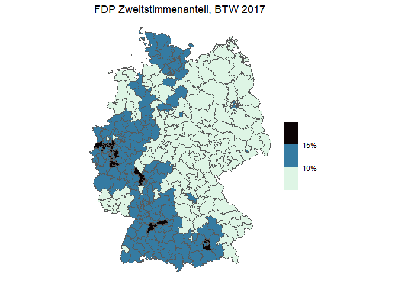
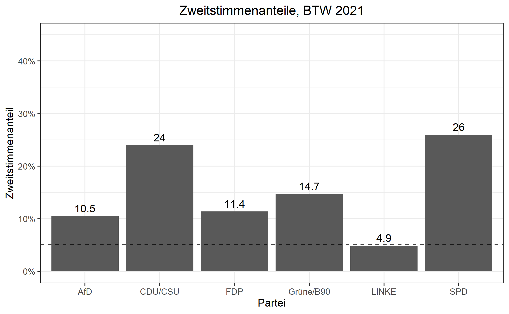
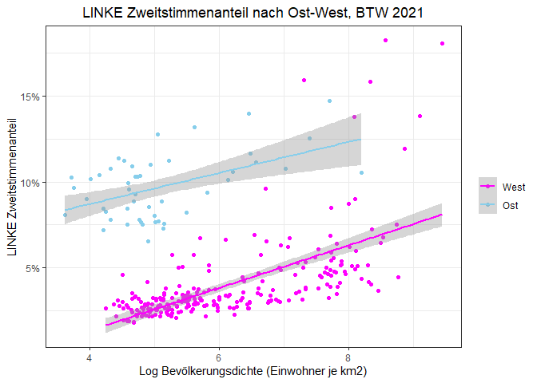
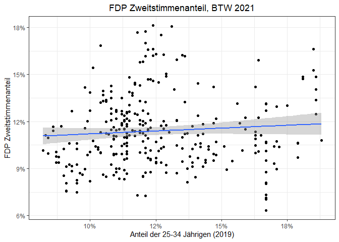
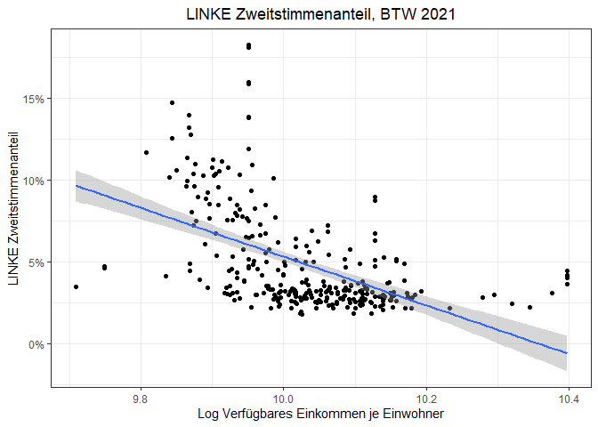

Bundestagswahl - 2021
================
21 February 2023

# Preliminaries

## Packages

``` r
library(readr)
library(readxl)
library(tidyverse)
library(stringr)
library(janitor)
library(tidyr)
library(modelsummary)
library(scales)
library(sf)
library(knitr)
library(kableExtra)
```

## Data

### Election Results

``` r
# election results 
## header
btw21_header <- read_delim("https://www.bundeswahlleiter.de/bundestagswahlen/2021/ergebnisse/opendata/csv/kerg.csv",
                           col_names = F, skip = 2, n_max = 3, delim = ";") 
# re-shaping header
btw21_header_proper <- btw21_header %>%
  rownames_to_column(var = "rowname") %>% # assign rownames to be used as identifiers
  pivot_longer(cols = !rowname, names_to = "super", values_to = "sub") %>% 
  fill(sub, .direction = "down") %>% # turn data into long format to re-shape multi-line headers into single line headers by assigning super-categories to all columns
  pivot_wider(id_cols = rowname, names_from = super, values_from = sub) %>% # turn data back into wide format tom match headers in results data frame
  sapply(., paste, collapse = "_") # combine column values from three rows into a single one, resulting in single-line header 
## import actual results 
btw21 <- read_delim("https://www.bundeswahlleiter.de/bundestagswahlen/2021/ergebnisse/opendata/csv/kerg.csv",
                  col_names = F,  skip = 5, delim = ";") %>% # do not use column names and skip first five rows, delimiter is semicolon 
  remove_empty(which = "rows") %>% # remove completely empty rows 
  clean_names() # use convenience function 
## assign header names 
names(btw21) <- btw21_header_proper[2:213] # I omit the first name since this is used the row identifier column.
## eliminate some final inconsistencies 
btw21 <- btw21 %>%
  clean_names() %>%
  rename("WKR_NR" = nr_ubrige_zweitstimmen,
         "Wahlkreis" = gebiet_ubrige_zweitstimmen,
         "Bundesland_Nr" = gehort_zu_ubrige_zweitstimmen) %>%
  mutate(WKR_NR = as.numeric(as.character(WKR_NR)))
# finally, get rid of Bundesland and overall summaries 
btw21 <- btw21 %>%
  filter(!(grepl("99", Bundesland_Nr) | grepl("Bundesgebiet", Wahlkreis)))
```

### Strukturdaten, Shapefile and Merging

``` r
# shapefile
btw_shapefile <- st_read("Data/btw21_geometrie_wahlkreise_geo_shp/Geometrie_Wahlkreise_20DBT_geo.shp")
```

    ## Reading layer `Geometrie_Wahlkreise_20DBT_geo' from data source 
    ##   `C:\Users\jacob\Documents\R_documents\Data\Bundestagswahl2021_anaylsis\bundestagswahl2021\Data\btw21_geometrie_wahlkreise_geo_shp\Geometrie_Wahlkreise_20DBT_geo.shp' 
    ##   using driver `ESRI Shapefile'
    ## Simple feature collection with 299 features and 4 fields
    ## Geometry type: MULTIPOLYGON
    ## Dimension:     XY
    ## Bounding box:  xmin: 5.86625 ymin: 47.27012 xmax: 15.03962 ymax: 55.05838
    ## Geodetic CRS:  WGS 84

``` r
# socio-economic characteristics of consttuencies 
strukturdaten21 <- read_csv2("Data/btw21_strukturdaten_wahlkreise.csv", skip = 8) %>%
  clean_names() %>%
  filter(!(grepl("Land insgesamt", wahlkreis_name) == TRUE)) %>%
  filter(!(grepl("Insgesamt", wahlkreis_name) == TRUE))
## merge data 
btw21 <- btw21 %>%
  left_join(btw_shapefile, by = "WKR_NR") %>%
  left_join(strukturdaten21, by = c("WKR_NR" = "wahlkreis_nr"))
## final data frame: 299-by-267 matrix, 267 = 5 (shapefile) - 1 (merging column) + 212 (btw21_results) + 52 (strukturdaten) - 1(merging column)
```

## Analysis

Let us start by creating some useful variables:

``` r
# variables 
btw21 <- btw21 %>%
  mutate(union_zweitstimmen_endgultig = ifelse(is.na(christlich_demokratische_union_deutschlands_zweitstimmen_endgultig), christlich_soziale_union_in_bayern_e_v_zweitstimmen_endgultig, christlich_demokratische_union_deutschlands_zweitstimmen_endgultig),
         CDU_CSU_Zweitstimmen_Share = union_zweitstimmen_endgultig/gultige_stimmen_zweitstimmen_endgultig,
         SPD_Zweitstimmen_Share = sozialdemokratische_partei_deutschlands_zweitstimmen_endgultig/gultige_stimmen_zweitstimmen_endgultig,
         FDP_Zweitstimmen_Share = freie_demokratische_partei_zweitstimmen_endgultig/gultige_stimmen_zweitstimmen_endgultig,
         AfD_Zweitstimmen_Share = alternative_fur_deutschland_zweitstimmen_endgultig/gultige_stimmen_zweitstimmen_endgultig,
         LINKE_Zweitstimmen_Share = die_linke_zweitstimmen_endgultig/gultige_stimmen_zweitstimmen_endgultig,
         Gruene_B90_Zweitstimmen_Share = bundnis_90_die_grunen_zweitstimmen_endgultig/gultige_stimmen_zweitstimmen_endgultig)
# final data set
## load 2017 election results 
load("Data/bundestagswahl2017_election_results.RData")
## create second data set consisting of merged results files 
btws17_21_merged <- btw21 %>%
  left_join(btw17_merged, by = "WKR_NR", 
            suffix = c("_btw21", "_btw21"))
```

Let us create an appropriate data set for plotting:

``` r
# general data set 
btws17_21_merged <- btws17_21_merged %>%
  mutate(CDU_CSU_delta_21_17 = CDU_CSU_Zweitstimmen_Share - union_zweitstimmen_share,
         SPD_delta_21_17 = SPD_Zweitstimmen_Share - spd_zweitstimmen_share,
         AfD_delta_21_17 = AfD_Zweitstimmen_Share - afd_zweitstimmen_share,
         Gruene_B90_delta_21_17 = Gruene_B90_Zweitstimmen_Share - green_zweitstimmen_share,
         FDP_delta_21_17 = FDP_Zweitstimmen_Share - fdp_zweitstimmen_share,
         LINKE_delta_21_17 = LINKE_Zweitstimmen_Share - linke_zweitstimmen_share)
# selection 
btws17_21_merged_plot <- btws17_21_merged %>%
  select(WKR_NR, WKR_Name, geometry_btw21, LAND_NAME_btw21,
         union_zweitstimmen_share, spd_zweitstimmen_share, 
         afd_zweitstimmen_share, fdp_zweitstimmen_share,
         green_zweitstimmen_share, linke_zweitstimmen_share, CDU_CSU_Zweitstimmen_Share, FDP_Zweitstimmen_Share,
         SPD_Zweitstimmen_Share, AfD_Zweitstimmen_Share, 
         Gruene_B90_Zweitstimmen_Share, LINKE_Zweitstimmen_Share, CDU_CSU_delta_21_17, SPD_delta_21_17, AfD_delta_21_17, Gruene_B90_delta_21_17, FDP_delta_21_17, LINKE_delta_21_17) 
save(btws17_21_merged_plot, file = "Data/bundestagswahlen_17_21_merged_plot_data.RData")
```

### Summary Statistics

``` r
btws17_21_merged_plot %>%
  select(-c(WKR_Name, WKR_NR, geometry_btw21, LAND_NAME_btw21), 
         "CDU/CSU Zweitstimmenanteil 2017" = union_zweitstimmen_share, 
         "SPD Zweitstimmenanteil 2017" = spd_zweitstimmen_share,
         "AfD Zweitstimmenanteil 2017" = afd_zweitstimmen_share,
         "FDP Zweitstimmenanteil 2017" = fdp_zweitstimmen_share,
         "Grüne B90 Zweitstimmenanteil 2017" = green_zweitstimmen_share, 
         "LINKE Zweitstimmenanteil 2017" = linke_zweitstimmen_share, 
         "CDU/CSU Zweitstimmenanteil 2021" = CDU_CSU_Zweitstimmen_Share, 
         "SPD Zweitstimmenanteil 2021" = SPD_Zweitstimmen_Share,
         "FDP Zweitstimmenanteil 2021" = FDP_Zweitstimmen_Share,
         "AfD Zweitstimmenanteil 2021" = AfD_Zweitstimmen_Share,
         "Grüne B90 Zweitstimmenanteil 2021" = Gruene_B90_Zweitstimmen_Share,
         "LINKE Zweitstimmenanteil 2021" = LINKE_Zweitstimmen_Share,
         "Veränderung des CDU/CSU Zweitstimmenanteils" = CDU_CSU_delta_21_17,
         "Veränderung des SPD Zweitstimmenanteils" = SPD_delta_21_17,
         "Veränderung des AfD Zweitstimmenanteils" = AfD_delta_21_17,
         "Veränderung des Grüne Zweitstimmenanteils" = Gruene_B90_delta_21_17,
         "Veränderung des FDP Zweitstimmenanteils" = FDP_delta_21_17,
         "Veränderung des LINKE Zweitstimmenanteils" = LINKE_delta_21_17) %>%
  mutate(across(.cols = everything(),
                .fns = ~ . * 100)) %>%
  datasummary_skim(fmt = "%.3f", 
                   output = "kableExtra", 
                   histogram = F) %>%
  landscape() %>%
  add_footnote(c("Die Veränderung der Zweitstimmenanteile beschreibt die Differenz der Zweitstimmenanteile der Bundestagswahl 2021 im Vergleich zu 2017."), 
               notation = "number")
```

<table class="table" style="width: auto !important; margin-left: auto; margin-right: auto;">
<thead>
<tr>
<th style="text-align:left;">
</th>
<th style="text-align:right;">
Unique (#)
</th>
<th style="text-align:right;">
Missing (%)
</th>
<th style="text-align:right;">
Mean
</th>
<th style="text-align:right;">
SD
</th>
<th style="text-align:right;">
Min
</th>
<th style="text-align:right;">
Median
</th>
<th style="text-align:right;">
Max
</th>
</tr>
</thead>
<tbody>
<tr>
<td style="text-align:left;">
CDU/CSU Zweitstimmenanteil 2017
</td>
<td style="text-align:right;">
299
</td>
<td style="text-align:right;">
0
</td>
<td style="text-align:right;">
32.880
</td>
<td style="text-align:right;">
5.961
</td>
<td style="text-align:right;">
13.908
</td>
<td style="text-align:right;">
32.788
</td>
<td style="text-align:right;">
53.103
</td>
</tr>
<tr>
<td style="text-align:left;">
SPD Zweitstimmenanteil 2017
</td>
<td style="text-align:right;">
299
</td>
<td style="text-align:right;">
0
</td>
<td style="text-align:right;">
20.653
</td>
<td style="text-align:right;">
6.240
</td>
<td style="text-align:right;">
7.799
</td>
<td style="text-align:right;">
20.655
</td>
<td style="text-align:right;">
37.820
</td>
</tr>
<tr>
<td style="text-align:left;">
AfD Zweitstimmenanteil 2017
</td>
<td style="text-align:right;">
299
</td>
<td style="text-align:right;">
0
</td>
<td style="text-align:right;">
12.759
</td>
<td style="text-align:right;">
5.462
</td>
<td style="text-align:right;">
4.940
</td>
<td style="text-align:right;">
11.454
</td>
<td style="text-align:right;">
35.465
</td>
</tr>
<tr>
<td style="text-align:left;">
FDP Zweitstimmenanteil 2017
</td>
<td style="text-align:right;">
299
</td>
<td style="text-align:right;">
0
</td>
<td style="text-align:right;">
10.659
</td>
<td style="text-align:right;">
2.693
</td>
<td style="text-align:right;">
5.264
</td>
<td style="text-align:right;">
10.414
</td>
<td style="text-align:right;">
19.743
</td>
</tr>
<tr>
<td style="text-align:left;">
Grüne B90 Zweitstimmenanteil 2017
</td>
<td style="text-align:right;">
299
</td>
<td style="text-align:right;">
0
</td>
<td style="text-align:right;">
8.777
</td>
<td style="text-align:right;">
3.948
</td>
<td style="text-align:right;">
2.233
</td>
<td style="text-align:right;">
8.078
</td>
<td style="text-align:right;">
21.167
</td>
</tr>
<tr>
<td style="text-align:left;">
LINKE Zweitstimmenanteil 2017
</td>
<td style="text-align:right;">
299
</td>
<td style="text-align:right;">
0
</td>
<td style="text-align:right;">
9.273
</td>
<td style="text-align:right;">
4.813
</td>
<td style="text-align:right;">
4.164
</td>
<td style="text-align:right;">
7.077
</td>
<td style="text-align:right;">
29.344
</td>
</tr>
<tr>
<td style="text-align:left;">
CDU/CSU Zweitstimmenanteil 2021
</td>
<td style="text-align:right;">
299
</td>
<td style="text-align:right;">
0
</td>
<td style="text-align:right;">
23.987
</td>
<td style="text-align:right;">
5.966
</td>
<td style="text-align:right;">
6.980
</td>
<td style="text-align:right;">
23.628
</td>
<td style="text-align:right;">
38.467
</td>
</tr>
<tr>
<td style="text-align:left;">
FDP Zweitstimmenanteil 2021
</td>
<td style="text-align:right;">
299
</td>
<td style="text-align:right;">
0
</td>
<td style="text-align:right;">
11.388
</td>
<td style="text-align:right;">
2.283
</td>
<td style="text-align:right;">
6.340
</td>
<td style="text-align:right;">
11.117
</td>
<td style="text-align:right;">
18.109
</td>
</tr>
<tr>
<td style="text-align:left;">
SPD Zweitstimmenanteil 2021
</td>
<td style="text-align:right;">
299
</td>
<td style="text-align:right;">
0
</td>
<td style="text-align:right;">
25.987
</td>
<td style="text-align:right;">
6.007
</td>
<td style="text-align:right;">
13.502
</td>
<td style="text-align:right;">
26.230
</td>
<td style="text-align:right;">
43.348
</td>
</tr>
<tr>
<td style="text-align:left;">
AfD Zweitstimmenanteil 2021
</td>
<td style="text-align:right;">
299
</td>
<td style="text-align:right;">
0
</td>
<td style="text-align:right;">
10.530
</td>
<td style="text-align:right;">
5.881
</td>
<td style="text-align:right;">
2.867
</td>
<td style="text-align:right;">
8.855
</td>
<td style="text-align:right;">
32.533
</td>
</tr>
<tr>
<td style="text-align:left;">
Grüne B90 Zweitstimmenanteil 2021
</td>
<td style="text-align:right;">
296
</td>
<td style="text-align:right;">
1
</td>
<td style="text-align:right;">
14.664
</td>
<td style="text-align:right;">
6.267
</td>
<td style="text-align:right;">
3.254
</td>
<td style="text-align:right;">
13.941
</td>
<td style="text-align:right;">
36.750
</td>
</tr>
<tr>
<td style="text-align:left;">
LINKE Zweitstimmenanteil 2021
</td>
<td style="text-align:right;">
299
</td>
<td style="text-align:right;">
0
</td>
<td style="text-align:right;">
4.912
</td>
<td style="text-align:right;">
3.145
</td>
<td style="text-align:right;">
1.817
</td>
<td style="text-align:right;">
3.430
</td>
<td style="text-align:right;">
18.243
</td>
</tr>
<tr>
<td style="text-align:left;">
Veränderung des CDU/CSU Zweitstimmenanteils
</td>
<td style="text-align:right;">
299
</td>
<td style="text-align:right;">
0
</td>
<td style="text-align:right;">
-8.893
</td>
<td style="text-align:right;">
2.639
</td>
<td style="text-align:right;">
-17.058
</td>
<td style="text-align:right;">
-8.629
</td>
<td style="text-align:right;">
-1.175
</td>
</tr>
<tr>
<td style="text-align:left;">
Veränderung des SPD Zweitstimmenanteils
</td>
<td style="text-align:right;">
299
</td>
<td style="text-align:right;">
0
</td>
<td style="text-align:right;">
5.335
</td>
<td style="text-align:right;">
3.009
</td>
<td style="text-align:right;">
-3.692
</td>
<td style="text-align:right;">
4.767
</td>
<td style="text-align:right;">
15.407
</td>
</tr>
<tr>
<td style="text-align:left;">
Veränderung des AfD Zweitstimmenanteils
</td>
<td style="text-align:right;">
299
</td>
<td style="text-align:right;">
0
</td>
<td style="text-align:right;">
-2.229
</td>
<td style="text-align:right;">
1.455
</td>
<td style="text-align:right;">
-5.258
</td>
<td style="text-align:right;">
-2.282
</td>
<td style="text-align:right;">
3.336
</td>
</tr>
<tr>
<td style="text-align:left;">
Veränderung des Grüne Zweitstimmenanteils
</td>
<td style="text-align:right;">
296
</td>
<td style="text-align:right;">
1
</td>
<td style="text-align:right;">
5.850
</td>
<td style="text-align:right;">
3.241
</td>
<td style="text-align:right;">
-0.116
</td>
<td style="text-align:right;">
5.608
</td>
<td style="text-align:right;">
16.386
</td>
</tr>
<tr>
<td style="text-align:left;">
Veränderung des FDP Zweitstimmenanteils
</td>
<td style="text-align:right;">
299
</td>
<td style="text-align:right;">
0
</td>
<td style="text-align:right;">
0.729
</td>
<td style="text-align:right;">
1.719
</td>
<td style="text-align:right;">
-4.176
</td>
<td style="text-align:right;">
0.838
</td>
<td style="text-align:right;">
4.562
</td>
</tr>
<tr>
<td style="text-align:left;">
Veränderung des LINKE Zweitstimmenanteils
</td>
<td style="text-align:right;">
299
</td>
<td style="text-align:right;">
0
</td>
<td style="text-align:right;">
-4.361
</td>
<td style="text-align:right;">
1.808
</td>
<td style="text-align:right;">
-11.100
</td>
<td style="text-align:right;">
-3.745
</td>
<td style="text-align:right;">
-1.737
</td>
</tr>
</tbody>
<tfoot>
<tr>
<td style="padding: 0; border:0;" colspan="100%">
<sup>1</sup> Die Veränderung der Zweitstimmenanteile beschreibt die
Differenz der Zweitstimmenanteile der Bundestagswahl 2021 im Vergleich
zu 2017.
</td>
</tr>
</tfoot>
</table>

Let us produce some plots of the *Zweitstimmenanteile* in 2017:

``` r
# loop
btw17_zweitstimmen_plot <- function(x){
  nm <- names(x)[5:10] 
  for(i in seq_along(nm)){
    plots <- ggplot(x, aes(geometry = geometry_btw21)) +
    geom_sf(aes_string(fill = nm[i])) +
    scale_fill_viridis_b(name = " ", 
                       labels = label_percent(scale = 100, accuracy = 1),
                       direction = -1,
                       option = "mako") +
    labs(title = paste(str_to_upper(str_replace_all(str_remove(nm[i], "_zweitstimmen_share"), "_", "/")), "Zweitstimmenanteil, BTW 2017")) + 
    theme_void() +
    theme(plot.title = element_text(hjust = 0.5))
    print(plots)
    ggsave(filename = paste("Figures/btw_17", nm[i], "plots.png", sep = "_"))
  }
}
# applying loop
btw17_zweitstimmen_plot(btws17_21_merged_plot)
```



Here is an overview of the results in 2017:


Then, we examine the *Zweitstimmenanteil* in 2021:

``` r
# loop
btw21_zweitstimmen_plot <- function(x){
  nm <- names(x)[11:16] # use columns with zweitstimmen_share
  for(i in seq_along(nm)){
    plots <- ggplot(x, aes(geometry = geometry_btw21)) +
    geom_sf(aes_string(fill = nm[i])) +
    scale_fill_viridis_b(name = " ", 
                       labels = label_percent(scale = 100, accuracy = 1),
                       direction = -1,
                       option = "mako") +
    labs(title = paste(str_replace_all(str_remove(nm[i], "_Zweitstimmen_Share"), "_", "/"), "Zweitstimmenanteil, BTW 2021")) + 
    theme_void() +
    theme(plot.title = element_text(hjust = 0.5))
    print(plots)
    ggsave(filename = paste("Figures/btw_21", nm[i], "plots.png", sep = "_"))
  }
}
# applying loop
btw21_zweitstimmen_plot(btws17_21_merged_plot)
```


Before digging deeper into the results at the constituency-level, here
is a plot of the overall results in 2021:



Let us create a table containing all Wahlkreise:

``` r
btws17_21_merged %>%
  select(Wahlkreis, CDU_CSU_Zweitstimmen_Share, 
         SPD_Zweitstimmen_Share, Gruene_B90_Zweitstimmen_Share,
         FDP_Zweitstimmen_Share, AfD_Zweitstimmen_Share, LINKE_Zweitstimmen_Share) %>%
  mutate(across(.cols = grep("Share", names(.)),
                .fns = ~ . * 100)) %>%
  kable(col.names = c("Wahlkreis", "CDU/CSU", "SPD",
                      "Grüne/B90", "FDP", "AfD", "LINKE"),
    booktabs = T, digits = 3) %>%
  add_header_above(c(" " = 1, "Zweitstimmenanteile" = 6)) %>%
  kable_styling(full_width = F) %>%
  landscape() 
```

<table class="table" style="width: auto !important; margin-left: auto; margin-right: auto;">
<thead>
<tr>
<th style="empty-cells: hide;border-bottom:hidden;" colspan="1">
</th>
<th style="border-bottom:hidden;padding-bottom:0; padding-left:3px;padding-right:3px;text-align: center; " colspan="6">

<div style="border-bottom: 1px solid #ddd; padding-bottom: 5px; ">

Zweitstimmenanteile

</div>

</th>
</tr>
<tr>
<th style="text-align:left;">
Wahlkreis
</th>
<th style="text-align:right;">
CDU/CSU
</th>
<th style="text-align:right;">
SPD
</th>
<th style="text-align:right;">
Grüne/B90
</th>
<th style="text-align:right;">
FDP
</th>
<th style="text-align:right;">
AfD
</th>
<th style="text-align:right;">
LINKE
</th>
</tr>
</thead>
<tbody>
<tr>
<td style="text-align:left;">
Flensburg – Schleswig
</td>
<td style="text-align:right;">
20.390
</td>
<td style="text-align:right;">
25.477
</td>
<td style="text-align:right;">
18.642
</td>
<td style="text-align:right;">
10.743
</td>
<td style="text-align:right;">
5.776
</td>
<td style="text-align:right;">
4.185
</td>
</tr>
<tr>
<td style="text-align:left;">
Nordfriesland – Dithmarschen Nord
</td>
<td style="text-align:right;">
24.636
</td>
<td style="text-align:right;">
26.311
</td>
<td style="text-align:right;">
15.670
</td>
<td style="text-align:right;">
12.730
</td>
<td style="text-align:right;">
6.104
</td>
<td style="text-align:right;">
3.078
</td>
</tr>
<tr>
<td style="text-align:left;">
Steinburg – Dithmarschen Süd
</td>
<td style="text-align:right;">
24.308
</td>
<td style="text-align:right;">
27.732
</td>
<td style="text-align:right;">
14.238
</td>
<td style="text-align:right;">
13.687
</td>
<td style="text-align:right;">
8.366
</td>
<td style="text-align:right;">
3.348
</td>
</tr>
<tr>
<td style="text-align:left;">
Rendsburg-Eckernförde
</td>
<td style="text-align:right;">
23.930
</td>
<td style="text-align:right;">
26.807
</td>
<td style="text-align:right;">
17.911
</td>
<td style="text-align:right;">
12.005
</td>
<td style="text-align:right;">
6.563
</td>
<td style="text-align:right;">
3.208
</td>
</tr>
<tr>
<td style="text-align:left;">
Kiel
</td>
<td style="text-align:right;">
15.425
</td>
<td style="text-align:right;">
26.013
</td>
<td style="text-align:right;">
28.432
</td>
<td style="text-align:right;">
10.389
</td>
<td style="text-align:right;">
4.936
</td>
<td style="text-align:right;">
6.081
</td>
</tr>
<tr>
<td style="text-align:left;">
Plön – Neumünster
</td>
<td style="text-align:right;">
22.856
</td>
<td style="text-align:right;">
29.179
</td>
<td style="text-align:right;">
17.393
</td>
<td style="text-align:right;">
11.998
</td>
<td style="text-align:right;">
7.350
</td>
<td style="text-align:right;">
3.193
</td>
</tr>
<tr>
<td style="text-align:left;">
Pinneberg
</td>
<td style="text-align:right;">
22.104
</td>
<td style="text-align:right;">
29.271
</td>
<td style="text-align:right;">
18.022
</td>
<td style="text-align:right;">
13.488
</td>
<td style="text-align:right;">
6.874
</td>
<td style="text-align:right;">
3.344
</td>
</tr>
<tr>
<td style="text-align:left;">
Segeberg – Stormarn-Mitte
</td>
<td style="text-align:right;">
22.336
</td>
<td style="text-align:right;">
28.577
</td>
<td style="text-align:right;">
16.826
</td>
<td style="text-align:right;">
13.959
</td>
<td style="text-align:right;">
7.327
</td>
<td style="text-align:right;">
3.262
</td>
</tr>
<tr>
<td style="text-align:left;">
Ostholstein – Stormarn-Nord
</td>
<td style="text-align:right;">
25.051
</td>
<td style="text-align:right;">
29.951
</td>
<td style="text-align:right;">
15.718
</td>
<td style="text-align:right;">
12.669
</td>
<td style="text-align:right;">
7.095
</td>
<td style="text-align:right;">
2.843
</td>
</tr>
<tr>
<td style="text-align:left;">
Herzogtum Lauenburg – Stormarn-Süd
</td>
<td style="text-align:right;">
23.194
</td>
<td style="text-align:right;">
28.848
</td>
<td style="text-align:right;">
16.604
</td>
<td style="text-align:right;">
14.175
</td>
<td style="text-align:right;">
7.507
</td>
<td style="text-align:right;">
3.234
</td>
</tr>
<tr>
<td style="text-align:left;">
Lübeck
</td>
<td style="text-align:right;">
18.142
</td>
<td style="text-align:right;">
30.486
</td>
<td style="text-align:right;">
22.443
</td>
<td style="text-align:right;">
10.462
</td>
<td style="text-align:right;">
6.778
</td>
<td style="text-align:right;">
4.442
</td>
</tr>
<tr>
<td style="text-align:left;">
Schwerin – Ludwigslust-Parchim I – Nordwestmecklenburg I
</td>
<td style="text-align:right;">
17.114
</td>
<td style="text-align:right;">
31.960
</td>
<td style="text-align:right;">
8.056
</td>
<td style="text-align:right;">
8.590
</td>
<td style="text-align:right;">
15.688
</td>
<td style="text-align:right;">
10.770
</td>
</tr>
<tr>
<td style="text-align:left;">
Ludwigslust-Parchim II – Nordwestmecklenburg II – Landkreis Rostock I
</td>
<td style="text-align:right;">
17.086
</td>
<td style="text-align:right;">
32.508
</td>
<td style="text-align:right;">
7.041
</td>
<td style="text-align:right;">
8.076
</td>
<td style="text-align:right;">
17.122
</td>
<td style="text-align:right;">
10.395
</td>
</tr>
<tr>
<td style="text-align:left;">
Rostock – Landkreis Rostock II
</td>
<td style="text-align:right;">
14.176
</td>
<td style="text-align:right;">
29.010
</td>
<td style="text-align:right;">
12.849
</td>
<td style="text-align:right;">
9.113
</td>
<td style="text-align:right;">
12.675
</td>
<td style="text-align:right;">
13.187
</td>
</tr>
<tr>
<td style="text-align:left;">
Vorpommern-Rügen – Vorpommern-Greifswald I
</td>
<td style="text-align:right;">
18.645
</td>
<td style="text-align:right;">
25.083
</td>
<td style="text-align:right;">
8.839
</td>
<td style="text-align:right;">
8.310
</td>
<td style="text-align:right;">
18.882
</td>
<td style="text-align:right;">
11.375
</td>
</tr>
<tr>
<td style="text-align:left;">
Mecklenburgische Seenplatte I – Vorpommern-Greifswald II
</td>
<td style="text-align:right;">
18.991
</td>
<td style="text-align:right;">
26.708
</td>
<td style="text-align:right;">
4.380
</td>
<td style="text-align:right;">
7.573
</td>
<td style="text-align:right;">
23.241
</td>
<td style="text-align:right;">
10.176
</td>
</tr>
<tr>
<td style="text-align:left;">
Mecklenburgische Seenplatte II – Landkreis Rostock III
</td>
<td style="text-align:right;">
18.752
</td>
<td style="text-align:right;">
29.865
</td>
<td style="text-align:right;">
5.099
</td>
<td style="text-align:right;">
7.535
</td>
<td style="text-align:right;">
20.896
</td>
<td style="text-align:right;">
10.252
</td>
</tr>
<tr>
<td style="text-align:left;">
Hamburg-Mitte
</td>
<td style="text-align:right;">
11.191
</td>
<td style="text-align:right;">
28.658
</td>
<td style="text-align:right;">
27.886
</td>
<td style="text-align:right;">
10.486
</td>
<td style="text-align:right;">
5.096
</td>
<td style="text-align:right;">
8.733
</td>
</tr>
<tr>
<td style="text-align:left;">
Hamburg-Altona
</td>
<td style="text-align:right;">
14.779
</td>
<td style="text-align:right;">
25.553
</td>
<td style="text-align:right;">
30.351
</td>
<td style="text-align:right;">
10.877
</td>
<td style="text-align:right;">
3.311
</td>
<td style="text-align:right;">
8.986
</td>
</tr>
<tr>
<td style="text-align:left;">
Hamburg-Eimsbüttel
</td>
<td style="text-align:right;">
14.868
</td>
<td style="text-align:right;">
28.005
</td>
<td style="text-align:right;">
29.921
</td>
<td style="text-align:right;">
11.343
</td>
<td style="text-align:right;">
3.531
</td>
<td style="text-align:right;">
6.764
</td>
</tr>
<tr>
<td style="text-align:left;">
Hamburg-Nord
</td>
<td style="text-align:right;">
18.619
</td>
<td style="text-align:right;">
27.925
</td>
<td style="text-align:right;">
25.194
</td>
<td style="text-align:right;">
14.211
</td>
<td style="text-align:right;">
3.688
</td>
<td style="text-align:right;">
4.733
</td>
</tr>
<tr>
<td style="text-align:left;">
Hamburg-Wandsbek
</td>
<td style="text-align:right;">
16.840
</td>
<td style="text-align:right;">
34.312
</td>
<td style="text-align:right;">
18.594
</td>
<td style="text-align:right;">
11.124
</td>
<td style="text-align:right;">
6.533
</td>
<td style="text-align:right;">
5.122
</td>
</tr>
<tr>
<td style="text-align:left;">
Hamburg-Bergedorf – Harburg
</td>
<td style="text-align:right;">
16.194
</td>
<td style="text-align:right;">
33.451
</td>
<td style="text-align:right;">
17.789
</td>
<td style="text-align:right;">
9.982
</td>
<td style="text-align:right;">
8.049
</td>
<td style="text-align:right;">
6.291
</td>
</tr>
<tr>
<td style="text-align:left;">
Aurich – Emden
</td>
<td style="text-align:right;">
17.670
</td>
<td style="text-align:right;">
43.348
</td>
<td style="text-align:right;">
12.973
</td>
<td style="text-align:right;">
8.894
</td>
<td style="text-align:right;">
8.204
</td>
<td style="text-align:right;">
3.430
</td>
</tr>
<tr>
<td style="text-align:left;">
Unterems
</td>
<td style="text-align:right;">
29.876
</td>
<td style="text-align:right;">
33.986
</td>
<td style="text-align:right;">
10.659
</td>
<td style="text-align:right;">
10.140
</td>
<td style="text-align:right;">
8.176
</td>
<td style="text-align:right;">
2.668
</td>
</tr>
<tr>
<td style="text-align:left;">
Friesland – Wilhelmshaven – Wittmund
</td>
<td style="text-align:right;">
21.466
</td>
<td style="text-align:right;">
37.951
</td>
<td style="text-align:right;">
12.804
</td>
<td style="text-align:right;">
10.437
</td>
<td style="text-align:right;">
8.238
</td>
<td style="text-align:right;">
3.101
</td>
</tr>
<tr>
<td style="text-align:left;">
Oldenburg – Ammerland
</td>
<td style="text-align:right;">
18.603
</td>
<td style="text-align:right;">
32.009
</td>
<td style="text-align:right;">
23.714
</td>
<td style="text-align:right;">
10.243
</td>
<td style="text-align:right;">
5.160
</td>
<td style="text-align:right;">
4.836
</td>
</tr>
<tr>
<td style="text-align:left;">
Delmenhorst – Wesermarsch – Oldenburg-Land
</td>
<td style="text-align:right;">
22.601
</td>
<td style="text-align:right;">
34.300
</td>
<td style="text-align:right;">
14.784
</td>
<td style="text-align:right;">
11.452
</td>
<td style="text-align:right;">
8.009
</td>
<td style="text-align:right;">
3.112
</td>
</tr>
<tr>
<td style="text-align:left;">
Cuxhaven – Stade II
</td>
<td style="text-align:right;">
26.186
</td>
<td style="text-align:right;">
34.970
</td>
<td style="text-align:right;">
12.563
</td>
<td style="text-align:right;">
10.058
</td>
<td style="text-align:right;">
7.873
</td>
<td style="text-align:right;">
2.628
</td>
</tr>
<tr>
<td style="text-align:left;">
Stade I – Rotenburg II
</td>
<td style="text-align:right;">
26.490
</td>
<td style="text-align:right;">
32.012
</td>
<td style="text-align:right;">
14.641
</td>
<td style="text-align:right;">
11.081
</td>
<td style="text-align:right;">
7.292
</td>
<td style="text-align:right;">
2.850
</td>
</tr>
<tr>
<td style="text-align:left;">
Mittelems
</td>
<td style="text-align:right;">
33.846
</td>
<td style="text-align:right;">
30.908
</td>
<td style="text-align:right;">
12.547
</td>
<td style="text-align:right;">
11.759
</td>
<td style="text-align:right;">
5.147
</td>
<td style="text-align:right;">
2.212
</td>
</tr>
<tr>
<td style="text-align:left;">
Cloppenburg – Vechta
</td>
<td style="text-align:right;">
38.467
</td>
<td style="text-align:right;">
24.617
</td>
<td style="text-align:right;">
11.076
</td>
<td style="text-align:right;">
12.089
</td>
<td style="text-align:right;">
7.819
</td>
<td style="text-align:right;">
2.173
</td>
</tr>
<tr>
<td style="text-align:left;">
Diepholz – Nienburg I
</td>
<td style="text-align:right;">
25.289
</td>
<td style="text-align:right;">
33.017
</td>
<td style="text-align:right;">
14.482
</td>
<td style="text-align:right;">
12.076
</td>
<td style="text-align:right;">
7.105
</td>
<td style="text-align:right;">
2.685
</td>
</tr>
<tr>
<td style="text-align:left;">
Osterholz – Verden
</td>
<td style="text-align:right;">
24.087
</td>
<td style="text-align:right;">
32.905
</td>
<td style="text-align:right;">
16.098
</td>
<td style="text-align:right;">
10.420
</td>
<td style="text-align:right;">
7.542
</td>
<td style="text-align:right;">
3.497
</td>
</tr>
<tr>
<td style="text-align:left;">
Rotenburg I – Heidekreis
</td>
<td style="text-align:right;">
25.055
</td>
<td style="text-align:right;">
34.778
</td>
<td style="text-align:right;">
13.572
</td>
<td style="text-align:right;">
10.085
</td>
<td style="text-align:right;">
8.007
</td>
<td style="text-align:right;">
2.847
</td>
</tr>
<tr>
<td style="text-align:left;">
Harburg
</td>
<td style="text-align:right;">
24.791
</td>
<td style="text-align:right;">
29.093
</td>
<td style="text-align:right;">
16.658
</td>
<td style="text-align:right;">
12.707
</td>
<td style="text-align:right;">
7.261
</td>
<td style="text-align:right;">
2.913
</td>
</tr>
<tr>
<td style="text-align:left;">
Lüchow-Dannenberg – Lüneburg
</td>
<td style="text-align:right;">
21.022
</td>
<td style="text-align:right;">
29.877
</td>
<td style="text-align:right;">
22.146
</td>
<td style="text-align:right;">
9.588
</td>
<td style="text-align:right;">
6.622
</td>
<td style="text-align:right;">
4.582
</td>
</tr>
<tr>
<td style="text-align:left;">
Osnabrück-Land
</td>
<td style="text-align:right;">
28.489
</td>
<td style="text-align:right;">
32.137
</td>
<td style="text-align:right;">
14.728
</td>
<td style="text-align:right;">
11.068
</td>
<td style="text-align:right;">
6.692
</td>
<td style="text-align:right;">
2.572
</td>
</tr>
<tr>
<td style="text-align:left;">
Stadt Osnabrück
</td>
<td style="text-align:right;">
23.205
</td>
<td style="text-align:right;">
30.246
</td>
<td style="text-align:right;">
23.262
</td>
<td style="text-align:right;">
9.849
</td>
<td style="text-align:right;">
4.648
</td>
<td style="text-align:right;">
4.191
</td>
</tr>
<tr>
<td style="text-align:left;">
Nienburg II – Schaumburg
</td>
<td style="text-align:right;">
23.956
</td>
<td style="text-align:right;">
34.948
</td>
<td style="text-align:right;">
14.083
</td>
<td style="text-align:right;">
10.024
</td>
<td style="text-align:right;">
8.769
</td>
<td style="text-align:right;">
2.710
</td>
</tr>
<tr>
<td style="text-align:left;">
Stadt Hannover I
</td>
<td style="text-align:right;">
18.348
</td>
<td style="text-align:right;">
30.968
</td>
<td style="text-align:right;">
23.796
</td>
<td style="text-align:right;">
10.410
</td>
<td style="text-align:right;">
6.017
</td>
<td style="text-align:right;">
4.521
</td>
</tr>
<tr>
<td style="text-align:left;">
Stadt Hannover II
</td>
<td style="text-align:right;">
15.821
</td>
<td style="text-align:right;">
28.161
</td>
<td style="text-align:right;">
29.467
</td>
<td style="text-align:right;">
9.328
</td>
<td style="text-align:right;">
4.741
</td>
<td style="text-align:right;">
6.199
</td>
</tr>
<tr>
<td style="text-align:left;">
Hannover-Land I
</td>
<td style="text-align:right;">
25.784
</td>
<td style="text-align:right;">
32.115
</td>
<td style="text-align:right;">
15.182
</td>
<td style="text-align:right;">
11.320
</td>
<td style="text-align:right;">
7.698
</td>
<td style="text-align:right;">
2.608
</td>
</tr>
<tr>
<td style="text-align:left;">
Celle – Uelzen
</td>
<td style="text-align:right;">
26.138
</td>
<td style="text-align:right;">
30.818
</td>
<td style="text-align:right;">
13.953
</td>
<td style="text-align:right;">
11.471
</td>
<td style="text-align:right;">
9.197
</td>
<td style="text-align:right;">
2.984
</td>
</tr>
<tr>
<td style="text-align:left;">
Gifhorn – Peine
</td>
<td style="text-align:right;">
22.956
</td>
<td style="text-align:right;">
35.701
</td>
<td style="text-align:right;">
13.323
</td>
<td style="text-align:right;">
9.851
</td>
<td style="text-align:right;">
9.736
</td>
<td style="text-align:right;">
2.516
</td>
</tr>
<tr>
<td style="text-align:left;">
Hameln-Pyrmont – Holzminden
</td>
<td style="text-align:right;">
22.650
</td>
<td style="text-align:right;">
36.804
</td>
<td style="text-align:right;">
13.125
</td>
<td style="text-align:right;">
10.352
</td>
<td style="text-align:right;">
8.806
</td>
<td style="text-align:right;">
2.837
</td>
</tr>
<tr>
<td style="text-align:left;">
Hannover-Land II
</td>
<td style="text-align:right;">
22.677
</td>
<td style="text-align:right;">
34.632
</td>
<td style="text-align:right;">
16.305
</td>
<td style="text-align:right;">
10.229
</td>
<td style="text-align:right;">
7.733
</td>
<td style="text-align:right;">
2.789
</td>
</tr>
<tr>
<td style="text-align:left;">
Hildesheim
</td>
<td style="text-align:right;">
22.847
</td>
<td style="text-align:right;">
34.698
</td>
<td style="text-align:right;">
16.626
</td>
<td style="text-align:right;">
9.636
</td>
<td style="text-align:right;">
7.611
</td>
<td style="text-align:right;">
3.322
</td>
</tr>
<tr>
<td style="text-align:left;">
Salzgitter – Wolfenbüttel
</td>
<td style="text-align:right;">
22.957
</td>
<td style="text-align:right;">
36.653
</td>
<td style="text-align:right;">
12.424
</td>
<td style="text-align:right;">
9.239
</td>
<td style="text-align:right;">
9.892
</td>
<td style="text-align:right;">
3.073
</td>
</tr>
<tr>
<td style="text-align:left;">
Braunschweig
</td>
<td style="text-align:right;">
18.615
</td>
<td style="text-align:right;">
30.423
</td>
<td style="text-align:right;">
23.979
</td>
<td style="text-align:right;">
10.084
</td>
<td style="text-align:right;">
5.914
</td>
<td style="text-align:right;">
4.562
</td>
</tr>
<tr>
<td style="text-align:left;">
Helmstedt – Wolfsburg
</td>
<td style="text-align:right;">
24.633
</td>
<td style="text-align:right;">
35.149
</td>
<td style="text-align:right;">
11.982
</td>
<td style="text-align:right;">
10.118
</td>
<td style="text-align:right;">
9.474
</td>
<td style="text-align:right;">
2.706
</td>
</tr>
<tr>
<td style="text-align:left;">
Goslar – Northeim – Osterode
</td>
<td style="text-align:right;">
23.619
</td>
<td style="text-align:right;">
37.857
</td>
<td style="text-align:right;">
12.028
</td>
<td style="text-align:right;">
10.005
</td>
<td style="text-align:right;">
8.305
</td>
<td style="text-align:right;">
2.987
</td>
</tr>
<tr>
<td style="text-align:left;">
Göttingen
</td>
<td style="text-align:right;">
21.576
</td>
<td style="text-align:right;">
31.927
</td>
<td style="text-align:right;">
20.241
</td>
<td style="text-align:right;">
9.755
</td>
<td style="text-align:right;">
6.104
</td>
<td style="text-align:right;">
5.073
</td>
</tr>
<tr>
<td style="text-align:left;">
Bremen I
</td>
<td style="text-align:right;">
17.478
</td>
<td style="text-align:right;">
28.841
</td>
<td style="text-align:right;">
23.977
</td>
<td style="text-align:right;">
9.931
</td>
<td style="text-align:right;">
5.309
</td>
<td style="text-align:right;">
8.497
</td>
</tr>
<tr>
<td style="text-align:left;">
Bremen II – Bremerhaven
</td>
<td style="text-align:right;">
16.893
</td>
<td style="text-align:right;">
34.873
</td>
<td style="text-align:right;">
16.815
</td>
<td style="text-align:right;">
8.463
</td>
<td style="text-align:right;">
8.921
</td>
<td style="text-align:right;">
6.732
</td>
</tr>
<tr>
<td style="text-align:left;">
Prignitz – Ostprignitz-Ruppin – Havelland I
</td>
<td style="text-align:right;">
16.044
</td>
<td style="text-align:right;">
34.017
</td>
<td style="text-align:right;">
6.344
</td>
<td style="text-align:right;">
7.495
</td>
<td style="text-align:right;">
19.190
</td>
<td style="text-align:right;">
8.061
</td>
</tr>
<tr>
<td style="text-align:left;">
Uckermark – Barnim I
</td>
<td style="text-align:right;">
15.334
</td>
<td style="text-align:right;">
31.369
</td>
<td style="text-align:right;">
7.037
</td>
<td style="text-align:right;">
8.064
</td>
<td style="text-align:right;">
19.922
</td>
<td style="text-align:right;">
8.988
</td>
</tr>
<tr>
<td style="text-align:left;">
Oberhavel – Havelland II
</td>
<td style="text-align:right;">
17.286
</td>
<td style="text-align:right;">
28.584
</td>
<td style="text-align:right;">
10.701
</td>
<td style="text-align:right;">
10.255
</td>
<td style="text-align:right;">
15.948
</td>
<td style="text-align:right;">
6.559
</td>
</tr>
<tr>
<td style="text-align:left;">
Märkisch-Oderland – Barnim II
</td>
<td style="text-align:right;">
15.045
</td>
<td style="text-align:right;">
27.916
</td>
<td style="text-align:right;">
7.997
</td>
<td style="text-align:right;">
8.561
</td>
<td style="text-align:right;">
18.235
</td>
<td style="text-align:right;">
10.318
</td>
</tr>
<tr>
<td style="text-align:left;">
Brandenburg an der Havel – Potsdam-Mittelmark I – Havelland III –
Teltow-Fläming I
</td>
<td style="text-align:right;">
15.300
</td>
<td style="text-align:right;">
33.262
</td>
<td style="text-align:right;">
8.388
</td>
<td style="text-align:right;">
8.198
</td>
<td style="text-align:right;">
16.379
</td>
<td style="text-align:right;">
8.256
</td>
</tr>
<tr>
<td style="text-align:left;">
Potsdam – Potsdam-Mittelmark II – Teltow-Fläming II
</td>
<td style="text-align:right;">
13.917
</td>
<td style="text-align:right;">
26.982
</td>
<td style="text-align:right;">
18.988
</td>
<td style="text-align:right;">
10.700
</td>
<td style="text-align:right;">
9.878
</td>
<td style="text-align:right;">
10.117
</td>
</tr>
<tr>
<td style="text-align:left;">
Dahme-Spreewald – Teltow-Fläming III – Oberspreewald-Lausitz I
</td>
<td style="text-align:right;">
16.325
</td>
<td style="text-align:right;">
28.504
</td>
<td style="text-align:right;">
8.426
</td>
<td style="text-align:right;">
9.854
</td>
<td style="text-align:right;">
17.948
</td>
<td style="text-align:right;">
7.800
</td>
</tr>
<tr>
<td style="text-align:left;">
Frankfurt (Oder) – Oder-Spree
</td>
<td style="text-align:right;">
14.148
</td>
<td style="text-align:right;">
29.457
</td>
<td style="text-align:right;">
7.107
</td>
<td style="text-align:right;">
8.848
</td>
<td style="text-align:right;">
20.156
</td>
<td style="text-align:right;">
9.557
</td>
</tr>
<tr>
<td style="text-align:left;">
Cottbus – Spree-Neiße
</td>
<td style="text-align:right;">
13.830
</td>
<td style="text-align:right;">
28.524
</td>
<td style="text-align:right;">
5.483
</td>
<td style="text-align:right;">
10.749
</td>
<td style="text-align:right;">
24.281
</td>
<td style="text-align:right;">
7.641
</td>
</tr>
<tr>
<td style="text-align:left;">
Elbe-Elster – Oberspreewald-Lausitz II
</td>
<td style="text-align:right;">
15.005
</td>
<td style="text-align:right;">
28.204
</td>
<td style="text-align:right;">
4.153
</td>
<td style="text-align:right;">
9.382
</td>
<td style="text-align:right;">
25.197
</td>
<td style="text-align:right;">
7.202
</td>
</tr>
<tr>
<td style="text-align:left;">
Altmark
</td>
<td style="text-align:right;">
20.945
</td>
<td style="text-align:right;">
27.414
</td>
<td style="text-align:right;">
5.415
</td>
<td style="text-align:right;">
8.721
</td>
<td style="text-align:right;">
19.146
</td>
<td style="text-align:right;">
9.635
</td>
</tr>
<tr>
<td style="text-align:left;">
Börde – Jerichower Land
</td>
<td style="text-align:right;">
22.264
</td>
<td style="text-align:right;">
26.567
</td>
<td style="text-align:right;">
4.945
</td>
<td style="text-align:right;">
9.247
</td>
<td style="text-align:right;">
20.144
</td>
<td style="text-align:right;">
8.455
</td>
</tr>
<tr>
<td style="text-align:left;">
Harz
</td>
<td style="text-align:right;">
22.260
</td>
<td style="text-align:right;">
27.238
</td>
<td style="text-align:right;">
5.469
</td>
<td style="text-align:right;">
9.144
</td>
<td style="text-align:right;">
18.088
</td>
<td style="text-align:right;">
9.267
</td>
</tr>
<tr>
<td style="text-align:left;">
Magdeburg
</td>
<td style="text-align:right;">
18.470
</td>
<td style="text-align:right;">
26.400
</td>
<td style="text-align:right;">
10.524
</td>
<td style="text-align:right;">
9.443
</td>
<td style="text-align:right;">
15.089
</td>
<td style="text-align:right;">
10.586
</td>
</tr>
<tr>
<td style="text-align:left;">
Dessau – Wittenberg
</td>
<td style="text-align:right;">
23.463
</td>
<td style="text-align:right;">
26.185
</td>
<td style="text-align:right;">
5.731
</td>
<td style="text-align:right;">
9.127
</td>
<td style="text-align:right;">
18.979
</td>
<td style="text-align:right;">
8.454
</td>
</tr>
<tr>
<td style="text-align:left;">
Anhalt
</td>
<td style="text-align:right;">
21.698
</td>
<td style="text-align:right;">
24.049
</td>
<td style="text-align:right;">
3.980
</td>
<td style="text-align:right;">
9.244
</td>
<td style="text-align:right;">
22.556
</td>
<td style="text-align:right;">
10.367
</td>
</tr>
<tr>
<td style="text-align:left;">
Halle
</td>
<td style="text-align:right;">
17.852
</td>
<td style="text-align:right;">
23.560
</td>
<td style="text-align:right;">
13.527
</td>
<td style="text-align:right;">
10.290
</td>
<td style="text-align:right;">
14.885
</td>
<td style="text-align:right;">
11.669
</td>
</tr>
<tr>
<td style="text-align:left;">
Burgenland – Saalekreis
</td>
<td style="text-align:right;">
21.300
</td>
<td style="text-align:right;">
22.845
</td>
<td style="text-align:right;">
4.015
</td>
<td style="text-align:right;">
10.263
</td>
<td style="text-align:right;">
24.884
</td>
<td style="text-align:right;">
8.533
</td>
</tr>
<tr>
<td style="text-align:left;">
Mansfeld
</td>
<td style="text-align:right;">
21.592
</td>
<td style="text-align:right;">
24.402
</td>
<td style="text-align:right;">
3.675
</td>
<td style="text-align:right;">
9.722
</td>
<td style="text-align:right;">
23.921
</td>
<td style="text-align:right;">
8.877
</td>
</tr>
<tr>
<td style="text-align:left;">
Berlin-Mitte
</td>
<td style="text-align:right;">
11.206
</td>
<td style="text-align:right;">
21.362
</td>
<td style="text-align:right;">
30.661
</td>
<td style="text-align:right;">
8.766
</td>
<td style="text-align:right;">
5.142
</td>
<td style="text-align:right;">
13.841
</td>
</tr>
<tr>
<td style="text-align:left;">
Berlin-Pankow
</td>
<td style="text-align:right;">
11.670
</td>
<td style="text-align:right;">
22.027
</td>
<td style="text-align:right;">
26.390
</td>
<td style="text-align:right;">
8.033
</td>
<td style="text-align:right;">
8.752
</td>
<td style="text-align:right;">
13.804
</td>
</tr>
<tr>
<td style="text-align:left;">
Berlin-Reinickendorf
</td>
<td style="text-align:right;">
24.045
</td>
<td style="text-align:right;">
24.978
</td>
<td style="text-align:right;">
15.553
</td>
<td style="text-align:right;">
10.689
</td>
<td style="text-align:right;">
9.767
</td>
<td style="text-align:right;">
4.641
</td>
</tr>
<tr>
<td style="text-align:left;">
Berlin-Spandau – Charlottenburg Nord
</td>
<td style="text-align:right;">
21.263
</td>
<td style="text-align:right;">
27.713
</td>
<td style="text-align:right;">
14.542
</td>
<td style="text-align:right;">
10.112
</td>
<td style="text-align:right;">
10.348
</td>
<td style="text-align:right;">
5.143
</td>
</tr>
<tr>
<td style="text-align:left;">
Berlin-Steglitz-Zehlendorf
</td>
<td style="text-align:right;">
22.842
</td>
<td style="text-align:right;">
24.538
</td>
<td style="text-align:right;">
22.617
</td>
<td style="text-align:right;">
12.700
</td>
<td style="text-align:right;">
5.670
</td>
<td style="text-align:right;">
4.753
</td>
</tr>
<tr>
<td style="text-align:left;">
Berlin-Charlottenburg-Wilmersdorf
</td>
<td style="text-align:right;">
18.987
</td>
<td style="text-align:right;">
24.051
</td>
<td style="text-align:right;">
26.317
</td>
<td style="text-align:right;">
13.124
</td>
<td style="text-align:right;">
4.793
</td>
<td style="text-align:right;">
6.468
</td>
</tr>
<tr>
<td style="text-align:left;">
Berlin-Tempelhof-Schöneberg
</td>
<td style="text-align:right;">
18.205
</td>
<td style="text-align:right;">
24.770
</td>
<td style="text-align:right;">
25.243
</td>
<td style="text-align:right;">
9.523
</td>
<td style="text-align:right;">
6.228
</td>
<td style="text-align:right;">
7.514
</td>
</tr>
<tr>
<td style="text-align:left;">
Berlin-Neukölln
</td>
<td style="text-align:right;">
16.564
</td>
<td style="text-align:right;">
24.144
</td>
<td style="text-align:right;">
22.668
</td>
<td style="text-align:right;">
7.134
</td>
<td style="text-align:right;">
7.426
</td>
<td style="text-align:right;">
11.922
</td>
</tr>
<tr>
<td style="text-align:left;">
Berlin-Friedrichshain-Kreuzberg – Prenzlauer Berg Ost
</td>
<td style="text-align:right;">
6.980
</td>
<td style="text-align:right;">
19.189
</td>
<td style="text-align:right;">
36.750
</td>
<td style="text-align:right;">
6.340
</td>
<td style="text-align:right;">
4.095
</td>
<td style="text-align:right;">
18.097
</td>
</tr>
<tr>
<td style="text-align:left;">
Berlin-Treptow-Köpenick
</td>
<td style="text-align:right;">
13.185
</td>
<td style="text-align:right;">
23.449
</td>
<td style="text-align:right;">
16.123
</td>
<td style="text-align:right;">
8.107
</td>
<td style="text-align:right;">
12.267
</td>
<td style="text-align:right;">
15.958
</td>
</tr>
<tr>
<td style="text-align:left;">
Berlin-Marzahn-Hellersdorf
</td>
<td style="text-align:right;">
16.369
</td>
<td style="text-align:right;">
23.460
</td>
<td style="text-align:right;">
8.565
</td>
<td style="text-align:right;">
7.310
</td>
<td style="text-align:right;">
16.848
</td>
<td style="text-align:right;">
15.867
</td>
</tr>
<tr>
<td style="text-align:left;">
Berlin-Lichtenberg
</td>
<td style="text-align:right;">
11.808
</td>
<td style="text-align:right;">
23.220
</td>
<td style="text-align:right;">
15.478
</td>
<td style="text-align:right;">
7.031
</td>
<td style="text-align:right;">
12.487
</td>
<td style="text-align:right;">
18.243
</td>
</tr>
<tr>
<td style="text-align:left;">
Aachen I
</td>
<td style="text-align:right;">
22.809
</td>
<td style="text-align:right;">
21.959
</td>
<td style="text-align:right;">
29.019
</td>
<td style="text-align:right;">
10.792
</td>
<td style="text-align:right;">
3.896
</td>
<td style="text-align:right;">
5.351
</td>
</tr>
<tr>
<td style="text-align:left;">
Aachen II
</td>
<td style="text-align:right;">
29.475
</td>
<td style="text-align:right;">
31.586
</td>
<td style="text-align:right;">
11.780
</td>
<td style="text-align:right;">
10.582
</td>
<td style="text-align:right;">
7.339
</td>
<td style="text-align:right;">
3.110
</td>
</tr>
<tr>
<td style="text-align:left;">
Heinsberg
</td>
<td style="text-align:right;">
32.275
</td>
<td style="text-align:right;">
26.965
</td>
<td style="text-align:right;">
11.709
</td>
<td style="text-align:right;">
11.129
</td>
<td style="text-align:right;">
7.890
</td>
<td style="text-align:right;">
3.146
</td>
</tr>
<tr>
<td style="text-align:left;">
Düren
</td>
<td style="text-align:right;">
30.380
</td>
<td style="text-align:right;">
28.961
</td>
<td style="text-align:right;">
11.143
</td>
<td style="text-align:right;">
11.243
</td>
<td style="text-align:right;">
8.658
</td>
<td style="text-align:right;">
3.004
</td>
</tr>
<tr>
<td style="text-align:left;">
Rhein-Erft-Kreis I
</td>
<td style="text-align:right;">
28.473
</td>
<td style="text-align:right;">
28.290
</td>
<td style="text-align:right;">
14.253
</td>
<td style="text-align:right;">
12.527
</td>
<td style="text-align:right;">
6.937
</td>
<td style="text-align:right;">
2.938
</td>
</tr>
<tr>
<td style="text-align:left;">
Euskirchen – Rhein-Erft-Kreis II
</td>
<td style="text-align:right;">
30.365
</td>
<td style="text-align:right;">
26.637
</td>
<td style="text-align:right;">
13.677
</td>
<td style="text-align:right;">
12.189
</td>
<td style="text-align:right;">
7.787
</td>
<td style="text-align:right;">
2.996
</td>
</tr>
<tr>
<td style="text-align:left;">
Köln I
</td>
<td style="text-align:right;">
19.771
</td>
<td style="text-align:right;">
26.366
</td>
<td style="text-align:right;">
23.916
</td>
<td style="text-align:right;">
10.737
</td>
<td style="text-align:right;">
5.970
</td>
<td style="text-align:right;">
5.902
</td>
</tr>
<tr>
<td style="text-align:left;">
Köln II
</td>
<td style="text-align:right;">
20.473
</td>
<td style="text-align:right;">
21.139
</td>
<td style="text-align:right;">
31.928
</td>
<td style="text-align:right;">
12.954
</td>
<td style="text-align:right;">
2.883
</td>
<td style="text-align:right;">
5.089
</td>
</tr>
<tr>
<td style="text-align:left;">
Köln III
</td>
<td style="text-align:right;">
17.801
</td>
<td style="text-align:right;">
25.842
</td>
<td style="text-align:right;">
28.761
</td>
<td style="text-align:right;">
8.967
</td>
<td style="text-align:right;">
5.101
</td>
<td style="text-align:right;">
6.414
</td>
</tr>
<tr>
<td style="text-align:left;">
Bonn
</td>
<td style="text-align:right;">
22.528
</td>
<td style="text-align:right;">
22.577
</td>
<td style="text-align:right;">
27.203
</td>
<td style="text-align:right;">
11.875
</td>
<td style="text-align:right;">
4.202
</td>
<td style="text-align:right;">
5.436
</td>
</tr>
<tr>
<td style="text-align:left;">
Rhein-Sieg-Kreis I
</td>
<td style="text-align:right;">
27.552
</td>
<td style="text-align:right;">
26.511
</td>
<td style="text-align:right;">
15.686
</td>
<td style="text-align:right;">
12.376
</td>
<td style="text-align:right;">
7.282
</td>
<td style="text-align:right;">
3.401
</td>
</tr>
<tr>
<td style="text-align:left;">
Rhein-Sieg-Kreis II
</td>
<td style="text-align:right;">
29.526
</td>
<td style="text-align:right;">
23.802
</td>
<td style="text-align:right;">
17.687
</td>
<td style="text-align:right;">
13.359
</td>
<td style="text-align:right;">
6.015
</td>
<td style="text-align:right;">
3.242
</td>
</tr>
<tr>
<td style="text-align:left;">
Oberbergischer Kreis
</td>
<td style="text-align:right;">
27.741
</td>
<td style="text-align:right;">
26.730
</td>
<td style="text-align:right;">
12.579
</td>
<td style="text-align:right;">
12.476
</td>
<td style="text-align:right;">
9.586
</td>
<td style="text-align:right;">
3.248
</td>
</tr>
<tr>
<td style="text-align:left;">
Rheinisch-Bergischer Kreis
</td>
<td style="text-align:right;">
27.416
</td>
<td style="text-align:right;">
25.259
</td>
<td style="text-align:right;">
18.355
</td>
<td style="text-align:right;">
13.856
</td>
<td style="text-align:right;">
5.714
</td>
<td style="text-align:right;">
2.969
</td>
</tr>
<tr>
<td style="text-align:left;">
Leverkusen – Köln IV
</td>
<td style="text-align:right;">
21.729
</td>
<td style="text-align:right;">
29.141
</td>
<td style="text-align:right;">
19.169
</td>
<td style="text-align:right;">
10.412
</td>
<td style="text-align:right;">
7.167
</td>
<td style="text-align:right;">
4.783
</td>
</tr>
<tr>
<td style="text-align:left;">
Wuppertal I
</td>
<td style="text-align:right;">
20.995
</td>
<td style="text-align:right;">
29.176
</td>
<td style="text-align:right;">
17.461
</td>
<td style="text-align:right;">
10.984
</td>
<td style="text-align:right;">
8.315
</td>
<td style="text-align:right;">
5.540
</td>
</tr>
<tr>
<td style="text-align:left;">
Solingen – Remscheid – Wuppertal II
</td>
<td style="text-align:right;">
24.296
</td>
<td style="text-align:right;">
29.711
</td>
<td style="text-align:right;">
14.977
</td>
<td style="text-align:right;">
12.487
</td>
<td style="text-align:right;">
7.709
</td>
<td style="text-align:right;">
3.746
</td>
</tr>
<tr>
<td style="text-align:left;">
Mettmann I
</td>
<td style="text-align:right;">
27.386
</td>
<td style="text-align:right;">
26.774
</td>
<td style="text-align:right;">
16.064
</td>
<td style="text-align:right;">
13.318
</td>
<td style="text-align:right;">
6.732
</td>
<td style="text-align:right;">
3.131
</td>
</tr>
<tr>
<td style="text-align:left;">
Mettmann II
</td>
<td style="text-align:right;">
27.060
</td>
<td style="text-align:right;">
27.999
</td>
<td style="text-align:right;">
14.738
</td>
<td style="text-align:right;">
13.211
</td>
<td style="text-align:right;">
7.408
</td>
<td style="text-align:right;">
3.163
</td>
</tr>
<tr>
<td style="text-align:left;">
Düsseldorf I
</td>
<td style="text-align:right;">
25.755
</td>
<td style="text-align:right;">
21.913
</td>
<td style="text-align:right;">
22.634
</td>
<td style="text-align:right;">
15.917
</td>
<td style="text-align:right;">
4.300
</td>
<td style="text-align:right;">
3.867
</td>
</tr>
<tr>
<td style="text-align:left;">
Düsseldorf II
</td>
<td style="text-align:right;">
22.370
</td>
<td style="text-align:right;">
25.221
</td>
<td style="text-align:right;">
22.289
</td>
<td style="text-align:right;">
12.257
</td>
<td style="text-align:right;">
6.012
</td>
<td style="text-align:right;">
4.901
</td>
</tr>
<tr>
<td style="text-align:left;">
Neuss I
</td>
<td style="text-align:right;">
29.923
</td>
<td style="text-align:right;">
27.186
</td>
<td style="text-align:right;">
13.637
</td>
<td style="text-align:right;">
12.632
</td>
<td style="text-align:right;">
7.019
</td>
<td style="text-align:right;">
2.964
</td>
</tr>
<tr>
<td style="text-align:left;">
Mönchengladbach
</td>
<td style="text-align:right;">
28.469
</td>
<td style="text-align:right;">
27.162
</td>
<td style="text-align:right;">
14.147
</td>
<td style="text-align:right;">
12.039
</td>
<td style="text-align:right;">
7.508
</td>
<td style="text-align:right;">
3.837
</td>
</tr>
<tr>
<td style="text-align:left;">
Krefeld I – Neuss II
</td>
<td style="text-align:right;">
29.519
</td>
<td style="text-align:right;">
25.491
</td>
<td style="text-align:right;">
15.534
</td>
<td style="text-align:right;">
14.275
</td>
<td style="text-align:right;">
6.043
</td>
<td style="text-align:right;">
3.027
</td>
</tr>
<tr>
<td style="text-align:left;">
Viersen
</td>
<td style="text-align:right;">
30.443
</td>
<td style="text-align:right;">
26.690
</td>
<td style="text-align:right;">
14.776
</td>
<td style="text-align:right;">
12.823
</td>
<td style="text-align:right;">
5.961
</td>
<td style="text-align:right;">
2.994
</td>
</tr>
<tr>
<td style="text-align:left;">
Kleve
</td>
<td style="text-align:right;">
32.275
</td>
<td style="text-align:right;">
28.178
</td>
<td style="text-align:right;">
13.894
</td>
<td style="text-align:right;">
11.511
</td>
<td style="text-align:right;">
5.674
</td>
<td style="text-align:right;">
2.785
</td>
</tr>
<tr>
<td style="text-align:left;">
Wesel I
</td>
<td style="text-align:right;">
26.674
</td>
<td style="text-align:right;">
33.403
</td>
<td style="text-align:right;">
12.934
</td>
<td style="text-align:right;">
10.848
</td>
<td style="text-align:right;">
6.893
</td>
<td style="text-align:right;">
3.199
</td>
</tr>
<tr>
<td style="text-align:left;">
Krefeld II – Wesel II
</td>
<td style="text-align:right;">
24.741
</td>
<td style="text-align:right;">
31.754
</td>
<td style="text-align:right;">
14.959
</td>
<td style="text-align:right;">
11.407
</td>
<td style="text-align:right;">
7.035
</td>
<td style="text-align:right;">
3.601
</td>
</tr>
<tr>
<td style="text-align:left;">
Duisburg I
</td>
<td style="text-align:right;">
19.700
</td>
<td style="text-align:right;">
35.128
</td>
<td style="text-align:right;">
15.232
</td>
<td style="text-align:right;">
9.008
</td>
<td style="text-align:right;">
8.335
</td>
<td style="text-align:right;">
4.745
</td>
</tr>
<tr>
<td style="text-align:left;">
Duisburg II
</td>
<td style="text-align:right;">
18.698
</td>
<td style="text-align:right;">
36.887
</td>
<td style="text-align:right;">
10.587
</td>
<td style="text-align:right;">
8.144
</td>
<td style="text-align:right;">
12.179
</td>
<td style="text-align:right;">
4.639
</td>
</tr>
<tr>
<td style="text-align:left;">
Oberhausen – Wesel III
</td>
<td style="text-align:right;">
21.366
</td>
<td style="text-align:right;">
36.825
</td>
<td style="text-align:right;">
12.460
</td>
<td style="text-align:right;">
9.425
</td>
<td style="text-align:right;">
9.096
</td>
<td style="text-align:right;">
3.897
</td>
</tr>
<tr>
<td style="text-align:left;">
Mülheim – Essen I
</td>
<td style="text-align:right;">
23.594
</td>
<td style="text-align:right;">
33.252
</td>
<td style="text-align:right;">
14.599
</td>
<td style="text-align:right;">
10.959
</td>
<td style="text-align:right;">
8.035
</td>
<td style="text-align:right;">
3.243
</td>
</tr>
<tr>
<td style="text-align:left;">
Essen II
</td>
<td style="text-align:right;">
20.151
</td>
<td style="text-align:right;">
33.870
</td>
<td style="text-align:right;">
13.381
</td>
<td style="text-align:right;">
9.129
</td>
<td style="text-align:right;">
11.034
</td>
<td style="text-align:right;">
4.334
</td>
</tr>
<tr>
<td style="text-align:left;">
Essen III
</td>
<td style="text-align:right;">
24.367
</td>
<td style="text-align:right;">
28.034
</td>
<td style="text-align:right;">
20.231
</td>
<td style="text-align:right;">
11.834
</td>
<td style="text-align:right;">
5.523
</td>
<td style="text-align:right;">
4.023
</td>
</tr>
<tr>
<td style="text-align:left;">
Recklinghausen I
</td>
<td style="text-align:right;">
23.181
</td>
<td style="text-align:right;">
35.244
</td>
<td style="text-align:right;">
12.573
</td>
<td style="text-align:right;">
9.930
</td>
<td style="text-align:right;">
9.050
</td>
<td style="text-align:right;">
3.511
</td>
</tr>
<tr>
<td style="text-align:left;">
Recklinghausen II
</td>
<td style="text-align:right;">
24.580
</td>
<td style="text-align:right;">
35.515
</td>
<td style="text-align:right;">
11.428
</td>
<td style="text-align:right;">
9.925
</td>
<td style="text-align:right;">
9.158
</td>
<td style="text-align:right;">
2.987
</td>
</tr>
<tr>
<td style="text-align:left;">
Gelsenkirchen
</td>
<td style="text-align:right;">
19.851
</td>
<td style="text-align:right;">
37.136
</td>
<td style="text-align:right;">
10.037
</td>
<td style="text-align:right;">
8.735
</td>
<td style="text-align:right;">
12.764
</td>
<td style="text-align:right;">
3.462
</td>
</tr>
<tr>
<td style="text-align:left;">
Steinfurt I – Borken I
</td>
<td style="text-align:right;">
33.751
</td>
<td style="text-align:right;">
28.725
</td>
<td style="text-align:right;">
13.164
</td>
<td style="text-align:right;">
11.405
</td>
<td style="text-align:right;">
5.378
</td>
<td style="text-align:right;">
2.866
</td>
</tr>
<tr>
<td style="text-align:left;">
Bottrop – Recklinghausen III
</td>
<td style="text-align:right;">
24.938
</td>
<td style="text-align:right;">
34.979
</td>
<td style="text-align:right;">
11.132
</td>
<td style="text-align:right;">
9.922
</td>
<td style="text-align:right;">
9.415
</td>
<td style="text-align:right;">
3.037
</td>
</tr>
<tr>
<td style="text-align:left;">
Borken II
</td>
<td style="text-align:right;">
36.646
</td>
<td style="text-align:right;">
26.230
</td>
<td style="text-align:right;">
13.479
</td>
<td style="text-align:right;">
11.831
</td>
<td style="text-align:right;">
4.789
</td>
<td style="text-align:right;">
2.427
</td>
</tr>
<tr>
<td style="text-align:left;">
Coesfeld – Steinfurt II
</td>
<td style="text-align:right;">
34.480
</td>
<td style="text-align:right;">
26.624
</td>
<td style="text-align:right;">
15.923
</td>
<td style="text-align:right;">
11.192
</td>
<td style="text-align:right;">
4.582
</td>
<td style="text-align:right;">
2.555
</td>
</tr>
<tr>
<td style="text-align:left;">
Steinfurt III
</td>
<td style="text-align:right;">
27.521
</td>
<td style="text-align:right;">
32.715
</td>
<td style="text-align:right;">
15.528
</td>
<td style="text-align:right;">
10.427
</td>
<td style="text-align:right;">
5.988
</td>
<td style="text-align:right;">
3.056
</td>
</tr>
<tr>
<td style="text-align:left;">
Münster
</td>
<td style="text-align:right;">
22.404
</td>
<td style="text-align:right;">
23.455
</td>
<td style="text-align:right;">
30.716
</td>
<td style="text-align:right;">
10.635
</td>
<td style="text-align:right;">
2.867
</td>
<td style="text-align:right;">
4.986
</td>
</tr>
<tr>
<td style="text-align:left;">
Warendorf
</td>
<td style="text-align:right;">
31.419
</td>
<td style="text-align:right;">
28.944
</td>
<td style="text-align:right;">
14.159
</td>
<td style="text-align:right;">
11.051
</td>
<td style="text-align:right;">
6.398
</td>
<td style="text-align:right;">
2.749
</td>
</tr>
<tr>
<td style="text-align:left;">
Gütersloh I
</td>
<td style="text-align:right;">
29.393
</td>
<td style="text-align:right;">
26.561
</td>
<td style="text-align:right;">
15.872
</td>
<td style="text-align:right;">
11.893
</td>
<td style="text-align:right;">
7.457
</td>
<td style="text-align:right;">
2.901
</td>
</tr>
<tr>
<td style="text-align:left;">
Bielefeld – Gütersloh II
</td>
<td style="text-align:right;">
20.284
</td>
<td style="text-align:right;">
27.155
</td>
<td style="text-align:right;">
21.807
</td>
<td style="text-align:right;">
11.217
</td>
<td style="text-align:right;">
6.759
</td>
<td style="text-align:right;">
6.224
</td>
</tr>
<tr>
<td style="text-align:left;">
Herford – Minden-Lübbecke II
</td>
<td style="text-align:right;">
23.524
</td>
<td style="text-align:right;">
31.563
</td>
<td style="text-align:right;">
13.446
</td>
<td style="text-align:right;">
11.762
</td>
<td style="text-align:right;">
9.549
</td>
<td style="text-align:right;">
3.572
</td>
</tr>
<tr>
<td style="text-align:left;">
Minden-Lübbecke I
</td>
<td style="text-align:right;">
23.628
</td>
<td style="text-align:right;">
32.559
</td>
<td style="text-align:right;">
13.038
</td>
<td style="text-align:right;">
11.536
</td>
<td style="text-align:right;">
9.165
</td>
<td style="text-align:right;">
3.204
</td>
</tr>
<tr>
<td style="text-align:left;">
Lippe I
</td>
<td style="text-align:right;">
22.825
</td>
<td style="text-align:right;">
31.094
</td>
<td style="text-align:right;">
13.622
</td>
<td style="text-align:right;">
11.834
</td>
<td style="text-align:right;">
9.826
</td>
<td style="text-align:right;">
3.754
</td>
</tr>
<tr>
<td style="text-align:left;">
Höxter – Gütersloh III – Lippe II
</td>
<td style="text-align:right;">
32.509
</td>
<td style="text-align:right;">
27.240
</td>
<td style="text-align:right;">
11.058
</td>
<td style="text-align:right;">
11.637
</td>
<td style="text-align:right;">
8.666
</td>
<td style="text-align:right;">
2.827
</td>
</tr>
<tr>
<td style="text-align:left;">
Paderborn
</td>
<td style="text-align:right;">
33.008
</td>
<td style="text-align:right;">
22.086
</td>
<td style="text-align:right;">
15.245
</td>
<td style="text-align:right;">
12.361
</td>
<td style="text-align:right;">
8.114
</td>
<td style="text-align:right;">
3.310
</td>
</tr>
<tr>
<td style="text-align:left;">
Hagen – Ennepe-Ruhr-Kreis I
</td>
<td style="text-align:right;">
23.822
</td>
<td style="text-align:right;">
33.006
</td>
<td style="text-align:right;">
12.003
</td>
<td style="text-align:right;">
11.266
</td>
<td style="text-align:right;">
9.582
</td>
<td style="text-align:right;">
3.382
</td>
</tr>
<tr>
<td style="text-align:left;">
Ennepe-Ruhr-Kreis II
</td>
<td style="text-align:right;">
22.001
</td>
<td style="text-align:right;">
33.651
</td>
<td style="text-align:right;">
16.169
</td>
<td style="text-align:right;">
10.635
</td>
<td style="text-align:right;">
7.114
</td>
<td style="text-align:right;">
3.706
</td>
</tr>
<tr>
<td style="text-align:left;">
Bochum I
</td>
<td style="text-align:right;">
19.410
</td>
<td style="text-align:right;">
32.660
</td>
<td style="text-align:right;">
20.050
</td>
<td style="text-align:right;">
9.495
</td>
<td style="text-align:right;">
6.662
</td>
<td style="text-align:right;">
5.355
</td>
</tr>
<tr>
<td style="text-align:left;">
Herne – Bochum II
</td>
<td style="text-align:right;">
19.012
</td>
<td style="text-align:right;">
38.229
</td>
<td style="text-align:right;">
12.625
</td>
<td style="text-align:right;">
8.719
</td>
<td style="text-align:right;">
9.752
</td>
<td style="text-align:right;">
4.128
</td>
</tr>
<tr>
<td style="text-align:left;">
Dortmund I
</td>
<td style="text-align:right;">
17.948
</td>
<td style="text-align:right;">
32.360
</td>
<td style="text-align:right;">
20.576
</td>
<td style="text-align:right;">
9.395
</td>
<td style="text-align:right;">
6.939
</td>
<td style="text-align:right;">
4.885
</td>
</tr>
<tr>
<td style="text-align:left;">
Dortmund II
</td>
<td style="text-align:right;">
19.364
</td>
<td style="text-align:right;">
35.773
</td>
<td style="text-align:right;">
15.207
</td>
<td style="text-align:right;">
9.545
</td>
<td style="text-align:right;">
7.907
</td>
<td style="text-align:right;">
4.455
</td>
</tr>
<tr>
<td style="text-align:left;">
Unna I
</td>
<td style="text-align:right;">
21.775
</td>
<td style="text-align:right;">
36.404
</td>
<td style="text-align:right;">
13.626
</td>
<td style="text-align:right;">
10.403
</td>
<td style="text-align:right;">
7.778
</td>
<td style="text-align:right;">
3.508
</td>
</tr>
<tr>
<td style="text-align:left;">
Hamm – Unna II
</td>
<td style="text-align:right;">
24.156
</td>
<td style="text-align:right;">
35.375
</td>
<td style="text-align:right;">
11.437
</td>
<td style="text-align:right;">
10.013
</td>
<td style="text-align:right;">
9.256
</td>
<td style="text-align:right;">
3.401
</td>
</tr>
<tr>
<td style="text-align:left;">
Soest
</td>
<td style="text-align:right;">
29.071
</td>
<td style="text-align:right;">
28.714
</td>
<td style="text-align:right;">
13.546
</td>
<td style="text-align:right;">
11.812
</td>
<td style="text-align:right;">
7.989
</td>
<td style="text-align:right;">
3.104
</td>
</tr>
<tr>
<td style="text-align:left;">
Hochsauerlandkreis
</td>
<td style="text-align:right;">
33.453
</td>
<td style="text-align:right;">
28.709
</td>
<td style="text-align:right;">
9.951
</td>
<td style="text-align:right;">
12.034
</td>
<td style="text-align:right;">
7.416
</td>
<td style="text-align:right;">
2.565
</td>
</tr>
<tr>
<td style="text-align:left;">
Siegen-Wittgenstein
</td>
<td style="text-align:right;">
26.187
</td>
<td style="text-align:right;">
31.259
</td>
<td style="text-align:right;">
11.082
</td>
<td style="text-align:right;">
11.551
</td>
<td style="text-align:right;">
9.136
</td>
<td style="text-align:right;">
3.557
</td>
</tr>
<tr>
<td style="text-align:left;">
Olpe – Märkischer Kreis I
</td>
<td style="text-align:right;">
32.774
</td>
<td style="text-align:right;">
27.567
</td>
<td style="text-align:right;">
9.919
</td>
<td style="text-align:right;">
12.512
</td>
<td style="text-align:right;">
8.525
</td>
<td style="text-align:right;">
2.701
</td>
</tr>
<tr>
<td style="text-align:left;">
Märkischer Kreis II
</td>
<td style="text-align:right;">
28.307
</td>
<td style="text-align:right;">
29.613
</td>
<td style="text-align:right;">
10.434
</td>
<td style="text-align:right;">
12.008
</td>
<td style="text-align:right;">
9.173
</td>
<td style="text-align:right;">
3.369
</td>
</tr>
<tr>
<td style="text-align:left;">
Nordsachsen
</td>
<td style="text-align:right;">
19.532
</td>
<td style="text-align:right;">
21.003
</td>
<td style="text-align:right;">
4.638
</td>
<td style="text-align:right;">
10.595
</td>
<td style="text-align:right;">
27.231
</td>
<td style="text-align:right;">
7.531
</td>
</tr>
<tr>
<td style="text-align:left;">
Leipzig I
</td>
<td style="text-align:right;">
14.994
</td>
<td style="text-align:right;">
20.880
</td>
<td style="text-align:right;">
15.532
</td>
<td style="text-align:right;">
10.612
</td>
<td style="text-align:right;">
15.558
</td>
<td style="text-align:right;">
12.549
</td>
</tr>
<tr>
<td style="text-align:left;">
Leipzig II
</td>
<td style="text-align:right;">
13.101
</td>
<td style="text-align:right;">
20.927
</td>
<td style="text-align:right;">
21.277
</td>
<td style="text-align:right;">
9.697
</td>
<td style="text-align:right;">
11.240
</td>
<td style="text-align:right;">
14.720
</td>
</tr>
<tr>
<td style="text-align:left;">
Leipzig-Land
</td>
<td style="text-align:right;">
20.387
</td>
<td style="text-align:right;">
21.256
</td>
<td style="text-align:right;">
5.847
</td>
<td style="text-align:right;">
11.419
</td>
<td style="text-align:right;">
23.969
</td>
<td style="text-align:right;">
7.705
</td>
</tr>
<tr>
<td style="text-align:left;">
Meißen
</td>
<td style="text-align:right;">
17.556
</td>
<td style="text-align:right;">
17.646
</td>
<td style="text-align:right;">
6.011
</td>
<td style="text-align:right;">
11.662
</td>
<td style="text-align:right;">
29.771
</td>
<td style="text-align:right;">
7.267
</td>
</tr>
<tr>
<td style="text-align:left;">
Bautzen I
</td>
<td style="text-align:right;">
18.597
</td>
<td style="text-align:right;">
16.980
</td>
<td style="text-align:right;">
3.977
</td>
<td style="text-align:right;">
10.941
</td>
<td style="text-align:right;">
31.861
</td>
<td style="text-align:right;">
7.812
</td>
</tr>
<tr>
<td style="text-align:left;">
Görlitz
</td>
<td style="text-align:right;">
18.299
</td>
<td style="text-align:right;">
16.849
</td>
<td style="text-align:right;">
4.873
</td>
<td style="text-align:right;">
9.960
</td>
<td style="text-align:right;">
32.533
</td>
<td style="text-align:right;">
7.502
</td>
</tr>
<tr>
<td style="text-align:left;">
Sächsische Schweiz-Osterzgebirge
</td>
<td style="text-align:right;">
17.106
</td>
<td style="text-align:right;">
15.474
</td>
<td style="text-align:right;">
5.273
</td>
<td style="text-align:right;">
11.708
</td>
<td style="text-align:right;">
31.928
</td>
<td style="text-align:right;">
7.659
</td>
</tr>
<tr>
<td style="text-align:left;">
Dresden I
</td>
<td style="text-align:right;">
15.418
</td>
<td style="text-align:right;">
18.987
</td>
<td style="text-align:right;">
15.228
</td>
<td style="text-align:right;">
12.235
</td>
<td style="text-align:right;">
17.873
</td>
<td style="text-align:right;">
10.522
</td>
</tr>
<tr>
<td style="text-align:left;">
Dresden II – Bautzen II
</td>
<td style="text-align:right;">
13.849
</td>
<td style="text-align:right;">
16.287
</td>
<td style="text-align:right;">
16.630
</td>
<td style="text-align:right;">
12.172
</td>
<td style="text-align:right;">
19.150
</td>
<td style="text-align:right;">
11.124
</td>
</tr>
<tr>
<td style="text-align:left;">
Mittelsachsen
</td>
<td style="text-align:right;">
17.537
</td>
<td style="text-align:right;">
18.494
</td>
<td style="text-align:right;">
4.673
</td>
<td style="text-align:right;">
11.574
</td>
<td style="text-align:right;">
30.016
</td>
<td style="text-align:right;">
8.005
</td>
</tr>
<tr>
<td style="text-align:left;">
Chemnitz
</td>
<td style="text-align:right;">
14.840
</td>
<td style="text-align:right;">
23.367
</td>
<td style="text-align:right;">
9.084
</td>
<td style="text-align:right;">
11.306
</td>
<td style="text-align:right;">
21.557
</td>
<td style="text-align:right;">
10.752
</td>
</tr>
<tr>
<td style="text-align:left;">
Chemnitzer Umland – Erzgebirgskreis II
</td>
<td style="text-align:right;">
18.136
</td>
<td style="text-align:right;">
20.237
</td>
<td style="text-align:right;">
4.514
</td>
<td style="text-align:right;">
11.117
</td>
<td style="text-align:right;">
27.343
</td>
<td style="text-align:right;">
8.211
</td>
</tr>
<tr>
<td style="text-align:left;">
Erzgebirgskreis I
</td>
<td style="text-align:right;">
19.632
</td>
<td style="text-align:right;">
18.071
</td>
<td style="text-align:right;">
3.254
</td>
<td style="text-align:right;">
10.154
</td>
<td style="text-align:right;">
30.566
</td>
<td style="text-align:right;">
7.566
</td>
</tr>
<tr>
<td style="text-align:left;">
Zwickau
</td>
<td style="text-align:right;">
18.567
</td>
<td style="text-align:right;">
21.105
</td>
<td style="text-align:right;">
4.902
</td>
<td style="text-align:right;">
10.602
</td>
<td style="text-align:right;">
25.147
</td>
<td style="text-align:right;">
9.364
</td>
</tr>
<tr>
<td style="text-align:left;">
Vogtlandkreis
</td>
<td style="text-align:right;">
19.672
</td>
<td style="text-align:right;">
22.356
</td>
<td style="text-align:right;">
4.600
</td>
<td style="text-align:right;">
10.069
</td>
<td style="text-align:right;">
25.056
</td>
<td style="text-align:right;">
8.857
</td>
</tr>
<tr>
<td style="text-align:left;">
Waldeck
</td>
<td style="text-align:right;">
22.340
</td>
<td style="text-align:right;">
36.065
</td>
<td style="text-align:right;">
10.861
</td>
<td style="text-align:right;">
11.238
</td>
<td style="text-align:right;">
9.482
</td>
<td style="text-align:right;">
3.264
</td>
</tr>
<tr>
<td style="text-align:left;">
Kassel
</td>
<td style="text-align:right;">
17.524
</td>
<td style="text-align:right;">
32.216
</td>
<td style="text-align:right;">
18.870
</td>
<td style="text-align:right;">
10.227
</td>
<td style="text-align:right;">
7.549
</td>
<td style="text-align:right;">
6.540
</td>
</tr>
<tr>
<td style="text-align:left;">
Werra-Meißner – Hersfeld-Rotenburg
</td>
<td style="text-align:right;">
21.598
</td>
<td style="text-align:right;">
37.651
</td>
<td style="text-align:right;">
8.987
</td>
<td style="text-align:right;">
9.926
</td>
<td style="text-align:right;">
11.547
</td>
<td style="text-align:right;">
3.506
</td>
</tr>
<tr>
<td style="text-align:left;">
Schwalm-Eder
</td>
<td style="text-align:right;">
21.494
</td>
<td style="text-align:right;">
35.999
</td>
<td style="text-align:right;">
10.124
</td>
<td style="text-align:right;">
11.081
</td>
<td style="text-align:right;">
10.812
</td>
<td style="text-align:right;">
3.169
</td>
</tr>
<tr>
<td style="text-align:left;">
Marburg
</td>
<td style="text-align:right;">
22.130
</td>
<td style="text-align:right;">
30.012
</td>
<td style="text-align:right;">
15.932
</td>
<td style="text-align:right;">
10.543
</td>
<td style="text-align:right;">
8.953
</td>
<td style="text-align:right;">
5.767
</td>
</tr>
<tr>
<td style="text-align:left;">
Lahn-Dill
</td>
<td style="text-align:right;">
24.917
</td>
<td style="text-align:right;">
29.423
</td>
<td style="text-align:right;">
11.200
</td>
<td style="text-align:right;">
11.445
</td>
<td style="text-align:right;">
11.567
</td>
<td style="text-align:right;">
3.370
</td>
</tr>
<tr>
<td style="text-align:left;">
Gießen
</td>
<td style="text-align:right;">
22.668
</td>
<td style="text-align:right;">
27.580
</td>
<td style="text-align:right;">
16.349
</td>
<td style="text-align:right;">
10.711
</td>
<td style="text-align:right;">
9.290
</td>
<td style="text-align:right;">
5.027
</td>
</tr>
<tr>
<td style="text-align:left;">
Fulda
</td>
<td style="text-align:right;">
31.114
</td>
<td style="text-align:right;">
22.475
</td>
<td style="text-align:right;">
10.095
</td>
<td style="text-align:right;">
12.695
</td>
<td style="text-align:right;">
13.261
</td>
<td style="text-align:right;">
2.750
</td>
</tr>
<tr>
<td style="text-align:left;">
Main-Kinzig – Wetterau II – Schotten
</td>
<td style="text-align:right;">
24.204
</td>
<td style="text-align:right;">
27.358
</td>
<td style="text-align:right;">
11.115
</td>
<td style="text-align:right;">
12.623
</td>
<td style="text-align:right;">
12.648
</td>
<td style="text-align:right;">
3.190
</td>
</tr>
<tr>
<td style="text-align:left;">
Hochtaunus
</td>
<td style="text-align:right;">
26.164
</td>
<td style="text-align:right;">
24.650
</td>
<td style="text-align:right;">
15.760
</td>
<td style="text-align:right;">
15.416
</td>
<td style="text-align:right;">
7.819
</td>
<td style="text-align:right;">
3.113
</td>
</tr>
<tr>
<td style="text-align:left;">
Wetterau I
</td>
<td style="text-align:right;">
23.619
</td>
<td style="text-align:right;">
26.162
</td>
<td style="text-align:right;">
15.968
</td>
<td style="text-align:right;">
13.874
</td>
<td style="text-align:right;">
8.510
</td>
<td style="text-align:right;">
3.574
</td>
</tr>
<tr>
<td style="text-align:left;">
Rheingau-Taunus – Limburg
</td>
<td style="text-align:right;">
26.051
</td>
<td style="text-align:right;">
25.638
</td>
<td style="text-align:right;">
14.857
</td>
<td style="text-align:right;">
13.928
</td>
<td style="text-align:right;">
8.519
</td>
<td style="text-align:right;">
3.165
</td>
</tr>
<tr>
<td style="text-align:left;">
Wiesbaden
</td>
<td style="text-align:right;">
21.149
</td>
<td style="text-align:right;">
24.874
</td>
<td style="text-align:right;">
19.885
</td>
<td style="text-align:right;">
14.049
</td>
<td style="text-align:right;">
7.109
</td>
<td style="text-align:right;">
5.285
</td>
</tr>
<tr>
<td style="text-align:left;">
Hanau
</td>
<td style="text-align:right;">
22.540
</td>
<td style="text-align:right;">
27.565
</td>
<td style="text-align:right;">
14.082
</td>
<td style="text-align:right;">
13.234
</td>
<td style="text-align:right;">
10.225
</td>
<td style="text-align:right;">
3.816
</td>
</tr>
<tr>
<td style="text-align:left;">
Main-Taunus
</td>
<td style="text-align:right;">
27.041
</td>
<td style="text-align:right;">
22.055
</td>
<td style="text-align:right;">
17.130
</td>
<td style="text-align:right;">
16.851
</td>
<td style="text-align:right;">
6.672
</td>
<td style="text-align:right;">
3.013
</td>
</tr>
<tr>
<td style="text-align:left;">
Frankfurt am Main I
</td>
<td style="text-align:right;">
18.026
</td>
<td style="text-align:right;">
22.606
</td>
<td style="text-align:right;">
23.526
</td>
<td style="text-align:right;">
14.858
</td>
<td style="text-align:right;">
5.458
</td>
<td style="text-align:right;">
7.223
</td>
</tr>
<tr>
<td style="text-align:left;">
Frankfurt am Main II
</td>
<td style="text-align:right;">
18.232
</td>
<td style="text-align:right;">
22.330
</td>
<td style="text-align:right;">
25.551
</td>
<td style="text-align:right;">
14.702
</td>
<td style="text-align:right;">
4.715
</td>
<td style="text-align:right;">
6.853
</td>
</tr>
<tr>
<td style="text-align:left;">
Groß-Gerau
</td>
<td style="text-align:right;">
21.398
</td>
<td style="text-align:right;">
29.763
</td>
<td style="text-align:right;">
14.836
</td>
<td style="text-align:right;">
11.756
</td>
<td style="text-align:right;">
8.815
</td>
<td style="text-align:right;">
4.228
</td>
</tr>
<tr>
<td style="text-align:left;">
Offenbach
</td>
<td style="text-align:right;">
22.947
</td>
<td style="text-align:right;">
24.901
</td>
<td style="text-align:right;">
17.368
</td>
<td style="text-align:right;">
13.237
</td>
<td style="text-align:right;">
7.764
</td>
<td style="text-align:right;">
4.998
</td>
</tr>
<tr>
<td style="text-align:left;">
Darmstadt
</td>
<td style="text-align:right;">
18.431
</td>
<td style="text-align:right;">
26.345
</td>
<td style="text-align:right;">
22.429
</td>
<td style="text-align:right;">
11.900
</td>
<td style="text-align:right;">
6.520
</td>
<td style="text-align:right;">
5.755
</td>
</tr>
<tr>
<td style="text-align:left;">
Odenwald
</td>
<td style="text-align:right;">
24.196
</td>
<td style="text-align:right;">
27.956
</td>
<td style="text-align:right;">
13.941
</td>
<td style="text-align:right;">
12.665
</td>
<td style="text-align:right;">
9.024
</td>
<td style="text-align:right;">
3.575
</td>
</tr>
<tr>
<td style="text-align:left;">
Bergstraße
</td>
<td style="text-align:right;">
24.474
</td>
<td style="text-align:right;">
27.155
</td>
<td style="text-align:right;">
14.168
</td>
<td style="text-align:right;">
13.492
</td>
<td style="text-align:right;">
9.493
</td>
<td style="text-align:right;">
3.057
</td>
</tr>
<tr>
<td style="text-align:left;">
Eichsfeld – Nordhausen – Kyffhäuserkreis
</td>
<td style="text-align:right;">
22.048
</td>
<td style="text-align:right;">
24.419
</td>
<td style="text-align:right;">
4.700
</td>
<td style="text-align:right;">
8.970
</td>
<td style="text-align:right;">
22.463
</td>
<td style="text-align:right;">
9.933
</td>
</tr>
<tr>
<td style="text-align:left;">
Eisenach – Wartburgkreis – Unstrut-Hainich-Kreis
</td>
<td style="text-align:right;">
18.317
</td>
<td style="text-align:right;">
24.875
</td>
<td style="text-align:right;">
4.843
</td>
<td style="text-align:right;">
8.597
</td>
<td style="text-align:right;">
24.469
</td>
<td style="text-align:right;">
10.292
</td>
</tr>
<tr>
<td style="text-align:left;">
Jena – Sömmerda – Weimarer Land I
</td>
<td style="text-align:right;">
15.644
</td>
<td style="text-align:right;">
22.412
</td>
<td style="text-align:right;">
10.951
</td>
<td style="text-align:right;">
9.222
</td>
<td style="text-align:right;">
19.835
</td>
<td style="text-align:right;">
12.784
</td>
</tr>
<tr>
<td style="text-align:left;">
Gotha – Ilm-Kreis
</td>
<td style="text-align:right;">
15.514
</td>
<td style="text-align:right;">
23.774
</td>
<td style="text-align:right;">
5.759
</td>
<td style="text-align:right;">
8.622
</td>
<td style="text-align:right;">
25.967
</td>
<td style="text-align:right;">
10.988
</td>
</tr>
<tr>
<td style="text-align:left;">
Erfurt – Weimar – Weimarer Land II
</td>
<td style="text-align:right;">
14.291
</td>
<td style="text-align:right;">
23.866
</td>
<td style="text-align:right;">
13.231
</td>
<td style="text-align:right;">
9.396
</td>
<td style="text-align:right;">
16.244
</td>
<td style="text-align:right;">
13.973
</td>
</tr>
<tr>
<td style="text-align:left;">
Gera – Greiz – Altenburger Land
</td>
<td style="text-align:right;">
16.443
</td>
<td style="text-align:right;">
21.877
</td>
<td style="text-align:right;">
4.415
</td>
<td style="text-align:right;">
9.764
</td>
<td style="text-align:right;">
28.101
</td>
<td style="text-align:right;">
11.242
</td>
</tr>
<tr>
<td style="text-align:left;">
Saalfeld-Rudolstadt – Saale-Holzland-Kreis – Saale-Orla-Kreis
</td>
<td style="text-align:right;">
16.406
</td>
<td style="text-align:right;">
21.272
</td>
<td style="text-align:right;">
4.485
</td>
<td style="text-align:right;">
9.372
</td>
<td style="text-align:right;">
28.174
</td>
<td style="text-align:right;">
11.231
</td>
</tr>
<tr>
<td style="text-align:left;">
Suhl – Schmalkalden-Meiningen – Hildburghausen – Sonneberg
</td>
<td style="text-align:right;">
16.510
</td>
<td style="text-align:right;">
25.097
</td>
<td style="text-align:right;">
4.270
</td>
<td style="text-align:right;">
8.272
</td>
<td style="text-align:right;">
26.354
</td>
<td style="text-align:right;">
10.930
</td>
</tr>
<tr>
<td style="text-align:left;">
Neuwied
</td>
<td style="text-align:right;">
26.811
</td>
<td style="text-align:right;">
29.961
</td>
<td style="text-align:right;">
10.500
</td>
<td style="text-align:right;">
11.510
</td>
<td style="text-align:right;">
9.709
</td>
<td style="text-align:right;">
3.005
</td>
</tr>
<tr>
<td style="text-align:left;">
Ahrweiler
</td>
<td style="text-align:right;">
28.515
</td>
<td style="text-align:right;">
28.761
</td>
<td style="text-align:right;">
12.023
</td>
<td style="text-align:right;">
11.887
</td>
<td style="text-align:right;">
7.697
</td>
<td style="text-align:right;">
2.618
</td>
</tr>
<tr>
<td style="text-align:left;">
Koblenz
</td>
<td style="text-align:right;">
26.016
</td>
<td style="text-align:right;">
29.346
</td>
<td style="text-align:right;">
14.398
</td>
<td style="text-align:right;">
11.220
</td>
<td style="text-align:right;">
7.146
</td>
<td style="text-align:right;">
3.293
</td>
</tr>
<tr>
<td style="text-align:left;">
Mosel/Rhein-Hunsrück
</td>
<td style="text-align:right;">
29.014
</td>
<td style="text-align:right;">
28.527
</td>
<td style="text-align:right;">
9.177
</td>
<td style="text-align:right;">
12.505
</td>
<td style="text-align:right;">
8.300
</td>
<td style="text-align:right;">
2.795
</td>
</tr>
<tr>
<td style="text-align:left;">
Kreuznach
</td>
<td style="text-align:right;">
24.465
</td>
<td style="text-align:right;">
32.387
</td>
<td style="text-align:right;">
9.442
</td>
<td style="text-align:right;">
11.491
</td>
<td style="text-align:right;">
9.886
</td>
<td style="text-align:right;">
3.259
</td>
</tr>
<tr>
<td style="text-align:left;">
Bitburg
</td>
<td style="text-align:right;">
30.138
</td>
<td style="text-align:right;">
27.909
</td>
<td style="text-align:right;">
9.273
</td>
<td style="text-align:right;">
11.375
</td>
<td style="text-align:right;">
7.146
</td>
<td style="text-align:right;">
2.653
</td>
</tr>
<tr>
<td style="text-align:left;">
Trier
</td>
<td style="text-align:right;">
23.744
</td>
<td style="text-align:right;">
30.298
</td>
<td style="text-align:right;">
15.593
</td>
<td style="text-align:right;">
11.128
</td>
<td style="text-align:right;">
6.181
</td>
<td style="text-align:right;">
3.922
</td>
</tr>
<tr>
<td style="text-align:left;">
Montabaur
</td>
<td style="text-align:right;">
26.504
</td>
<td style="text-align:right;">
30.327
</td>
<td style="text-align:right;">
10.345
</td>
<td style="text-align:right;">
11.690
</td>
<td style="text-align:right;">
8.951
</td>
<td style="text-align:right;">
2.882
</td>
</tr>
<tr>
<td style="text-align:left;">
Mainz
</td>
<td style="text-align:right;">
21.193
</td>
<td style="text-align:right;">
26.772
</td>
<td style="text-align:right;">
22.944
</td>
<td style="text-align:right;">
11.515
</td>
<td style="text-align:right;">
5.382
</td>
<td style="text-align:right;">
4.679
</td>
</tr>
<tr>
<td style="text-align:left;">
Worms
</td>
<td style="text-align:right;">
22.781
</td>
<td style="text-align:right;">
30.127
</td>
<td style="text-align:right;">
12.619
</td>
<td style="text-align:right;">
12.192
</td>
<td style="text-align:right;">
10.334
</td>
<td style="text-align:right;">
3.075
</td>
</tr>
<tr>
<td style="text-align:left;">
Ludwigshafen/Frankenthal
</td>
<td style="text-align:right;">
22.006
</td>
<td style="text-align:right;">
29.946
</td>
<td style="text-align:right;">
11.828
</td>
<td style="text-align:right;">
12.020
</td>
<td style="text-align:right;">
11.794
</td>
<td style="text-align:right;">
3.035
</td>
</tr>
<tr>
<td style="text-align:left;">
Neustadt – Speyer
</td>
<td style="text-align:right;">
23.980
</td>
<td style="text-align:right;">
27.345
</td>
<td style="text-align:right;">
13.898
</td>
<td style="text-align:right;">
12.664
</td>
<td style="text-align:right;">
10.155
</td>
<td style="text-align:right;">
2.832
</td>
</tr>
<tr>
<td style="text-align:left;">
Kaiserslautern
</td>
<td style="text-align:right;">
19.841
</td>
<td style="text-align:right;">
32.520
</td>
<td style="text-align:right;">
10.516
</td>
<td style="text-align:right;">
10.296
</td>
<td style="text-align:right;">
12.362
</td>
<td style="text-align:right;">
3.812
</td>
</tr>
<tr>
<td style="text-align:left;">
Pirmasens
</td>
<td style="text-align:right;">
25.632
</td>
<td style="text-align:right;">
29.269
</td>
<td style="text-align:right;">
7.556
</td>
<td style="text-align:right;">
10.996
</td>
<td style="text-align:right;">
13.141
</td>
<td style="text-align:right;">
3.218
</td>
</tr>
<tr>
<td style="text-align:left;">
Südpfalz
</td>
<td style="text-align:right;">
23.233
</td>
<td style="text-align:right;">
27.716
</td>
<td style="text-align:right;">
13.486
</td>
<td style="text-align:right;">
12.447
</td>
<td style="text-align:right;">
10.433
</td>
<td style="text-align:right;">
3.299
</td>
</tr>
<tr>
<td style="text-align:left;">
Altötting
</td>
<td style="text-align:right;">
34.219
</td>
<td style="text-align:right;">
14.219
</td>
<td style="text-align:right;">
9.512
</td>
<td style="text-align:right;">
10.328
</td>
<td style="text-align:right;">
10.826
</td>
<td style="text-align:right;">
2.151
</td>
</tr>
<tr>
<td style="text-align:left;">
Erding – Ebersberg
</td>
<td style="text-align:right;">
33.408
</td>
<td style="text-align:right;">
15.330
</td>
<td style="text-align:right;">
14.689
</td>
<td style="text-align:right;">
12.069
</td>
<td style="text-align:right;">
7.296
</td>
<td style="text-align:right;">
2.177
</td>
</tr>
<tr>
<td style="text-align:left;">
Freising
</td>
<td style="text-align:right;">
32.586
</td>
<td style="text-align:right;">
15.061
</td>
<td style="text-align:right;">
13.492
</td>
<td style="text-align:right;">
11.256
</td>
<td style="text-align:right;">
9.070
</td>
<td style="text-align:right;">
2.307
</td>
</tr>
<tr>
<td style="text-align:left;">
Fürstenfeldbruck
</td>
<td style="text-align:right;">
33.330
</td>
<td style="text-align:right;">
16.232
</td>
<td style="text-align:right;">
15.917
</td>
<td style="text-align:right;">
12.012
</td>
<td style="text-align:right;">
6.885
</td>
<td style="text-align:right;">
2.185
</td>
</tr>
<tr>
<td style="text-align:left;">
Ingolstadt
</td>
<td style="text-align:right;">
34.618
</td>
<td style="text-align:right;">
16.936
</td>
<td style="text-align:right;">
11.168
</td>
<td style="text-align:right;">
10.613
</td>
<td style="text-align:right;">
10.021
</td>
<td style="text-align:right;">
2.386
</td>
</tr>
<tr>
<td style="text-align:left;">
München-Nord
</td>
<td style="text-align:right;">
22.862
</td>
<td style="text-align:right;">
19.006
</td>
<td style="text-align:right;">
25.649
</td>
<td style="text-align:right;">
14.839
</td>
<td style="text-align:right;">
4.717
</td>
<td style="text-align:right;">
4.027
</td>
</tr>
<tr>
<td style="text-align:left;">
München-Ost
</td>
<td style="text-align:right;">
25.501
</td>
<td style="text-align:right;">
18.682
</td>
<td style="text-align:right;">
24.653
</td>
<td style="text-align:right;">
14.028
</td>
<td style="text-align:right;">
4.645
</td>
<td style="text-align:right;">
3.663
</td>
</tr>
<tr>
<td style="text-align:left;">
München-Süd
</td>
<td style="text-align:right;">
23.545
</td>
<td style="text-align:right;">
19.213
</td>
<td style="text-align:right;">
26.433
</td>
<td style="text-align:right;">
12.470
</td>
<td style="text-align:right;">
4.589
</td>
<td style="text-align:right;">
4.449
</td>
</tr>
<tr>
<td style="text-align:left;">
München-West/Mitte
</td>
<td style="text-align:right;">
23.044
</td>
<td style="text-align:right;">
18.982
</td>
<td style="text-align:right;">
27.478
</td>
<td style="text-align:right;">
13.359
</td>
<td style="text-align:right;">
4.252
</td>
<td style="text-align:right;">
4.159
</td>
</tr>
<tr>
<td style="text-align:left;">
München-Land
</td>
<td style="text-align:right;">
32.561
</td>
<td style="text-align:right;">
17.214
</td>
<td style="text-align:right;">
18.537
</td>
<td style="text-align:right;">
14.448
</td>
<td style="text-align:right;">
5.281
</td>
<td style="text-align:right;">
2.240
</td>
</tr>
<tr>
<td style="text-align:left;">
Rosenheim
</td>
<td style="text-align:right;">
31.027
</td>
<td style="text-align:right;">
14.382
</td>
<td style="text-align:right;">
13.624
</td>
<td style="text-align:right;">
12.095
</td>
<td style="text-align:right;">
8.695
</td>
<td style="text-align:right;">
2.418
</td>
</tr>
<tr>
<td style="text-align:left;">
Bad Tölz-Wolfratshausen – Miesbach
</td>
<td style="text-align:right;">
34.209
</td>
<td style="text-align:right;">
13.502
</td>
<td style="text-align:right;">
13.400
</td>
<td style="text-align:right;">
12.595
</td>
<td style="text-align:right;">
8.005
</td>
<td style="text-align:right;">
2.148
</td>
</tr>
<tr>
<td style="text-align:left;">
Starnberg – Landsberg am Lech
</td>
<td style="text-align:right;">
32.123
</td>
<td style="text-align:right;">
15.857
</td>
<td style="text-align:right;">
18.120
</td>
<td style="text-align:right;">
13.254
</td>
<td style="text-align:right;">
6.139
</td>
<td style="text-align:right;">
2.466
</td>
</tr>
<tr>
<td style="text-align:left;">
Traunstein
</td>
<td style="text-align:right;">
31.535
</td>
<td style="text-align:right;">
15.448
</td>
<td style="text-align:right;">
12.256
</td>
<td style="text-align:right;">
9.657
</td>
<td style="text-align:right;">
8.602
</td>
<td style="text-align:right;">
2.418
</td>
</tr>
<tr>
<td style="text-align:left;">
Weilheim
</td>
<td style="text-align:right;">
35.125
</td>
<td style="text-align:right;">
14.528
</td>
<td style="text-align:right;">
13.413
</td>
<td style="text-align:right;">
10.434
</td>
<td style="text-align:right;">
7.927
</td>
<td style="text-align:right;">
2.278
</td>
</tr>
<tr>
<td style="text-align:left;">
Deggendorf
</td>
<td style="text-align:right;">
33.285
</td>
<td style="text-align:right;">
15.692
</td>
<td style="text-align:right;">
6.724
</td>
<td style="text-align:right;">
8.510
</td>
<td style="text-align:right;">
14.143
</td>
<td style="text-align:right;">
1.817
</td>
</tr>
<tr>
<td style="text-align:left;">
Landshut
</td>
<td style="text-align:right;">
33.057
</td>
<td style="text-align:right;">
15.881
</td>
<td style="text-align:right;">
10.313
</td>
<td style="text-align:right;">
10.373
</td>
<td style="text-align:right;">
10.255
</td>
<td style="text-align:right;">
2.149
</td>
</tr>
<tr>
<td style="text-align:left;">
Passau
</td>
<td style="text-align:right;">
32.499
</td>
<td style="text-align:right;">
17.561
</td>
<td style="text-align:right;">
9.294
</td>
<td style="text-align:right;">
9.395
</td>
<td style="text-align:right;">
11.777
</td>
<td style="text-align:right;">
2.273
</td>
</tr>
<tr>
<td style="text-align:left;">
Rottal-Inn
</td>
<td style="text-align:right;">
34.288
</td>
<td style="text-align:right;">
14.340
</td>
<td style="text-align:right;">
7.126
</td>
<td style="text-align:right;">
9.684
</td>
<td style="text-align:right;">
12.296
</td>
<td style="text-align:right;">
1.866
</td>
</tr>
<tr>
<td style="text-align:left;">
Straubing
</td>
<td style="text-align:right;">
35.346
</td>
<td style="text-align:right;">
15.077
</td>
<td style="text-align:right;">
6.778
</td>
<td style="text-align:right;">
8.774
</td>
<td style="text-align:right;">
13.159
</td>
<td style="text-align:right;">
1.866
</td>
</tr>
<tr>
<td style="text-align:left;">
Amberg
</td>
<td style="text-align:right;">
35.061
</td>
<td style="text-align:right;">
18.303
</td>
<td style="text-align:right;">
9.394
</td>
<td style="text-align:right;">
8.742
</td>
<td style="text-align:right;">
10.419
</td>
<td style="text-align:right;">
2.376
</td>
</tr>
<tr>
<td style="text-align:left;">
Regensburg
</td>
<td style="text-align:right;">
30.875
</td>
<td style="text-align:right;">
17.441
</td>
<td style="text-align:right;">
16.195
</td>
<td style="text-align:right;">
9.473
</td>
<td style="text-align:right;">
8.751
</td>
<td style="text-align:right;">
3.430
</td>
</tr>
<tr>
<td style="text-align:left;">
Schwandorf
</td>
<td style="text-align:right;">
34.127
</td>
<td style="text-align:right;">
17.921
</td>
<td style="text-align:right;">
6.419
</td>
<td style="text-align:right;">
7.264
</td>
<td style="text-align:right;">
13.499
</td>
<td style="text-align:right;">
1.949
</td>
</tr>
<tr>
<td style="text-align:left;">
Weiden
</td>
<td style="text-align:right;">
35.363
</td>
<td style="text-align:right;">
22.428
</td>
<td style="text-align:right;">
6.981
</td>
<td style="text-align:right;">
7.309
</td>
<td style="text-align:right;">
11.342
</td>
<td style="text-align:right;">
2.154
</td>
</tr>
<tr>
<td style="text-align:left;">
Bamberg
</td>
<td style="text-align:right;">
33.406
</td>
<td style="text-align:right;">
17.356
</td>
<td style="text-align:right;">
14.789
</td>
<td style="text-align:right;">
9.682
</td>
<td style="text-align:right;">
9.647
</td>
<td style="text-align:right;">
3.158
</td>
</tr>
<tr>
<td style="text-align:left;">
Bayreuth
</td>
<td style="text-align:right;">
34.053
</td>
<td style="text-align:right;">
20.683
</td>
<td style="text-align:right;">
12.174
</td>
<td style="text-align:right;">
9.352
</td>
<td style="text-align:right;">
9.053
</td>
<td style="text-align:right;">
2.563
</td>
</tr>
<tr>
<td style="text-align:left;">
Coburg
</td>
<td style="text-align:right;">
31.945
</td>
<td style="text-align:right;">
25.241
</td>
<td style="text-align:right;">
9.304
</td>
<td style="text-align:right;">
8.674
</td>
<td style="text-align:right;">
10.422
</td>
<td style="text-align:right;">
2.532
</td>
</tr>
<tr>
<td style="text-align:left;">
Hof
</td>
<td style="text-align:right;">
33.163
</td>
<td style="text-align:right;">
24.427
</td>
<td style="text-align:right;">
7.730
</td>
<td style="text-align:right;">
8.471
</td>
<td style="text-align:right;">
11.689
</td>
<td style="text-align:right;">
2.412
</td>
</tr>
<tr>
<td style="text-align:left;">
Kulmbach
</td>
<td style="text-align:right;">
36.181
</td>
<td style="text-align:right;">
19.786
</td>
<td style="text-align:right;">
8.766
</td>
<td style="text-align:right;">
8.350
</td>
<td style="text-align:right;">
11.555
</td>
<td style="text-align:right;">
2.185
</td>
</tr>
<tr>
<td style="text-align:left;">
Ansbach
</td>
<td style="text-align:right;">
33.057
</td>
<td style="text-align:right;">
19.658
</td>
<td style="text-align:right;">
11.659
</td>
<td style="text-align:right;">
8.467
</td>
<td style="text-align:right;">
9.997
</td>
<td style="text-align:right;">
2.561
</td>
</tr>
<tr>
<td style="text-align:left;">
Erlangen
</td>
<td style="text-align:right;">
28.870
</td>
<td style="text-align:right;">
19.486
</td>
<td style="text-align:right;">
20.181
</td>
<td style="text-align:right;">
10.382
</td>
<td style="text-align:right;">
7.027
</td>
<td style="text-align:right;">
3.760
</td>
</tr>
<tr>
<td style="text-align:left;">
Fürth
</td>
<td style="text-align:right;">
29.946
</td>
<td style="text-align:right;">
21.493
</td>
<td style="text-align:right;">
15.120
</td>
<td style="text-align:right;">
9.528
</td>
<td style="text-align:right;">
8.983
</td>
<td style="text-align:right;">
3.527
</td>
</tr>
<tr>
<td style="text-align:left;">
Nürnberg-Nord
</td>
<td style="text-align:right;">
23.773
</td>
<td style="text-align:right;">
20.924
</td>
<td style="text-align:right;">
23.570
</td>
<td style="text-align:right;">
10.168
</td>
<td style="text-align:right;">
6.151
</td>
<td style="text-align:right;">
5.971
</td>
</tr>
<tr>
<td style="text-align:left;">
Nürnberg-Süd
</td>
<td style="text-align:right;">
30.038
</td>
<td style="text-align:right;">
22.682
</td>
<td style="text-align:right;">
13.741
</td>
<td style="text-align:right;">
8.931
</td>
<td style="text-align:right;">
10.023
</td>
<td style="text-align:right;">
3.801
</td>
</tr>
<tr>
<td style="text-align:left;">
Roth
</td>
<td style="text-align:right;">
32.311
</td>
<td style="text-align:right;">
20.551
</td>
<td style="text-align:right;">
13.881
</td>
<td style="text-align:right;">
8.994
</td>
<td style="text-align:right;">
8.501
</td>
<td style="text-align:right;">
2.623
</td>
</tr>
<tr>
<td style="text-align:left;">
Aschaffenburg
</td>
<td style="text-align:right;">
31.388
</td>
<td style="text-align:right;">
20.747
</td>
<td style="text-align:right;">
14.166
</td>
<td style="text-align:right;">
11.117
</td>
<td style="text-align:right;">
9.413
</td>
<td style="text-align:right;">
2.792
</td>
</tr>
<tr>
<td style="text-align:left;">
Bad Kissingen
</td>
<td style="text-align:right;">
37.586
</td>
<td style="text-align:right;">
17.642
</td>
<td style="text-align:right;">
9.170
</td>
<td style="text-align:right;">
8.787
</td>
<td style="text-align:right;">
10.649
</td>
<td style="text-align:right;">
2.784
</td>
</tr>
<tr>
<td style="text-align:left;">
Main-Spessart
</td>
<td style="text-align:right;">
34.442
</td>
<td style="text-align:right;">
20.864
</td>
<td style="text-align:right;">
11.337
</td>
<td style="text-align:right;">
9.010
</td>
<td style="text-align:right;">
8.861
</td>
<td style="text-align:right;">
2.346
</td>
</tr>
<tr>
<td style="text-align:left;">
Schweinfurt
</td>
<td style="text-align:right;">
34.820
</td>
<td style="text-align:right;">
19.496
</td>
<td style="text-align:right;">
10.927
</td>
<td style="text-align:right;">
9.619
</td>
<td style="text-align:right;">
10.033
</td>
<td style="text-align:right;">
3.152
</td>
</tr>
<tr>
<td style="text-align:left;">
Würzburg
</td>
<td style="text-align:right;">
30.296
</td>
<td style="text-align:right;">
20.075
</td>
<td style="text-align:right;">
19.293
</td>
<td style="text-align:right;">
10.411
</td>
<td style="text-align:right;">
6.616
</td>
<td style="text-align:right;">
3.805
</td>
</tr>
<tr>
<td style="text-align:left;">
Augsburg-Stadt
</td>
<td style="text-align:right;">
25.353
</td>
<td style="text-align:right;">
19.153
</td>
<td style="text-align:right;">
19.002
</td>
<td style="text-align:right;">
11.130
</td>
<td style="text-align:right;">
9.109
</td>
<td style="text-align:right;">
4.560
</td>
</tr>
<tr>
<td style="text-align:left;">
Augsburg-Land
</td>
<td style="text-align:right;">
33.330
</td>
<td style="text-align:right;">
16.402
</td>
<td style="text-align:right;">
12.868
</td>
<td style="text-align:right;">
10.950
</td>
<td style="text-align:right;">
9.565
</td>
<td style="text-align:right;">
2.050
</td>
</tr>
<tr>
<td style="text-align:left;">
Donau-Ries
</td>
<td style="text-align:right;">
35.162
</td>
<td style="text-align:right;">
16.505
</td>
<td style="text-align:right;">
9.545
</td>
<td style="text-align:right;">
9.982
</td>
<td style="text-align:right;">
10.969
</td>
<td style="text-align:right;">
1.828
</td>
</tr>
<tr>
<td style="text-align:left;">
Neu-Ulm
</td>
<td style="text-align:right;">
31.446
</td>
<td style="text-align:right;">
16.994
</td>
<td style="text-align:right;">
11.062
</td>
<td style="text-align:right;">
11.730
</td>
<td style="text-align:right;">
11.876
</td>
<td style="text-align:right;">
2.349
</td>
</tr>
<tr>
<td style="text-align:left;">
Oberallgäu
</td>
<td style="text-align:right;">
30.440
</td>
<td style="text-align:right;">
16.549
</td>
<td style="text-align:right;">
15.156
</td>
<td style="text-align:right;">
11.593
</td>
<td style="text-align:right;">
7.940
</td>
<td style="text-align:right;">
2.790
</td>
</tr>
<tr>
<td style="text-align:left;">
Ostallgäu
</td>
<td style="text-align:right;">
31.691
</td>
<td style="text-align:right;">
15.641
</td>
<td style="text-align:right;">
11.997
</td>
<td style="text-align:right;">
10.909
</td>
<td style="text-align:right;">
10.007
</td>
<td style="text-align:right;">
2.533
</td>
</tr>
<tr>
<td style="text-align:left;">
Stuttgart I
</td>
<td style="text-align:right;">
20.107
</td>
<td style="text-align:right;">
19.768
</td>
<td style="text-align:right;">
28.411
</td>
<td style="text-align:right;">
16.601
</td>
<td style="text-align:right;">
4.202
</td>
<td style="text-align:right;">
5.182
</td>
</tr>
<tr>
<td style="text-align:left;">
Stuttgart II
</td>
<td style="text-align:right;">
21.405
</td>
<td style="text-align:right;">
22.757
</td>
<td style="text-align:right;">
21.267
</td>
<td style="text-align:right;">
15.278
</td>
<td style="text-align:right;">
7.190
</td>
<td style="text-align:right;">
5.079
</td>
</tr>
<tr>
<td style="text-align:left;">
Böblingen
</td>
<td style="text-align:right;">
26.106
</td>
<td style="text-align:right;">
20.583
</td>
<td style="text-align:right;">
16.791
</td>
<td style="text-align:right;">
18.073
</td>
<td style="text-align:right;">
8.660
</td>
<td style="text-align:right;">
2.648
</td>
</tr>
<tr>
<td style="text-align:left;">
Esslingen
</td>
<td style="text-align:right;">
25.301
</td>
<td style="text-align:right;">
22.767
</td>
<td style="text-align:right;">
18.229
</td>
<td style="text-align:right;">
15.940
</td>
<td style="text-align:right;">
7.423
</td>
<td style="text-align:right;">
3.099
</td>
</tr>
<tr>
<td style="text-align:left;">
Nürtingen
</td>
<td style="text-align:right;">
26.023
</td>
<td style="text-align:right;">
20.657
</td>
<td style="text-align:right;">
16.833
</td>
<td style="text-align:right;">
17.504
</td>
<td style="text-align:right;">
8.706
</td>
<td style="text-align:right;">
2.648
</td>
</tr>
<tr>
<td style="text-align:left;">
Göppingen
</td>
<td style="text-align:right;">
26.096
</td>
<td style="text-align:right;">
23.375
</td>
<td style="text-align:right;">
12.584
</td>
<td style="text-align:right;">
16.160
</td>
<td style="text-align:right;">
11.465
</td>
<td style="text-align:right;">
2.483
</td>
</tr>
<tr>
<td style="text-align:left;">
Waiblingen
</td>
<td style="text-align:right;">
25.744
</td>
<td style="text-align:right;">
21.604
</td>
<td style="text-align:right;">
15.507
</td>
<td style="text-align:right;">
17.739
</td>
<td style="text-align:right;">
8.855
</td>
<td style="text-align:right;">
2.862
</td>
</tr>
<tr>
<td style="text-align:left;">
Ludwigsburg
</td>
<td style="text-align:right;">
24.758
</td>
<td style="text-align:right;">
21.824
</td>
<td style="text-align:right;">
18.399
</td>
<td style="text-align:right;">
16.162
</td>
<td style="text-align:right;">
8.378
</td>
<td style="text-align:right;">
3.088
</td>
</tr>
<tr>
<td style="text-align:left;">
Neckar-Zaber
</td>
<td style="text-align:right;">
24.976
</td>
<td style="text-align:right;">
22.309
</td>
<td style="text-align:right;">
15.665
</td>
<td style="text-align:right;">
16.600
</td>
<td style="text-align:right;">
10.085
</td>
<td style="text-align:right;">
2.616
</td>
</tr>
<tr>
<td style="text-align:left;">
Heilbronn
</td>
<td style="text-align:right;">
23.929
</td>
<td style="text-align:right;">
22.624
</td>
<td style="text-align:right;">
12.966
</td>
<td style="text-align:right;">
16.230
</td>
<td style="text-align:right;">
13.161
</td>
<td style="text-align:right;">
2.837
</td>
</tr>
<tr>
<td style="text-align:left;">
Schwäbisch Hall – Hohenlohe
</td>
<td style="text-align:right;">
24.497
</td>
<td style="text-align:right;">
21.767
</td>
<td style="text-align:right;">
13.277
</td>
<td style="text-align:right;">
16.265
</td>
<td style="text-align:right;">
12.724
</td>
<td style="text-align:right;">
2.908
</td>
</tr>
<tr>
<td style="text-align:left;">
Backnang – Schwäbisch Gmünd
</td>
<td style="text-align:right;">
25.838
</td>
<td style="text-align:right;">
21.666
</td>
<td style="text-align:right;">
13.719
</td>
<td style="text-align:right;">
15.800
</td>
<td style="text-align:right;">
11.799
</td>
<td style="text-align:right;">
2.900
</td>
</tr>
<tr>
<td style="text-align:left;">
Aalen – Heidenheim
</td>
<td style="text-align:right;">
27.416
</td>
<td style="text-align:right;">
23.599
</td>
<td style="text-align:right;">
12.692
</td>
<td style="text-align:right;">
14.686
</td>
<td style="text-align:right;">
10.725
</td>
<td style="text-align:right;">
2.713
</td>
</tr>
<tr>
<td style="text-align:left;">
Karlsruhe-Stadt
</td>
<td style="text-align:right;">
17.668
</td>
<td style="text-align:right;">
21.347
</td>
<td style="text-align:right;">
27.773
</td>
<td style="text-align:right;">
13.009
</td>
<td style="text-align:right;">
6.799
</td>
<td style="text-align:right;">
5.623
</td>
</tr>
<tr>
<td style="text-align:left;">
Karlsruhe-Land
</td>
<td style="text-align:right;">
25.704
</td>
<td style="text-align:right;">
23.089
</td>
<td style="text-align:right;">
16.185
</td>
<td style="text-align:right;">
14.799
</td>
<td style="text-align:right;">
9.523
</td>
<td style="text-align:right;">
2.690
</td>
</tr>
<tr>
<td style="text-align:left;">
Rastatt
</td>
<td style="text-align:right;">
26.980
</td>
<td style="text-align:right;">
23.694
</td>
<td style="text-align:right;">
14.256
</td>
<td style="text-align:right;">
13.817
</td>
<td style="text-align:right;">
10.620
</td>
<td style="text-align:right;">
2.783
</td>
</tr>
<tr>
<td style="text-align:left;">
Heidelberg
</td>
<td style="text-align:right;">
20.804
</td>
<td style="text-align:right;">
22.779
</td>
<td style="text-align:right;">
25.630
</td>
<td style="text-align:right;">
13.144
</td>
<td style="text-align:right;">
6.120
</td>
<td style="text-align:right;">
4.878
</td>
</tr>
<tr>
<td style="text-align:left;">
Mannheim
</td>
<td style="text-align:right;">
18.218
</td>
<td style="text-align:right;">
25.290
</td>
<td style="text-align:right;">
21.150
</td>
<td style="text-align:right;">
13.134
</td>
<td style="text-align:right;">
9.113
</td>
<td style="text-align:right;">
5.013
</td>
</tr>
<tr>
<td style="text-align:left;">
Odenwald – Tauber
</td>
<td style="text-align:right;">
30.447
</td>
<td style="text-align:right;">
22.168
</td>
<td style="text-align:right;">
11.058
</td>
<td style="text-align:right;">
13.049
</td>
<td style="text-align:right;">
11.968
</td>
<td style="text-align:right;">
2.545
</td>
</tr>
<tr>
<td style="text-align:left;">
Rhein-Neckar
</td>
<td style="text-align:right;">
25.459
</td>
<td style="text-align:right;">
23.478
</td>
<td style="text-align:right;">
15.766
</td>
<td style="text-align:right;">
14.370
</td>
<td style="text-align:right;">
10.283
</td>
<td style="text-align:right;">
2.829
</td>
</tr>
<tr>
<td style="text-align:left;">
Bruchsal – Schwetzingen
</td>
<td style="text-align:right;">
25.777
</td>
<td style="text-align:right;">
22.838
</td>
<td style="text-align:right;">
13.834
</td>
<td style="text-align:right;">
14.577
</td>
<td style="text-align:right;">
11.581
</td>
<td style="text-align:right;">
2.736
</td>
</tr>
<tr>
<td style="text-align:left;">
Pforzheim
</td>
<td style="text-align:right;">
24.182
</td>
<td style="text-align:right;">
21.069
</td>
<td style="text-align:right;">
13.045
</td>
<td style="text-align:right;">
16.298
</td>
<td style="text-align:right;">
13.546
</td>
<td style="text-align:right;">
2.670
</td>
</tr>
<tr>
<td style="text-align:left;">
Calw
</td>
<td style="text-align:right;">
28.261
</td>
<td style="text-align:right;">
18.848
</td>
<td style="text-align:right;">
11.413
</td>
<td style="text-align:right;">
17.660
</td>
<td style="text-align:right;">
12.846
</td>
<td style="text-align:right;">
2.412
</td>
</tr>
<tr>
<td style="text-align:left;">
Freiburg
</td>
<td style="text-align:right;">
17.399
</td>
<td style="text-align:right;">
21.228
</td>
<td style="text-align:right;">
31.612
</td>
<td style="text-align:right;">
10.644
</td>
<td style="text-align:right;">
4.922
</td>
<td style="text-align:right;">
6.910
</td>
</tr>
<tr>
<td style="text-align:left;">
Lörrach – Müllheim
</td>
<td style="text-align:right;">
22.310
</td>
<td style="text-align:right;">
24.242
</td>
<td style="text-align:right;">
19.017
</td>
<td style="text-align:right;">
14.295
</td>
<td style="text-align:right;">
8.226
</td>
<td style="text-align:right;">
3.206
</td>
</tr>
<tr>
<td style="text-align:left;">
Emmendingen – Lahr
</td>
<td style="text-align:right;">
24.808
</td>
<td style="text-align:right;">
23.850
</td>
<td style="text-align:right;">
17.244
</td>
<td style="text-align:right;">
13.289
</td>
<td style="text-align:right;">
8.988
</td>
<td style="text-align:right;">
3.127
</td>
</tr>
<tr>
<td style="text-align:left;">
Offenburg
</td>
<td style="text-align:right;">
25.909
</td>
<td style="text-align:right;">
21.291
</td>
<td style="text-align:right;">
14.873
</td>
<td style="text-align:right;">
14.690
</td>
<td style="text-align:right;">
9.871
</td>
<td style="text-align:right;">
2.850
</td>
</tr>
<tr>
<td style="text-align:left;">
Rottweil – Tuttlingen
</td>
<td style="text-align:right;">
27.615
</td>
<td style="text-align:right;">
18.620
</td>
<td style="text-align:right;">
10.849
</td>
<td style="text-align:right;">
18.109
</td>
<td style="text-align:right;">
13.359
</td>
<td style="text-align:right;">
2.246
</td>
</tr>
<tr>
<td style="text-align:left;">
Schwarzwald-Baar
</td>
<td style="text-align:right;">
26.587
</td>
<td style="text-align:right;">
21.242
</td>
<td style="text-align:right;">
13.315
</td>
<td style="text-align:right;">
16.208
</td>
<td style="text-align:right;">
10.777
</td>
<td style="text-align:right;">
2.520
</td>
</tr>
<tr>
<td style="text-align:left;">
Konstanz
</td>
<td style="text-align:right;">
23.152
</td>
<td style="text-align:right;">
20.880
</td>
<td style="text-align:right;">
21.044
</td>
<td style="text-align:right;">
15.031
</td>
<td style="text-align:right;">
8.530
</td>
<td style="text-align:right;">
3.711
</td>
</tr>
<tr>
<td style="text-align:left;">
Waldshut
</td>
<td style="text-align:right;">
26.362
</td>
<td style="text-align:right;">
22.798
</td>
<td style="text-align:right;">
17.252
</td>
<td style="text-align:right;">
13.644
</td>
<td style="text-align:right;">
8.343
</td>
<td style="text-align:right;">
2.885
</td>
</tr>
<tr>
<td style="text-align:left;">
Reutlingen
</td>
<td style="text-align:right;">
25.892
</td>
<td style="text-align:right;">
20.669
</td>
<td style="text-align:right;">
15.859
</td>
<td style="text-align:right;">
16.574
</td>
<td style="text-align:right;">
10.259
</td>
<td style="text-align:right;">
3.330
</td>
</tr>
<tr>
<td style="text-align:left;">
Tübingen
</td>
<td style="text-align:right;">
21.764
</td>
<td style="text-align:right;">
20.388
</td>
<td style="text-align:right;">
23.422
</td>
<td style="text-align:right;">
14.193
</td>
<td style="text-align:right;">
7.853
</td>
<td style="text-align:right;">
5.151
</td>
</tr>
<tr>
<td style="text-align:left;">
Ulm
</td>
<td style="text-align:right;">
26.569
</td>
<td style="text-align:right;">
20.673
</td>
<td style="text-align:right;">
17.732
</td>
<td style="text-align:right;">
14.412
</td>
<td style="text-align:right;">
9.109
</td>
<td style="text-align:right;">
3.052
</td>
</tr>
<tr>
<td style="text-align:left;">
Biberach
</td>
<td style="text-align:right;">
30.607
</td>
<td style="text-align:right;">
17.509
</td>
<td style="text-align:right;">
13.666
</td>
<td style="text-align:right;">
14.492
</td>
<td style="text-align:right;">
10.821
</td>
<td style="text-align:right;">
2.244
</td>
</tr>
<tr>
<td style="text-align:left;">
Bodensee
</td>
<td style="text-align:right;">
26.724
</td>
<td style="text-align:right;">
19.722
</td>
<td style="text-align:right;">
17.271
</td>
<td style="text-align:right;">
15.792
</td>
<td style="text-align:right;">
8.707
</td>
<td style="text-align:right;">
2.854
</td>
</tr>
<tr>
<td style="text-align:left;">
Ravensburg
</td>
<td style="text-align:right;">
26.666
</td>
<td style="text-align:right;">
19.010
</td>
<td style="text-align:right;">
17.493
</td>
<td style="text-align:right;">
14.893
</td>
<td style="text-align:right;">
8.666
</td>
<td style="text-align:right;">
3.244
</td>
</tr>
<tr>
<td style="text-align:left;">
Zollernalb – Sigmaringen
</td>
<td style="text-align:right;">
28.806
</td>
<td style="text-align:right;">
19.566
</td>
<td style="text-align:right;">
11.354
</td>
<td style="text-align:right;">
16.991
</td>
<td style="text-align:right;">
12.068
</td>
<td style="text-align:right;">
2.593
</td>
</tr>
<tr>
<td style="text-align:left;">
Saarbrücken
</td>
<td style="text-align:right;">
20.500
</td>
<td style="text-align:right;">
38.112
</td>
<td style="text-align:right;">
NA
</td>
<td style="text-align:right;">
11.702
</td>
<td style="text-align:right;">
9.259
</td>
<td style="text-align:right;">
9.599
</td>
</tr>
<tr>
<td style="text-align:left;">
Saarlouis
</td>
<td style="text-align:right;">
24.370
</td>
<td style="text-align:right;">
36.422
</td>
<td style="text-align:right;">
NA
</td>
<td style="text-align:right;">
12.076
</td>
<td style="text-align:right;">
10.015
</td>
<td style="text-align:right;">
6.726
</td>
</tr>
<tr>
<td style="text-align:left;">
St. Wendel
</td>
<td style="text-align:right;">
26.452
</td>
<td style="text-align:right;">
37.385
</td>
<td style="text-align:right;">
NA
</td>
<td style="text-align:right;">
10.885
</td>
<td style="text-align:right;">
9.417
</td>
<td style="text-align:right;">
5.756
</td>
</tr>
<tr>
<td style="text-align:left;">
Homburg
</td>
<td style="text-align:right;">
22.879
</td>
<td style="text-align:right;">
37.239
</td>
<td style="text-align:right;">
NA
</td>
<td style="text-align:right;">
11.237
</td>
<td style="text-align:right;">
11.487
</td>
<td style="text-align:right;">
6.611
</td>
</tr>
</tbody>
</table>

Next, I am interested in the change of the party’s *Zweitstimmenanteile*
between the 2017 and 2021 elections.

``` r
# loop
delta_loop <- function(x){
  lw <- names(x)[17:22]
  for(i in seq_along(lw)){
  plots <- ggplot(x, aes(geometry = geometry_btw21)) +
  geom_sf(aes_string(fill = lw[i])) +
  scale_fill_viridis_b(name = " ", 
                       labels = label_number(scale = 100, accuracy = 1),
                       option = "mako",
                       direction = -1) +
  labs(title = paste("Veränderung (2021-2017) des Zweitstimmenanteils für die", str_replace_all(str_remove(lw[i], "_delta_21_17"), "_", "/")), caption = "Verluste und Gewinne sind hier in Prozentpunkten angegeben.") +
  theme_void() +
  theme(plot.title = element_text(hjust = 0.5),
        plot.caption = element_text(hjust = 0.5))
    print(plots)
    ggsave(filename = paste("Figures/btw_21", lw[i], "delta_plots.png", sep = "_"))
  }
}
# apply loop
delta_loop(btws17_21_merged_plot)
```


Let us also examine the change in the *Zweitstimmenanteile* from the
2013 to the 2021 election.

``` r
# import data 
load("Data/btws_13_21.RData")

# write loop 
delta_21_13_loop <- function(x){
  lw <- names(x)[4:8]
  for(i in seq_along(lw)){
  plots <- ggplot(x, aes(geometry = geometry)) +
  geom_sf(aes_string(fill = lw[i])) +
  scale_fill_viridis_b(name = " ", 
                       labels = label_number(scale = 100, accuracy = 1),
                       option = "mako",
                       direction = -1) +
  labs(title = paste("Veränderung (2021-2013) des Zweitstimmenanteils für die", str_replace_all(str_remove(lw[i], "_delta_21_13"), "_", "/")), caption = "Verluste und Gewinne sind hier in Prozentpunkten angegeben.") +
  theme_void() +
  theme(plot.title = element_text(hjust = 0.5),
        plot.caption = element_text(hjust = 0.5))
    print(plots)
    ggsave(filename = paste("Figures/btw_21", lw[i], "delta_plots21_13.png", sep = "_"))
  }
}

# apply loop 
delta_21_13_loop(btws_13_21)
```


### Population Density and Vote Shares

``` r
# data 
some_correlations <- btws17_21_merged %>%
  select(Wahlkreis, east_dummy, alter_von_bis_jahren_am_31_12_2019_60_74_percent,
        alter_von_bis_jahren_am_31_12_2019_25_34_percent,
         verfugbares_einkommen_der_privaten_haushalte_2018_eur_je_ew, arbeitslosenquote_februar_2021_insgesamt, bev_lkerungsdichte_am_31_12_2015_einwohner_je_km, pkw_bestand_am_01_01_2020_pkw_mit_elektro_oder_hybrid_antrieb_percent,
schulabganger_innen_allgemeinblldender_schulen_2019_mit_allgemeiner_und_fachhochschulreife_percent,
unternehmensregister_2018_unternehmen_insgesamt_je_1000_ew,
schulabganger_innen_allgemeinbildender_schulen_2019_ohne_hauptschulabschluss_percent,
empfanger_innen_von_leistungen_nach_sgb_ii_oktober_2020_insgesamt_je_1000_ew,
empfanger_innen_von_leistungen_nach_sgb_ii_oktober_2020_auslander_innen_percent,
         CDU_CSU_Zweitstimmen_Share, SPD_Zweitstimmen_Share, 
         AfD_Zweitstimmen_Share, Gruene_B90_Zweitstimmen_Share, FDP_Zweitstimmen_Share, LINKE_Zweitstimmen_Share)
# loops 
population_loop21 <- function(x){
  db <- names(x)[14:ncol(x)]
  for(i in seq_along(db)){
  plots <- ggplot(x, aes(x = log(bev_lkerungsdichte_am_31_12_2015_einwohner_je_km))) +
  geom_point(aes_string(y = db[i])) +
  geom_smooth(aes_string(y = db[i]), method = "lm") +
  scale_y_continuous(name = paste(str_replace_all(str_remove_all(db[i], "_Zweitstimmen_Share"), "_", "/"), "Zweitstimmenanteil"),
                     labels = label_percent(scale = 100, accuracy = 1)) +
  labs(x = "Log Bevölkerungsdichte (Einwohner je km2)", 
       title = paste(str_replace_all(str_remove_all(db[i], "_Zweitstimmen_Share"), "_", "/"), "Zweitstimmenanteil, BTW 2021")) +
  theme_bw() +
  theme(plot.title = element_text(hjust = 0.5))
  print(plots)
  ggsave(filename = paste("Figures/btw_21_log_pop_density", db[i], "zweitstimmenanteil.png", sep = "_"))
  }
}
# loops
population_loop21_east_west <- function(x){
  db <- names(x)[14:ncol(x)]
  for(i in seq_along(db)){
  plots <- ggplot(x, aes(x = log(bev_lkerungsdichte_am_31_12_2015_einwohner_je_km), colour = factor(east_dummy))) +
  geom_point(aes_string(y = db[i])) +
  geom_smooth(aes_string(y = db[i]), method = "lm") +
  scale_colour_manual(" ", values = c("0" = "magenta",
                                      "1" = "skyblue"),
                           labels = c("0" = "West",
                                      "1" = "Ost")) +
  scale_y_continuous(name = paste(str_replace_all(str_remove_all(db[i], "_Zweitstimmen_Share"), "_", "/"), "Zweitstimmenanteil"),
                     labels = label_percent(scale = 100, accuracy = 1)) +
  labs(x = "Log Bevölkerungsdichte (Einwohner je km2)", 
       title = paste(str_replace_all(str_remove_all(db[i], "_Zweitstimmen_Share"), "_", "/"), "Zweitstimmenanteil nach Ost-West, BTW 2021")) +
  theme_bw() +
  theme(plot.title = element_text(hjust = 0.5))
  print(plots)
  ggsave(filename = paste("Figures/btw_21_log_pop_density_ost_west", db[i], "zweitstimmenanteil.png", sep = "_"))
  }
}
# apply loops
population_loop21(some_correlations)
```


``` r
population_loop21_east_west(some_correlations)
```



### Share of Young and Voters

``` r
# loop
young_loop <- function(x){
  db <- names(x)[14:ncol(x)]
  for(i in seq_along(db)){
    plots <- ggplot(x, aes(x = alter_von_bis_jahren_am_31_12_2019_25_34_percent)) +
  geom_point(aes_string(y = db[i])) +
  geom_smooth(aes_string(y = db[i]), method = "lm") +
  scale_y_continuous(name = paste(str_replace_all(str_remove_all(db[i], "_Zweitstimmen_Share"), "_", "/"), "Zweitstimmenanteil"),
                     labels = label_percent(scale = 100, accuracy = 1)) +
      scale_x_continuous(name = "Anteil der 25-34 Jährigen (2019)",
                         labels = label_percent(scale = 1, accuracy = 1)) +
  labs(title = paste(str_replace_all(str_remove_all(db[i], "_Zweitstimmen_Share"), "_", "/"), "Zweitstimmenanteil, BTW 2021")) +
  theme_bw() +
  theme(plot.title = element_text(hjust = 0.5))
  print(plots)
  ggsave(filename = paste("Figures/btw_21_age_25_34", db[i], "zweitstimmenanteil.png", sep = "_"))
  }
}
## east-west
young_loop_east_west <- function(x){
  db <- names(x)[14:ncol(x)]
  for(i in seq_along(db)){
    plots <- ggplot(x, aes(x = alter_von_bis_jahren_am_31_12_2019_25_34_percent, colour = factor(east_dummy))) +
  geom_point(aes_string(y = db[i])) +
  geom_smooth(aes_string(y = db[i]), method = "lm") +
  scale_colour_manual(" ", values = c("0" = "magenta",
                                      "1" = "skyblue"),
                           labels = c("0" = "West",
                                      "1" = "Ost")) +
  scale_y_continuous(name = paste(str_replace_all(str_remove_all(db[i], "_Zweitstimmen_Share"), "_", "/"), "Zweitstimmenanteil"),
                     labels = label_percent(scale = 100, accuracy = 1)) +
  scale_x_continuous(name = "Anteil der 25-34 Jährigen (2019)",
                         labels = label_percent(scale = 1, accuracy = 1)) +
  labs(title = paste(str_replace_all(str_remove_all(db[i], "_Zweitstimmen_Share"), "_", "/"), "Zweitstimmenanteil, BTW 2021")) +
  theme_bw() +
  theme(plot.title = element_text(hjust = 0.5))
  print(plots)
  ggsave(filename = paste("Figures/btw_21_age_25_34", db[i], "east_west.png", sep = "_"))
  }
}
# applying loops
young_loop(some_correlations)
```



``` r
young_loop_east_west(some_correlations)
```


### Share of Oldies and Vote shares

``` r
# loop
oldies_loop <- function(x){
  db <- names(x)[14:ncol(x)]
  for(i in seq_along(db)){
    plots <- ggplot(x, aes(x = alter_von_bis_jahren_am_31_12_2019_60_74_percent)) +
  geom_point(aes_string(y = db[i])) +
  geom_smooth(aes_string(y = db[i]), method = "lm") +
  scale_y_continuous(name = paste(str_replace_all(str_remove_all(db[i], "_Zweitstimmen_Share"), "_", "/"), "Zweitstimmenanteil"),
                     labels = label_percent(scale = 100, accuracy = 1)) +
      scale_x_continuous(name = "Anteil der 60-74 Jährigen (2019)",
                         labels = label_percent(scale = 1, accuracy = 1)) +
  labs(title = paste(str_replace_all(str_remove_all(db[i], "_Zweitstimmen_Share"), "_", "/"), "Zweitstimmenanteil, BTW 2021")) +
  theme_bw() +
  theme(plot.title = element_text(hjust = 0.5))
  print(plots)
  ggsave(filename = paste("Figures/btw_21_age_60_74", db[i], "zweitstimmenanteil.png", sep = "_"))
  }
}
## east-west
oldies_loop_east_west <- function(x){
  db <- names(x)[14:ncol(x)]
  for(i in seq_along(db)){
    plots <- ggplot(x, aes(x = alter_von_bis_jahren_am_31_12_2019_60_74_percent, colour = factor(east_dummy))) +
  geom_point(aes_string(y = db[i])) +
  geom_smooth(aes_string(y = db[i]), method = "lm") +
  scale_colour_manual(" ", values = c("0" = "magenta",
                                      "1" = "skyblue"),
                           labels = c("0" = "West",
                                      "1" = "Ost")) +
  scale_y_continuous(name = paste(str_replace_all(str_remove_all(db[i], "_Zweitstimmen_Share"), "_", "/"), "Zweitstimmenanteil"),
                     labels = label_percent(scale = 100, accuracy = 1)) +
  scale_x_continuous(name = "Anteil der 60-74 Jährigen (2019)",
                         labels = label_percent(scale = 1, accuracy = 1)) +
  labs(title = paste(str_replace_all(str_remove_all(db[i], "_Zweitstimmen_Share"), "_", "/"), "Zweitstimmenanteil, BTW 2021")) +
  theme_bw() +
  theme(plot.title = element_text(hjust = 0.5))
  print(plots)
  ggsave(filename = paste("Figures/btw_21_age_60_74", db[i], "east_west.png", sep = "_"))
  }
}
# applying loops
oldies_loop(some_correlations)
```


``` r
oldies_loop_east_west(some_correlations)
```


### Disposable Income and Vote Shares

``` r
# loop
income_loop <- function(x){
  db <- names(x)[14:ncol(x)]
  for(i in seq_along(db)){
    plots <- ggplot(x, aes(x = log(verfugbares_einkommen_der_privaten_haushalte_2018_eur_je_ew))) +
  geom_point(aes_string(y = db[i])) +
  geom_smooth(aes_string(y = db[i]), method = "lm") +
  scale_y_continuous(name = paste(str_replace_all(str_remove_all(db[i], "_Zweitstimmen_Share"), "_", "/"), "Zweitstimmenanteil"),
                     labels = label_percent(scale = 100, accuracy = 1)) +
  labs(x = "Log Verfügbares Einkommen je Einwohner", title = paste(str_replace_all(str_remove_all(db[i], "_Zweitstimmen_Share"), "_", "/"), "Zweitstimmenanteil, BTW 2021")) +
  theme_bw() +
  theme(plot.title = element_text(hjust = 0.5))
  print(plots)
  ggsave(filename = paste("Figures/btw_21_disposable_income", db[i], "zweitstimmenanteil.png", sep = "_"))
  }
}
## east-west loop
income_loop_east_west <- function(x){
  db <- names(x)[14:ncol(x)]
  for(i in seq_along(db)){
    plots <- ggplot(x, aes(x = log(verfugbares_einkommen_der_privaten_haushalte_2018_eur_je_ew), colour = factor(east_dummy))) +
  geom_point(aes_string(y = db[i])) +
  geom_smooth(aes_string(y = db[i]), method = "lm") +
  scale_colour_manual(" ", values = c("0" = "magenta",
                                      "1" = "skyblue"),
                           labels = c("0" = "West",
                                      "1" = "Ost")) +
  scale_y_continuous(name = paste(str_replace_all(str_remove_all(db[i], "_Zweitstimmen_Share"), "_", "/"), "Zweitstimmenanteil"),
                     labels = label_percent(scale = 100, accuracy = 1)) +
  labs(x = "Log Verfügbares Einkommen je Einwohner", title = paste(str_replace_all(str_remove_all(db[i], "_Zweitstimmen_Share"), "_", "/"), "Zweitstimmenanteil, BTW 2021")) +
  theme_bw() +
  theme(plot.title = element_text(hjust = 0.5))
  print(plots)
  ggsave(filename = paste("Figures/btw_21_disposable_income", db[i], "east_west.png", sep = "_"))
  }
}
## applying loops 
income_loop(some_correlations)
```



``` r
income_loop_east_west(some_correlations)
```


### Unemployment Rate and Vote Shares

``` r
# loop
unemployment_loop <- function(x){
  db <- names(x)[14:ncol(x)]
  for(i in seq_along(db)){
    plots <- ggplot(x, aes(x = arbeitslosenquote_februar_2021_insgesamt)) +
  geom_point(aes_string(y = db[i])) +
  geom_smooth(aes_string(y = db[i]), method = "lm") +
  scale_y_continuous(name = paste(str_replace_all(str_remove_all(db[i], "_Zweitstimmen_Share"), "_", "/"), "Zweitstimmenanteil"),
                     labels = label_percent(scale = 100, accuracy = 1)) +
  scale_x_continuous(name = "Arbeitslosenquote (Februar 2021)",
                         labels = label_percent(scale = 1, accuracy = 1)) +
  labs(title = paste(str_replace_all(str_remove_all(db[i], "_Zweitstimmen_Share"), "_", "/"), "Zweitstimmenanteil, BTW 2021")) +
  theme_bw() +
  theme(plot.title = element_text(hjust = 0.5))
  print(plots)
  ggsave(filename = paste("Figures/btw_21_unemployment", db[i], "zweitstimmenanteil.png", sep = "_"))
  }
}
## east-west loop
unemployment_loop_east_west <- function(x){
  db <- names(x)[14:ncol(x)]
  for(i in seq_along(db)){
    plots <- ggplot(x, aes(x = arbeitslosenquote_februar_2021_insgesamt, 
                           colour = factor(east_dummy))) +
  geom_point(aes_string(y = db[i])) +
  geom_smooth(aes_string(y = db[i]), method = "lm") +
  scale_colour_manual(" ", values = c("0" = "magenta",
                                      "1" = "skyblue"),
                           labels = c("0" = "West",
                                      "1" = "Ost")) +
  scale_y_continuous(name = paste(str_replace_all(str_remove_all(db[i], "_Zweitstimmen_Share"), "_", "/"), "Zweitstimmenanteil"),
                     labels = label_percent(scale = 100, accuracy = 1)) +
  scale_x_continuous(name = "Arbeitslosenquote (Februar 2021)",
                         labels = label_percent(scale = 1, accuracy = 1)) +
  labs(title = paste(str_replace_all(str_remove_all(db[i], "_Zweitstimmen_Share"), "_", "/"), "Zweitstimmenanteil, BTW 2021")) +
  theme_bw() +
  theme(plot.title = element_text(hjust = 0.5))
  print(plots)
  ggsave(filename = paste("Figures/btw_21_unemployment", db[i], "east_west.png", sep = "_"))
  }
}
## applying loops 
unemployment_loop(some_correlations)
```


``` r
unemployment_loop_east_west(some_correlations)
```


### Recipients of Arbeitslosengeld II

``` r
# loop
unemployment_benefit_loop <- function(x){
  db <- names(x)[14:ncol(x)]
  for(i in seq_along(db)){
    plots <- ggplot(x, aes(x = empfanger_innen_von_leistungen_nach_sgb_ii_oktober_2020_insgesamt_je_1000_ew)) +
  geom_point(aes_string(y = db[i])) +
  geom_smooth(aes_string(y = db[i]), method = "lm") +
  scale_y_continuous(name = paste(str_replace_all(str_remove_all(db[i], "_Zweitstimmen_Share"), "_", "/"), "Zweitstimmenanteil"),
                     labels = label_percent(scale = 100, accuracy = 1)) +
  labs(x = "Arbeitslosengled-II-Empfänger je 1000 Einwohner", title = paste(str_replace_all(str_remove_all(db[i], "_Zweitstimmen_Share"), "_", "/"), "Zweitstimmenanteil, BTW 2021")) +
  theme_bw() +
  theme(plot.title = element_text(hjust = 0.5))
  print(plots)
  ggsave(filename = paste("Figures/btw_21_unemployment_benefit", db[i], "zweitstimmenanteil.png", sep = "_"))
  }
}
## east-west loop
unemployment_benefit_east_west <- function(x){
  db <- names(x)[14:ncol(x)]
  for(i in seq_along(db)){
    plots <- ggplot(x, aes(x = empfanger_innen_von_leistungen_nach_sgb_ii_oktober_2020_insgesamt_je_1000_ew, 
                           colour = factor(east_dummy))) +
  geom_point(aes_string(y = db[i])) +
  geom_smooth(aes_string(y = db[i]), method = "lm") +
  scale_colour_manual(" ", values = c("0" = "magenta",
                                      "1" = "skyblue"),
                           labels = c("0" = "West",
                                      "1" = "Ost")) +
  scale_y_continuous(name = paste(str_replace_all(str_remove_all(db[i], "_Zweitstimmen_Share"), "_", "/"), "Zweitstimmenanteil"),
                     labels = label_percent(scale = 100, accuracy = 1)) +
  labs(x = "Arbeitslosengled-II-Empfänger je 1000 Einwohner", title = paste(str_replace_all(str_remove_all(db[i], "_Zweitstimmen_Share"), "_", "/"), "Zweitstimmenanteil, BTW 2021")) +
  theme_bw() +
  theme(plot.title = element_text(hjust = 0.5))
  print(plots)
  ggsave(filename = paste("Figures/btw_21_unemployment_benefit", db[i], "east_west.png", sep = "_"))
  }
}
## applying loops 
unemployment_benefit_loop(some_correlations)
```


``` r
unemployment_benefit_east_west(some_correlations)
```


### Share of Foreign Arbeitslosengeld-II-Recipients

``` r
# loop
unemployment_benefit_foreign_loop <- function(x){
  db <- names(x)[14:ncol(x)]
  for(i in seq_along(db)){
    plots <- ggplot(x, aes(x = empfanger_innen_von_leistungen_nach_sgb_ii_oktober_2020_auslander_innen_percent)) +
  geom_point(aes_string(y = db[i])) +
  geom_smooth(aes_string(y = db[i]), method = "lm") +
  scale_y_continuous(name = paste(str_replace_all(str_remove_all(db[i], "_Zweitstimmen_Share"), "_", "/"), "Zweitstimmenanteil"),
                     labels = label_percent(scale = 100, accuracy = 1)) +
  scale_x_continuous(name = "Anteil ausländischer Arbeitslosengeld-II-Empfänger",
                         labels = label_percent(scale = 1, accuracy = 1)) +
  labs(title = paste(str_replace_all(str_remove_all(db[i], "_Zweitstimmen_Share"), "_", "/"), "Zweitstimmenanteil, BTW 2021")) +
  theme_bw() +
  theme(plot.title = element_text(hjust = 0.5))
  print(plots)
  ggsave(filename = paste("Figures/btw_21_unemployment_benefit_foreign", db[i], "zweitstimmenanteil.png", sep = "_"))
  }
}
## east-west loop
unemployment_benefit_foreign_loop_east_west <- function(x){
  db <- names(x)[14:ncol(x)]
  for(i in seq_along(db)){
    plots <- ggplot(x, aes(x = empfanger_innen_von_leistungen_nach_sgb_ii_oktober_2020_auslander_innen_percent, 
                           colour = factor(east_dummy))) +
  geom_point(aes_string(y = db[i])) +
  geom_smooth(aes_string(y = db[i]), method = "lm") +
  scale_colour_manual(" ", values = c("0" = "magenta",
                                      "1" = "skyblue"),
                           labels = c("0" = "West",
                                      "1" = "Ost")) +
  scale_y_continuous(name = paste(str_replace_all(str_remove_all(db[i], "_Zweitstimmen_Share"), "_", "/"), "Zweitstimmenanteil"),
                     labels = label_percent(scale = 100, accuracy = 1)) +
  scale_x_continuous(name = "Anteil ausländischer Arbeitslosengeld-II-Empfänger",
                         labels = label_percent(scale = 1, accuracy = 1)) +
  labs(title = paste(str_replace_all(str_remove_all(db[i], "_Zweitstimmen_Share"), "_", "/"), "Zweitstimmenanteil, BTW 2021")) +
  theme_bw() +
  theme(plot.title = element_text(hjust = 0.5))
  print(plots)
  ggsave(filename = paste("Figures/btw_21_unemployment_benefit_foreign", db[i], "east_west.png", sep = "_"))
  }
}
## apply loops 
unemployment_benefit_foreign_loop(some_correlations)
```


``` r
unemployment_benefit_foreign_loop_east_west(some_correlations)
```


### Elektroautos and Vote Shares

``` r
# loop
electro_loop <- function(x){
  db <- names(x)[14:ncol(x)]
  for(i in seq_along(db)){
    plots <- ggplot(x, aes(x = pkw_bestand_am_01_01_2020_pkw_mit_elektro_oder_hybrid_antrieb_percent)) +
  geom_point(aes_string(y = db[i])) +
  geom_smooth(aes_string(y = db[i]), method = "lm") +
  scale_y_continuous(name = paste(str_replace_all(str_remove_all(db[i], "_Zweitstimmen_Share"), "_", "/"), "Zweitstimmenanteil"),
                     labels = label_percent(scale = 100, accuracy = 1)) +
  scale_x_continuous(name = "Anteil an PKWs mit Elektro- oder Hybridantrieb",
                         labels = label_percent(scale = 1, accuracy = 1)) +
  labs(title = paste(str_replace_all(str_remove_all(db[i], "_Zweitstimmen_Share"), "_", "/"), "Zweitstimmenanteil, BTW 2021")) +
  theme_bw() +
  theme(plot.title = element_text(hjust = 0.5))
  print(plots)
  ggsave(filename = paste("Figures/btw_21_electro", db[i], "zweitstimmenanteil.png", sep = "_"))
  }
}
## east-west loop
electro_loop_east_west <- function(x){
  db <- names(x)[14:ncol(x)]
  for(i in seq_along(db)){
    plots <- ggplot(x, aes(x = pkw_bestand_am_01_01_2020_pkw_mit_elektro_oder_hybrid_antrieb_percent, 
                           colour = factor(east_dummy))) +
  geom_point(aes_string(y = db[i])) +
  geom_smooth(aes_string(y = db[i]), method = "lm") +
  scale_colour_manual(" ", values = c("0" = "magenta",
                                      "1" = "skyblue"),
                           labels = c("0" = "West",
                                      "1" = "Ost")) +
  scale_y_continuous(name = paste(str_replace_all(str_remove_all(db[i], "_Zweitstimmen_Share"), "_", "/"), "Zweitstimmenanteil"),
                     labels = label_percent(scale = 100, accuracy = 1)) +
  scale_x_continuous(name = "Anteil an PKWs mit Elektro- oder Hybridantrieb",
                         labels = label_percent(scale = 1, accuracy = 1)) +
  labs(title = paste(str_replace_all(str_remove_all(db[i], "_Zweitstimmen_Share"), "_", "/"), "Zweitstimmenanteil, BTW 2021")) +
  theme_bw() +
  theme(plot.title = element_text(hjust = 0.5))
  print(plots)
  ggsave(filename = paste("Figures/btw_21_electro", db[i], "east_west.png", sep = "_"))
  }
}
## applying loops 
electro_loop(some_correlations)
```


``` r
electro_loop_east_west(some_correlations)
```


### Unternehmensregister and Vote Shares

``` r
# loop
company_loop <- function(x){
  db <- names(x)[14:ncol(x)]
  for(i in seq_along(db)){
    plots <- ggplot(x, aes(x = unternehmensregister_2018_unternehmen_insgesamt_je_1000_ew)) +
  geom_point(aes_string(y = db[i])) +
  geom_smooth(aes_string(y = db[i]), method = "lm") +
  scale_y_continuous(name = paste(str_replace_all(str_remove_all(db[i], "_Zweitstimmen_Share"), "_", "/"), "Zweitstimmenanteil"),
                     labels = label_percent(scale = 100, accuracy = 1)) +
  labs(x = "Anzahl der Unternehmen je 1000 Einwohner", title = paste(str_replace_all(str_remove_all(db[i], "_Zweitstimmen_Share"), "_", "/"), "Zweitstimmenanteil, BTW 2021")) +
  theme_bw() +
  theme(plot.title = element_text(hjust = 0.5))
  print(plots)
  ggsave(filename = paste("Figures/btw_21_companies", db[i], "zweitstimmenanteil.png", sep = "_"))
  }
}
## east-west loop
company_loop_east_west <- function(x){
  db <- names(x)[14:ncol(x)]
  for(i in seq_along(db)){
    plots <- ggplot(x, aes(x = unternehmensregister_2018_unternehmen_insgesamt_je_1000_ew, 
                           colour = factor(east_dummy))) +
  geom_point(aes_string(y = db[i])) +
  geom_smooth(aes_string(y = db[i]), method = "lm") +
  scale_colour_manual(" ", values = c("0" = "magenta",
                                      "1" = "skyblue"),
                           labels = c("0" = "West",
                                      "1" = "Ost")) +
  scale_y_continuous(name = paste(str_replace_all(str_remove_all(db[i], "_Zweitstimmen_Share"), "_", "/"), "Zweitstimmenanteil"),
                     labels = label_percent(scale = 100, accuracy = 1)) +
  labs(x = "Anzahl der Unternehmen je 1000 Einwohner", title = paste(str_replace_all(str_remove_all(db[i], "_Zweitstimmen_Share"), "_", "/"), "Zweitstimmenanteil, BTW 2021")) +
  theme_bw() +
  theme(plot.title = element_text(hjust = 0.5))
  print(plots)
  ggsave(filename = paste("Figures/btw_21_companies", db[i], "east_west.png", sep = "_"))
  }
}
## applying loops 
company_loop(some_correlations)
```


``` r
company_loop_east_west(some_correlations)
```


### Schulabgänger ohne Hauptschulabschluss

``` r
# loop
hauptschul_loop <- function(x){
  db <- names(x)[14:ncol(x)]
  for(i in seq_along(db)){
    plots <- ggplot(x, aes(x = schulabganger_innen_allgemeinbildender_schulen_2019_ohne_hauptschulabschluss_percent)) +
  geom_point(aes_string(y = db[i])) +
  geom_smooth(aes_string(y = db[i]), method = "lm") +
  scale_y_continuous(name = paste(str_replace_all(str_remove_all(db[i], "_Zweitstimmen_Share"), "_", "/"), "Zweitstimmenanteil"),
                     labels = label_percent(scale = 100, accuracy = 1)) +
  scale_x_continuous(name = "Anteil der Schulabgänger ohne Hauptschulabschluss",
                         labels = label_percent(scale = 1, accuracy = 1)) +
  labs(title = paste(str_replace_all(str_remove_all(db[i], "_Zweitstimmen_Share"), "_", "/"), "Zweitstimmenanteil, BTW 2021")) +
  theme_bw() +
  theme(plot.title = element_text(hjust = 0.5))
  print(plots)
  ggsave(filename = paste("Figures/btw_21_ohne_hauptschulabschluss", db[i], "zweitstimmenanteil.png", sep = "_"))
  }
}
## east-west loop
hauptschul_loop_east_west <- function(x){
  db <- names(x)[14:ncol(x)]
  for(i in seq_along(db)){
    plots <- ggplot(x, aes(x = schulabganger_innen_allgemeinbildender_schulen_2019_ohne_hauptschulabschluss_percent, 
                           colour = factor(east_dummy))) +
  geom_point(aes_string(y = db[i])) +
  geom_smooth(aes_string(y = db[i]), method = "lm") +
  scale_colour_manual(" ", values = c("0" = "magenta",
                                      "1" = "skyblue"),
                           labels = c("0" = "West",
                                      "1" = "Ost")) +
  scale_y_continuous(name = paste(str_replace_all(str_remove_all(db[i], "_Zweitstimmen_Share"), "_", "/"), "Zweitstimmenanteil"),
                     labels = label_percent(scale = 100, accuracy = 1)) +
  scale_x_continuous(name = "Anteil der Schulabgänger ohne Hauptschulabschluss",
                         labels = label_percent(scale = 1, accuracy = 1)) +
  labs(title = paste(str_replace_all(str_remove_all(db[i], "_Zweitstimmen_Share"), "_", "/"), "Zweitstimmenanteil, BTW 2021")) +
  theme_bw() +
  theme(plot.title = element_text(hjust = 0.5))
  print(plots)
  ggsave(filename = paste("Figures/btw_21_ohne_hauptschulabschluss", db[i], "east_west.png", sep = "_"))
  }
}
## apply loops
hauptschul_loop(some_correlations)
```


``` r
hauptschul_loop_east_west(some_correlations)
```


### Schulabgänger mit Abitur

``` r
# loop
abitur_loop <- function(x){
  db <- names(x)[14:ncol(x)]
  for(i in seq_along(db)){
    plots <- ggplot(x, aes(x = schulabganger_innen_allgemeinblldender_schulen_2019_mit_allgemeiner_und_fachhochschulreife_percent)) +
  geom_point(aes_string(y = db[i])) +
  geom_smooth(aes_string(y = db[i]), method = "lm") +
  scale_y_continuous(name = paste(str_replace_all(str_remove_all(db[i], "_Zweitstimmen_Share"), "_", "/"), "Zweitstimmenanteil"),
                     labels = label_percent(scale = 100, accuracy = 1)) +
  scale_x_continuous(name = "Anteil der Schulabgänger mit allgemeiner Reife",
                         labels = label_percent(scale = 1, accuracy = 1)) +
  labs(title = paste(str_replace_all(str_remove_all(db[i], "_Zweitstimmen_Share"), "_", "/"), "Zweitstimmenanteil, BTW 2021")) +
  theme_bw() +
  theme(plot.title = element_text(hjust = 0.5))
  print(plots)
  ggsave(filename = paste("Figures/btw_21_abitur", db[i], "zweitstimmenanteil.png", sep = "_"))
  }
}
## east-west loop
abitur_loop_east_west <- function(x){
  db <- names(x)[14:ncol(x)]
  for(i in seq_along(db)){
    plots <- ggplot(x, aes(x = schulabganger_innen_allgemeinblldender_schulen_2019_mit_allgemeiner_und_fachhochschulreife_percent, 
                           colour = factor(east_dummy))) +
  geom_point(aes_string(y = db[i])) +
  geom_smooth(aes_string(y = db[i]), method = "lm") +
  scale_colour_manual(" ", values = c("0" = "magenta",
                                      "1" = "skyblue"),
                           labels = c("0" = "West",
                                      "1" = "Ost")) +
  scale_y_continuous(name = paste(str_replace_all(str_remove_all(db[i], "_Zweitstimmen_Share"), "_", "/"), "Zweitstimmenanteil"),
                     labels = label_percent(scale = 100, accuracy = 1)) +
  scale_x_continuous(name = "Anteil der Schulabgänger mit allgemeiner Reife",
                         labels = label_percent(scale = 1, accuracy = 1)) +
  labs(title = paste(str_replace_all(str_remove_all(db[i], "_Zweitstimmen_Share"), "_", "/"), "Zweitstimmenanteil, BTW 2021")) +
  theme_bw() +
  theme(plot.title = element_text(hjust = 0.5))
  print(plots)
  ggsave(filename = paste("Figures/btw_21_abitur", db[i], "east_west.png", sep = "_"))
  }
}
# apply loops
abitur_loop(some_correlations)
```


``` r
abitur_loop_east_west(some_correlations)
```


